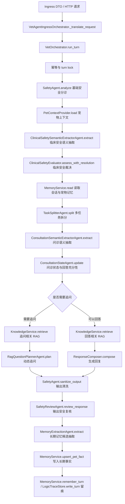

<!--
=============================================================================
文件: docs/architecture/agent-middleware-migration-plan.md
作用: 说明兽医 Agent 数据链中 LiteLLM response_format、OPA、LlamaIndex 与 Guardrails 的渐进式迁移方案。
范围: 适用于当前业务 Agent 主链路、临床安全链路、RAG 链路、记忆写入链路与后续 CI/CD 门禁设计。
说明: 本文档仅描述迁移顺序、替代边界、配置形态与验收标准；运行时配置以源码、Docker Compose、服务 YAML 和 GitHub Release 为准。
维护: 架构迁移必须通过 Pull Request 分阶段落地；每一阶段应同步更新测试、门禁和相关运维说明。
=============================================================================
-->

# Agent 中间件与脚手架迁移方案

> **文档状态**：迁移方案 
> **适用分支**：`main` 及后续 feature、fix、release 分支 
> **迁移目标**：在不大规模重写 `VetOrchestrator` 的前提下，将现有手写 JSON 解析、硬编码关键词裁决和低质量 RAG 回退逐步替换为标准中间件能力。

## 1. 背景与目标

当前 Agent 主链路已经具备可运行的确定性编排，但仍存在以下工程风险：

1. 多个 LLM 子 Agent 通过提示词要求模型“只输出 JSON”，随后在业务代码中使用正则或字符串截取提取 JSON。
2. 安全、问诊领域、记忆写入和输出清洗仍保留较多关键词、正则和硬编码阈值逻辑。
3. RAG 检索在 PostgreSQL 向量检索不可用时存在文本相似度和文件兜底路径，长期看不适合作为生产级检索框架。
4. 安全边界既承担输入分诊，又承担输出清洗，缺少统一的策略裁决和可观测策略结果。

本次迁移的目标不是更换主编排框架，而是在当前数据链位置引入标准中间件：

| 中间件或脚手架 | 核心替代目标 | 不承担的职责 |
|---|---|---|
| LiteLLM `response_format` | 替代手写 JSON 提取与非结构化 LLM 输出解析 | 不直接决定医疗动作，不替代业务策略 |
| OPA | 替代分散的硬编码动作策略、记忆写入策略和安全动作裁决 | 不承载医学推理，不实现问诊状态机 |
| LlamaIndex | 替代手写低质量检索、文本兜底和部分 RAG 编排适配逻辑 | 不绕过 `KnowledgeService` 业务门面 |
| Guardrails | 可选增强输入与输出安全边界、格式约束和风险拦截 | 不作为唯一安全裁决源，不替代 OPA 审计策略 |

## 2. 当前 Agent 数据链基线

当前主链路入口集中在 `src/vet_agent/orchestrator.py` 的 `VetOrchestrator.run_turn()` 与 `_run_turn_core()`，接入转换集中在 `src/vet_agent/ingress_adapter.py`。

迁移时应保持上述数据链顺序稳定。各中间件应优先替换对应阶段的内部实现，不应在第一阶段改变请求、响应、会话状态和外部 API 契约。

## 3. 数据链阶段替代映射

下表按当前 Agent 数据链顺序排列，并注明中间件替代的具体阶段。

| 顺序 | 当前数据链阶段 | 当前实现位置 | 迁移中间件 | 替代或接入范围 | 第一阶段处理方式 |
|---:|---|---|---|---|---|
| 1 | 入口请求转换 | `VetAgentIngressOrchestrator._translate_request` | 暂不替代 | 保持现有 Pydantic DTO 与协议转换 | 仅补充结构化审计字段透传 |
| 2 | 幂等与 turn lock | `VetOrchestrator.run_turn`、`MemoryService` | 暂不替代 | 保持现有会话一致性策略 | 保持主流程稳定 |
| 3 | 基础输入安全候选 | `SafetyAgent.analyze` | OPA、Guardrails | OPA 替代“关键词命中即动作”的最终裁决；Guardrails 可做输入风险预筛 | 规则只产出候选信号，最终动作交给策略结果 |
| 4 | 宠物上下文读取 | `PetContextProvider.load` | OPA | 宠物资料作为策略上下文输入，不作为直接医学结论 | 保持读取逻辑，仅明确 verified 与 request-side 边界 |
| 5 | 临床安全语义抽取 | `ClinicalSafetySemanticExtractorAgent.extract` | LiteLLM `response_format` | 替代 `_extract_json()` 和 Markdown code fence 兼容解析 | 引入 `chat_structured()` 后保留现有 Pydantic 结果模型 |
| 6 | 临床安全裁决 | `ClinicalSafetyEvaluator.assess_with_resolution` | OPA | 将候选风险、结构化语义、上下文适用性转换为可审计策略动作 | 保留 evaluator 作为候选归一层，OPA 负责动作裁决 |
| 7 | 记忆读取 | `MemoryService.read`、`make_semantic_memory` | 暂不替代 | Mem0 仍是语义记忆后端增强，不是临床事实源 | 不改变现有可信事实边界 |
| 8 | 多任务拆分 | `TaskSplitterAgent.split`、`RuleTaskSplitter` | LiteLLM `response_format`、OPA | response_format 替代 `_parse_llm_tasks()`；OPA 可限制任务数量、任务域和降级动作 | LLM 结果结构化，规则拆分仅作为候选回退 |
| 9 | 问诊语义抽取 | `ConsultationSemanticExtractorAgent.extract` | LiteLLM `response_format` | 替代 `_extract_json()`；结构化事实进入问诊状态 | 保留 `SemanticExtractorOutput`，移除手写 JSON 提取 |
| 10 | 问诊状态与回答充分性 | `ConsultationStateAgent.update`、`AnswerabilityEvaluator` | OPA | OPA 只裁决“是否允许阶段性回答/是否必须追问”等动作门槛 | 不把槽位状态机迁移到 Rego，避免策略膨胀 |
| 11 | 追问相关 RAG | `_plan_followup_questions`、`KnowledgeService.retrieve` | LlamaIndex、LiteLLM `response_format` | LlamaIndex 替代手写检索；response_format 替代追问规划 JSON 解析 | 保持 `KnowledgeHit` 和 `Evidence` 输出契约 |
| 12 | 回答相关 RAG | `KnowledgeService.retrieve`、`PostgresKnowledgeRepository` | LlamaIndex | 替代 pgvector/text/file 的低质量回退查询编排 | 通过 `KnowledgeRepository` 协议适配，不改调用方 |
| 13 | 回复生成 | `ResponseComposer.compose`、`QwenClient.chat` | LiteLLM、Guardrails | LiteLLM 继续统一模型网关；Guardrails 可在输出前后做约束验证 | 自然语言回复暂不强制结构化，只强化审计与输出检查 |
| 14 | 输出清洗与安全复核 | `SafetyAgent.sanitize_output`、`SafetyReviewAgent.review_response` | Guardrails、OPA | Guardrails 检测格式、剂量和越界内容；OPA 决定放行、改写、阻断或升级 | 先以 observe 模式并行记录，再切为 enforce |
| 15 | 长期记忆抽取 | `MemoryExtractionAgent.extract` | LiteLLM `response_format`、OPA | response_format 替代 `_extract_json()`；OPA 替代 `MemoryWritePolicy` 中的硬编码写入策略 | 禁止 `_rule_candidates()` 直接产生可写事实 |
| 16 | 长期记忆写入 | `MemoryService.upsert_pet_fact` | OPA | 写入前执行主体、事实类型、置信度、确认状态和冲突策略裁决 | 保持数据库写入接口不变 |
| 17 | 留痕与响应终态 | `LogicTraceStore.write_turn`、响应 metadata | 暂不替代 | 记录中间件策略输入摘要、策略输出和 fallback 状态 | 扩展 metadata，不改变外部响应主结构 |

## 4. 各中间件替代边界

### 4.1 LiteLLM response_format

LiteLLM `response_format` 应替代以下模式：

1. 提示词要求“只输出 JSON”但未由 API 层强制结构化输出。
2. 使用正则从模型文本中截取 `{...}`。
3. 兼容 Markdown code fence 的 JSON 解析。
4. 模型返回解释性文字后继续尝试解析。

不应替代以下内容：

1. Pydantic 输出模型校验。
2. 业务策略裁决。
3. 临床安全保守降级。
4. 自然语言最终回答生成。

### 4.2 OPA

OPA 应替代以下模式：

1. 关键词命中后立即阻断、升级或写入长期记忆。
2. 分散在多个 Agent 中的动作阈值与动作分支。
3. 缺少审计原因的安全清洗和写入过滤。
4. 需要环境级可变更的策略条件。

OPA 不应承载以下内容：

1. 宠物医学语义抽取。
2. RAG 检索排序算法。
3. 多轮问诊状态机。
4. 自然语言生成。
5. 复杂字符串扫描。

### 4.3 LlamaIndex

LlamaIndex 应替代以下模式：

1. 字符集合重叠打分。
2. PostgreSQL 文本相似度空命中后返回前几条知识。
3. 手写检索、过滤、重排和证据组装适配逻辑。
4. 无统一索引生命周期管理的 RAG 数据访问。

LlamaIndex 不应绕过以下边界：

1. `KnowledgeService.retrieve()` 业务门面。
2. `KnowledgeHit` 和 `Evidence` 响应契约。
3. 数据资产审核状态与版权元数据过滤。
4. 临床安全裁决的策略边界。

### 4.4 Guardrails

Guardrails 应增强以下位置：

1. 输入请求中的 prompt 注入、越权指令和非目标场景识别。
2. 输出文本中的具体剂量、绝对化诊断、影像判读和用药越界建议识别。
3. 结构化输出中的字段边界、枚举边界和内容格式边界。

Guardrails 不应替代以下内容：

1. OPA 最终策略裁决。
2. Pydantic 类型校验。
3. 临床安全结构化语义抽取。
4. 业务 trace 和审计。