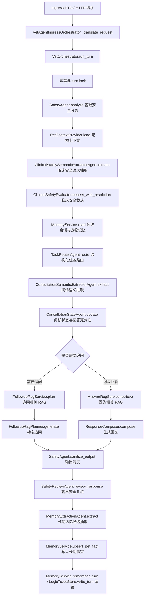

<!--
=============================================================================
文件: docs/architecture/agent-middleware-migration-plan.md
作用: 说明兽医 Agent 数据链中 LiteLLM response_format、OPA、LlamaIndex、Mem0、PostgreSQL/pgvector 与 Guardrails 的渐进式迁移方案。
范围: 适用于当前业务 Agent 主链路、临床安全链路、RAG 链路、记忆链路、状态存储、向量存储与后续 CI/CD 门禁设计。
说明: 本文档仅描述迁移顺序、替代边界、配置形态与验收标准；运行时配置以源码、Docker Compose、服务 YAML 和 GitHub Release 为准。
维护: 架构迁移必须通过 Pull Request 分阶段落地；每一阶段应同步更新测试、门禁和相关运维说明。
=============================================================================
-->

# Agent 中间件与脚手架迁移方案

> **文档状态**：迁移方案 
> **适用分支**：`main` 及后续 feature、fix、release 分支 
> **迁移目标**：在不大规模重写 `VetOrchestrator` 的前提下，将现有手写 JSON 解析、硬编码关键词裁决和低质量 RAG 回退逐步替换为标准中间件能力。

## 1. 背景与目标

当前 Agent 主链路已经具备可运行的确定性编排，但仍存在以下工程风险：

1. 多个 LLM 子 Agent 通过提示词要求模型“只输出 JSON”，随后在业务代码中使用正则或字符串截取提取 JSON。
2. 安全、问诊领域、记忆写入和输出清洗仍保留较多关键词、正则和硬编码阈值逻辑。
3. RAG 检索在 PostgreSQL 向量检索不可用时存在文本相似度和文件兜底路径，长期看不适合作为生产级检索框架。
4. 安全边界既承担输入分诊，又承担输出清洗，缺少统一的策略裁决和可观测策略结果。

本次迁移的目标不是更换主编排框架，而是在当前数据链位置引入标准中间件：

| 中间件或脚手架 | 核心替代目标 | 不承担的职责 |
|---|---|---|
| LiteLLM `response_format` | 替代手写 JSON 提取与非结构化 LLM 输出解析 | 不直接决定医疗动作，不替代业务策略 |
| OPA | 替代分散的硬编码动作策略、记忆写入策略和安全动作裁决 | 不承载医学推理，不实现问诊状态机 |
| LlamaIndex | 替代手写低质量检索、文本兜底和部分 RAG 编排适配逻辑 | 不绕过 `FollowupRagService`、`AnswerRagService` 业务边界 |
| Mem0 | 替代手写语义记忆召回、跨轮相关历史筛选和部分记忆候选生成 | 不替代权威事实库、活跃问诊状态、幂等状态和策略裁决 |
| PostgreSQL/pgvector | 替代本地 JSON、seed 文件生产主路径、静态资产主路径和手写向量存储 | 不替代 OPA 策略、LlamaIndex 检索编排、Mem0 语义记忆和 LiteLLM 结构化输出 |
| Guardrails | 可选增强输入与输出安全边界、格式约束和风险拦截 | 不作为唯一安全裁决源，不替代 OPA 审计策略 |

## 2. 当前 Agent 数据链基线

当前主链路入口集中在 `src/vet_agent/orchestrator.py` 的 `VetOrchestrator.run_turn()` 与 `_run_turn_core()`，接入转换集中在 `src/vet_agent/ingress_adapter.py`。

迁移时应保持上述数据链顺序稳定。各中间件应优先替换对应阶段的内部实现，不应在第一阶段改变请求、响应、会话状态和外部 API 契约。

## 3. 数据链阶段替代映射

下表按当前 Agent 数据链顺序排列，并注明中间件替代的具体阶段。

| 顺序 | 当前数据链阶段 | 当前实现位置 | 迁移中间件 | 替代或接入范围 | 第一阶段处理方式 |
|---:|---|---|---|---|---|
| 1 | 入口请求转换 | `VetAgentIngressOrchestrator._translate_request` | 暂不替代 | 保持现有 Pydantic DTO 与协议转换 | 仅补充结构化审计字段透传 |
| 2 | 身份、宠物资料与会话范围 | `PetContextProvider.load`、`PetProfileModel`、`PetSessionBindingModel` | PostgreSQL/pgvector、OPA | PostgreSQL 保存已验证宠物资料和会话绑定；OPA 使用结构化上下文裁决动作 | 明确 verified profile 与 request-side pet_info 边界 |
| 3 | 幂等与 turn lock | `VetOrchestrator.run_turn`、`PostgresMemoryService.turn_lock`、`IdempotencyRecordModel` | PostgreSQL/pgvector | 替代进程内锁和文件幂等记录，支持多实例一致性 | 生产路径固定使用 PostgreSQL advisory lock 与幂等表 |
| 4 | 基础输入安全候选 | `SafetyAgent.analyze`、`SafetyRuleModel` | PostgreSQL/pgvector、OPA、Guardrails | PostgreSQL 保存安全规则候选；OPA 替代“关键词命中即动作”的最终裁决；Guardrails 可做输入风险预筛 | 规则只产出候选信号，最终动作交给策略结果 |
| 5 | 临床安全语义抽取 | `ClinicalSafetySemanticExtractorAgent.extract` | LiteLLM `response_format` | 替代 `_extract_json()` 和 Markdown code fence 兼容解析 | 引入 `chat_structured()` 后保留现有 Pydantic 结果模型 |
| 6 | 临床安全候选召回 | `ClinicalSafetyRetriever`、`PostgresClinicalSafetyRepository`、`ClinicalSafetyChunkModel` | PostgreSQL/pgvector | 替代临床安全静态 JSON 主路径和文件短语回退，按已审核 chunk 执行向量召回 | 生产优先使用 `clinical_safety_chunks.embedding`，文件仓储仅作开发或应急降级 |
| 7 | 临床安全裁决 | `ClinicalSafetyEvaluator.assess_with_resolution` | OPA | 将候选风险、结构化语义、上下文适用性转换为可审计策略动作 | 保留 evaluator 作为候选归一层，OPA 负责动作裁决 |
| 8 | 记忆读取 | `PostgresMemoryService.read`、`make_semantic_memory`、`Mem0RestSemanticMemory` | PostgreSQL/pgvector、Mem0 | PostgreSQL 读取权威事实、episode 和会话状态；Mem0 增强跨轮语义相关记忆召回 | 不改变 PostgreSQL 可信事实源边界，Mem0 仅作为语义投影 |
| 9 | 多任务拆分 | `TaskRouterAgent.route`、`TaskRoutingService`、`TaskExecutionPlan` | LiteLLM `response_format`、Pydantic、OPA、PostgreSQL/pgvector | 结构化输出替代手写 JSON 解析；任务域目录由 `task_routing_domains` 提供；OPA 校验任务数量、任务域、任务键和已有任务引用；依赖、契约或策略失败直接 Fail Fast | 移除 `TaskSplitterAgent`、`RuleTaskSplitter`、`classifier_keywords` 和所有关键词回退路径 |
| 10 | 问诊语义抽取 | `ConsultationSemanticExtractorAgent.extract` | LiteLLM `response_format` | 替代 `_extract_json()`；结构化事实进入问诊状态 | 保留 `SemanticExtractorOutput`，移除手写 JSON 提取 |
| 11 | 问诊状态与回答充分性 | `ConsultationStateAgent.update`、`AnswerabilityEvaluator`、`ConsultationStateModel` | PostgreSQL/pgvector、OPA | PostgreSQL 保存活跃问诊状态；OPA 只裁决“是否允许阶段性回答/是否必须追问”等动作门槛 | 不把槽位状态机迁移到 Rego，不把活跃状态写入 Mem0 |
| 12 | 追问相关 RAG | `FollowupRagService`、`FollowupRagQueryBuilder`、`FollowupRagServiceProtocol` | LlamaIndex、PostgreSQL/pgvector、LiteLLM `response_format` | LlamaIndex 替代手写检索编排；PostgreSQL/pgvector 作为生产向量存储；response_format 替代追问规划 JSON 解析 | 通过 `FollowupRagServiceProtocol` 保持 `KnowledgeHit`、`Evidence` 和追问计划契约 |
| 13 | 回答相关 RAG | `AnswerRagService`、`AnswerRagQueryBuilder`、`AnswerRagServiceProtocol` | LlamaIndex、PostgreSQL/pgvector | 替代 pgvector/text/file 的低质量回退查询编排；只读取已启用、已审核且有 embedding 的知识 chunk | 通过 `AnswerRagServiceProtocol` 暴露回答证据上下文，不依赖旧 `KnowledgeService` |
| 14 | 回复生成上下文编译 | `ResponseComposer.compose`、`PostgresMemoryService.read` | Mem0、PostgreSQL/pgvector | Mem0 提供与本轮主诉相关的历史语义记忆；PostgreSQL 提供权威事实和最近对话摘要 | 后续引入 `MemoryContextBuilder`，避免直接消费原始记忆结构 |
| 15 | 回复生成 | `ResponseComposer.compose`、`QwenClient.chat` | LiteLLM、Guardrails | LiteLLM 继续统一模型网关；Guardrails 可在输出前后做约束验证 | 自然语言回复暂不强制结构化，只强化审计与输出检查 |
| 16 | 输出清洗与安全复核 | `SafetyAgent.sanitize_output`、`SafetyReviewAgent.review_response` | Guardrails、OPA | Guardrails 检测格式、剂量和越界内容；OPA 决定放行、改写、阻断或升级 | 先以 observe 模式并行记录，再切为 enforce |
| 17 | 长期记忆候选抽取 | `MemoryExtractionAgent.extract`、`Mem0RestSemanticMemory.add_turn` | LiteLLM `response_format`、Mem0、OPA | response_format 替代 `_extract_json()`；Mem0 可提供语义记忆候选；OPA 替代 `MemoryWritePolicy` 中的硬编码写入策略 | 禁止 `_rule_candidates()` 或 Mem0 结果直接产生可写权威事实 |
| 18 | 长期事实写入 | `PostgresMemoryService.upsert_pet_fact`、`PetMemoryFactModel` | PostgreSQL/pgvector、OPA | PostgreSQL 保存权威事实、来源、置信度和有效期；OPA 写入前裁决主体、事实类型、确认状态和冲突策略 | 保持数据库写入接口不变，Mem0 只保存语义投影 |
| 19 | 中期 episode 与语义记忆投影 | `PetMemoryEpisodeModel`、`Mem0RestSemanticMemory.add_turn` | PostgreSQL/pgvector、Mem0 | PostgreSQL 保存 episode 审计记录；Mem0 保存可检索语义投影 | episode 审计不迁移到 Mem0，Mem0 失败不影响权威落库 |
| 20 | 报告解析结果 | `PetReportModel`、`PetReportItemModel`、`ReportIngestionService` | PostgreSQL/pgvector、LiteLLM `response_format` | PostgreSQL 保存结构化报告和检查项；response_format 替代视觉模型手写 JSON 解析 | 报告结构化结果作为数据库事实候选，不直接写 Mem0 或长期事实 |
| 21 | 删除与纠正治理 | `PostgresMemoryService.delete_pet_memory`、`Mem0RestSemanticMemory.delete_pet` | PostgreSQL/pgvector、Mem0、OPA | PostgreSQL 执行权威数据删除；Mem0 同步删除语义投影；OPA 裁决纠正、禁用和写入动作 | 建立删除失败审计，避免语义投影残留 |
| 22 | 留痕与响应终态 | `LogicTraceStore.write_turn`、`LogicTraceModel`、响应 metadata | PostgreSQL/pgvector | 记录中间件策略输入摘要、策略输出、RAG 命中、记忆投影和 fallback 状态 | 扩展 metadata，不改变外部响应主结构 |

## 4. 各中间件替代边界

### 4.1 LiteLLM response_format

LiteLLM `response_format` 应替代以下模式：

1. 提示词要求“只输出 JSON”但未由 API 层强制结构化输出。
2. 使用正则从模型文本中截取 `{...}`。
3. 兼容 Markdown code fence 的 JSON 解析。
4. 模型返回解释性文字后继续尝试解析。

不应替代以下内容：

1. Pydantic 输出模型校验。
2. 业务策略裁决。
3. 临床安全保守降级。
4. 自然语言最终回答生成。

### 4.2 OPA

OPA 应替代以下模式：

1. 关键词命中后立即阻断、升级或写入长期记忆。
2. 分散在多个 Agent 中的动作阈值与动作分支。
3. 缺少审计原因的安全清洗和写入过滤。
4. 需要环境级可变更的策略条件。

OPA 不应承载以下内容：

1. 宠物医学语义抽取。
2. RAG 检索排序算法。
3. 多轮问诊状态机。
4. 自然语言生成。
5. 复杂字符串扫描。

### 4.3 LlamaIndex

LlamaIndex 应替代以下模式：

1. 字符集合重叠打分。
2. PostgreSQL 文本相似度空命中后返回前几条知识。
3. 手写检索、过滤、重排和证据组装适配逻辑。
4. 无统一索引生命周期管理的 RAG 数据访问。

LlamaIndex 不应绕过以下边界：

1. `FollowupRagService` 和 `AnswerRagService` 业务服务边界。
2. `KnowledgeHit` 和 `Evidence` 响应契约。
3. 数据资产审核状态与版权元数据过滤。
4. 临床安全裁决的策略边界。

### 4.4 Mem0

Mem0 应替代或增强以下模式：

1. 仅依赖最近若干轮对话或 `last_summary` 的历史上下文拼接。
2. 手写跨轮语义相关性筛选。
3. 中期 episode 只能按时间倒序读取、无法按当前主诉召回的记忆使用方式。
4. 长期记忆候选完全依赖关键词、正则或单次 LLM 抽取的候选生成方式。
5. 跨 session 宠物历史只能依赖权威事实表、无法召回相关语义片段的上下文编译方式。

Mem0 不应绕过以下边界：

1. `pet_memory_facts` 权威事实库。
2. `consultation_states` 活跃问诊状态。
3. `idempotency_records` 幂等状态。
4. OPA 写入、删除、阻断、升级和改写策略裁决。
5. PostgreSQL 删除治理和审计留痕。
6. LlamaIndex 医学知识库 RAG。

Mem0 的运行定位是“语义记忆投影”。Mem0 召回结果可进入回答上下文，可作为长期事实候选来源之一，但不得直接写入权威事实，也不得作为临床安全裁决的唯一依据。

### 4.5 PostgreSQL/pgvector

PostgreSQL/pgvector 应替代以下模式：

1. 本地 JSON 记忆、trace、问诊状态和幂等记录的生产主路径。
2. seed 文件作为安全规则、问诊规则、RAG 知识和临床安全资产的生产主可信源。
3. 临床安全静态 JSON 资产和文件短语回退作为生产主召回路径。
4. 手写向量存储、无审核状态的 RAG chunk 和无来源元数据的临时知识片段。
5. 多实例部署下不可靠的进程内锁、进程内状态和本地文件状态。
6. 无结构化审计表的 RAG、策略、报告解析和医疗输出留痕。

PostgreSQL/pgvector 不应替代以下内容：

1. OPA 的最终策略裁决。
2. LlamaIndex 的检索、索引、重排和引用编排。
3. Mem0 的跨轮语义记忆召回。
4. LiteLLM `response_format` 的模型输出结构化约束。
5. Guardrails 的输入与输出边界检查。
6. `VetOrchestrator` 的主流程编排。

PostgreSQL/pgvector 的运行定位是“生产级结构化可信存储和向量存储底座”。它保存规则、资产、知识、状态、事实、报告、幂等、trace 和向量，不承载不可审计的策略状态机。

### 4.6 Guardrails

Guardrails 应增强以下位置：

1. 输入请求中的 prompt 注入、越权指令和非目标场景识别。
2. 输出文本中的具体剂量、绝对化诊断、影像判读和用药越界建议识别。
3. 结构化输出中的字段边界、枚举边界和内容格式边界。

Guardrails 不应替代以下内容：

1. OPA 最终策略裁决。
2. Pydantic 类型校验。
3. 临床安全结构化语义抽取。
4. 业务 trace 和审计。
