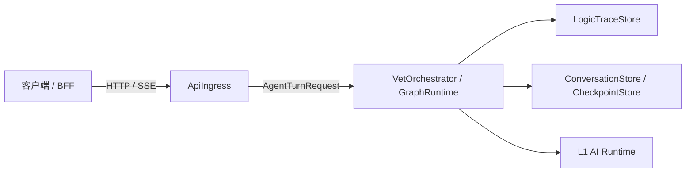
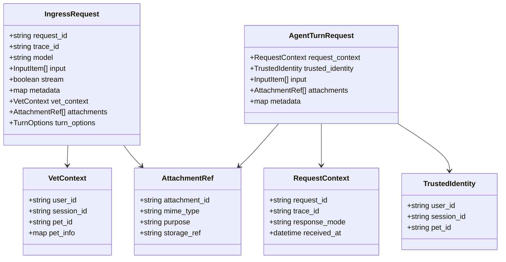
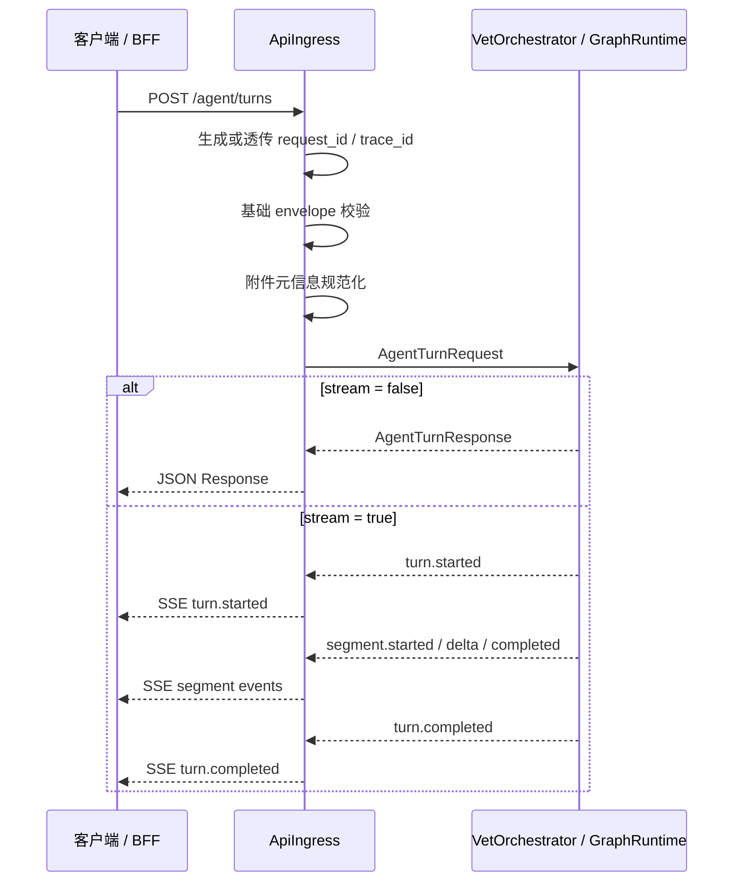

# API 接入组件设计文档 / ApiIngress

## 3.1 基础元数据 (Metadata)

* **组件标识：** API 接入组件 / `ApiIngress`
* **责任人 (Owner)：** 待定
* **代码仓库：** 待定
* **关联需求：**
  * [`docs/component_catalog.md`](../../../component_catalog.md) §4.1 API 接入组件
  * [`docs/prd.md`](../../../prd.md) §5.1、§5.2.7、§7.5、§7.6
  * [`docs/design_spec.md`](../../../design_spec.md)
* **架构层级：** L0 通用基础组件 / 接入层
* **文档状态：** 草案

## 3.2 职责边界 (Responsibility Boundaries)

* **核心能力 (Capabilities)：**
* 接收客户端 / BFF 发起的一轮 Agent 对话请求。
* 执行入口层基础请求格式校验，包括必填上下文字段、请求体结构、响应模式与附件元信息完整性。
* 为每次请求生成或透传 `request_id`、`trace_id`，并将其贯穿到下游编排请求。
* 采用 OpenAI Responses 风格组织 `input`、`output`、`stream` 与流式事件，同时保留兽医业务扩展字段。
* 支持同步响应与 SSE 流式响应。
* 将标准化后的请求转发给 Agent 编排入口。
* 将编排层返回的普通响应、流式事件与错误统一映射为 HTTP 响应。
* 记录入口访问日志、基础指标与错误摘要。

* **非目标 (Non-Goals)：**
* 不实现 JWT、OAuth、登录态解析或用户身份认证。当前阶段 Agent 服务仅在局域网访问，`user_id`、`session_id`、`pet_id` 由上游客户端 / BFF 可信传入。
* 不校验 `pet_id` 是否属于 `user_id`，该类授权校验由上游 BFF / 数据层在后续阶段承接。
* 不执行 session 与 `pet_id` 的业务一致性校验；一 session 一宠策略由 `PetSessionPolicy` 负责。
* 不做宠物识别、定宠、切宠或跨宠推理。
* 不做多任务拆解、意图识别、`generation_profile` 判定或 SAF 信号识别。
* 不做 RAG、OCR、记忆读写、上下文编译、模型调用或安全护栏审查。
* 不解释 A/B/C 业务留痕字段；仅透传 `trace_id`，业务逻辑链由 `LogicTraceStore` 与 `VetTraceSchema` 负责。
* 不在普通访问日志中记录完整医疗对话正文。

## 3.3 架构与交互设计 (Architecture & Interaction)

* **上下文视图 (Context Diagram)：**

`ApiIngress` 是可信局域网入口。它只负责协议接入、请求治理、上下文透传与响应承载；所有业务判断由下游编排和业务组件完成。

* **核心领域模型 (Domain Model)：**

模型说明：

* `IngressRequest` 采用 OpenAI Responses 风格的 `model`、`input`、`stream`、`metadata` 字段，并通过 `vet_context`、`attachments`、`turn_options` 承载业务扩展。
* `TrustedIdentity` 表示上游可信传入的身份上下文，不代表 `ApiIngress` 已完成鉴权。
* 完整 API 报文字段应由 API 治理平台或代码内 DTO 维护；本文仅描述组件级领域模型。

## 3.4 契约与依赖 (Contracts & Dependencies)

* **入向契约 (Inbound APIs)：**
* 创建一轮 Agent 对话：`POST /agent/turns` -> [`docs/api/external_api.md`](../../../api/external_api.md)
* 创建一轮 Agent 对话的 OpenAI Responses 风格兼容入口：`POST /openai/v1/responses` -> [`docs/api/external_api.md`](../../../api/external_api.md)
* 存活检查：`GET /health` -> [`docs/api/external_api.md`](../../../api/external_api.md)
* 就绪检查：`GET /ready` -> [`docs/api/external_api.md`](../../../api/external_api.md)

接口原则：

* `/agent/turns` 是生产主业务入口。
* `/openai/v1/responses` 是兼容适配入口，用于 SDK 习惯、内部调试或迁移适配，不作为兽医业务主契约。
* 主接口可借鉴 OpenAI Responses 的 `input` / `output` / `stream` 形态，但 `vet_context`、`attachments`、`segments`、`vet_result` 等字段属于本系统业务扩展。
* 外部请求不得通过兼容字段放宽 SAF、安全护栏、工具权限、RAG 禁令或一 session 一宠约束。

核心入向校验：

* `vet_context.user_id` 必填。
* `vet_context.session_id` 必填。
* `vet_context.pet_id` 必填。
* `input` 与 `attachments` 至少存在一类有效内容。
* `stream` 为布尔值；未传时采用服务默认响应模式。
* 附件只校验元信息完整性与入口大小限制，不在本组件判断附件医学类型。

* **出向依赖 (Outbound Dependencies)：**
* **强依赖：**
* `VetOrchestrator` / `GraphRuntime`：承接一轮 Agent 编排。不可用时，`ApiIngress` 无法完成核心对话能力。
* `RuntimeConfig`：提供入口大小限制、超时、流式心跳、兼容入口开关等运行参数。不可用时服务不可就绪。
* `Observability`：记录入口层日志与指标。不可用不应影响基础响应，但需触发降级告警。

* **弱依赖：**
* `LogicTraceStore`：由下游编排负责写入业务逻辑链；`ApiIngress` 仅传递 `trace_id`。若下游反馈留痕降级，本组件只透传响应元信息。
* `ConversationStore` / `CheckpointStore`：由编排层调用。本组件不直接依赖。
* API 治理平台：维护完整接口字段、示例与版本。缺失时不阻塞运行，但阻塞正式对外契约冻结。

异常映射原则：

* 入口格式错误映射为 `400 INVALID_REQUEST`。
* 缺少必需上下文映射为 `422 MISSING_REQUIRED_CONTEXT`。
* 请求体或附件元信息超过入口限制映射为 `413 PAYLOAD_TOO_LARGE`。
* 编排层不可用映射为 `503 SERVICE_UNAVAILABLE`。
* 编排超时映射为 `504 ORCHESTRATOR_TIMEOUT`。
* 客户端中断流式连接记录为 `CLIENT_CANCELLED`，已发布内容不由本组件回滚。

## 3.5 核心流转机制 (Core Flow Mechanism)

* **状态流转/时序图：**

同步模式核心步骤：

1. 接收 HTTP 请求。
2. 生成或透传 `request_id`、`trace_id`。
3. 校验基础请求结构与必需上下文。
4. 规范化附件元信息。
5. 构造 `AgentTurnRequest`。
6. 调用编排入口。
7. 等待完整 `AgentTurnResponse`。
8. 返回 JSON 响应并记录入口指标。

流式模式核心步骤：

1. 接收 HTTP 请求。
2. 完成与同步模式一致的入口校验和请求映射。
3. 建立 SSE 连接。
4. 调用编排层流式接口。
5. 按编排层事件顺序透传 `turn.started`、`segment.started`、文本增量、`segment.completed`、`turn.completed`。
6. 客户端断开时通知编排层并记录取消事件。

流式事件约束：

* `ApiIngress` 不决定业务段顺序；急症段优先由 `VetResponseComposer` 和编排层保证。
* `ApiIngress` 不缓存整轮响应后再统一发送；流式事件到达后应尽快写出。
* 入口层可发送心跳事件以维持长连接，但不得伪造业务 segment。

幂等约束：

* `ApiIngress` 可透传 `turn_options.idempotency_key` 或使用 `request_id` 作为幂等标识输入。
* 整轮幂等判定由编排层或会话持久化层负责。
* 编排层确认接收后，本组件不得自行重试整轮请求，避免重复发布和重复落库。

## 3.6 稳定性与可观测性 (Reliability & Observability)

* **流量控制：**
* 按客户端来源、路径与响应模式设置入口限流。
* 对请求体大小、附件元信息数量、单次流式连接时长设置上限。
* 对编排入口设置调用超时；超时后返回统一错误，不生成替代业务回复。
* 对流式连接设置空闲超时与心跳间隔。
* 局域网访问控制由部署层承担；本组件不实现用户级认证。

* **数据一致性：**
* `ApiIngress` 不直接写会话消息、checkpoint 或业务逻辑链。
* `request_id` 与 `trace_id` 必须随请求传入下游，作为后续落库、留痕和排障的关联键。
* 客户端取消流式连接时，本组件仅通知下游并记录取消；已发布 segment 与已产生的下游状态不由入口层回滚。
* 本组件不缓存医疗回复正文；如需缓存或幂等复用，由编排层或存储层负责。

* **核心指标 (Golden Signals)：**
* `api_ingress_requests_total`：入口请求总数，按路径、响应模式、状态码、错误码分组。
* `api_ingress_request_duration_ms`：入口总耗时。
* `api_ingress_orchestrator_accept_duration_ms`：编排层接收耗时。
* `api_ingress_stream_first_event_duration_ms`：流式首事件耗时。
* `api_ingress_stream_duration_ms`：流式连接持续时间。
* `api_ingress_active_streams`：当前活跃流式连接数。
* `api_ingress_validation_error_total`：入口校验失败次数。
* `api_ingress_payload_rejected_total`：请求体或附件元信息超限次数。
* `api_ingress_client_cancel_total`：客户端取消次数。
* `api_ingress_orchestrator_error_total`：编排入口错误次数。

访问日志字段：

* `request_id`
* `trace_id`
* `user_id`
* `session_id`
* `pet_id`
* `path`
* `response_mode`
* `status_code`
* `error_code`
* `duration_ms`
* `attachment_count`

日志约束：

* 普通访问日志不得记录完整用户医疗输入、完整模型回复、OCR 原文或安全审查三联稿。
* 业务内容与逻辑链应进入 `LogicTraceStore`，并由业务留痕分级控制。

可用性目标：

* `/health` 仅反映进程存活。
* `/ready` 反映入口配置加载与编排入口可用性。
* 当编排入口不可用时，`/ready` 应返回不可就绪；`/agent/turns` 应返回统一服务不可用错误。
