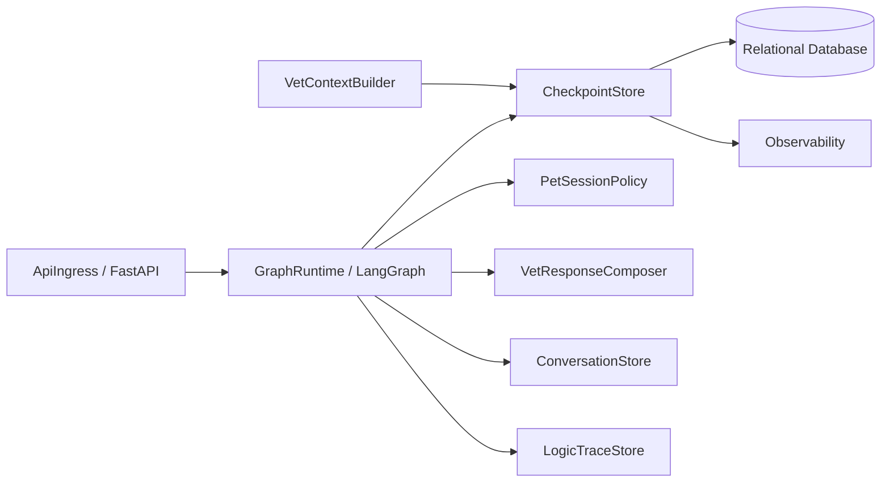
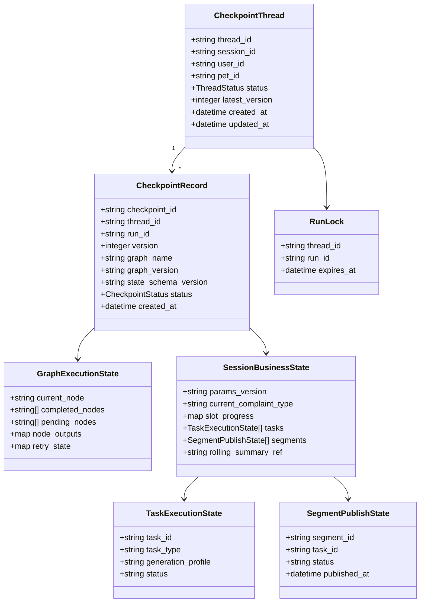
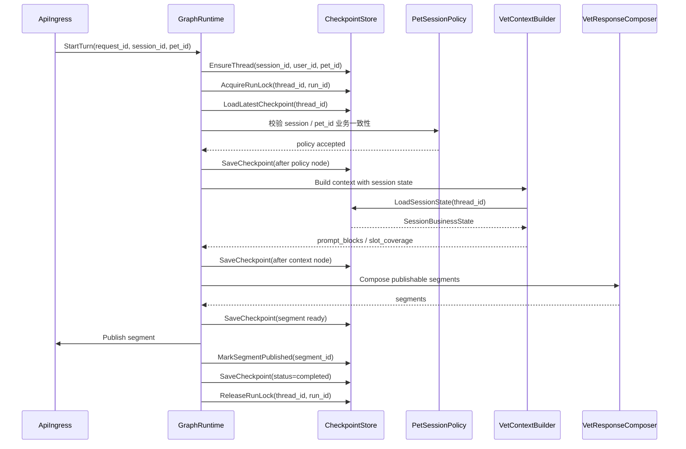
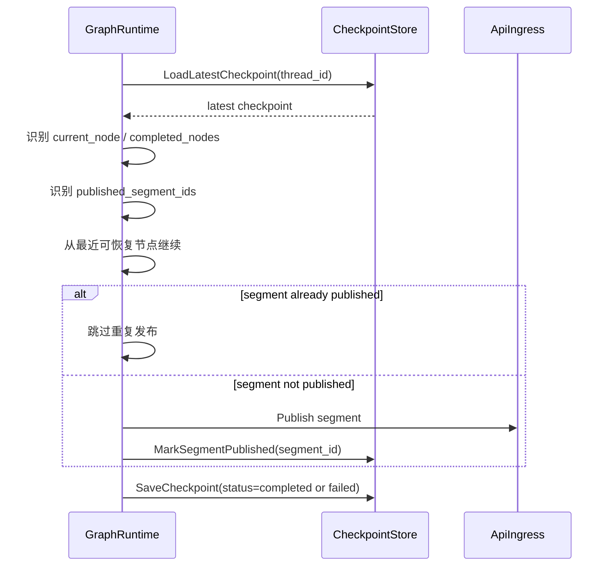
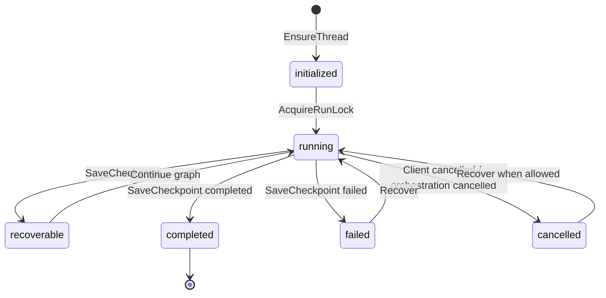

# Checkpoint 组件设计文档 / CheckpointStore

## 3.1 基础元数据 (Metadata)

* **组件标识：** Checkpoint 组件 / `CheckpointStore`
* **责任人 (Owner)：** 待定
* **代码仓库：** 待定
* **关联需求：**
  * [`docs/component_catalog.md`](../../../component_catalog.md) §4.3 Checkpoint 组件
  * [`docs/prd.md`](../../../prd.md) §5.1、§5.2.7、§5.3、§5.4、§6.4、§7.5、§7.6、§8.2
  * [`docs/design_spec.md`](../../../design_spec.md)
* **架构层级：** L0 通用基础组件 / 状态持久化层
* **文档状态：** 草案

## 3.2 职责边界 (Responsibility Boundaries)

* **核心能力 (Capabilities)：**
* 为 `GraphRuntime` / LangGraph 编排流程提供可持久化的 checkpoint 能力。
* 保存一轮 Agent 图执行的节点进度、节点结果摘要、运行状态和恢复锚点。
* 保存 session 级业务状态快照，包括 `pet_id`、`slot_progress`、子任务状态、segment 发布状态、`params_version` 等由上游定义的业务字段。
* 支持按 `session_id` 或等价 `thread_id` 读取最新 checkpoint。
* 支持失败后从最近可恢复节点继续执行。
* 支持同一 session 的运行锁，避免并发请求同时改写同一条编排状态。
* 支持乐观锁写入，避免旧状态覆盖新状态。
* 支持记录已发布 segment，避免恢复或重试时重复发布。
* 支持 checkpoint schema version 与 graph version 记录，便于状态迁移、排障和回归。
* 向 `VetContextBuilder` 等业务组件提供 session 状态摘要读取能力。

* **非目标 (Non-Goals)：**
* 不实现 JWT、OAuth、登录态解析或用户身份认证。当前阶段 Agent 服务仅在局域网访问，`user_id`、`session_id`、`pet_id` 由上游客户端 / BFF 可信传入。
* 不校验 `pet_id` 是否属于 `user_id`，该类授权校验由上游 BFF / 数据层在后续阶段承接。
* 不决定 session 是否允许绑定某个 `pet_id`；一 session 一宠策略由 `PetSessionPolicy` 负责。
* 不执行宠物选择、定宠、切宠、跨宠对照或多宠推理。
* 不执行多任务拆解、意图识别、`generation_profile` 判定、RAG、OCR、模型调用或安全护栏审查。
* 不保存用户与助手对话事实；消息正文、消息顺序和助手 segment 内容由 `ConversationStore` 负责。
* 不保存完整业务逻辑链、护栏三联稿、RAG 片段、`guard_actions[]` 或 `signals[]` 全量结构；该类留痕由 `LogicTraceStore` 负责。
* 不抽取、纠正或删除长期记忆；宠物级 / 主人级记忆与 `CoreFactSnapshot` 由 `VetMemoryService` 负责。
* 不作为 RAG 知识库、向量索引或审计库使用。
* 不解释 `slot_progress`、`task_state`、`segment_state` 等业务字段的兽医语义，仅负责存储、版本控制和恢复。

## 3.3 架构与交互设计 (Architecture & Interaction)

* **上下文视图 (Context Diagram)：**

`CheckpointStore` 是 FastAPI 应用内的状态持久化组件。当前阶段不作为独立公网服务暴露；它通过应用内 service / repository 契约被 `GraphRuntime`、`VetContextBuilder` 与响应合成链路调用。

`CheckpointStore` 可以对接 LangGraph checkpointer，但业务组件不直接依赖 LangGraph 内部状态结构。项目内部应通过 `CheckpointStore` 契约读写 checkpoint，以便后续替换编排中间件或调整状态存储实现。

`CheckpointStore` 只保存图执行状态与 session 短期业务状态。对话事实、长期记忆与逻辑链分别由 `ConversationStore`、`VetMemoryService` 和 `LogicTraceStore` 维护。

* **核心领域模型 (Domain Model)：**

模型说明：

* `CheckpointThread` 是可恢复执行线程。兽医 Agent 默认一个 `session_id` 对应一个 `thread_id`。
* `CheckpointRecord` 是一次节点边界保存的状态快照，记录 graph 与 schema 版本。
* `GraphExecutionState` 面向编排恢复，描述当前节点、已完成节点、待执行节点和必要节点输出摘要。
* `SessionBusinessState` 面向业务组件读取，保存短期 session 状态；其中字段含义由 L2 业务组件定义。
* `SegmentPublishState` 用于记录 segment 是否已经发布，防止失败恢复后重复发布。
* `RunLock` 用于同一 session 的执行互斥。
* 完整 API 报文字段和物理表结构应由代码内 DTO、迁移脚本或 API 治理平台维护；本文仅描述组件级领域模型。

## 3.4 契约与依赖 (Contracts & Dependencies)

* **入向契约 (Inbound APIs)：**
* 获取或创建执行线程：`EnsureThread` -> API 治理平台链接待建立
* 读取最新 checkpoint：`LoadLatestCheckpoint` -> API 治理平台链接待建立
* 读取指定 checkpoint：`GetCheckpoint` -> API 治理平台链接待建立
* 保存 checkpoint：`SaveCheckpoint` -> API 治理平台链接待建立
* 查询 checkpoint 历史：`ListCheckpoints` -> API 治理平台链接待建立
* 获取运行锁：`AcquireRunLock` -> API 治理平台链接待建立
* 释放运行锁：`ReleaseRunLock` -> API 治理平台链接待建立
* 标记 segment 已发布：`MarkSegmentPublished` -> API 治理平台链接待建立
* 读取 session 状态摘要：`LoadSessionState` -> API 治理平台链接待建立

接口原则：

* 当前契约优先作为 FastAPI 应用内服务接口使用；若后续独立服务化，再登记 HTTP / RPC 接口。
* 兽医 Agent 默认 `thread_id` 由 `session_id` 派生；具体命名规则由代码内适配层维护。
* 所有写入接口必须携带 `request_id`、`trace_id`、`session_id`、`run_id`、`graph_version` 与 `state_schema_version`。
* 保存 checkpoint 时必须携带 `expected_version` 或等价条件，使用乐观锁避免并发覆盖。
* 同一 `thread_id` 同一时间只允许一个 active run 持有运行锁。
* `pet_id` 可作为线程初始化后的状态锚点保存；若写入状态与线程既有 `pet_id` 不一致，本组件应拒绝写入并返回冲突错误。
* `CheckpointStore` 不判断 `pet_id` 冲突时的业务处置文案；该处置由 `PetSessionPolicy` 或编排层负责。
* `metadata` 与业务状态只承载恢复所需摘要、引用或哈希，不承载完整医疗对话正文、完整 prompt 或完整护栏三联稿。
* `MarkSegmentPublished` 必须具备幂等性；重复标记同一 `segment_id` 时返回既有发布状态。

异常映射原则：

* checkpoint 不存在映射为 `CHECKPOINT_NOT_FOUND`。
* 执行线程不存在映射为 `CHECKPOINT_THREAD_NOT_FOUND`。
* 运行锁已被其他 run 持有映射为 `CHECKPOINT_LOCKED`。
* 乐观锁版本冲突映射为 `CHECKPOINT_VERSION_CONFLICT`。
* 写入状态与线程既有 `pet_id` 不一致映射为 `CHECKPOINT_PET_CONFLICT`。
* 状态体超过限制映射为 `CHECKPOINT_STATE_TOO_LARGE`。
* 状态 schema 版本不支持映射为 `CHECKPOINT_SCHEMA_UNSUPPORTED`。
* 状态反序列化或校验失败映射为 `CHECKPOINT_STATE_CORRUPTED`。
* 存储不可用映射为 `CHECKPOINT_STORE_UNAVAILABLE`。

* **出向依赖 (Outbound Dependencies)：**
* **强依赖：**
* 关系型数据库：保存 thread、checkpoint、运行锁和 segment 发布状态。不可用时，本组件无法提供核心恢复能力。
* `RuntimeConfig`：提供 checkpoint 大小限制、历史保留数量、运行锁 TTL、写入超时、schema 兼容策略等运行参数。不可用时服务不可就绪。
* `Observability`：记录 checkpoint 读写、锁竞争、恢复、错误和状态大小等指标。不可用不应影响核心写入，但需触发降级告警。

* **弱依赖：**
* LangGraph checkpointer adapter：用于对接 LangGraph 生态的状态保存接口。适配器不可用时，不影响 `CheckpointStore` 的领域契约，但会影响 `GraphRuntime` 的恢复集成。
* Redis 或等价短期锁组件：可选用于运行锁加速。不可用时应回退到关系型数据库锁或等价持久化锁。
* `LogicTraceStore`：保存完整业务逻辑链。不可用时不影响 checkpoint 存储，但 A/B 级业务链路应由上游发布门或告警策略处理。
* API 治理平台：维护完整接口字段、示例与版本。缺失时不阻塞运行，但阻塞正式接口冻结。

## 3.5 核心流转机制 (Core Flow Mechanism)

* **状态流转/时序图：**

失败恢复流程：

Checkpoint 状态：

核心流程约束：

* 编排节点应在关键边界保存 checkpoint，包括请求校验后、任务拆解后、安全评估后、上下文构建后、生成后、审查后、segment ready 后和整轮完成后。
* `CheckpointStore` 不决定哪些节点是关键边界；关键边界由 `GraphRuntime` 与业务编排图定义。
* 发布 segment 前应保存 `segment ready` 状态；发布成功后必须调用 `MarkSegmentPublished`。
* 恢复时必须读取已发布 segment 状态，已发布段不得重复发布。
* checkpoint 中仅保存恢复所需数据、摘要、引用或哈希；完整响应正文和护栏细节由 `ConversationStore` 与 `LogicTraceStore` 保存。
* 当状态 schema version 与当前代码不兼容时，应返回版本错误，由上游选择迁移、冷启动或人工处理。

## 3.6 稳定性与可观测性 (Reliability & Observability)

* **流量控制：**
* 同一 `thread_id` 同一时刻仅允许一个 active run 持有运行锁。
* 对运行锁设置 TTL，避免进程异常退出后永久阻塞 session。
* 对 checkpoint 状态体大小、单个节点输出摘要大小、历史 checkpoint 保留数量设置上限。
* 对 checkpoint 读写设置超时；超时后返回统一存储错误，不生成替代业务回复。
* 对高频保存节点做节流或合并策略，但不得跳过业务编排定义的关键恢复边界。
* 对历史 checkpoint 执行保留策略，保留 latest 与最近 N 个历史版本；长期业务留痕不依赖 checkpoint 保存。

* **数据一致性：**
* 关系型数据库是 checkpoint 权威存储；Redis、LangGraph adapter 或内存缓存不得作为唯一事实源。
* `SaveCheckpoint` 必须使用乐观锁或等价机制，避免旧版本覆盖新版本。
* `AcquireRunLock` 与 `ReleaseRunLock` 应具备幂等性，并记录 `run_id`。
* `MarkSegmentPublished` 应具备幂等性；同一 `segment_id` 重复调用不得产生重复发布事实。
* `thread_id` 初始化后的 `session_id`、`user_id`、`pet_id` 不应由普通 checkpoint 写入改写。
* checkpoint 写入与 segment 发布之间存在外部副作用边界；本组件通过 `segment ready` 与 `segment published` 两阶段状态降低重复发布风险。
* `CheckpointStore` 不回滚已发布 segment；恢复或补偿策略由 `GraphRuntime` 与响应发布链路处理。
* 状态 schema 升级应保留兼容策略；无法兼容时返回明确错误，不静默反序列化失败。
* 普通 checkpoint 不保存完整医疗对话正文；需要正文回放时通过 `ConversationStore` 或 `LogicTraceStore` 获取。

* **核心指标 (Golden Signals)：**
* `checkpoint_store_load_total`：checkpoint 读取次数，按结果与错误码分组。
* `checkpoint_store_save_total`：checkpoint 保存次数，按 graph、节点、结果与错误码分组。
* `checkpoint_store_load_duration_ms`：读取耗时。
* `checkpoint_store_save_duration_ms`：保存耗时。
* `checkpoint_store_state_size_bytes`：状态体大小分布。
* `checkpoint_store_version_conflict_total`：乐观锁冲突次数。
* `checkpoint_store_lock_acquire_total`：运行锁获取次数，按成功、失败、超时分组。
* `checkpoint_store_lock_contention_total`：同一 thread 锁竞争次数。
* `checkpoint_store_stale_lock_total`：过期锁清理次数。
* `checkpoint_store_recovery_total`：恢复尝试次数。
* `checkpoint_store_recovery_success_total`：恢复成功次数。
* `checkpoint_store_segment_published_total`：segment 发布标记次数。
* `checkpoint_store_segment_republish_prevented_total`：恢复时阻止重复发布次数。
* `checkpoint_store_schema_unsupported_total`：状态 schema 不兼容次数。
* `checkpoint_store_unavailable_total`：主存储不可用次数。

访问日志字段：

* `request_id`
* `trace_id`
* `session_id`
* `thread_id`
* `run_id`
* `checkpoint_id`
* `graph_name`
* `graph_version`
* `state_schema_version`
* `operation`
* `checkpoint_version`
* `current_node`
* `status`
* `error_code`
* `duration_ms`
* `state_size_bytes`

日志约束：

* 普通访问日志不记录完整医疗对话正文、完整 prompt、完整模型草稿或完整审查稿。
* 可记录状态哈希、正文长度、节点名称、版本号和错误摘要，用于排障与一致性检查。
* A/B/C 业务逻辑链所需正文、草稿、审查稿和依据由 `LogicTraceStore` 按分级策略保存。
