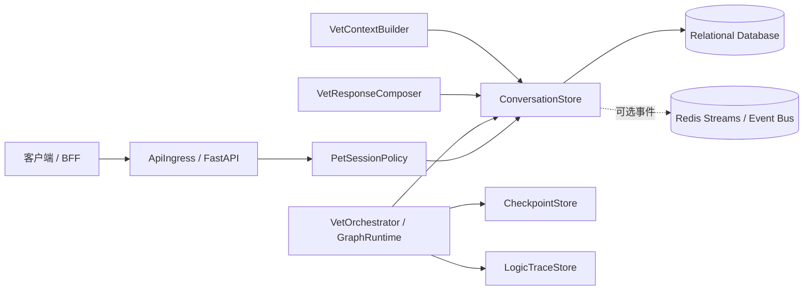
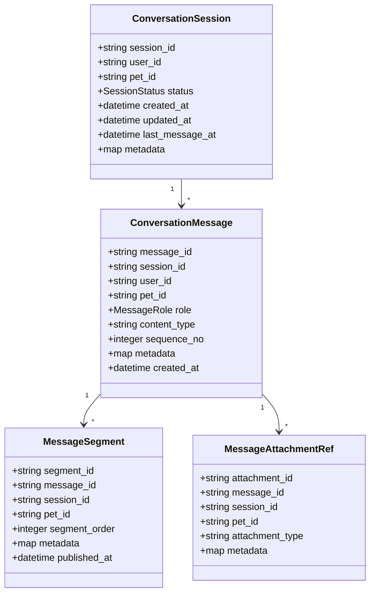
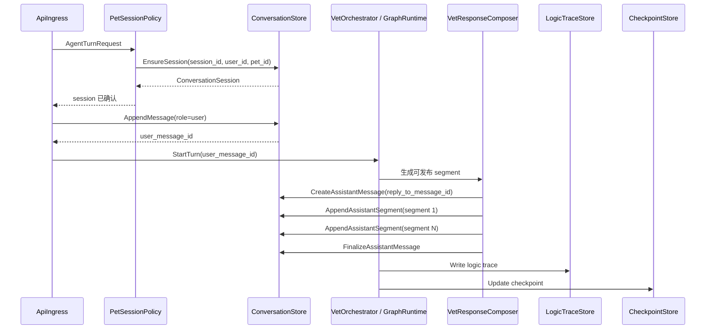
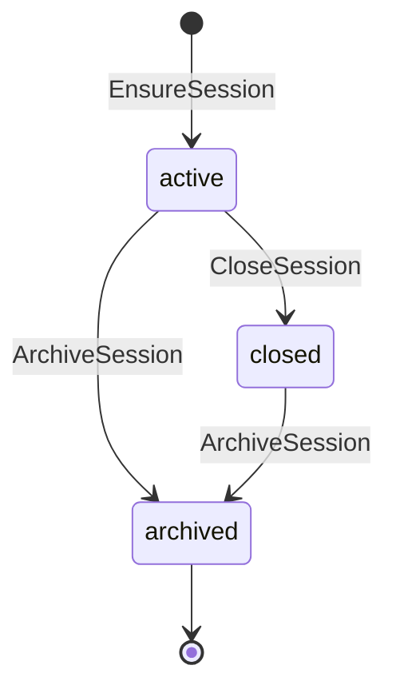

# Session / Message Store 组件设计文档 / ConversationStore

## 3.1 基础元数据 (Metadata)

* **组件标识：** Session / Message Store / `ConversationStore`
* **责任人 (Owner)：** 待定
* **代码仓库：** 待定
* **关联需求：**
  * [`docs/component_catalog.md`](../../../component_catalog.md) §4.2 Session / Message Store
  * [`docs/prd.md`](../../../prd.md) §5.1、§5.2.7、§5.3、§5.4、§6.4、§7.5、§8.2
  * [`docs/design_spec.md`](../../../design_spec.md)
* **架构层级：** L0 通用基础组件 / 持久化层
* **文档状态：** 草案

## 3.2 职责边界 (Responsibility Boundaries)

* **核心能力 (Capabilities)：**
* 创建、读取和关闭对话 session。
* 保存用户消息、助手消息及必要的系统 / 工具消息引用。
* 支持按 `session_id` 查询消息历史，并提供面向上下文构建的最近消息读取能力。
* 支持消息级 `metadata`，用于保存 `request_id`、`trace_id`、`generation_profile`、`audit_tier`、附件引用等轻量关联信息。
* 支持 session 与消息绑定 `pet_id`，并提供存储级一致性保护。
* 支持 session 内消息稳定排序。
* 支持幂等写入，避免请求重试、节点重放或流式发布重试导致重复消息。
* 支持助手回复的多段发布记录，包括 segment 顺序、发布时间和轻量 metadata。
* 为 `VetContextBuilder`、`LogicTraceStore`、前端会话展示和问题回放提供对话事实来源。

* **非目标 (Non-Goals)：**
* 不实现 JWT、OAuth、登录态解析或用户身份认证。当前阶段 Agent 服务仅在局域网访问，`user_id`、`session_id`、`pet_id` 由上游客户端 / BFF 可信传入。
* 不校验 `pet_id` 是否属于 `user_id`，该类授权校验由上游 BFF / 数据层在后续阶段承接。
* 不执行宠物选择、定宠、切宠、跨宠对照或多宠推理。
* 不决定 session 是否允许绑定某个 `pet_id`；一 session 一宠策略由 `PetSessionPolicy` 负责。
* 不保存 `slot_progress`、`rolling_summary`、pending tasks、节点执行状态等编排状态；该类状态由 `CheckpointStore` 负责。
* 不保存完整业务逻辑链、护栏三联稿、RAG 片段、`guard_actions[]` 或 `signals[]` 全量结构；该类留痕由 `LogicTraceStore` 负责。
* 不抽取、纠正或删除长期记忆；宠物级 / 主人级记忆由 `VetMemoryService` 负责。
* 不执行多任务拆解、意图识别、`generation_profile` 判定、RAG、OCR、模型调用或安全护栏审查。
* 不保存附件文件本体、OCR 原文或化验结构化结果；仅保存附件引用。

## 3.3 架构与交互设计 (Architecture & Interaction)

* **上下文视图 (Context Diagram)：**

`ConversationStore` 是 FastAPI 应用内的对话事实存储服务。当前阶段不作为独立公网服务暴露；它通过应用内 service / repository 契约被 `PetSessionPolicy`、`VetOrchestrator`、`VetContextBuilder` 与响应合成组件调用。

`ConversationStore` 只保存对话事实：谁、在哪个 session、围绕哪只宠物、说了什么、助手分几段发布。业务策略、编排状态与逻辑链分别由上层业务组件、`CheckpointStore` 与 `LogicTraceStore` 维护。

底层主存储优先采用关系型数据库。LangGraph / LangChain 作为应用内包引入时，可通过适配器读取或写入消息历史，但不替代 `ConversationStore` 的领域契约。

* **核心领域模型 (Domain Model)：**

模型说明：

* `ConversationSession` 是对话聚合根。创建后 `pet_id` 不应由普通更新改写；换宠应由客户端新开 session。
* `ConversationMessage` 是对外可回放的消息事实。完整提示词、模型草稿、审查稿、RAG 片段和护栏动作不属于本模型。
* `MessageSegment` 用于记录助手多段发布事实，支撑急症段先发布、同轮多任务覆盖等业务回放。
* `MessageAttachmentRef` 只保存附件引用和轻量元信息；附件文件、OCR 结果和化验结构化字段由对应组件管理。
* 核心字段的完整 API 报文和物理表结构应由代码内 DTO、迁移脚本或 API 治理平台维护；本文仅描述组件级领域模型。

## 3.4 契约与依赖 (Contracts & Dependencies)

* **入向契约 (Inbound APIs)：**
* 创建或确认 session：`EnsureSession` -> API 治理平台链接待建立
* 读取 session：`GetSession` -> API 治理平台链接待建立
* 追加用户 / 系统 / 工具消息：`AppendMessage` -> API 治理平台链接待建立
* 创建助手消息容器：`CreateAssistantMessage` -> API 治理平台链接待建立
* 追加助手回复段：`AppendAssistantSegment` -> API 治理平台链接待建立
* 完成助手消息：`FinalizeAssistantMessage` -> API 治理平台链接待建立
* 按 session 分页查询消息：`ListMessagesBySession` -> API 治理平台链接待建立
* 读取最近消息：`GetRecentMessages` -> API 治理平台链接待建立
* 关闭或归档 session：`CloseSession` / `ArchiveSession` -> API 治理平台链接待建立

接口原则：

* 当前契约优先作为 FastAPI 应用内服务接口使用；若后续独立服务化，再登记 HTTP / RPC 接口。
* 所有写入接口必须携带 `session_id`、`user_id` 与 `pet_id`。
* 创建 session 时允许透传上游可信身份上下文，但不在本组件执行正式鉴权。
* 追加消息时，消息 `user_id` 与 `pet_id` 必须与 session 绑定值一致。
* 幂等键应由上游传入或由编排层生成，本组件负责识别重复写入并返回既有结果。
* 助手多段回复可先创建消息容器，再按段追加 segment；segment 的业务排序由上游响应合成组件决定。
* `metadata` 仅承载轻量关联信息，不作为完整逻辑链或业务状态存储。

存储级一致性规则：

* 同一 `session_id` 只能绑定一个 `pet_id`。
* 同一 session 内消息 `sequence_no` 单调递增。
* 消息 `pet_id` 必须等于 session `pet_id`。
* 消息 `user_id` 必须等于 session `user_id`。
* 助手 segment 的 `pet_id` 必须等于所属消息与 session 的 `pet_id`。
* 附件引用的 `pet_id` 必须等于所属消息与 session 的 `pet_id`。

异常映射原则：

* session 不存在映射为 `SESSION_NOT_FOUND`。
* session 已关闭仍写入映射为 `SESSION_CLOSED`。
* 请求 `pet_id` 与 session 绑定值不一致映射为 `SESSION_PET_CONFLICT`。
* 请求 `user_id` 与 session 绑定值不一致映射为 `SESSION_USER_CONFLICT`。
* 幂等键重复映射为 `MESSAGE_DUPLICATE`，并返回既有写入结果。
* 消息或 segment 写入失败映射为 `MESSAGE_APPEND_FAILED`。
* 存储不可用映射为 `STORE_UNAVAILABLE`。

* **出向依赖 (Outbound Dependencies)：**
* **强依赖：**
* 关系型数据库：保存 session、message、segment 与附件引用。不可用时，本组件无法提供核心持久化能力。
* `RuntimeConfig`：提供分页上限、消息大小限制、幂等保留策略、可选事件通道开关等运行参数。不可用时服务不可就绪。
* `Observability`：记录存储操作日志、指标与错误摘要。不可用不应影响核心写入，但需触发降级告警。

* **弱依赖：**
* Redis Streams / Event Bus：可选用于流式 segment 发布事件或内部异步消费。不可用时不影响关系型数据库中的权威消息事实。
* Attachment Service / Object Storage：保存附件本体。本组件仅保存引用；附件服务异常时，已存在的文本消息能力不受影响。
* LangChain Chat Message History Adapter：可选适配生态包读取近期消息。适配器不可用时不影响本组件主契约。
* API 治理平台：维护完整接口字段、示例与版本。缺失时不阻塞运行，但阻塞正式接口冻结。

## 3.5 核心流转机制 (Core Flow Mechanism)

* **状态流转/时序图：**

核心流程约束：

* 用户消息应在编排开始前落库，确保后续 trace、checkpoint 与重试流程可以绑定稳定的 `user_message_id`。
* 助手消息可采用“消息容器 + 多个 segment”的形式保存，适配多任务与流式发布。
* `ConversationStore` 不决定 segment 业务顺序；急症段优先由 `VetResponseComposer` 与编排层保证。
* `ConversationStore` 记录 segment 实际保存和发布时间，用于业务回放与验收取证。
* `LogicTraceStore` 写入失败不应改写已保存的消息事实，但 A/B 级链路应由上游触发告警或发布门策略。
* `CheckpointStore` 更新失败不应由本组件补写业务状态；本组件仅保证对话事实可读取。

Session 状态：

状态说明：

* `active`：允许追加消息。
* `closed`：不再允许普通对话写入。
* `archived`：默认不进入活跃会话列表，仍可用于历史回放。
* 合规删除、记忆删除和附件删除不由本组件状态机定义。

## 3.6 稳定性与可观测性 (Reliability & Observability)

* **流量控制：**
* 对单次消息正文大小、metadata 大小、附件引用数量和单次助手 segment 数量设置上限。
* 对按 session 查询消息设置分页上限，禁止无界读取全量历史。
* 对写入接口设置数据库调用超时；超时后返回统一存储错误，不生成替代业务回复。
* 对幂等写入设置保留窗口，避免编排重试造成重复消息。
* 可选事件通道不可用时降级为仅写权威数据库，不影响消息事实保存。

* **数据一致性：**
* session 创建、用户消息追加、助手消息容器创建、segment 追加应具备事务性或等价的一致性保障。
* session 的 `pet_id` 创建后不可由普通写接口改写。
* 所有消息和 segment 必须携带 `pet_id`，且与 session 绑定值一致。
* `sequence_no` 由本组件分配或校验，确保 session 内消息顺序稳定。
* 助手多段发布场景中，已保存 segment 不由本组件回滚；上游若取消生成，应通过消息状态或后续 segment 标记表达。
* 关系型数据库是消息事实唯一权威来源；Redis Streams、LangChain adapter 或缓存均不得作为权威存储。
* 本组件可缓存最近消息读取结果，但缓存命中不得绕过 `pet_id` 与 `session_id` 校验。

* **核心指标 (Golden Signals)：**
* `conversation_store_session_create_total`：session 创建次数，按结果与错误码分组。
* `conversation_store_session_conflict_total`：session 绑定冲突次数，按冲突类型分组。
* `conversation_store_message_append_total`：消息写入次数，按 role、结果与错误码分组。
* `conversation_store_segment_append_total`：助手 segment 写入次数，按结果与错误码分组。
* `conversation_store_message_query_total`：消息读取次数，按读取类型与结果分组。
* `conversation_store_write_duration_ms`：写入耗时。
* `conversation_store_query_duration_ms`：查询耗时。
* `conversation_store_duplicate_write_total`：幂等重复写入次数。
* `conversation_store_without_pet_id_total`：缺失 `pet_id` 的写入请求次数，目标值为 0。
* `conversation_store_pet_mismatch_total`：消息或 segment `pet_id` 与 session 不一致次数。
* `conversation_store_unavailable_total`：主存储不可用次数。

访问日志字段：

* `request_id`
* `trace_id`
* `session_id`
* `user_id`
* `pet_id`
* `operation`
* `message_id`
* `segment_id`
* `sequence_no`
* `status`
* `error_code`
* `duration_ms`

日志约束：

* 普通访问日志不记录完整医疗对话正文。
* 可记录消息正文哈希、长度和内容类型，用于排障与一致性检查。
* A/B 级业务逻辑链所需正文、草稿和审查稿由 `LogicTraceStore` 按分级策略保存。
