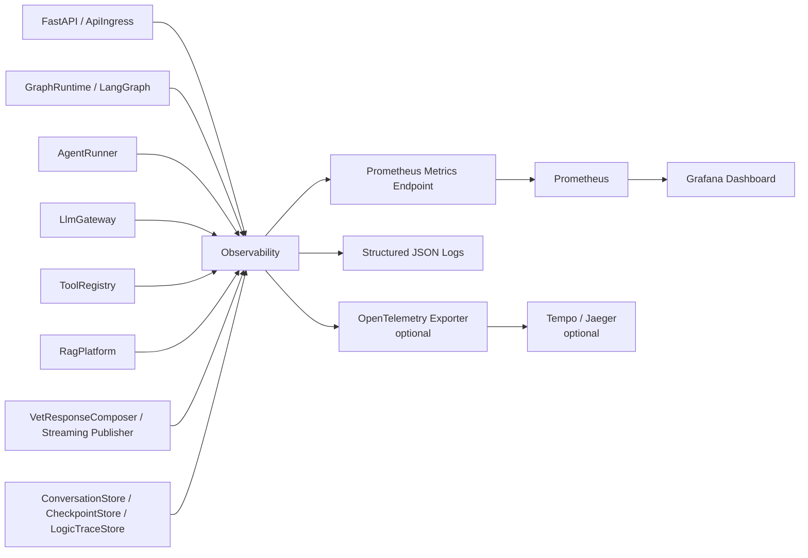
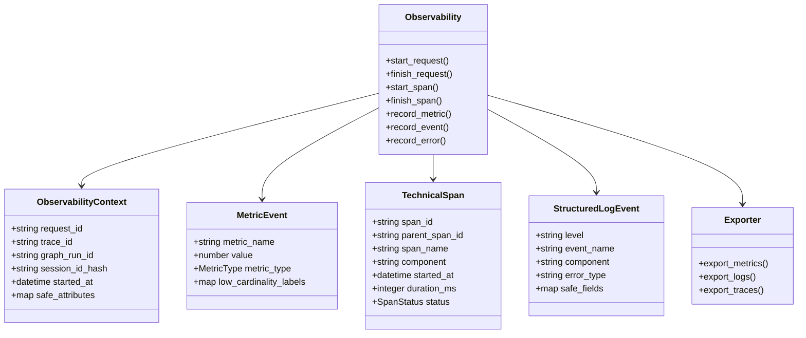
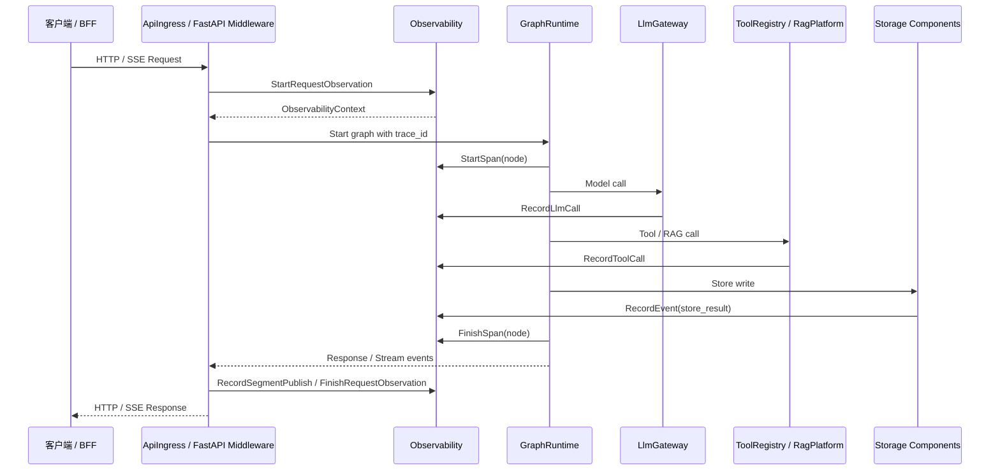
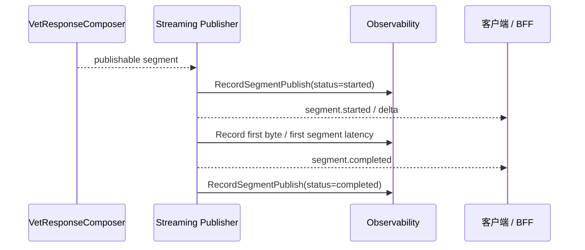
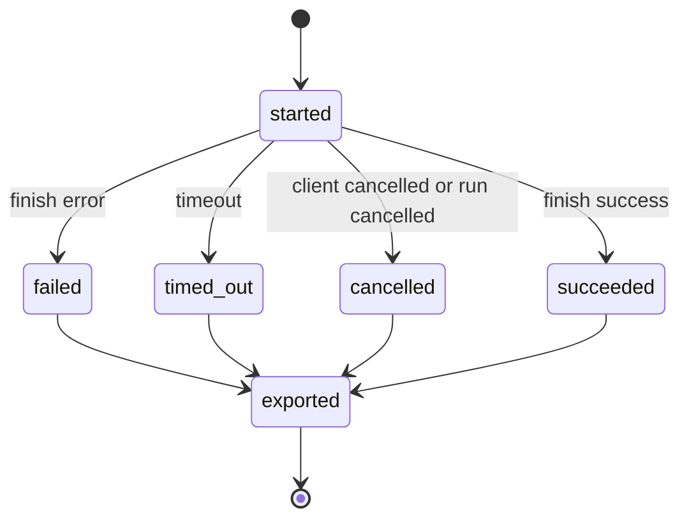

# Observability 组件设计文档 / Observability

## 3.1 基础元数据 (Metadata)

* **组件标识：** Observability 组件 / `Observability`
* **责任人 (Owner)：** 待定
* **代码仓库：** 待定
* **关联需求：**
  * [`docs/component_catalog.md`](../../../component_catalog.md) §4.5 Observability 组件
  * [`docs/component_catalog.md`](../../../component_catalog.md) §5.7 逻辑链留痕组件
  * [`docs/prd.md`](../../../prd.md) §5.1、§5.3、§5.4、§7.5、§7.6、§9、§10.3
  * [`docs/design_spec.md`](../../../design_spec.md)
* **架构层级：** L0 通用基础组件 / 可观测性基础设施层
* **文档状态：** 草案

## 3.2 职责边界 (Responsibility Boundaries)

* **核心能力 (Capabilities)：**
* 为 FastAPI 请求、LangGraph 图执行、Agent 调用、模型调用、工具调用、RAG 调用、流式分段发布提供统一技术观测能力。
* 生成或透传 `request_id`、`trace_id`，并为一次 Agent 请求建立可贯穿 HTTP、Graph、LLM、Tool 与存储写入的技术关联上下文。
* 输出低基数 metrics，用于 Prometheus 等指标中间件采集。
* 输出结构化运行日志，用于本地日志、日志采集器或后续 Loki / ELK 等日志系统接入。
* 输出技术 trace 事件，用于后续 OpenTelemetry、Tempo 或 Jaeger 等链路追踪系统接入。
* 记录请求耗时、图节点耗时、模型调用耗时、token 统计、工具调用耗时、RAG 检索耗时、错误、超时、重试、fallback 与流式 segment 发布时延。
* 为运行指标看板和基础告警提供稳定指标口径。
* 采用中间件为主的策略，优先适配 Prometheus、Grafana、OpenTelemetry 等成熟生态；自研范围限定为业务组件打点适配、标签治理与事件映射。
* 在自身下游中间件不可用时降级运行，不阻断 Agent 主链路。

* **非目标 (Non-Goals)：**
* 不实现 JWT、OAuth、登录态解析或用户身份认证。当前阶段 Agent 服务仅在局域网访问，`user_id`、`session_id`、`pet_id` 由上游客户端 / BFF 可信传入。
* 不负责业务逻辑链留痕；每轮关键决策链、护栏三联稿、`signals[]`、`guard_actions[]`、`draft_response`、`reviewed_draft` 与 `final_response` 由 `LogicTraceStore` 负责。
* 不定义兽医业务留痕 schema；A/B/C 三级业务留痕字段由 `VetTraceSchema` 负责。
* 不保存完整用户输入、完整 prompt、完整模型输出、OCR 原文、病历正文、化验报告原文或其他敏感医疗正文。
* 不执行 SAF、T4、急症、用药边界、宠物隔离、RAG 禁令或多任务发布顺序等业务判定。
* 不替代 `VetEvaluationSuites` 的红队、回归与验收测试。
* 不作为消息库、记忆库、RAG 知识库、业务审计库或逻辑链事实源。
* 不自研指标存储、监控查询语言、看板系统或告警调度系统；该类能力由成熟中间件承接。

## 3.3 架构与交互设计 (Architecture & Interaction)

* **上下文视图 (Context Diagram)：**

`Observability` 是 FastAPI 应用内的通用观测基础设施组件。它通过 middleware、node wrapper、LLM wrapper、tool wrapper 与 streaming hook 收集技术运行信号，并将其导出到指标、日志与链路追踪中间件。

当前阶段 `Observability` 不作为独立业务服务暴露；Prometheus 通过应用的 metrics endpoint 拉取指标，Grafana 读取 Prometheus 作为看板数据源。OpenTelemetry、Tempo / Jaeger、Loki / ELK 可作为后续增强，不作为 MVP 阻塞项。

* **核心领域模型 (Domain Model)：**

模型说明：

* `ObservabilityContext` 是单次请求的技术观测上下文，贯穿 FastAPI、GraphRuntime、AgentRunner、LlmGateway、ToolRegistry 与存储写入。
* `MetricEvent` 表示可聚合指标事件，只允许低基数标签；`user_id`、`pet_id`、`session_id`、`message_id`、`trace_id` 不得作为 Prometheus label。
* `TechnicalSpan` 表示技术链路追踪片段，用于定位一次请求慢在哪里或失败在哪里。
* `StructuredLogEvent` 表示结构化运行日志，只保存安全字段、错误摘要和关联 ID，不保存敏感正文。
* `Exporter` 是面向外部中间件的适配层。MVP 至少提供 Prometheus metrics 与 JSON log 输出；OpenTelemetry exporter 可后续启用。
* 完整指标枚举、日志字段、span 属性和 exporter 配置应由代码内常量、配置文件或可观测性平台维护；本文仅描述组件级领域模型。

## 3.4 契约与依赖 (Contracts & Dependencies)

* **入向契约 (Inbound APIs)：**
* 初始化观测上下文：`StartRequestObservation` -> API 治理平台链接待建立
* 完成请求观测：`FinishRequestObservation` -> API 治理平台链接待建立
* 开始技术 span：`StartSpan` -> API 治理平台链接待建立
* 完成技术 span：`FinishSpan` -> API 治理平台链接待建立
* 记录指标：`RecordMetric` -> API 治理平台链接待建立
* 记录结构化事件：`RecordEvent` -> API 治理平台链接待建立
* 记录异常摘要：`RecordError` -> API 治理平台链接待建立
* 记录 LLM 调用摘要：`RecordLlmCall` -> API 治理平台链接待建立
* 记录工具调用摘要：`RecordToolCall` -> API 治理平台链接待建立
* 记录 segment 发布摘要：`RecordSegmentPublish` -> API 治理平台链接待建立
* 指标抓取端点：`GET /metrics` -> API 治理平台链接待建立

接口原则：

* 当前契约优先作为 FastAPI 应用内 SDK / service 接口使用；`GET /metrics` 是 Prometheus 抓取入口。
* `StartRequestObservation` 应由 `ApiIngress` 或 FastAPI middleware 在请求入口调用，并生成或透传 `request_id`、`trace_id`。
* `StartSpan` / `FinishSpan` 应由 `GraphRuntime` node wrapper、Agent wrapper、tool wrapper 和存储 wrapper 调用。
* `RecordLlmCall` 只记录模型供应商、模型标识、Agent 名称、剖面标签、耗时、token、重试、状态与错误类型，不记录 prompt 或 completion 正文。
* `RecordToolCall` 只记录工具名、耗时、状态、超时与错误类型，不记录工具返回的大对象正文。
* `RecordSegmentPublish` 只记录 segment 类型、是否首段、发布时间、耗时与发布状态，不记录 segment 正文。
* `RecordMetric` 必须拒绝或降级处理高基数标签，避免指标系统膨胀。
* `GET /metrics` 当前仅面向局域网或部署层受限环境开放；本组件不内建 JWT / OAuth 鉴权。

异常映射原则：

* 非法指标名映射为 `OBS_METRIC_NAME_INVALID`。
* 高基数标签或禁止标签映射为 `OBS_LABEL_REJECTED`。
* 观测上下文缺失映射为 `OBS_CONTEXT_MISSING`。
* span 嵌套关系异常映射为 `OBS_SPAN_RELATION_INVALID`。
* exporter 不可用映射为 `OBS_EXPORTER_UNAVAILABLE`。
* 日志事件包含敏感字段映射为 `OBS_EVENT_UNSAFE`.
* 指标端点不可用映射为 `OBS_METRICS_ENDPOINT_UNAVAILABLE`。

* **出向依赖 (Outbound Dependencies)：**
* **强依赖：**
* Python 日志系统或等价结构化日志输出能力：提供最小运行事件输出。若完全不可用，服务应进入降级告警或不可就绪状态。
* `RuntimeConfig`：提供观测开关、采样策略、敏感字段屏蔽、指标标签白名单、exporter 配置、日志级别与 endpoint 开关。不可用时服务不可就绪。

* **弱依赖：**
* Prometheus client / metrics exporter：提供 metrics endpoint 与指标聚合。不可用时不阻断 Agent 主链路，但运行指标不可被正常采集。
* Prometheus：拉取并存储时间序列指标。不可用时本组件继续本地暴露 `/metrics`，不阻断主链路。
* Grafana：展示运行指标看板。不可用时不影响指标采集与业务请求。
* OpenTelemetry SDK / Collector：后续用于导出技术 trace。不可用时降级为仅 metrics + logs。
* Tempo / Jaeger：后续用于技术链路查询。不可用时不影响请求处理。
* Loki / ELK 或等价日志系统：后续用于日志检索。不可用时结构化日志仍输出到标准日志通道。
* Alertmanager 或等价告警系统：后续用于告警调度。不可用时不影响业务请求。
* `LogicTraceStore`：作为被观测对象，仅向 `Observability` 提供写入成功、失败和耗时等技术事件；业务逻辑链内容不进入 `Observability`。

## 3.5 核心流转机制 (Core Flow Mechanism)

* **状态流转/时序图：**

请求观测流程：

流式 segment 观测流程：

技术 span 状态：

核心流程约束：

* 请求入口必须存在 `request_id` 与 `trace_id`；缺失时由入口层生成。
* 一次请求内的 HTTP、Graph、LLM、Tool、RAG、存储和流式发布事件必须关联同一 `trace_id`。
* 观测写入不得阻塞主链路；除启动期配置错误外，exporter 失败只能触发降级事件和告警。
* metrics label 必须使用白名单策略；高基数字段只能进入结构化日志安全字段或业务逻辑链。
* 流式输出按 segment 记录，不按 token 逐条记录。
* `Observability` 只记录技术摘要；如需排查业务判断细节，应通过 `trace_id` 关联查询 `LogicTraceStore`。

## 3.6 稳定性与可观测性 (Reliability & Observability)

* **流量控制：**
* 观测打点在同步路径中只执行轻量计数、计时和上下文字段读取；重型导出应异步或由中间件拉取完成。
* 对结构化日志输出设置字段白名单、大小上限和异常日志限流。
* 对指标 label 使用白名单和低基数枚举；禁止将 `user_id`、`pet_id`、`session_id`、`message_id`、`trace_id` 作为 Prometheus label。
* 对 OpenTelemetry trace 可配置采样策略；错误、超时、fallback 等事件可提高采样优先级。
* 对 exporter 设置超时、缓冲上限和失败降级；下游观测中间件不可用时不得拖慢 Agent 回复。
* `/metrics` endpoint 应仅在内网或部署层受限环境暴露；本组件不承担用户级鉴权。

* **数据一致性：**
* `request_id`、`trace_id`、`graph_run_id`、`node_run_id`、`model_call_id`、`tool_call_id` 应在各组件间稳定传递，作为日志、指标、技术 trace 与业务逻辑链的关联键。
* metrics 为聚合型时间序列，不作为精确业务事实源。
* technical trace 为排障辅助，不作为业务逻辑链事实源。
* structured logs 只保存安全字段与错误摘要，不保存敏感正文。
* `Observability` 与 `LogicTraceStore` 的写入结果可能存在时间先后差异；排障时以 `trace_id` 关联，不要求二者强事务一致。
* exporter 失败时可丢弃非关键观测事件；不得回滚业务消息、checkpoint 或逻辑链写入。
* 对同一请求的重复观测事件应使用 `request_id`、`trace_id` 与调用 ID 去重或以幂等方式聚合。

* **核心指标 (Golden Signals)：**
* `http_requests_total`：HTTP 请求总数，按 endpoint、method、status_code、streaming 分组。
* `http_request_duration_seconds`：HTTP 请求耗时。
* `http_request_errors_total`：HTTP 错误总数，按 endpoint、status_code、error_type 分组。
* `http_active_requests`：当前活跃请求数。
* `graph_runs_total`：Graph 执行总数，按 graph_name、status 分组。
* `graph_run_duration_seconds`：Graph 执行耗时。
* `graph_node_duration_seconds`：Graph 节点耗时，按 node_name、status 分组。
* `graph_node_errors_total`：Graph 节点错误总数。
* `graph_node_retries_total`：Graph 节点重试次数。
* `graph_node_timeouts_total`：Graph 节点超时次数。
* `llm_calls_total`：模型调用总数，按 agent_name、generation_profile、model_provider、model_name、status 分组。
* `llm_call_duration_seconds`：模型调用耗时。
* `llm_prompt_tokens_total`：prompt token 总量。
* `llm_completion_tokens_total`：completion token 总量。
* `llm_total_tokens_total`：总 token 消耗。
* `llm_call_retries_total`：模型调用重试次数。
* `tool_calls_total`：工具调用总数，按 tool_name、status 分组。
* `tool_call_duration_seconds`：工具调用耗时。
* `tool_call_timeouts_total`：工具调用超时次数。
* `rag_queries_total`：RAG 查询总数，按 rag_mode、generation_profile、status 分组。
* `rag_query_duration_seconds`：RAG 查询耗时。
* `rag_empty_results_total`：RAG 空结果次数。
* `stream_first_byte_duration_seconds`：流式首字节耗时。
* `segment_publish_duration_seconds`：segment 发布耗时，按 segment_type、generation_profile、is_first_segment、status 分组。
* `segments_published_total`：segment 发布总数。
* `guardrail_actions_total`：护栏动作技术事件总数，按 stage、action_type、generation_profile 分组。
* `fallback_triggered_total`：fallback 触发总数，按 fallback_reason_code、generation_profile 分组。
* `logic_trace_write_duration_seconds`：业务逻辑链写入耗时。
* `logic_trace_write_errors_total`：业务逻辑链写入错误总数。
* `observability_exporter_errors_total`：观测 exporter 错误总数，按 exporter_type 分组。

看板分组：

* 服务总览：QPS、P95 / P99 延迟、错误率、活跃请求、流式请求数。
* Graph 执行：Graph 耗时、节点耗时、节点错误率、节点超时率、checkpoint 相关耗时。
* LLM 稳定性与成本：各 Agent 调用量、耗时、错误率、重试次数、token 消耗。
* Tool / RAG：工具耗时、RAG 耗时、空结果率、错误率。
* 安全与 fallback 技术事件：fallback 触发次数、reason code 分布、guardrail action 分布、审查节点耗时。
* 流式与分段发布：首字节耗时、首段耗时、`safety_trigger` segment 发布时间、客户端取消次数。

告警候选：

* HTTP 5xx 错误率连续升高。
* P99 请求延迟超过运行阈值。
* Graph 节点超时率异常升高。
* LLM 调用错误率或 P95 延迟异常升高。
* `fallback_triggered_total` 在短时间内异常升高。
* `safety_trigger` 首段发布时间异常升高。
* RAG 空结果率或查询错误率异常升高。
* `LogicTraceStore` 写入失败率异常升高。
* Observability exporter 持续不可用。

观测面板链接：

* Prometheus 指标抓取：待建立
* Grafana 服务总览面板：待建立
* Grafana Agent 运行面板：待建立
* 技术 Trace 查询面板：待建立
