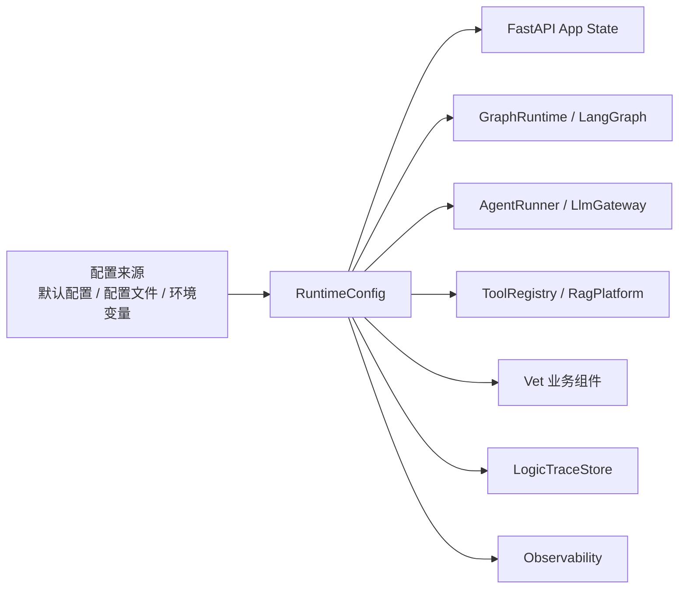
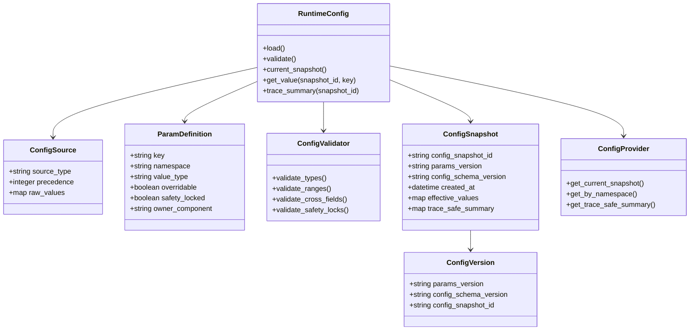
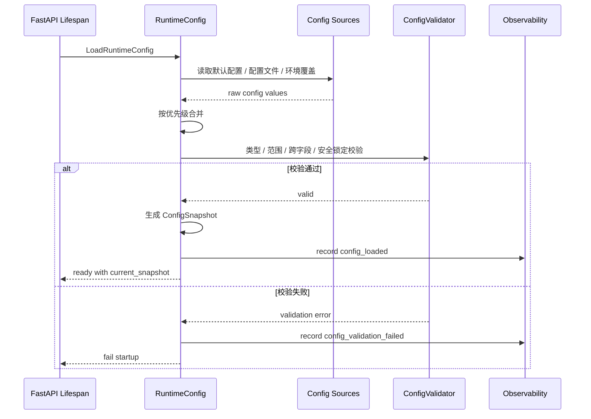
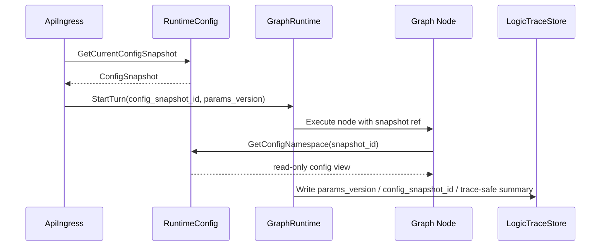
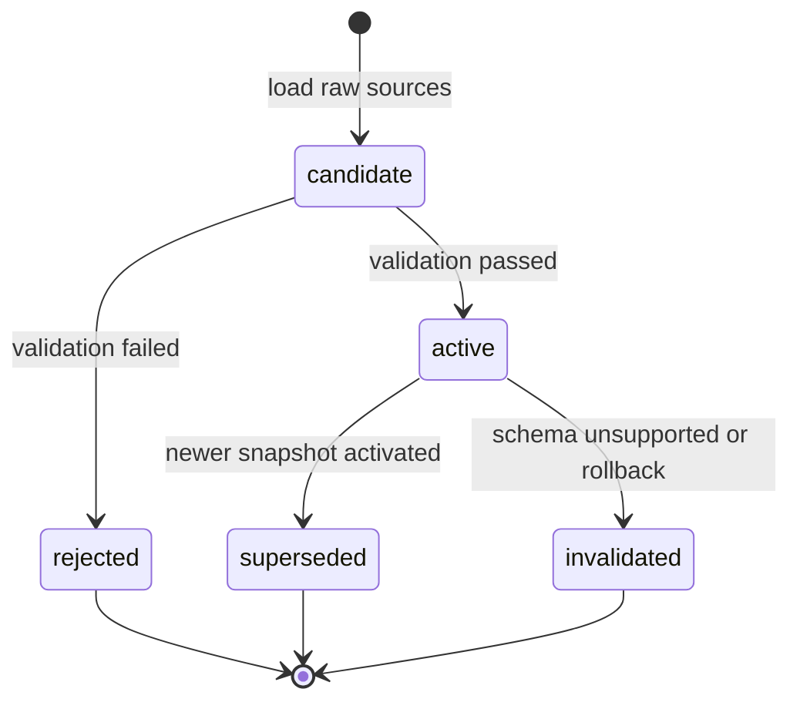

# 配置与参数组件设计文档 / RuntimeConfig

## 3.1 基础元数据 (Metadata)

* **组件标识：** 配置与参数组件 / `RuntimeConfig`
* **责任人 (Owner)：** 待定
* **代码仓库：** 待定
* **关联需求：**
  * [`docs/component_catalog.md`](../../../component_catalog.md) §4.4 配置与参数组件
  * [`docs/prd.md`](../../../prd.md) §5.4、§7.5、§7.6、§9.11、§10
  * [`docs/design_spec.md`](../../../design_spec.md)
* **架构层级：** L0 通用基础组件 / 配置基础设施层
* **文档状态：** 草案

## 3.2 职责边界 (Responsibility Boundaries)

* **核心能力 (Capabilities)：**
* 加载通用运行配置与业务运行参数，并向 FastAPI 应用内组件提供统一只读访问入口。
* 管理参数定义、默认值、类型、允许范围、覆盖规则与配置 schema version。
* 基于 Pydantic / pydantic-settings 执行配置结构化、环境覆盖解析、字段校验与跨字段校验。
* 在服务启动或配置变更前执行安全锁定校验，禁止通过配置放宽 PRD 约束中的 P0 安全要求。
* 生成不可变 `ConfigSnapshot`，保证单次请求全链路使用同一份有效配置。
* 管理并暴露 `params_version`、`config_schema_version`、`config_snapshot_id`。
* 向 `GraphRuntime`、`AgentRunner`、`LlmGateway`、`ToolRegistry`、`RagPlatform`、`VetContextBuilder`、安全护栏组件、`LogicTraceStore` 等下游提供配置读取能力。
* 向逻辑链留痕提供参数版本与关键参数摘要，支持回归夹具固定参数版本。
* 记录配置加载、校验、拒绝覆盖、快照切换等基础指标。

* **非目标 (Non-Goals)：**
* 不实现 JWT、OAuth、登录态解析或用户身份认证。当前阶段 Agent 服务仅在局域网访问，`user_id`、`session_id`、`pet_id` 由上游客户端 / BFF 可信传入。
* 不实现面向业务用户或公网的配置管理后台；MVP 阶段仅要求启动加载与部署覆盖。
* 不负责定义兽医业务规则语义；SAF、用药阶梯、问诊追问、参考区间、RAG 使用边界等语义由 L2 业务组件和 PRD 负责。
* 不执行多任务拆解、意图识别、`generation_profile` 判定、RAG、OCR、模型调用或安全护栏审查。
* 不保存业务逻辑链；仅向 `LogicTraceStore` 提供可记录的版本与配置摘要。
* 不保存或输出密钥明文、真实网络地址、数据库连接串、模型 API key 等敏感配置。
* 不作为红队用例库、参考区间表、知识库索引或业务字典存储。
* 不在文档内复制 PRD §10 的完整参数表；运行参数事实源以 PRD §10 为准。

## 3.3 架构与交互设计 (Architecture & Interaction)

* **上下文视图 (Context Diagram)：**

`RuntimeConfig` 是 FastAPI 应用内配置基础设施组件。它在应用启动阶段加载、合并并校验配置，随后生成当前有效 `ConfigSnapshot`。请求进入时，`ApiIngress` 或 `GraphRuntime` 获取当前快照，并将快照标识写入本轮 Graph state；后续节点均基于同一快照读取参数。

当前阶段 `RuntimeConfig` 不作为独立网络服务暴露。若后续引入配置中心或热更新能力，应仍通过 `RuntimeConfig` 统一生成已校验快照，不允许业务组件直接读取远程配置或环境变量。

* **核心领域模型 (Domain Model)：**

模型说明：

* `ConfigSource` 表示配置来源与覆盖优先级。MVP 阶段来源包括内置默认值、项目配置文件、环境变量或 `.env`；后续可扩展远程配置中心。
* `ParamDefinition` 表示参数定义元数据，包括类型、命名空间、是否可覆盖、是否安全锁定、主要消费组件等。
* `ConfigValidator` 负责配置校验，包括类型、范围、跨字段关系与安全不可放宽项。
* `ConfigSnapshot` 是合并与校验后的不可变有效配置。单次请求应始终绑定一个 `config_snapshot_id`。
* `ConfigProvider` 是下游组件读取配置的稳定契约；业务节点不得直接读取环境变量或原始配置文件。
* 完整配置模型字段应由代码内 Pydantic model 维护；本文仅描述组件级领域模型。

## 3.4 契约与依赖 (Contracts & Dependencies)

* **入向契约 (Inbound APIs)：**
* 应用启动加载配置：`LoadRuntimeConfig` -> API 治理平台链接待建立
* 获取当前配置快照：`GetCurrentConfigSnapshot` -> API 治理平台链接待建立
* 按快照读取配置值：`GetConfigValue` -> API 治理平台链接待建立
* 按命名空间读取配置视图：`GetConfigNamespace` -> API 治理平台链接待建立
* 获取逻辑链安全摘要：`GetTraceSafeConfigSummary` -> API 治理平台链接待建立
* 校验候选配置：`ValidateCandidateConfig` -> API 治理平台链接待建立
* 重新加载配置：`ReloadRuntimeConfig` -> API 治理平台链接待建立，MVP 可不启用

接口原则：

* 当前契约优先作为 FastAPI 应用内服务接口使用；若后续独立服务化，再登记 HTTP / RPC 接口。
* `LoadRuntimeConfig` 应在应用就绪前完成；配置校验失败时服务不得进入 ready 状态。
* `GetCurrentConfigSnapshot` 返回不可变快照引用或等价只读对象，不允许调用方修改有效配置。
* `GetConfigValue` 与 `GetConfigNamespace` 必须基于指定 `config_snapshot_id` 或当前请求绑定快照读取。
* `GetTraceSafeConfigSummary` 只返回可进入逻辑链的摘要，不返回密钥、连接串、真实网络地址等敏感值。
* `ReloadRuntimeConfig` 若启用，必须先校验候选配置并原子切换；已开始请求继续使用旧快照，新请求使用新快照。
* 完整结构化配置字段由代码内 Pydantic model 维护；本文不复制完整字段字典。

关键校验原则：

* 必需配置缺失、类型错误、范围越界、未知关键参数、跨字段关系冲突时，应拒绝配置并返回明确错误。
* 对安全锁定项的放宽尝试必须拒绝，不能自动纠正后继续启动。
* 配置合并后必须生成稳定 `config_snapshot_id`。
* 每轮涉诊或调用 Agent 编排的请求应记录 `params_version`；A/B 级逻辑链可记录关键参数摘要。

异常映射原则：

* 配置来源不可读映射为 `CONFIG_SOURCE_UNAVAILABLE`。
* 配置结构不符合 schema 映射为 `CONFIG_SCHEMA_INVALID`。
* 参数类型错误映射为 `CONFIG_TYPE_INVALID`。
* 参数范围错误映射为 `CONFIG_RANGE_INVALID`。
* 跨字段校验失败映射为 `CONFIG_RELATION_INVALID`。
* 安全锁定项被放宽映射为 `CONFIG_SAFETY_LOCK_VIOLATION`。
* 配置快照不存在映射为 `CONFIG_SNAPSHOT_NOT_FOUND`。
* 配置摘要包含敏感字段映射为 `CONFIG_TRACE_SUMMARY_UNSAFE`。

* **出向依赖 (Outbound Dependencies)：**
* **强依赖：**
* 本地默认配置与项目配置文件：提供服务启动所需的基础配置。不可用或不合法时服务不可就绪。
* Pydantic / pydantic-settings：提供配置模型、环境覆盖解析、字段校验与 settings 管理能力。不可用时本组件无法完成核心配置加载。
* `Observability`：记录配置加载、校验、拒绝覆盖和快照状态。不可用不应影响配置加载，但需触发降级告警。

* **弱依赖：**
* `.env` / 环境变量 / secrets file：用于部署覆盖。缺失时可使用项目配置与默认值，但不得缺失必需配置。
* 远程配置中心：后续可选能力。不可用时应使用最后一个已验证快照或启动期本地配置；MVP 可不接入。
* `LogicTraceStore`：消费 `params_version` 与配置摘要。本组件不直接写入逻辑链；留痕失败由调用方处理。
* API 治理平台：维护完整内部接口字段、示例与版本。缺失时不阻塞运行，但阻塞正式接口冻结。

## 3.5 核心流转机制 (Core Flow Mechanism)

* **状态流转/时序图：**

应用启动加载流程：

请求绑定快照流程：

配置快照状态：

核心流程约束：

* 应用 ready 前必须存在一个已校验 `active` 快照。
* 单次请求获取快照后，整条 Graph 执行链路不得自动切换到新快照。
* 业务组件只能通过 `ConfigProvider` 获取配置视图，不得直接读取原始环境变量。
* 安全锁定项校验失败时不得降级启动。
* 若后续启用 reload，新快照必须先进入 `candidate` 并完成完整校验，才可原子切换为 `active`。

## 3.6 稳定性与可观测性 (Reliability & Observability)

* **流量控制：**
* 配置读取为应用内本地只读操作，不设置业务流量限流。
* `ReloadRuntimeConfig` 若启用，应限制调用来源、调用频率与并发执行；MVP 阶段可不开放。
* 对配置文件大小、参数数量、嵌套深度与候选配置校验耗时设置上限。
* 对远程配置中心的访问设置超时与熔断；MVP 阶段不依赖远程配置中心。

* **数据一致性：**
* `ConfigSnapshot` 一经激活即不可变；新配置必须生成新 `config_snapshot_id`。
* 单次请求必须绑定一个固定 `config_snapshot_id`，并贯穿 `GraphRuntime`、Agent 节点、工具调用、护栏和逻辑链写入。
* `params_version`、`config_schema_version` 与 `config_snapshot_id` 应同时保留，分别支撑业务参数回归、配置结构兼容和精确排障。
* 配置摘要进入逻辑链前必须经过敏感字段过滤。
* 若启用 reload，应保留 last-known-good 快照；候选配置校验失败不得影响当前 active 快照。
* 配置源不是业务事实源；对话事实、checkpoint、逻辑链、记忆、知识库和 OCR 结构化结果由对应组件维护。

* **核心指标 (Golden Signals)：**
* `runtime_config_load_total`：配置加载次数，按结果分组。
* `runtime_config_validation_failure_total`：配置校验失败次数，按错误类型分组。
* `runtime_config_safety_lock_violation_total`：安全锁定项违规次数。
* `runtime_config_snapshot_active`：当前 active 快照标识与版本标签。
* `runtime_config_snapshot_change_total`：快照切换次数。
* `runtime_config_lookup_total`：配置读取次数，按命名空间与结果分组。
* `runtime_config_lookup_error_total`：配置读取错误次数。
* `runtime_config_trace_summary_rejected_total`：因敏感字段或不安全摘要被拒绝的次数。
* `requests_by_params_version`：请求量按 `params_version` 分布。
* `fallback_by_params_version`：fallback 触发按 `params_version` 分布。
* `route_distribution_by_params_version`：关键路由分布按 `params_version` 分布。

可观测性面板链接：待建立。
