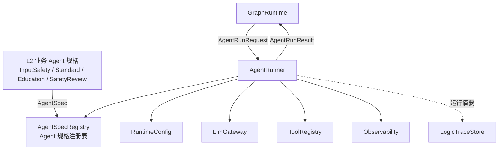
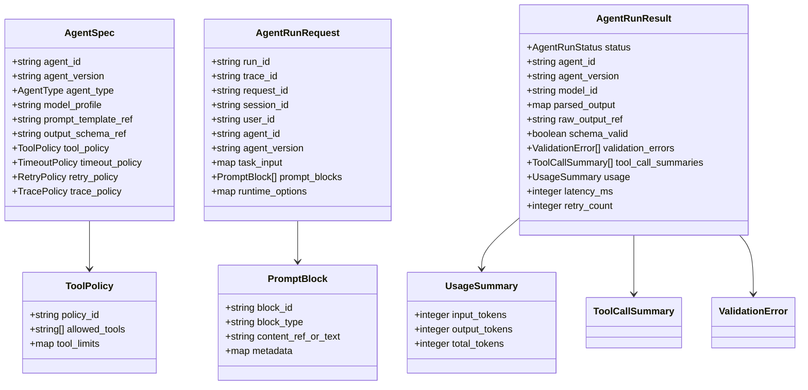
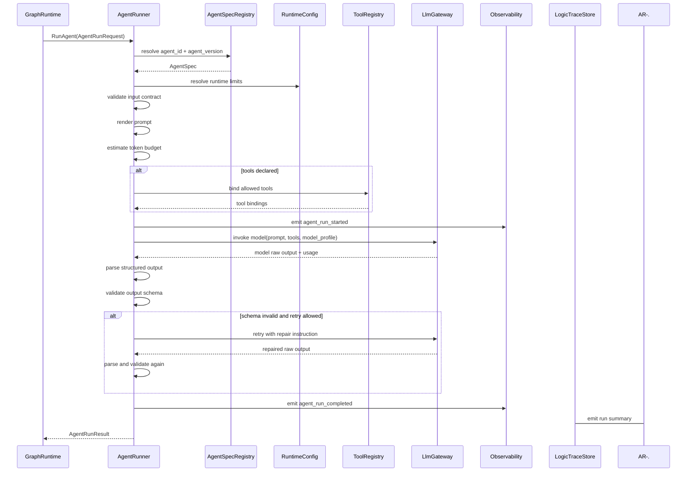
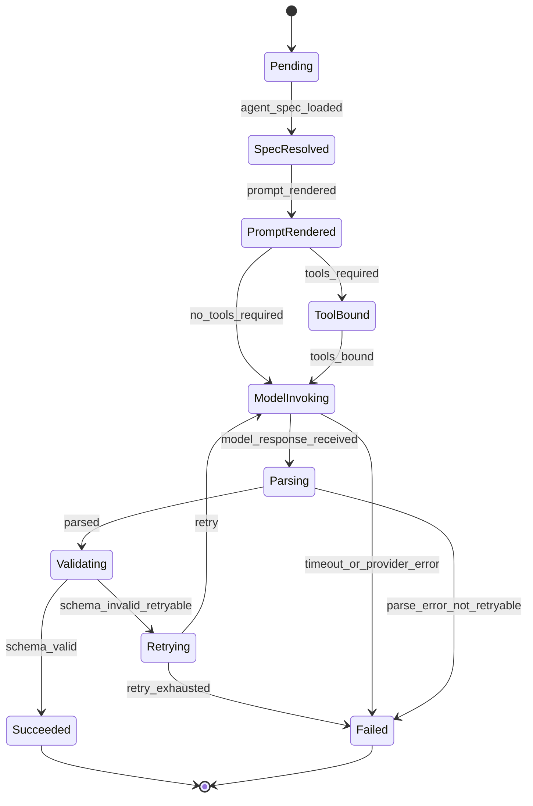

# Agent Runner 组件设计文档 / AgentRunner

## 3.1 基础元数据 (Metadata)

* **组件标识：** Agent Runner / `AgentRunner`
* **责任人 (Owner)：** 待定
* **代码仓库：** 当前仓库，正式 Git Repository URL 待补充
* **关联需求：**
  * [`docs/component_catalog.md`](../../../component_catalog.md) §5.2 Agent Runner
  * [`docs/prd.md`](../../../prd.md) §5.4、§7.4、§7.6、§9.2
  * [`docs/design_spec.md`](../../../design_spec.md)
* **架构层级：** L1 AI 通用运行组件
* **文档状态：** 草案

## 3.2 职责边界 (Responsibility Boundaries)

* **核心能力 (Capabilities)：**
* 基于版本化 `AgentSpec` 执行一次受控 Agent 调用。
* 渲染 Agent prompt，并将上游传入的上下文块、安全边界、任务输入和运行参数组合为模型请求。
* 通过 `LlmGateway` 调用指定模型配置，屏蔽具体模型供应商差异。
* 通过 `ToolRegistry` 绑定当前 Agent 被授权使用的工具集合，并执行工具权限约束。
* 支持结构化输出解析，将模型原始输出转换为业务节点可消费的标准结果。
* 执行输出 schema 校验，并在允许范围内进行格式修复或有限重试。
* 处理模型调用超时、临时供应商错误、工具调用错误和结构化解析失败。
* 返回标准化 `AgentRunResult`，供 `GraphRuntime`、业务节点、护栏节点和逻辑链留痕组件继续处理。
* 记录模型调用摘要、token 使用、延迟、重试次数、工具调用摘要和结构化校验结果。
* 支持不同业务 Agent 使用不同模型、prompt、输出 schema、工具权限和运行策略。

* **非目标 (Non-Goals)：**
* 不负责 HTTP 接入、FastAPI 路由、SSE 输出或客户端协议适配；入口能力由 `ApiIngress` 承担。
* 不实现 JWT、OAuth、登录态解析或用户认证。当前阶段 Agent 服务仅在局域网访问，身份上下文由上游可信传入。
* 不负责 `session_id` 与 `pet_id` 的业务一致性校验；一 session 一宠策略由 `PetSessionPolicy` 负责。
* 不负责多任务拆解、任务优先级、分段发布顺序或急症段优先发布；这些由 L2 业务编排和 `VetResponseComposer` 负责。
* 不决定 `intent`、`route`、`generation_profile` 或 `audit_tier`；这些由对应业务节点或业务 schema 决定。
* 不构造宠物画像、记忆、slot、OCR 或 RAG 上下文；上下文编译由 `VetContextBuilder`、`RagPlatform` 或其他上游节点完成。
* 不以通用 Agent Memory 替代兽医领域上下文适配层。
* 不让模型通过自主工具调用补齐 P0 临床上下文；P0 上下文必须由上游业务节点显式传入。
* 不执行最终安全放行；输出安全审查由 `VetOutputSafetyReviewer` 承担，确定性否决由 `VetDeterministicFallbackGate` 承担。
* 不直接向用户发布模型输出；用户可见内容必须由下游护栏、合成与发布组件处理。
* 不写入长期记忆、会话消息、checkpoint 或业务逻辑链全量记录；本组件仅输出运行摘要和结果对象。

## 3.3 架构与交互设计 (Architecture & Interaction)

* **上下文视图 (Context Diagram)：**

`AgentRunner` 是 FastAPI 应用内的 AI 运行组件。它通常由 LangGraph 节点调用，内部可按需使用 LangChain 的模型适配、prompt 模板、工具绑定和结构化输出能力。`AgentRunner` 只执行一次受控 Agent 调用，不持有全局业务图状态，也不替代 `GraphRuntime` 的流程编排能力。

* **核心领域模型 (Domain Model)：**

模型说明：

* `AgentSpec` 是 Agent 执行规格，不是业务需求文档。业务 Agent 的 prompt、输出 schema、工具权限和模型配置均通过该规格引用。
* `AgentRunRequest` 是一次运行输入，由上游图节点构造。它可以携带 `session_id`、`user_id` 等上下文字段，但本组件不解释其业务授权含义。
* `PromptBlock` 是已编译上下文的承载单元。对兽医业务而言，该内容应由 `VetContextBuilder` 或 RAG 节点准备完成。
* `AgentRunResult` 是标准运行结果。业务含义由调用方根据 `agent_id` 和 `parsed_output` 解释。
* 完整 DTO 字段、枚举和校验细节应由代码内 Pydantic 模型或 API 治理平台维护；本文仅描述组件级领域模型。

## 3.4 契约与依赖 (Contracts & Dependencies)

* **入向契约 (Inbound APIs)：**
* 执行 Agent：`RunAgent` -> API 治理平台链接待建立
* 执行 Agent 并返回运行事件：`RunAgentWithEvents` -> API 治理平台链接待建立
* 校验 Agent 规格：`ValidateAgentSpec` -> API 治理平台链接待建立
* 预估 prompt token：`EstimateAgentPrompt` -> API 治理平台链接待建立

接口原则：

* 当前契约优先作为 FastAPI 应用内服务接口使用；若后续独立服务化，再登记 HTTP / RPC 接口。
* 所有运行请求必须指定 `agent_id` 与 `agent_version`，不得依赖隐式默认 Agent。
* 所有运行请求必须携带 `trace_id` 与 `request_id`，用于贯穿模型调用、工具调用、观测指标与逻辑链留痕。
* `task_input` 与 `prompt_blocks` 必须由上游业务节点准备；本组件不主动读取业务数据库补齐上下文。
* `tool_policy` 采用默认拒绝策略；未在 `AgentSpec` 中声明的工具不得绑定。
* 输出 schema 校验失败时，本组件只做格式层面的有限修复或重试，不自行改写业务决策。
* 若调用方要求流式运行，本组件最多返回内部运行事件或 draft 增量；是否对用户发布由下游护栏和发布组件决定。

异常映射原则：

* Agent 规格不存在映射为 `AGENT_SPEC_NOT_FOUND`。
* Agent 规格版本不可用映射为 `AGENT_SPEC_VERSION_UNAVAILABLE`。
* prompt 渲染失败映射为 `PROMPT_RENDER_FAILED`。
* prompt 超出模型上下文限制映射为 `TOKEN_BUDGET_EXCEEDED`。
* 模型调用超时映射为 `MODEL_TIMEOUT`。
* 模型供应商错误映射为 `MODEL_PROVIDER_ERROR`。
* 工具未授权映射为 `TOOL_PERMISSION_DENIED`。
* 工具执行失败映射为 `TOOL_EXECUTION_FAILED`。
* 输出解析失败映射为 `OUTPUT_PARSE_FAILED`。
* 输出 schema 校验失败映射为 `OUTPUT_SCHEMA_VALIDATION_FAILED`。
* 重试耗尽映射为 `AGENT_RETRY_EXHAUSTED`。

* **出向依赖 (Outbound Dependencies)：**
* **强依赖：**
* `LlmGateway`：执行模型调用、模型路由、供应商适配、token 统计和模型降级。不可用时本组件无法完成核心运行能力。
* `AgentSpecRegistry`：提供 Agent 规格、prompt 模板引用、输出 schema 引用、模型配置引用和工具权限策略。不可用时不得执行未确认规格的 Agent。
* `RuntimeConfig`：提供全局超时、重试上限、模型调用限制和运行参数版本。不可用时服务不可就绪。
* `Observability`：记录模型运行指标、错误、超时和 token 使用。不可用不应影响一次运行，但需触发降级告警。

* **弱依赖：**
* `ToolRegistry`：仅当当前 Agent 规格声明工具时需要。若工具系统不可用，允许无工具 Agent 正常运行；有工具 Agent 按 `tool_policy` 降级或失败。
* `LogicTraceStore`：消费运行摘要、输入输出摘要或 hash。短暂不可用时可由上游图运行事件补偿，但本组件必须暴露 trace 写入降级状态。
* LangChain 模型、prompt、tool 或 structured output 适配器：作为库能力按需引入。适配器异常不得绕过本组件的 schema 校验和权限策略。
* API 治理平台：维护完整接口字段、示例和版本。缺失时不阻塞运行，但阻塞正式契约冻结。

## 3.5 核心流转机制 (Core Flow Mechanism)

* **状态流转/时序图：**

核心流程约束：

* `AgentRunner` 的一次运行应对应一个明确的 `agent_id` 与 `agent_version`。
* prompt 渲染必须只使用调用方传入的 `task_input`、`prompt_blocks`、`runtime_options` 与 `AgentSpec` 中声明的模板。
* token 超限时不得静默裁剪业务上下文；应返回 `TOKEN_BUDGET_EXCEEDED` 或由调用方显式提供压缩后的输入。
* 工具绑定必须先经 `ToolRegistry` 权限校验，禁止运行期由模型请求未授权工具。
* 结构化输出校验失败时，可执行有限格式修复，但不得改变业务节点已经给定的路由、安全或上下文边界。
* `raw_output` 是否持久化由 `trace_policy` 与调用方留痕等级共同决定；本组件不自行决定业务 `audit_tier`。
* 面向用户的流式发布不得从 `AgentRunner` 直接发出，必须等待下游护栏和发布组件处理。

## 3.6 稳定性与可观测性 (Reliability & Observability)

* **流量控制：**
* 支持按 `agent_id`、模型配置和实例维度限制并发运行数。
* 支持单次 Agent 运行 timeout。
* 支持模型调用 retry 上限，避免同一节点无限重试。
* 支持 token 预算预估，超限时快速失败。
* 支持工具调用超时和工具调用次数上限。
* 支持针对模型供应商错误的熔断信号输出，实际模型降级由 `LlmGateway` 按配置执行。
* 不在本组件内执行 HTTP 层限流；入口限流由 `ApiIngress` 或部署网关承担。

* **数据一致性：**
* `AgentRunner` 本身不持久化业务状态，不作为 session、message、checkpoint、memory 或 trace 的事实源。
* 每次运行必须产生稳定 `run_id`，并在结果、观测事件和 trace 摘要中保持一致。
* 工具调用摘要必须与本次 `run_id` 关联，便于上游逻辑链回放。
* 对同一请求的自动重试仅限模型调用或格式修复，不得重复执行外部不可逆工具；具备副作用的工具必须由 `ToolRegistry` 或业务节点提供幂等保护。
* 若 trace 写入降级，本组件仍需在 `AgentRunResult` 中暴露降级状态，供 `GraphRuntime` 或业务发布门处理。
* 模型原始输出、prompt 全文和敏感上下文的记录策略必须受 `TracePolicy` 控制，默认优先记录摘要或 hash。

* **核心指标 (Golden Signals)：**
* `agent_runner_runs_total`：Agent 运行总数，按 `agent_id`、`agent_version`、`model_profile`、状态分组。
* `agent_runner_success_total`：成功运行总数。
* `agent_runner_failed_total`：失败运行总数，按错误码分组。
* `agent_runner_duration_ms`：单次 Agent 运行总耗时。
* `agent_runner_model_latency_ms`：模型调用耗时。
* `agent_runner_prompt_tokens`：输入 token 数。
* `agent_runner_completion_tokens`：输出 token 数。
* `agent_runner_total_tokens`：总 token 数。
* `agent_runner_retry_total`：重试次数。
* `agent_runner_timeout_total`：超时次数。
* `agent_runner_parse_failure_total`：结构化解析失败次数。
* `agent_runner_schema_validation_failure_total`：schema 校验失败次数。
* `agent_runner_tool_call_total`：工具调用次数，按工具名和 Agent 分组。
* `agent_runner_tool_failure_total`：工具调用失败次数。
* `agent_runner_trace_degraded_total`：运行摘要留痕降级次数。
* 可观测性面板链接：无
