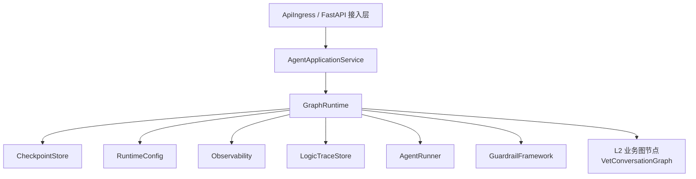
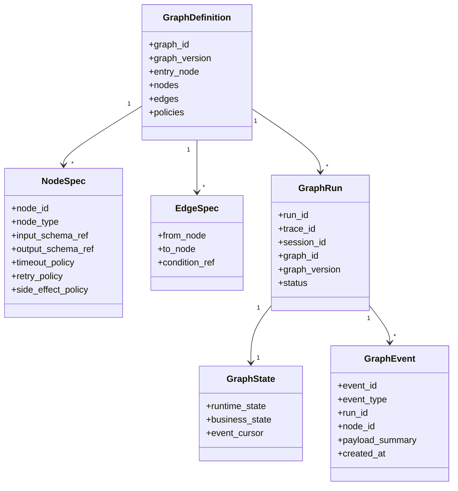
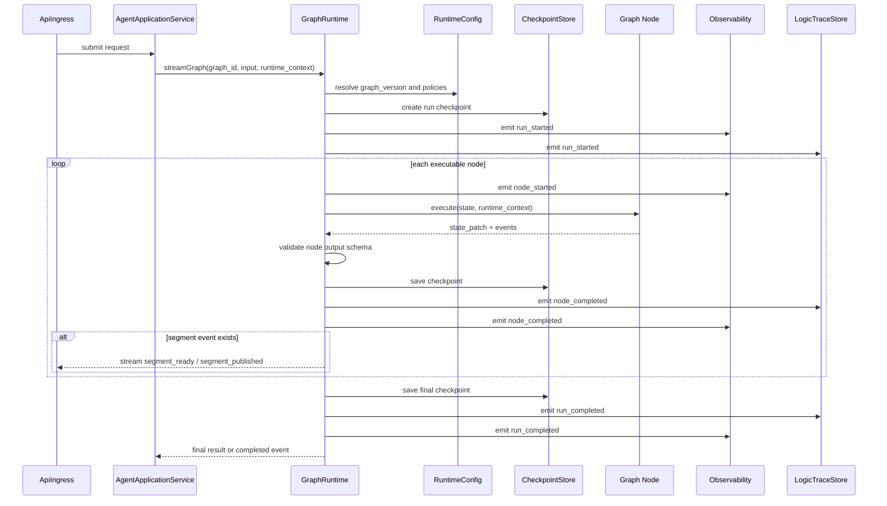
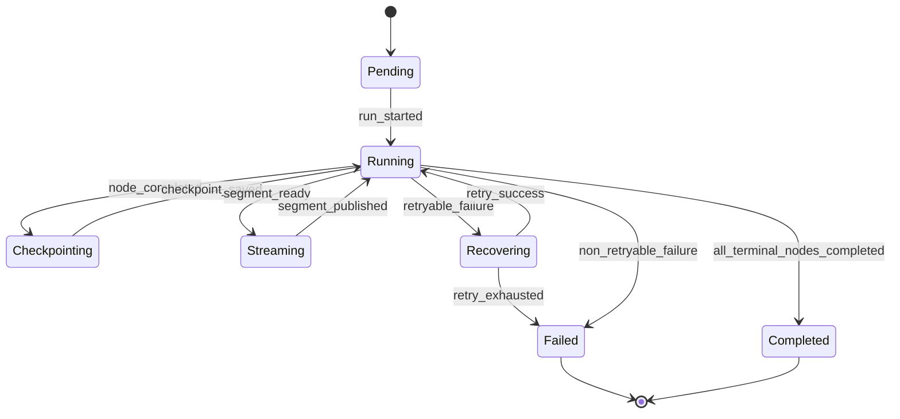

# 图编排运行时组件设计文档 (GraphRuntime Component Design)

## 3.1 基础元数据 (Metadata)

* **组件标识：** 图编排运行时 / GraphRuntime
* **责任人 (Owner)：** 待定
* **代码仓库：** 当前仓库，正式 Git Repository URL 待补充
* **关联需求：** [`docs/prd.md`](../../../prd.md)、[`docs/component_catalog.md`](../../../component_catalog.md)
* **架构层级：** L1 AI 通用运行组件

## 3.2 职责边界 (Responsibility Boundaries)

* **核心能力 (Capabilities)：**
* 图定义注册、图版本选择与图实例编译。
* 节点、边、条件分支、并行分支、fan-out / fan-in 的统一执行。
* 节点级超时、重试、失败中断与恢复策略。
* 与 `CheckpointStore` 集成，持久化图运行状态与业务状态快照。
* 输出标准运行事件，供流式响应、逻辑链留痕与可观测性组件消费。
* 支持分段流式发布事件，使上层业务可以在部分分支完成后先发布可发布片段。
* 为每次运行绑定 `request_id`、`trace_id`、`run_id`、`graph_id`、`graph_version` 与 `params_version`。

* **非目标 (Non-Goals)：**
* 不负责用户认证、JWT / OAuth 校验或访问授权；当前服务访问控制由局域网部署边界与上游组件承担。
* 不负责 `user_id`、`pet_id` 的业务归属鉴权。
* 不负责兽医业务判决，如急症识别、用药边界、化验单解释、宠物会话策略或生成剖面选择。
* 不直接调用大模型；模型调用由 `AgentRunner` 承担。
* 不直接调用 RAG、OCR、记忆、工具系统；相关能力由业务节点或 L1 组件通过自身契约调用。
* 不定义业务逻辑链字段；业务留痕 schema 由 `VetTraceSchema` 定义，GraphRuntime 仅提供运行事件与节点摘要。
* 不决定业务分段排序或是否急症优先；该决策由业务节点产出，GraphRuntime 只保证可发布片段可以被事件化输出。

## 3.3 架构与交互设计 (Architecture & Interaction)

* **上下文视图 (Context Diagram)：**

* **核心领域模型 (Domain Model)：**

## 3.4 契约与依赖 (Contracts & Dependencies)

* **入向契约 (Inbound APIs)：**
* `executeGraph`：同步执行指定 `graph_id` 与 `graph_version`，返回最终运行结果。接口形态为服务内契约，外部 REST 包装由 `ApiIngress` 定义。
* `streamGraph`：流式执行指定图，返回标准 `GraphEvent` 事件流。接口形态为服务内契约，HTTP SSE / chunked response 由 `ApiIngress` 转换。
* `resumeGraph`：基于 `run_id` 或 checkpoint 引用恢复未完成运行。恢复能力依赖 `CheckpointStore` 是否可用。
* `registerGraph`：服务启动阶段注册图定义。运行期不允许未受控动态拼装业务图。

* **出向依赖 (Outbound Dependencies)：**
* **强依赖：**
* `CheckpointStore`：用于保存和恢复图状态；对包含不可逆副作用的运行，checkpoint 不可用时不得继续发布。
* `RuntimeConfig`：用于读取图版本、节点策略、超时、重试与参数版本。
* `Observability`：用于记录运行指标、节点指标、超时与错误。

* **弱依赖：**
* `LogicTraceStore`：用于消费运行事件并形成逻辑链留痕；短暂不可用时可缓冲或降级记录，但必须暴露降级状态。
* `AgentRunner`：仅在图节点需要模型执行时被调用；GraphRuntime 不直接处理 prompt 或模型响应。
* `GuardrailFramework`：仅在图定义包含护栏节点时被调用；GraphRuntime 负责调度，不负责安全规则本身。
* L2 业务节点：由具体业务图声明，节点失败策略以图定义中的 `failure_policy` 为准。

## 3.5 核心流转机制 (Core Flow Mechanism)

* **状态流转/时序图：**

## 3.6 稳定性与可观测性 (Reliability & Observability)

* **流量控制：**
* 支持单实例最大并发运行数限制。
* 支持单次图运行总 deadline。
* 支持节点级 timeout 与 retry。
* 支持并行分支最大 fan-out 数限制。
* 支持对弱依赖失败的降级事件输出。
* 不在本组件内执行 HTTP 层限流；入口限流由 `ApiIngress` 或部署网关承担。

* **数据一致性：**
* 图运行状态以 `CheckpointStore` 为恢复依据。
* 副作用节点必须声明 `side_effect_policy` 与 `idempotency_key`。
* 对发布、消息落库、最终 trace 写入等不可逆动作，执行前后均应产生 checkpoint。
* 已发布片段必须记录 `segment_id` 与发布状态，恢复时不得重复发布同一片段。
* 运行事件允许异步写入 `LogicTraceStore`，但事件游标必须保留在 checkpoint 中以支持补偿。

* **核心指标 (Golden Signals)：**
* `graph_run_total`
* `graph_run_success_total`
* `graph_run_failed_total`
* `graph_run_duration_ms`
* `node_duration_ms`
* `node_retry_total`
* `node_timeout_total`
* `checkpoint_save_duration_ms`
* `checkpoint_failure_total`
* `stream_first_event_latency_ms`
* `segment_ready_total`
* `segment_published_total`
* `parallel_task_count`
* `fallback_triggered_total`
* 可观测性面板链接：无
