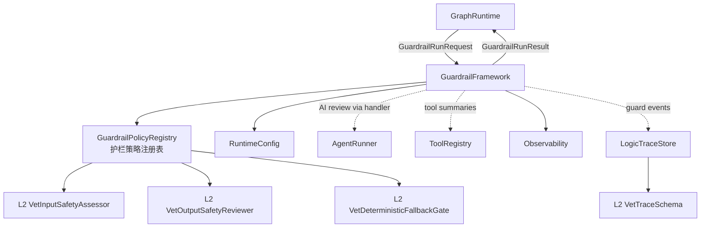
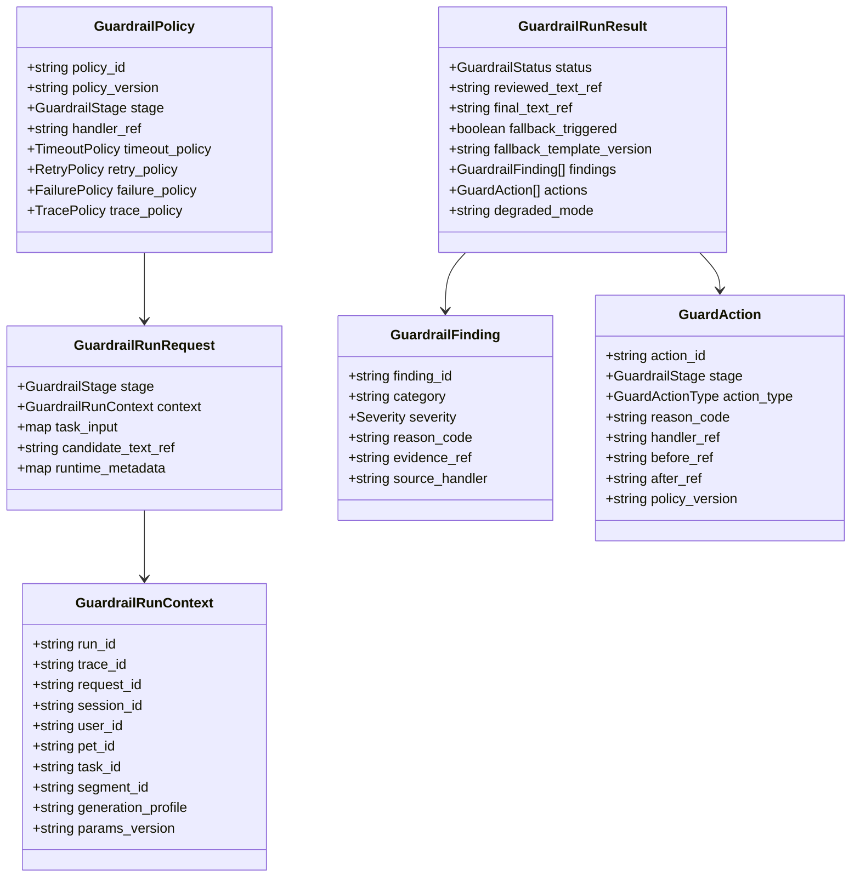
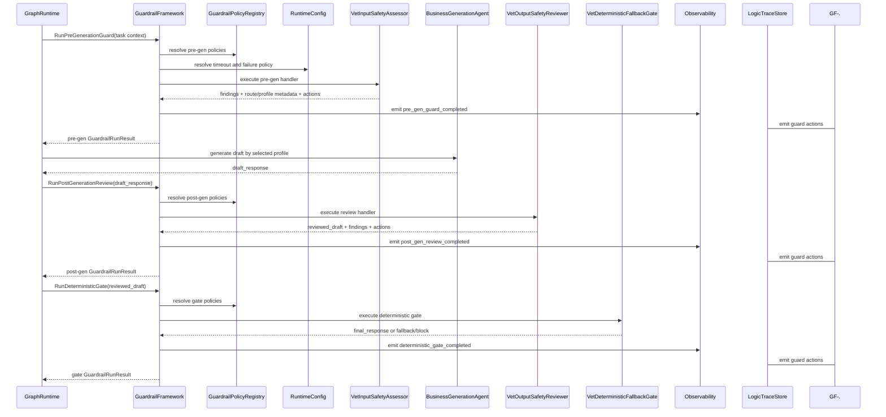
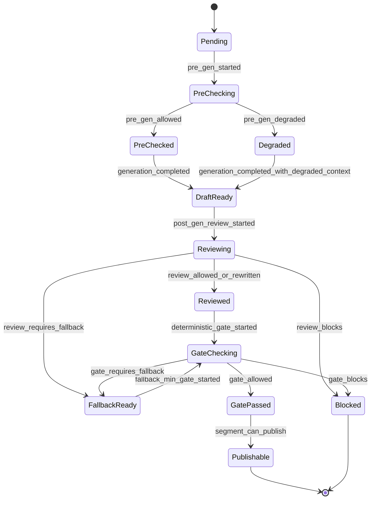

# 护栏框架组件设计文档 (GuardrailFramework Component Design)

## 3.1 基础元数据 (Metadata)

* **组件标识：** 护栏框架 / GuardrailFramework
* **责任人 (Owner)：** 待定
* **代码仓库：** 当前仓库，正式 Git Repository URL 待补充
* **关联需求：**
  * [`docs/component_catalog.md`](../../../component_catalog.md) §5.6 Guardrail Framework
  * [`docs/prd.md`](../../../prd.md) §5.4、§7.2、§7.5、§7.6、§9.2
  * [`docs/design_spec.md`](../../../design_spec.md)
* **架构层级：** L1 AI 通用运行组件
* **文档状态：** 草案

## 3.2 职责边界 (Responsibility Boundaries)

* **核心能力 (Capabilities)：**
* 提供生成前、生成后、发布前的标准护栏 hook 执行机制。
* 支持按业务图节点、子任务或 segment 粒度执行护栏。
* 统一调度已注册的护栏策略和业务 handler，包括 pre-gen、post-gen review 与 deterministic gate。
* 统一表达护栏发现项、护栏动作、阶段结果和 fallback 状态。
* 支持 `allow`、`rewrite`、`block`、`fallback` 等标准动作。
* 支持护栏 handler 的超时、有限重试、降级和 fail-safe 策略。
* 为 `GraphRuntime` 提供发布前 gate 结果，防止未经护栏处理的草稿直接发布。
* 输出标准 guard action 事件，供 `LogicTraceStore`、业务 trace schema 与可观测性组件消费。
* 支持按策略版本记录 `policy_version`、`params_version`、handler 版本与 fallback 模板版本。
* 支持与 `AgentRunner`、`ToolRegistry`、`RuntimeConfig`、`Observability` 和 L2 业务安全组件协同。

* **非目标 (Non-Goals)：**
* 不负责 HTTP 接入、FastAPI 路由、SSE 输出或客户端协议适配；入口能力由 `ApiIngress` 承担。
* 不实现 JWT、OAuth、登录态解析或用户认证。当前阶段 Agent 服务仅在局域网访问，身份上下文由上游可信传入。
* 不负责 `session_id` 与 `pet_id` 的业务一致性校验；一 session 一宠策略由 `PetSessionPolicy` 负责。
* 不负责多任务拆解、任务优先级或业务分段排序；这些由 `VetTaskDecomposer` 与 `VetResponseComposer` 负责。
* 不直接生成用户回答；生成能力由 `StandardConsultationAgent`、`EducationAgent`、`SafetyTriggerAgent` 等 L2 业务 Agent 承担。
* 不定义兽医 SAF 规则、T0-T4 用药边界、急症红线、免责文本或化验单安全规则；这些由 L2 业务安全组件和业务策略维护。
* 不以正则、词表或确定性规则替代业务输出安全审查 Agent；本组件只提供 deterministic gate 的执行插槽。
* 不直接调用 RAG、OCR、记忆或宠物数据源；相关工具或业务服务由上游节点或 L2 handler 调用。
* 不决定业务 `audit_tier` 或完整留痕字段；A/B/C 业务留痕 schema 由 `VetTraceSchema` 定义。
* 不作为合规审计系统；本组件仅提供可回放逻辑链中的护栏阶段记录。

## 3.3 架构与交互设计 (Architecture & Interaction)

* **上下文视图 (Context Diagram)：**

`GuardrailFramework` 是 FastAPI 应用内的 AI 通用运行组件，通常作为 LangGraph 图节点或节点包装器被 `GraphRuntime` 调用。它通过策略注册表装配 L2 业务 handler，本身不持有兽医业务规则，也不直接解释 SAF、用药或急症语义。

* **核心领域模型 (Domain Model)：**

模型说明：

* `GuardrailPolicy` 定义某阶段应执行的 handler、版本、超时、重试、失败策略与 trace 策略。
* `GuardrailRunContext` 绑定请求、图运行、任务、segment 与业务剖面上下文。字段可承载 `pet_id`，但本组件不解释其授权含义。
* `GuardrailRunRequest` 是一次护栏阶段执行请求。完整 DTO 字段应由代码内 Pydantic 模型或 API 治理平台维护。
* `GuardrailFinding` 描述护栏发现项；业务 reason code 由 L2 业务 handler 定义。
* `GuardAction` 描述护栏采取的动作，用于逻辑链留痕和可观测性统计。
* `GuardrailRunResult` 是阶段结果，供 `GraphRuntime` 判断是否可进入下游生成、改写、fallback 或发布。

## 3.4 契约与依赖 (Contracts & Dependencies)

* **入向契约 (Inbound APIs)：**
* 运行生成前护栏：`RunPreGenerationGuard` -> API 治理平台链接待建立
* 运行生成后审查：`RunPostGenerationReview` -> API 治理平台链接待建立
* 运行确定性发布门：`RunDeterministicGate` -> API 治理平台链接待建立
* 注册护栏策略：`RegisterGuardrailPolicy` -> API 治理平台链接待建立
* 校验护栏策略：`ValidateGuardrailPolicy` -> API 治理平台链接待建立

接口原则：

* 当前契约优先作为 FastAPI 应用内服务接口使用；若后续独立服务化，再登记 HTTP / RPC 接口。
* 所有护栏运行请求必须携带 `trace_id`、`request_id`、`run_id` 与 `params_version`。
* 所有护栏运行请求必须声明 `stage`，不得依赖隐式阶段推断。
* 对 segment 级输出，调用方必须传入稳定 `segment_id`；未通过 gate 的 segment 不得进入发布队列。
* `candidate_text_ref` 可为文本摘要、对象引用或受 trace 策略保护的正文引用；本组件不强制持久化完整正文。
* handler 输出必须转换为标准 `GuardrailFinding`、`GuardAction` 与 `GuardrailRunResult`。
* 若阶段结果为 `block` 或 `fallback`，调用方必须停止当前候选文本发布。
* fallback 文本仍需经过发布前 gate 的最小检查，禁止 fallback 绕过最后发布门。

异常映射原则：

* 护栏策略不存在映射为 `GUARDRAIL_POLICY_NOT_FOUND`。
* 护栏策略版本不可用映射为 `GUARDRAIL_POLICY_VERSION_UNAVAILABLE`。
* handler 未注册映射为 `GUARDRAIL_HANDLER_NOT_REGISTERED`。
* handler 超时映射为 `GUARDRAIL_HANDLER_TIMEOUT`。
* handler 输出解析失败映射为 `GUARDRAIL_OUTPUT_PARSE_FAILED`。
* handler 输出 schema 校验失败映射为 `GUARDRAIL_OUTPUT_SCHEMA_INVALID`。
* fallback 模板不可用映射为 `GUARDRAIL_FALLBACK_TEMPLATE_UNAVAILABLE`。
* deterministic gate 未产生结论映射为 `GUARDRAIL_GATE_INCONCLUSIVE`。
* trace 事件写入降级映射为 `GUARDRAIL_TRACE_DEGRADED`。

* **出向依赖 (Outbound Dependencies)：**
* **强依赖：**
* `GuardrailPolicyRegistry`：提供阶段策略、handler 引用、版本、超时、重试、失败策略与 trace 策略。不可用时不得执行未确认策略。
* `RuntimeConfig`：提供护栏阶段开关、参数版本、阶段超时、重试上限与 fail-safe 策略。不可用时服务不可就绪。
* L2 业务护栏 handler：提供具体业务判断与改写能力。兽医业务中包括 `VetInputSafetyAssessor`、`VetOutputSafetyReviewer` 与 `VetDeterministicFallbackGate`。
* `Observability`：记录护栏阶段指标、错误、超时、fallback 与降级状态。不可用不应影响单次执行，但需触发降级告警。

* **弱依赖：**
* `AgentRunner`：当某个业务 handler 需要调用模型完成审查时使用。若不可用，按当前阶段 `failure_policy` 降级、fallback 或 fail-closed。
* `ToolRegistry`：用于读取或校验工具调用摘要。工具权限的硬控制由 `ToolRegistry` 承担，GuardrailFramework 只消费摘要或产生发现项。
* `LogicTraceStore`：消费护栏事件、finding 与 action。短暂不可用时可进入可靠 outbox 或降级记录，但必须向上游暴露 trace 降级状态。
* `VetTraceSchema`：定义 A/B/C 业务留痕字段集合。本组件只提供标准化护栏事件，不决定最终字段裁剪。
* API 治理平台：维护完整接口字段、示例和版本。缺失时不阻塞运行，但阻塞正式契约冻结。

## 3.5 核心流转机制 (Core Flow Mechanism)

* **状态流转/时序图：**

核心流程约束：

* 每个需要发布的 segment 必须至少完成 post-gen review 与 deterministic gate。
* `draft_response` 不得直接进入用户可见发布队列。
* `reviewed_draft` 未通过 deterministic gate 前不得发布。
* 业务生成 Agent 不得作为该草稿的唯一安全审查者。
* 同一轮多 segment 输出必须按 segment 独立执行护栏，不得只审查最终合成文本。
* deterministic gate 的高优先级否决结果不得被后续 rewrite 覆盖。
* fallback 文本必须带有稳定模板版本，并经过发布前最小 gate 检查。
* 护栏阶段产生的 `GuardAction` 必须绑定 `trace_id`、`task_id`、`segment_id` 与 `policy_version`。
* handler 超时或结构化输出失败时，必须按照当前阶段 `failure_policy` 返回明确状态，不得静默视为通过。
* 工具调用合规检查以工具摘要为依据；工具权限拦截仍由 `ToolRegistry` 负责。

## 3.6 稳定性与可观测性 (Reliability & Observability)

* **流量控制：**
* 支持按阶段、handler、业务剖面和实例维度限制并发执行数。
* 支持阶段级 timeout，避免 post-gen review 或 deterministic gate 无限等待。
* 支持 handler 级有限重试，重试范围由 `GuardrailPolicy` 声明。
* 支持最大 rewrite 次数限制，避免审查与改写循环。
* 支持 fallback 次数限制，fallback 失败后必须返回明确 block 或 fail-safe 状态。
* 支持对 AI 审查 handler 的模型调用熔断信号输出，实际模型降级由 `AgentRunner` 与 `LlmGateway` 执行。
* 不在本组件内执行 HTTP 层限流；入口限流由 `ApiIngress` 或部署网关承担。

* **数据一致性：**
* 护栏执行结果不作为消息、session、checkpoint 或长期记忆的事实源。
* 每次护栏执行必须绑定稳定 `run_id`、`trace_id`、`task_id` 与可选 `segment_id`。
* 同一 segment 的护栏重试必须保持幂等，不得重复发布或重复写入不可逆业务副作用。
* `GuardAction` 与 `GuardrailFinding` 应作为逻辑链事件输出；最终持久化字段由 `VetTraceSchema` 与 `LogicTraceStore` 决定。
* 若 `LogicTraceStore` 短暂不可用，应进入可靠 outbox 或暴露 `trace_degraded` 状态，供上游发布策略处理。
* 若 deterministic gate 未产生明确通过结果，上游不得将当前候选文本标记为可发布。
* 对已经发布的 segment，后续 trace 补偿不得改变用户已见内容，只能追加运行记录或事故处理记录。
* 模型审查输入、草稿全文和改写全文的记录策略必须受 trace 策略约束，默认优先记录摘要或 hash。

* **核心指标 (Golden Signals)：**
* `guardrail_run_total`：护栏运行总数，按阶段、handler、状态分组。
* `guardrail_success_total`：护栏成功完成总数。
* `guardrail_failed_total`：护栏失败总数，按错误码分组。
* `guardrail_stage_duration_ms`：各阶段执行耗时。
* `guardrail_handler_timeout_total`：handler 超时次数。
* `guardrail_handler_retry_total`：handler 重试次数。
* `guardrail_output_parse_failure_total`：handler 输出解析失败次数。
* `guardrail_action_total`：护栏动作次数，按 `action_type`、阶段、业务剖面分组。
* `guardrail_rewrite_total`：改写次数。
* `guardrail_block_total`：阻断次数。
* `guardrail_fallback_total`：fallback 次数。
* `guardrail_fallback_failure_total`：fallback 失败次数。
* `guardrail_gate_inconclusive_total`：deterministic gate 未产生明确结论次数。
* `guardrail_trace_degraded_total`：护栏留痕降级次数。
* `guardrail_segment_publishable_total`：通过护栏并可发布的 segment 数。
* `guardrail_first_publishable_latency_ms`：从 segment 草稿生成到可发布的耗时。
* 可观测性面板链接：无
