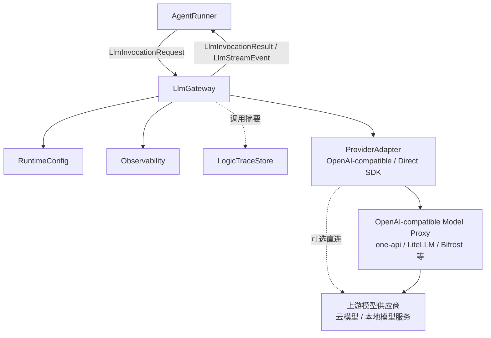
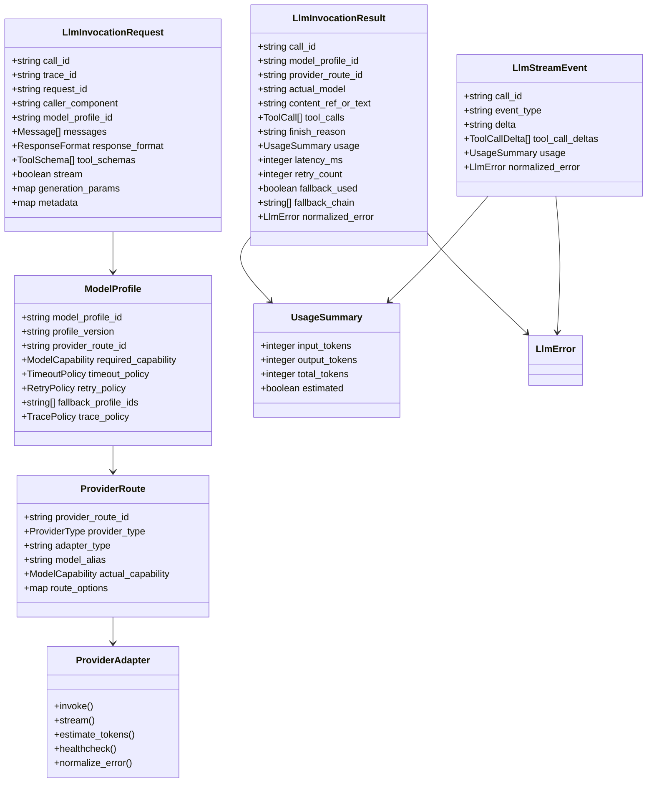
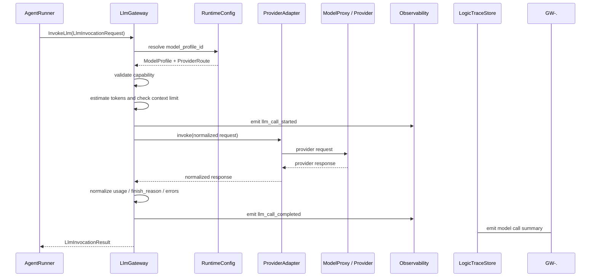
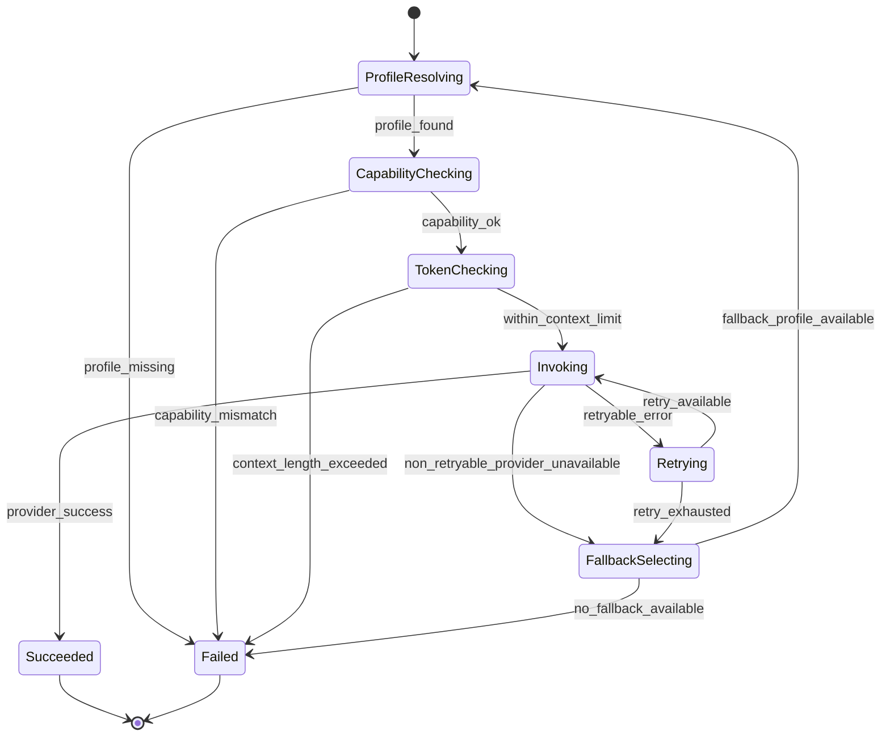
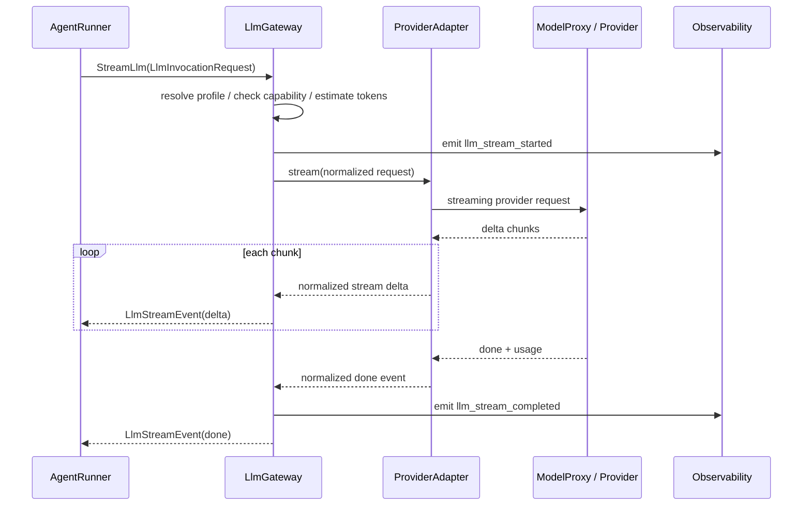

# LLM Gateway 组件设计文档 / LlmGateway

## 3.1 基础元数据 (Metadata)

* **组件标识：** LLM Gateway / `LlmGateway`
* **责任人 (Owner)：** 待定
* **代码仓库：** 当前仓库，正式 Git Repository URL 待补充
* **关联需求：**
  * [`docs/component_catalog.md`](../../../component_catalog.md) §5.3 LLM Gateway
  * [`docs/prd.md`](../../../prd.md) §5.4、§7.4、§7.6、§9.2、§10
  * [`docs/design_spec.md`](../../../design_spec.md)
* **架构层级：** L1 AI 通用运行组件
* **文档状态：** 草案

## 3.2 职责边界 (Responsibility Boundaries)

* **核心能力 (Capabilities)：**
* 为 `AgentRunner` 提供统一的大模型调用入口，屏蔽具体模型供应商、SDK、代理网关和协议差异。
* 基于版本化 `ModelProfile` 解析模型供应商、模型别名、能力要求、超时策略、重试策略和降级链。
* 支持通过 OpenAI-compatible 模型代理接入上游模型；MVP 可选用 one-api、LiteLLM 等开源项目作为下游模型代理，自研层保持薄适配。
* 支持同步调用与流式调用，并向上游返回统一的模型响应、流式事件、token 使用量、finish reason 和调用摘要。
* 在调用前执行模型能力检查，包括上下文窗口、流式能力、结构化输出能力、工具调用能力和视觉能力等。
* 在调用前执行 token 预算预估；超出上下文限制时返回标准错误，不在本组件内静默裁剪业务上下文。
* 统一处理模型调用超时、临时供应商错误、代理网关错误、限流、上下文超限和响应格式异常。
* 基于配置执行有限重试、profile 降级和供应商错误归一。
* 记录模型调用延迟、token、重试、降级、错误类型、实际模型和代理类型等运行摘要。
* 向 `Observability` 输出模型调用指标，并向 `LogicTraceStore` 或调用方提供可进入逻辑链的调用摘要。
* 支持不同业务 Agent 通过不同 `model_profile_id` 使用不同模型、不同超时和不同降级策略。

* **非目标 (Non-Goals)：**
* 不负责 HTTP 接入、FastAPI 路由、SSE 协议包装或客户端连接管理；入口能力由 `ApiIngress` 承担。
* 不实现 JWT、OAuth、登录态解析或用户认证。当前阶段 Agent 服务仅在局域网访问，身份上下文由上游可信传入。
* 不决定 `intent`、`route`、`generation_profile`、`audit_tier` 或业务分段发布顺序。
* 不负责 prompt 渲染、Agent 规格解析、工具绑定、结构化输出业务解析或 schema 修复；这些由 `AgentRunner` 承担。
* 不负责 RAG 检索、文档 rerank、知识源版权判断或引用组织；这些由 `RagPlatform` 和业务节点承担。
* 不负责工具注册、工具权限、工具执行或工具调用审计；这些由 `ToolRegistry` 承担。
* 不负责兽医安全判决、SAF 识别、T4 用药审查、急症就医导向判断或最终发布放行。
* 不负责 `session_id` 与 `pet_id` 的业务一致性校验，也不读取宠物画像、记忆、OCR 或业务数据库。
* 不写入长期记忆、会话消息、checkpoint 或业务逻辑链全量记录；本组件只输出模型调用摘要与稳定结果对象。
* 不将 one-api、LiteLLM 或任一开源模型代理作为不可替换事实源；下游模型代理属于可替换基础设施。
* 不保存或输出上游供应商 API key、代理网关 token、真实网络地址等敏感配置明文。

## 3.3 架构与交互设计 (Architecture & Interaction)

* **上下文视图 (Context Diagram)：**

`LlmGateway` 是 FastAPI 应用内的 AI 通用运行组件。MVP 阶段推荐通过 OpenAI-compatible 下游模型代理接入模型供应商，自研 `LlmGateway` 仅保留系统内统一契约、profile 映射、能力检查、超时控制、错误归一、调用摘要和观测接入。

若后续需要多服务共享模型能力、集中成本控制或统一供应商灰度，`LlmGateway` 可以独立服务化；独立服务化后仍应保持本组件契约不向业务层泄漏具体模型代理实现。

* **核心领域模型 (Domain Model)：**

模型说明：

* `LlmInvocationRequest` 是一次模型调用输入，由 `AgentRunner` 构造。本组件可以透传 `session_id`、`user_id`、`pet_id` 等追踪元数据，但不解释其业务含义。
* `ModelProfile` 是系统内模型调用配置单元，用于隔离不同 Agent 的模型、能力、超时、重试和降级策略。
* `ProviderRoute` 描述实际下游路由，可以指向 one-api、LiteLLM 等 OpenAI-compatible 代理，也可以指向直连供应商适配器。
* `ProviderAdapter` 是协议适配边界，负责请求转换、响应转换、token 估算和错误归一。
* `LlmInvocationResult` 与 `LlmStreamEvent` 是稳定返回契约，不暴露下游代理或供应商 SDK 的原始类型。
* 完整 DTO 字段、枚举和校验细节应由代码内 Pydantic 模型或 API 治理平台维护；本文仅描述组件级领域模型。

## 3.4 契约与依赖 (Contracts & Dependencies)

* **入向契约 (Inbound APIs)：**
* 调用模型：`InvokeLlm` -> API 治理平台链接待建立
* 流式调用模型：`StreamLlm` -> API 治理平台链接待建立
* 预估 token：`EstimateLlmTokens` -> API 治理平台链接待建立
* 检查模型 profile：`CheckModelProfile` -> API 治理平台链接待建立
* 检查下游路由健康状态：`CheckProviderRouteHealth` -> API 治理平台链接待建立

接口原则：

* 当前契约优先作为 FastAPI 应用内服务接口使用；若后续独立服务化，再登记 HTTP / RPC 接口。
* 所有模型调用必须指定 `model_profile_id`，不得由业务 Agent 直接指定供应商真实模型名或下游代理地址。
* 所有模型调用必须携带 `trace_id`、`request_id` 与 `caller_component`，用于贯穿观测指标和逻辑链摘要。
* `messages`、`response_format`、`tool_schemas` 和 `generation_params` 必须由 `AgentRunner` 或其上游节点准备；本组件不主动构造业务 prompt。
* 若调用方要求流式响应，本组件只返回模型增量事件；增量是否面向用户发布由下游护栏、合成和发布组件决定。
* token 超限时，本组件返回标准错误；上下文裁剪、P0 字段保留和重试输入重构必须由上游业务组件显式完成。
* 下游模型代理或供应商返回的原始错误必须转换为系统标准错误，不得泄漏供应商私有错误结构给业务节点。
* 模型调用摘要可以进入逻辑链；完整 prompt、完整模型原始响应和敏感配置的记录策略必须受 `TracePolicy` 控制。

异常映射原则：

* 模型 profile 不存在映射为 `LLM_PROFILE_NOT_FOUND`。
* 模型 profile 暂不可用映射为 `LLM_PROFILE_UNAVAILABLE`。
* 模型能力不满足请求映射为 `LLM_CAPABILITY_MISMATCH`。
* token 预算超过上下文限制映射为 `LLM_CONTEXT_LENGTH_EXCEEDED`。
* 模型调用超时映射为 `LLM_TIMEOUT`。
* 首 token 超时映射为 `LLM_FIRST_TOKEN_TIMEOUT`。
* 下游代理不可用映射为 `LLM_PROXY_UNAVAILABLE`。
* 上游供应商不可用映射为 `LLM_PROVIDER_UNAVAILABLE`。
* 上游限流映射为 `LLM_RATE_LIMITED`。
* 请求参数非法映射为 `LLM_INVALID_REQUEST`。
* 模型安全策略阻断映射为 `LLM_SAFETY_BLOCKED`。
* 模型响应无法归一映射为 `LLM_MALFORMED_RESPONSE`。
* 重试与降级耗尽映射为 `LLM_RETRY_EXHAUSTED`。

* **出向依赖 (Outbound Dependencies)：**
* **强依赖：**
* `RuntimeConfig`：提供 `ModelProfile`、`ProviderRoute`、超时、重试、降级链、能力声明和 trace 策略。不可用时不得执行模型调用。
* OpenAI-compatible 模型代理或直连供应商适配器：执行实际模型调用。MVP 推荐配置 one-api、LiteLLM 等代理；若未配置可用路由，本组件核心能力不可用。
* `Observability`：记录模型调用延迟、token、错误、重试、降级和代理健康状态。不可用不应影响单次调用，但需触发降级告警。

* **弱依赖：**
* `LogicTraceStore`：消费模型调用摘要。短暂不可用时本组件应在返回结果中暴露 trace 降级状态，由上游图运行事件补偿。
* 下游模型代理管理后台：用于渠道配置、供应商 key 管理、基础额度和渠道状态管理。管理后台不可用不影响已配置路由的调用。
* 供应商 tokenizer 或本地 token 估算库：用于调用前 token 预估。不可用时可使用保守估算并标记 `estimated=true`，但不得跳过上下文限制检查。
* LangChain / 供应商 SDK / OpenAI-compatible SDK：作为适配器内部库能力按需引入。库类型不得泄漏到本组件公共契约。
* API 治理平台：维护完整接口字段、示例和版本。缺失时不阻塞运行，但阻塞正式契约冻结。

## 3.5 核心流转机制 (Core Flow Mechanism)

* **状态流转/时序图：**

非流式调用流程：

重试与降级流程：

流式调用流程：

核心流程约束：

* 每次调用必须生成稳定 `call_id`，并在响应、观测事件和逻辑链摘要中保持一致。
* profile 降级只允许降级到能力兼容的 profile；需要结构化输出、工具调用、视觉或流式能力时，降级目标必须满足相同能力要求。
* 下游模型代理内部渠道切换属于基础设施降级；`LlmGateway` profile 降级属于系统调用策略，两者都应在调用摘要中体现可观测结果。
* 本组件不得为了通过上下文限制而自行删除 prompt 片段；裁剪和压缩由上游上下文组件或 `AgentRunner` 显式处理。
* 若流式过程中发生错误，应返回标准错误事件并结束当前流；是否启用业务安全模板由上游图和护栏组件决定。
* 模型原始响应是否进入持久化留痕由调用方 trace 策略决定；本组件默认提供摘要、hash 或引用。

## 3.6 稳定性与可观测性 (Reliability & Observability)

* **流量控制：**
* 支持按 `model_profile_id`、`provider_route_id`、实例维度限制并发调用数。
* 支持按 profile 配置 `connect_timeout`、`first_token_timeout`、`read_timeout` 和 `total_timeout`。
* 支持针对可重试错误的有限重试，避免无限重放模型请求。
* 支持 profile 级降级链，且降级前执行能力兼容检查。
* 支持代理路由熔断信号；熔断命中时优先尝试配置的备用 profile 或返回标准错误。
* 支持上下文长度预检查，避免已知超限请求进入下游代理。
* 不在本组件内执行 HTTP 入口限流；入口限流由 `ApiIngress` 或部署网关承担。
* 不在本组件内执行业务安全兜底；模型不可用后的业务兜底由 `GraphRuntime`、`GuardrailFramework` 或 L2 业务组件承担。

* **数据一致性：**
* `LlmGateway` 本身不持久化业务状态，不作为 session、message、checkpoint、memory、RAG 索引或业务 trace 的事实源。
* 每次模型调用必须绑定 `call_id`、`trace_id`、`request_id`、`caller_component` 和 `model_profile_id`。
* 自动重试必须复用同一业务调用上下文，并在结果中记录 `retry_count`；不得在重试中改变 prompt 业务含义。
* profile 降级必须在结果中记录 `fallback_used` 与 `fallback_chain`，供逻辑链回放。
* token 使用量应优先采用供应商或代理返回值；无法取得时使用估算值并标记 `estimated=true`。
* 完整 prompt、完整响应和敏感元数据不得进入普通日志；可持久化内容必须受 `TracePolicy` 与业务留痕等级控制。
* 下游模型代理日志不能替代 `LogicTraceStore`；代理日志仅作为基础设施排障来源。

* **核心指标 (Golden Signals)：**
* `llm_gateway_calls_total`：模型调用总数，按 `model_profile_id`、`provider_route_id`、状态分组。
* `llm_gateway_stream_calls_total`：流式模型调用总数。
* `llm_gateway_success_total`：成功调用总数。
* `llm_gateway_failed_total`：失败调用总数，按标准错误码分组。
* `llm_gateway_latency_ms`：非流式调用总耗时。
* `llm_gateway_first_token_latency_ms`：流式调用首 token 延迟。
* `llm_gateway_input_tokens_total`：输入 token 总数。
* `llm_gateway_output_tokens_total`：输出 token 总数。
* `llm_gateway_total_tokens_total`：总 token 数。
* `llm_gateway_token_estimated_total`：使用估算 token 的调用数。
* `llm_gateway_retry_total`：模型调用重试次数。
* `llm_gateway_fallback_total`：profile 降级次数。
* `llm_gateway_context_length_exceeded_total`：上下文超限次数。
* `llm_gateway_rate_limited_total`：上游限流次数。
* `llm_gateway_proxy_unavailable_total`：模型代理不可用次数。
* `llm_gateway_provider_unavailable_total`：模型供应商不可用次数。
* `llm_gateway_capability_mismatch_total`：模型能力不满足请求次数。
* `llm_gateway_timeout_total`：模型调用超时次数。
* `llm_gateway_circuit_open_total`：路由熔断触发次数。
* `llm_gateway_trace_degraded_total`：模型调用摘要留痕降级次数。
* 可观测性面板链接：无
