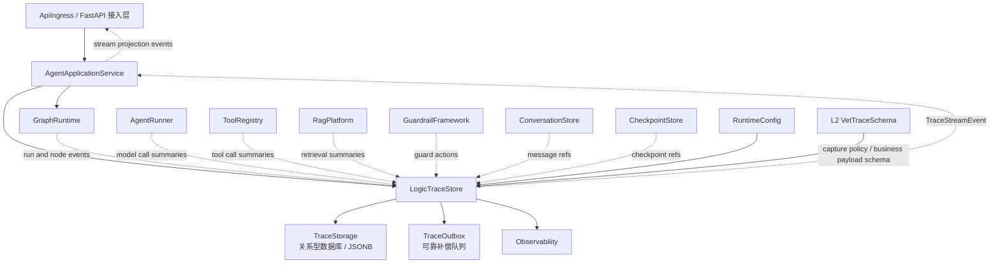
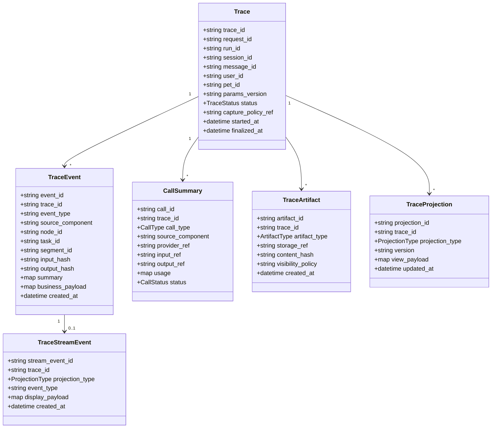
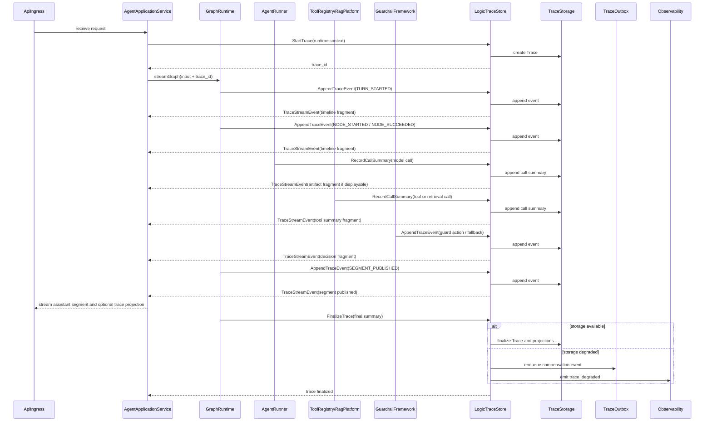
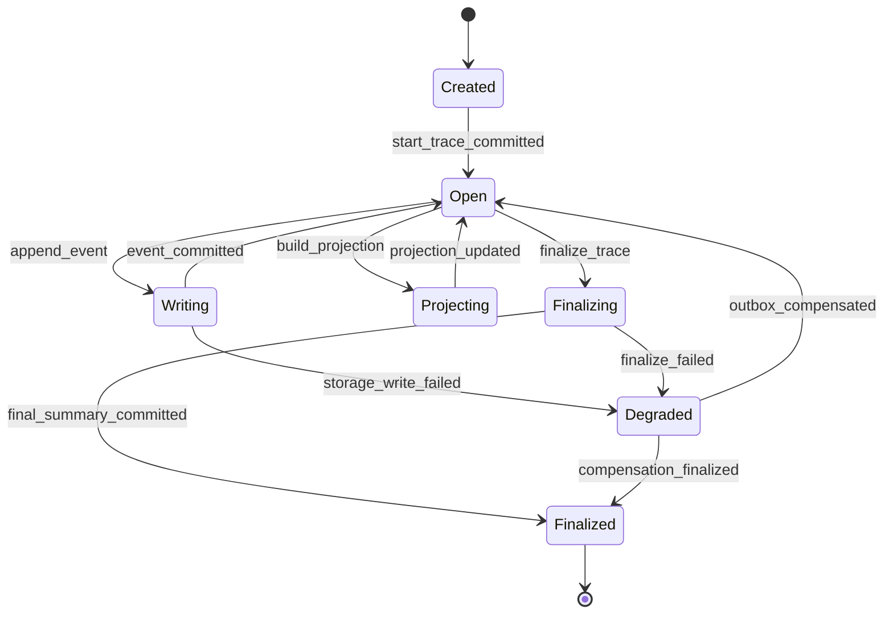

# 逻辑链留痕组件设计文档 (LogicTraceStore Component Design)

## 3.1 基础元数据 (Metadata)

* **组件标识：** 逻辑链留痕组件 / LogicTraceStore
* **责任人 (Owner)：** 待定
* **代码仓库：** 当前仓库，正式 Git Repository URL 待补充
* **关联需求：**
  * [`docs/component_catalog.md`](../../../component_catalog.md) §5.7 逻辑链留痕组件
  * [`docs/component_catalog.md`](../../../component_catalog.md) §6.16 兽医逻辑链 schema 组件
  * [`docs/prd.md`](../../../prd.md) §5.1、§7.5、§7.6、§9.2.1
  * [`docs/design_spec.md`](../../../design_spec.md)
* **架构层级：** L1 AI 通用运行组件
* **文档状态：** 草案

## 3.2 职责边界 (Responsibility Boundaries)

* **核心能力 (Capabilities)：**
* 为每轮 Agent 运行创建稳定 `trace_id`，并绑定 `request_id`、`run_id`、`session_id`、`message_id`、`params_version` 等运行上下文。
* 以 append-only 方式保存关键逻辑链事件，包括图节点事件、决策事件、模型调用摘要、工具调用摘要、RAG 调用摘要、护栏动作、fallback、分段发布和最终响应记录。
* 支持保存节点输入输出摘要、哈希或 artifact 引用，避免强制在主记录中内嵌大文本。
* 支持按 trace capture policy 写入不同粒度的记录；具体 A/B/C 业务字段由 L2 `VetTraceSchema` 定义。
* 支持实时生成 `TraceStreamEvent`，使 `timeline_view`、`decision_view`、`artifact_view` 的可展示片段在产出后即可被上游流式转发。
* 支持事后按 `trace_id`、`message_id`、`session_id`、`run_id` 等键查询完整逻辑链。
* 支持将原始事件投影为查询视图，包括时间线视图、关键判决视图和 artifact 视图。
* 支持 trace 写入降级、可靠 outbox 和补偿写入，避免弱依赖短暂异常导致整轮链路不可恢复。
* 输出标准 trace 指标和降级事件，供 `Observability` 消费。

* **非目标 (Non-Goals)：**
* 不作为传统合规审计系统；本组件只提供 Agent 运行的可解释逻辑链记录。
* 不负责用户认证、JWT / OAuth 校验或访问授权。当前阶段 Agent 服务仅在局域网访问，身份上下文由上游可信传入。
* 不负责判断 `audit_tier`、`generation_profile`、SAF 信号、用药风险、急症状态、RAG 是否应调用或 OCR 是否可作为依据；这些由 L2 业务组件定义和产出。
* 不定义 A/B/C 兽医业务留痕字段集合；字段 schema 与裁剪策略由 `VetTraceSchema` 维护。
* 不作为 `ConversationStore`，不承担聊天消息主存储能力。
* 不作为 `CheckpointStore`，不承担 LangGraph 状态恢复能力。
* 不作为长期记忆、宠物记忆或 RAG 知识库索引；trace 数据不得被自动回灌到知识库索引。
* 不保存或展示模型隐藏 chain-of-thought；仅保存结构化决策摘要、证据引用、节点输出摘要和可复盘 artifact。
* 不负责 UI 渲染、SSE / WebSocket 协议适配或小程序展示逻辑；实时事件由 `ApiIngress` 或上层应用服务转发。
* 不替代 `Observability` 的指标、日志和告警职责；本组件记录逻辑链，`Observability` 记录运行健康状态。

## 3.3 架构与交互设计 (Architecture & Interaction)

* **上下文视图 (Context Diagram)：**

`LogicTraceStore` 是 FastAPI 应用内的 L1 通用运行组件。它接收运行时各组件产生的 trace event，保存原始结构化事件，并按查询或实时流式需要投影为人可读视图片段。本组件不解释兽医业务语义，只校验通用 trace envelope 与 L2 schema 引用是否存在。

* **核心领域模型 (Domain Model)：**

模型说明：

* `Trace` 是一轮 Agent 运行的逻辑链聚合根，绑定运行上下文和 capture policy 引用。
* `TraceEvent` 是 append-only 事件，承载通用 envelope 和业务扩展 payload。
* `CallSummary` 统一表达模型、工具、RAG 等外部或内部调用摘要。
* `TraceArtifact` 保存草稿、审查稿、prompt 摘要、检索片段摘要等较大对象的引用、哈希和可见性策略。
* `TraceProjection` 是事后查询视图的物化结果或按需构造结果。
* `TraceStreamEvent` 是面向实时流式展示的安全投影片段，不等同于原始 trace JSON。

## 3.4 契约与依赖 (Contracts & Dependencies)

* **入向契约 (Inbound APIs)：**
* 创建逻辑链：`StartTrace` -> API 治理平台链接待建立
* 追加逻辑链事件：`AppendTraceEvent` -> API 治理平台链接待建立
* 记录模型 / 工具 / RAG 调用摘要：`RecordCallSummary` -> API 治理平台链接待建立
* 记录 artifact 引用：`RecordTraceArtifact` -> API 治理平台链接待建立
* 生成或刷新查询投影：`BuildTraceProjection` -> API 治理平台链接待建立
* 订阅实时投影事件：`SubscribeTraceStream` -> API 治理平台链接待建立
* 完结逻辑链：`FinalizeTrace` -> API 治理平台链接待建立
* 查询逻辑链：`GetTrace`、`GetTraceProjection`、`ListTraces` -> API 治理平台链接待建立

接口原则：

* 当前契约优先作为 FastAPI 应用内服务接口使用；若后续独立服务化，再登记 HTTP / RPC 接口。
* `StartTrace` 必须在业务图正式执行前完成，并将 `trace_id` 写入运行上下文。
* 所有写入请求必须携带 `trace_id`、`request_id` 或可反查的运行标识。
* `AppendTraceEvent` 必须声明 `event_type`、`source_component` 与事件时间，不得依赖服务端猜测业务阶段。
* 业务扩展字段必须放入 `business_payload`，并声明 schema 引用或 capture policy 引用。
* 大文本应优先以摘要、哈希或 `TraceArtifact.storage_ref` 写入；是否保存全文由 capture policy 决定。
* `TraceStreamEvent` 只包含可展示投影片段，不承载完整原始 JSON、不承载隐藏推理。
* 查询接口默认返回 projection；原始事件查询应作为内部调试能力受控开放。

异常映射原则：

* trace 不存在映射为 `TRACE_NOT_FOUND`。
* trace 已完结后继续写入映射为 `TRACE_ALREADY_FINALIZED`。
* 事件 schema 校验失败映射为 `TRACE_EVENT_SCHEMA_INVALID`。
* capture policy 不存在映射为 `TRACE_CAPTURE_POLICY_NOT_FOUND`。
* artifact 引用不可用映射为 `TRACE_ARTIFACT_UNAVAILABLE`。
* 投影构建失败映射为 `TRACE_PROJECTION_BUILD_FAILED`。
* trace 主存储写入失败映射为 `TRACE_STORAGE_WRITE_FAILED`。
* trace outbox 写入失败映射为 `TRACE_OUTBOX_WRITE_FAILED`。
* 实时投影发送失败映射为 `TRACE_STREAM_DELIVERY_FAILED`。

* **出向依赖 (Outbound Dependencies)：**
* **强依赖：**
* `TraceStorage`：保存 `Trace`、`TraceEvent`、`CallSummary`、`TraceArtifact` 与投影数据。MVP 建议采用关系型数据库并使用 JSONB 承载扩展 payload。
* `RuntimeConfig`：提供 trace capture policy、保留策略、投影开关、事件采样策略和参数版本。不可用时服务不可就绪。
* `TraceOutbox`：保存写入失败或需异步补偿的 trace 事件。对于 A/B 级业务链路，outbox 不可用时必须向上游暴露降级状态。

* **弱依赖：**
* `VetTraceSchema`：提供兽医业务字段 schema、A/B/C capture policy 和业务投影规则。本组件可在 schema 暂不可用时保存通用 envelope，但必须标记 `business_schema_degraded`。
* `Observability`：消费 trace 写入耗时、失败率、降级、outbox backlog 等指标。不可用不阻断 trace 写入，但需产生本地降级日志。
* `ConversationStore`：提供消息引用和最终消息状态。本组件只保存引用，不承担消息主存储。
* `CheckpointStore`：提供图恢复状态引用。本组件只保存 checkpoint 引用，不承担状态恢复。
* artifact 外部存储：用于保存较大文本或二进制引用。不可用时可退化为摘要和哈希。
* API 治理平台：维护完整 DTO 字段、示例和版本。缺失时不阻塞运行，但阻塞正式契约冻结。

## 3.5 核心流转机制 (Core Flow Mechanism)

* **状态流转/时序图：**

核心机制说明：

* 原始 trace event 与实时 projection event 分离。原始事件用于复盘和查询，实时 projection 用于展示“当前处理到哪一步”。
* 实时 projection 不要求等待整轮结束；当关键判决、工具摘要、护栏结果或 segment 发布事件产生时即可输出。
* 事后查询视图不直接暴露原始 JSON，而是通过 `timeline_view`、`decision_view`、`artifact_view` 等 projection 返回。
* 原始事件、投影事件和 artifact 均应带版本信息，避免后续 schema 演进导致历史记录不可读。

## 3.6 稳定性与可观测性 (Reliability & Observability)

* **流量控制：**
* 支持单 trace 最大事件数限制。
* 支持单事件 payload 大小限制；超过阈值时转为 artifact 引用或摘要。
* 支持实时投影事件限流，避免 trace stream 影响主响应流。
* 支持 outbox backlog 阈值告警。
* 查询接口支持分页、时间范围和 projection 类型过滤。
* 不在本组件内执行 HTTP 层限流；入口限流由 `ApiIngress` 或部署网关承担。

* **数据一致性：**
* `TraceEvent` 采用 append-only 语义，已写入事件不得原地改写；修正应通过补充事件表达。
* `trace_id` 在一次图运行中保持不变，并写入 LangGraph state。
* `event_id` 应支持幂等写入，避免节点重试导致重复记录。
* `Trace` 完结前允许追加事件；完结后仅允许写入受控补偿事件或维护类标记。
* `TraceProjection` 可按需重建，不能作为原始事实源。
* A/B 级业务链路至少应成功写入 trace envelope、关键决策事件、最终响应事件或对应 outbox 记录。
* 实时投影发送失败不应回滚原始 trace 事件，但必须记录降级状态。
* `safety_trigger` 等安全关键路径不得因非关键 artifact 写入失败而延迟必要响应；降级状态必须进入 trace 和指标。

* **核心指标 (Golden Signals)：**
* `trace_start_total`
* `trace_finalize_total`
* `trace_append_event_total`
* `trace_append_event_failed_total`
* `trace_write_latency_ms`
* `trace_projection_build_latency_ms`
* `trace_stream_event_total`
* `trace_stream_delivery_failed_total`
* `trace_outbox_backlog`
* `trace_outbox_retry_total`
* `trace_degraded_total`
* `trace_artifact_write_failed_total`
* `trace_query_latency_ms`
* `trace_query_failed_total`
