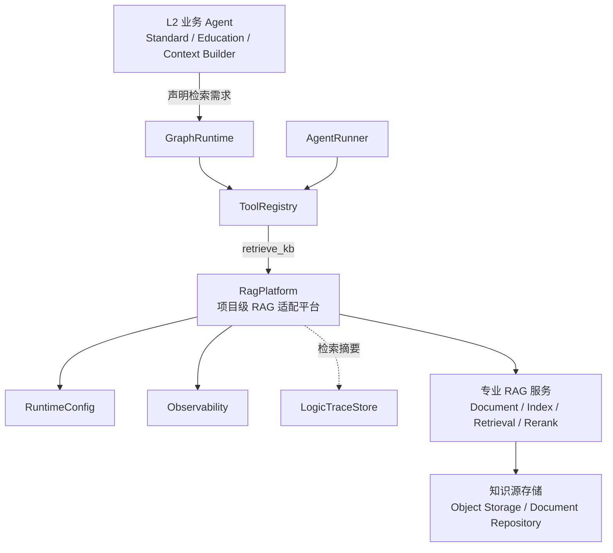
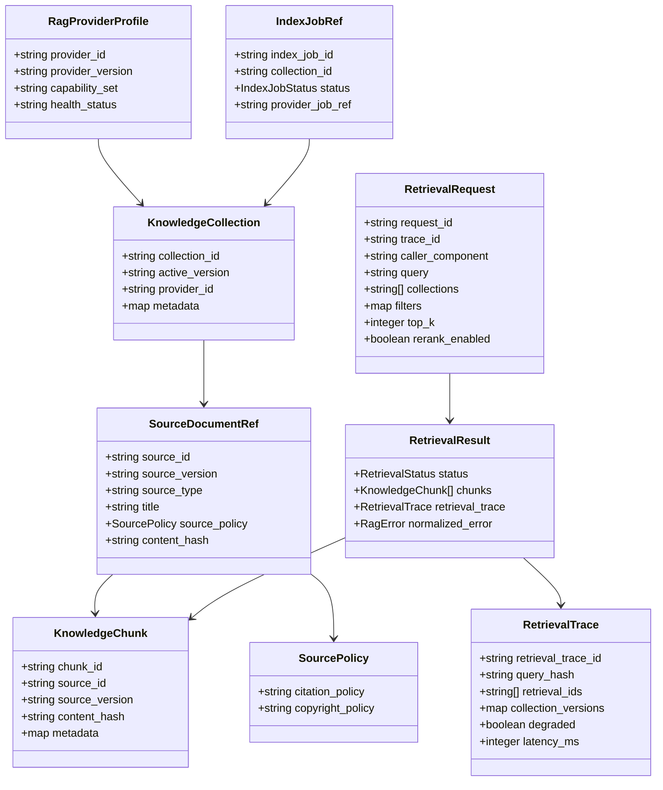
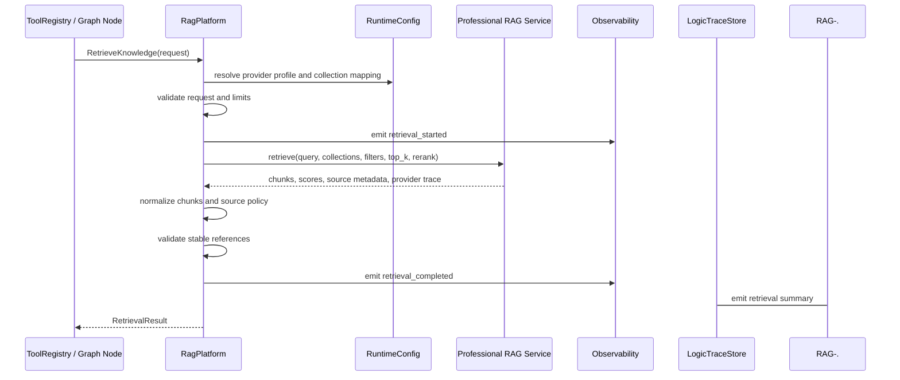
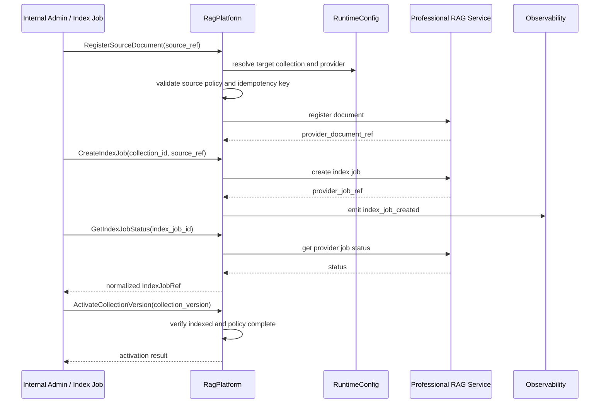
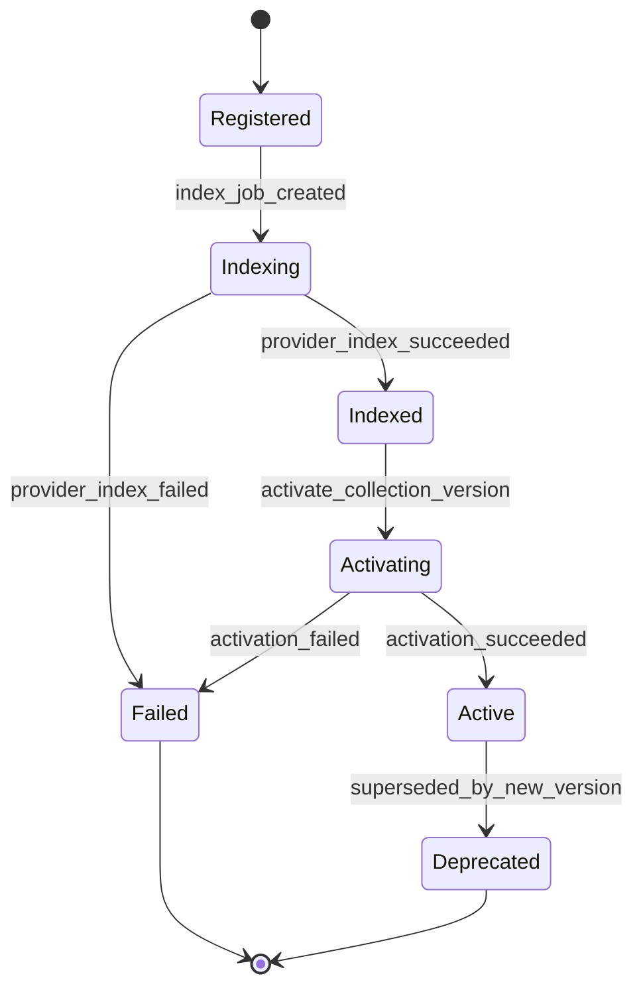

# RAG 平台组件设计文档 / RagPlatform

## 3.1 基础元数据 (Metadata)

* **组件标识：** RAG 平台 / `RagPlatform`
* **责任人 (Owner)：** 待定
* **代码仓库：** 当前仓库，正式 Git Repository URL 待补充
* **关联需求：**
* [`docs/component_catalog.md`](../../../component_catalog.md) §5.5 RAG 平台
* [`docs/prd.md`](../../../prd.md) §5.4、§6.8、§7.4、§7.5、§9.4、§9.9
* [`docs/design_spec.md`](../../../design_spec.md)
* **架构层级：** L1 AI 通用运行组件
* **文档状态：** 草案

## 3.2 职责边界 (Responsibility Boundaries)

* **核心能力 (Capabilities)：**
* 作为项目级 RAG 适配平台，优先复用已有专业 RAG 服务的文档管理、索引、检索、rerank 与知识源管理能力。
* 为上层 `ToolRegistry`、图节点和业务 Agent 提供稳定的 `retrieve_kb` 检索契约，屏蔽底层 RAG 服务、向量库、关键词索引和 rerank 组件差异。
* 支持知识集合、来源文档、文档版本、chunk、索引任务和激活版本的统一抽象。
* 支持运行时检索请求的 collection 选择、metadata filter、top-k、rerank 开关、超时、降级与错误归一。
* 返回可被上游生成节点消费的知识片段、检索分数、来源元数据、文档版本、内容 hash、版权策略和引用策略。
* 标准化底层 RAG 服务的来源元数据，将不同知识源映射为项目统一的 `citation_policy` 与 `copyright_policy`。
* 返回 `retrieval_trace_id`、`retrieval_ids`、collection 版本、检索耗时、降级标记和标准错误码，供逻辑链留痕组件记录。
* 支持文档导入、索引任务创建、索引状态查询、collection 版本激活等管理型能力；具体解析、切片、embedding 和索引实现优先委托专业 RAG 服务。
* 向 `Observability` 输出检索延迟、成功率、空结果率、降级率、索引任务状态和底层服务错误等指标。
* 支持后续从应用内适配模块平滑演进为独立 RAG 适配服务，但不要求 MVP 阶段独立部署。

* **非目标 (Non-Goals)：**
* 不自研完整 RAG 引擎、向量数据库、embedding 算法、reranker 或文档解析流水线；除非专业 RAG 服务无法满足最低契约并经架构评审确认。
* 不生成最终回答，不提供面向用户的问答聊天能力，也不将底层 RAG 服务的生成式回答直接返回业务 Agent。
* 不判断用户意图、`route`、`generation_profile`、`audit_tier`、任务优先级或分段发布顺序。
* 不决定某个业务剖面是否必须检索或禁止检索；剖面策略由 L2 业务组件与 `ToolRegistry` 权限策略执行。
* 不承载兽医 SAF 语义判断、用药边界判断、急症判断、化验参考区间判断或输出安全放行。
* 不替代 `VetContextBuilder`、`VetMemoryService`、`LabOcrService`、`ReferenceRangePolicy` 或 `LogicTraceStore`。
* 不将运行时用户对话、模型草稿、护栏终稿或安全触发输出自动写入知识库索引。
* 不负责 `session_id` 与 `pet_id` 的业务一致性校验，也不负责用户认证、JWT、OAuth 或用户级授权。
* 不在组件文档中维护完整字段字典、物理建表 DDL、测试用例矩阵或底层 RAG 服务私有配置。

## 3.3 架构与交互设计 (Architecture & Interaction)

* **上下文视图 (Context Diagram)：**

`RagPlatform` 是 FastAPI 应用内的 L1 AI 通用运行组件。MVP 阶段推荐以应用内适配模块形式部署，通过 `ToolRegistry` 暴露 `retrieve_kb` 工具；底层文档导入、切片、embedding、索引和 rerank 优先复用已有专业 RAG 服务。若后续专业 RAG 服务或数据规模要求独立部署，本组件的入向契约保持稳定。

* **核心领域模型 (Domain Model)：**

模型说明：

* `RagProviderProfile` 描述底层专业 RAG 服务的能力集合与版本，不泄漏私有 SDK 类型到上层业务契约。
* `KnowledgeCollection` 是运行时检索的知识集合抽象，用于隔离不同知识库、环境和激活版本。
* `SourceDocumentRef` 仅保存来源文档引用、版本、hash 和策略标记；完整文档内容由专业 RAG 服务或知识源存储管理。
* `KnowledgeChunk` 是返回给业务 Agent 的最小知识片段引用，正文内容、位置和分数等完整 DTO 由代码内 Pydantic 模型或 API 治理平台维护。
* `SourcePolicy` 是项目统一的来源策略抽象，供业务层执行引用展示和版权分流。
* `RetrievalTrace` 是进入逻辑链的检索摘要；完整业务留痕字段由 `VetTraceSchema` 和 `LogicTraceStore` 负责。

## 3.4 契约与依赖 (Contracts & Dependencies)

* **入向契约 (Inbound APIs)：**
* 检索知识片段：`RetrieveKnowledge` / `retrieve_kb` -> API 治理平台链接待建立
* 注册来源文档：`RegisterSourceDocument` -> API 治理平台链接待建立
* 创建索引任务：`CreateIndexJob` -> API 治理平台链接待建立
* 查询索引任务状态：`GetIndexJobStatus` -> API 治理平台链接待建立
* 激活 collection 版本：`ActivateCollectionVersion` -> API 治理平台链接待建立
* 查询 chunk 详情：`GetChunkById` -> API 治理平台链接待建立
* 查询 collection 状态：`ListCollections` -> API 治理平台链接待建立
* 健康检查：`CheckRagHealth` -> API 治理平台链接待建立

接口原则：

* 当前契约优先作为 FastAPI 应用内服务接口使用；若后续独立服务化，再登记 HTTP / RPC 接口。
* 运行时检索请求必须携带 `trace_id`、`request_id` 与 `caller_component`，用于观测、权限链路和逻辑链摘要。
* 运行时检索仅返回知识片段与来源元数据，不返回底层 RAG 服务生成的完整问答文本。
* 检索请求必须显式声明 collection 或由上游业务策略解析为受控 collection；本组件不得从用户自然语言中自行推断知识库范围。
* 检索结果必须包含稳定 `chunk_id`、`source_id`、`source_version`、`content_hash` 或等价引用信息；缺失时需标记降级或丢弃不合格结果。
* 来源策略缺失时不得默认视为可公开引用；需映射为受限策略并在结果中标记。
* 本组件允许执行调用方传入的通用禁止标记或工具权限结论，但不自行推导业务剖面规则。
* 文档注册与索引任务接口仅面向内部管理流程或受控后台，不暴露给普通客户端请求。
* 运行时对话、模型输出和安全触发回复不得通过本组件自动进入知识库索引。

异常映射原则：

* collection 不存在映射为 `RAG_COLLECTION_NOT_FOUND`。
* collection 未激活映射为 `RAG_COLLECTION_NOT_ACTIVE`。
* 检索请求非法映射为 `RAG_REQUEST_INVALID`。
* metadata filter 不合法映射为 `RAG_FILTER_INVALID`。
* 底层 RAG 服务不可用映射为 `RAG_PROVIDER_UNAVAILABLE`。
* 底层 RAG 服务超时映射为 `RAG_PROVIDER_TIMEOUT`。
* 向量检索失败映射为 `RAG_VECTOR_RETRIEVAL_FAILED`。
* 关键词检索失败映射为 `RAG_KEYWORD_RETRIEVAL_FAILED`。
* rerank 失败映射为 `RAG_RERANK_FAILED`，可按策略返回未 rerank 结果并标记 `degraded=true`。
* 无检索结果映射为 `RAG_NO_RESULTS`。
* 来源策略缺失映射为 `RAG_SOURCE_POLICY_MISSING`。
* 返回结果缺失稳定引用映射为 `RAG_RESULT_REFERENCE_INVALID`。
* 索引任务失败映射为 `RAG_INDEX_JOB_FAILED`。
* 检索摘要写入或发射失败映射为 `RAG_TRACE_EMIT_FAILED`。

* **出向依赖 (Outbound Dependencies)：**
* **强依赖：**
* 专业 RAG 服务：提供文档管理、文档解析、切片、embedding、索引、检索、rerank 和索引任务管理。不可用时本组件运行时检索能力不可用。
* `RuntimeConfig`：提供 provider profile、collection 映射、超时、top-k 上限、rerank 开关、降级策略和参数版本。不可用时不得执行运行时检索。
* `Observability`：记录检索、索引、降级、错误和底层服务健康指标。不可用不应影响一次检索，但需暴露观测降级状态。

* **弱依赖：**
* `LogicTraceStore`：消费检索摘要。短暂不可用时本组件应返回 trace 降级状态，并由上游图运行事件或缓冲机制补偿。
* `ToolRegistry`：通常作为运行时检索入口的上游权限组件。本组件不直接依赖其内部实现，但检索工具暴露与权限治理应由该组件承接。
* 知识源存储：保存原始文档或附件引用。若仅检索已索引内容，短暂不可用不影响运行时检索；若执行导入任务则阻塞对应管理流程。
* API 治理平台：维护完整接口字段、示例和版本。缺失时不阻塞运行，但阻塞正式契约冻结。

## 3.5 核心流转机制 (Core Flow Mechanism)

* **状态流转/时序图：**

运行时检索流程：

文档索引流程：

索引任务状态机：

核心流程约束：

* 运行时检索必须经过请求校验、collection 解析、结果引用校验和来源策略标准化。
* 检索异常不得由本组件转换为生成式回答；调用方根据标准错误码决定业务降级。
* 索引任务采用版本激活机制；未完成或来源策略不完整的 collection 版本不得成为 active version。
* rerank、向量检索或关键词检索的部分失败必须在 `RetrievalResult` 中显式标记 `degraded` 与标准错误码。

## 3.6 稳定性与可观测性 (Reliability & Observability)

* **流量控制：**
* 支持运行时检索并发限制、单请求 deadline、底层 RAG 服务 timeout 和有限重试。
* 支持 top-k、query 长度、filter 复杂度、返回 chunk 数量和返回内容大小上限。
* 支持按 provider、collection、caller_component 维度的熔断与降级。
* rerank 默认作为可降级步骤；rerank 超时不应阻塞可用基础检索结果返回，除非调用方显式要求强一致 rerank。
* 文档导入与索引任务应与运行时检索使用独立并发池，避免批量索引影响在线检索。
* 不在本组件内执行 HTTP 层限流；入口限流由 `ApiIngress` 或部署网关承担。

* **数据一致性：**
* collection 使用 active version 机制；运行时检索只读取已激活版本。
* 文档注册应具备幂等键，避免重复导入同一来源版本。
* 来源文档、chunk 与检索结果必须保留稳定引用或内容 hash，以支持逻辑链回溯。
* 来源策略是索引激活前置条件；策略缺失的结果不得默认按公开可引用处理。
* 运行时检索不写入知识库索引，避免用户对话、模型草稿或安全触发输出污染知识源。
* 检索摘要可异步写入 `LogicTraceStore`，但 `RetrievalResult` 必须包含足够的 trace 引用，供上游在必要时补偿记录。

* **核心指标 (Golden Signals)：**
* `rag_retrieval_total`
* `rag_retrieval_success_total`
* `rag_retrieval_failed_total`
* `rag_retrieval_latency_ms`
* `rag_empty_result_total`
* `rag_degraded_total`
* `rag_provider_timeout_total`
* `rag_provider_unavailable_total`
* `rag_rerank_failed_total`
* `rag_source_policy_missing_total`
* `rag_result_reference_invalid_total`
* `rag_index_job_total`
* `rag_index_job_success_total`
* `rag_index_job_failed_total`
* `rag_active_collection_version`
* `rag_trace_emit_failed_total`
* 可观测性面板链接：无
