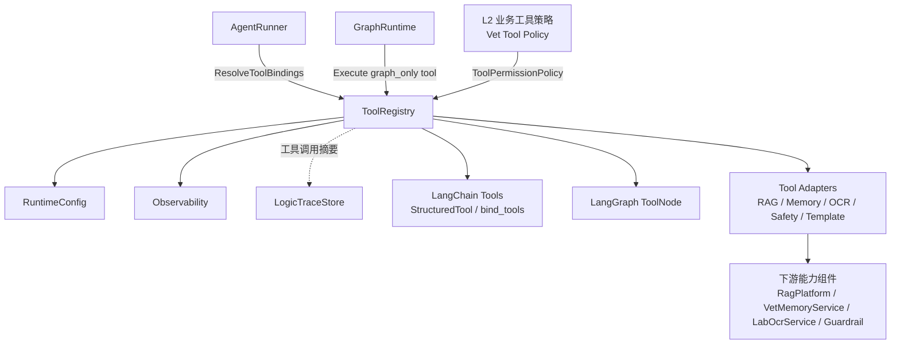
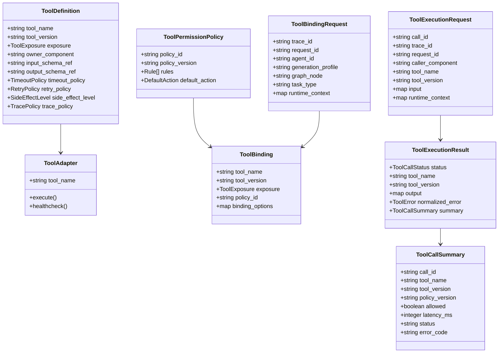
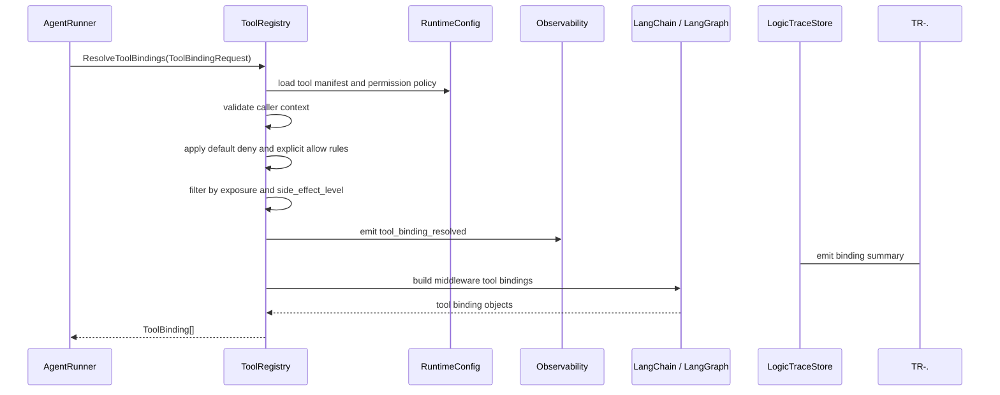
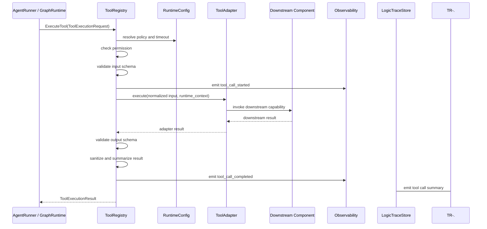
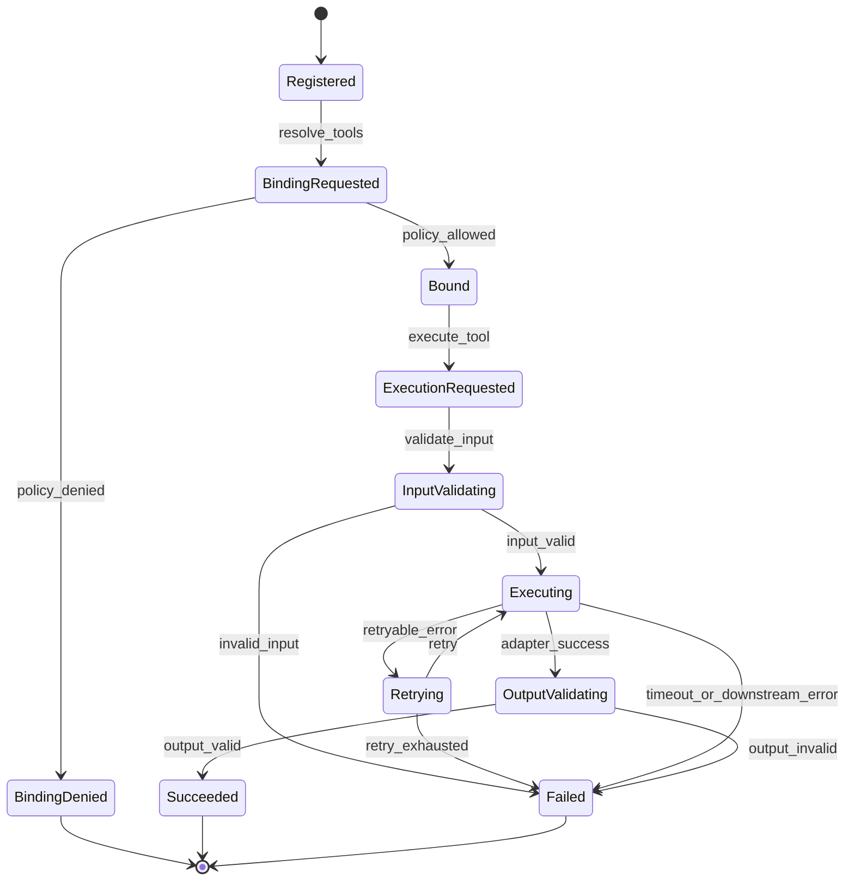

# Tool Registry 组件设计文档 / ToolRegistry

## 3.1 基础元数据 (Metadata)

* **组件标识：** Tool Registry / `ToolRegistry`
* **责任人 (Owner)：** 待定
* **代码仓库：** 当前仓库，正式 Git Repository URL 待补充
* **关联需求：**
  * [`docs/component_catalog.md`](../../../component_catalog.md) §5.4 Tool Registry
  * [`docs/prd.md`](../../../prd.md) §5.4、§7.4、§7.5、§7.6、§9.2
  * [`docs/design_spec.md`](../../../design_spec.md)
* **架构层级：** L1 AI 通用运行组件
* **文档状态：** 草案

## 3.2 职责边界 (Responsibility Boundaries)

* **核心能力 (Capabilities)：**
* 作为 LangChain / LangGraph 工具体系之上的项目级工具治理适配层，统一管理工具定义、工具版本、工具 schema、暴露范围与执行策略。
* 支持服务启动阶段注册工具 manifest 与工具 adapter，并校验工具名、版本、输入输出 schema、暴露类型和超时策略。
* 支持按 `agent_id`、`generation_profile`、`graph_node`、`task_type`、工具暴露类型和运行上下文解析本轮可用工具集合。
* 支持将已授权工具包装为 AgentRunner 可绑定的 LangChain tool 或 LangGraph `ToolNode` 可执行工具。
* 支持 `agent_callable`、`graph_only`、`system_only` 三类工具暴露级别，避免所有系统能力默认暴露给模型。
* 在工具执行前执行权限校验、schema 校验、上下文完整性校验、超时策略和必要的只读 / 副作用约束检查。
* 在工具执行后执行结果 schema 校验、结果摘要化、敏感信息裁剪和标准错误映射。
* 管理工具级 timeout、有限重试、熔断和并发限制；重试仅允许用于幂等或只读工具。
* 向 `Observability` 输出工具调用指标，并向 `LogicTraceStore` 或调用方提供可进入逻辑链的工具调用摘要。
* 支持不同业务 Agent 使用不同工具权限策略，确保业务剖面边界可被工程约束执行。

* **非目标 (Non-Goals)：**
* 不自研通用 tool calling 协议、模型工具调用循环或工具并行执行引擎；相关能力优先复用 LangChain / LangGraph。
* 不负责 HTTP 接入、FastAPI 路由、SSE 输出或客户端协议适配；入口能力由 `ApiIngress` 承担。
* 不实现 JWT、OAuth、登录态解析或用户认证。当前阶段 Agent 服务仅在局域网访问，身份上下文由上游可信传入。
* 不负责 `session_id` 与 `pet_id` 的业务一致性校验；一 session 一宠策略由 `PetSessionPolicy` 负责。
* 不判断 `intent`、`route`、`generation_profile`、`audit_tier`、急症优先级或业务分段发布顺序。
* 不承载兽医 SAF 语义判断、T4 用药边界判断、化验单医学解释或最终发布放行。
* 不替代 `VetContextBuilder` 读取和编译 P0 临床上下文；模型不得通过自主工具调用补齐 P0 主路径上下文。
* 不替代 `RagPlatform`、`VetMemoryService`、`LabOcrService`、`ReferenceRangePolicy` 或 `GuardrailFramework` 的业务能力。
* 不允许向模型暴露任意 SQL、文件读取、grep 或未声明内部工具作为通用能力。
* 不写入长期记忆、会话消息或 checkpoint；本组件仅输出工具调用结果、调用摘要和标准化错误。

## 3.3 架构与交互设计 (Architecture & Interaction)

* **上下文视图 (Context Diagram)：**

`ToolRegistry` 是 FastAPI 应用内的 L1 AI 通用运行组件。MVP 阶段不作为独立网络服务部署，而是作为 `AgentRunner` 与 `GraphRuntime` 的服务内依赖。它复用 LangChain 的 tool 定义和绑定能力，以及 LangGraph 的工具节点执行能力；自研部分仅保留工具 manifest、权限解析、执行治理、结果摘要、错误映射和逻辑链适配。

* **核心领域模型 (Domain Model)：**

模型说明：

* `ToolDefinition` 是工具静态定义，不承载兽医业务规则正文。完整 DTO 字段、枚举和校验细节由代码内 Pydantic 模型或 API 治理平台维护。
* `ToolExposure` 用于区分 `agent_callable`、`graph_only`、`system_only`，避免模型默认获得所有系统工具。
* `ToolPermissionPolicy` 采用默认拒绝策略，由 L2 业务工具策略提供具体授权规则。
* `ToolBindingRequest` 是工具绑定解析输入，可以携带 `pet_id`、`session_id` 等上下文，但本组件不解释其业务归属含义。
* `ToolExecutionResult` 是稳定返回契约，不向调用方泄漏下游工具 SDK 的原始异常或内部实现类型。
* `ToolCallSummary` 是进入逻辑链的工具调用摘要；完整输入输出记录策略由上游 `TracePolicy` 和 `audit_tier` 控制。

## 3.4 契约与依赖 (Contracts & Dependencies)

* **入向契约 (Inbound APIs)：**
* 注册工具定义：`RegisterToolDefinitions` -> API 治理平台链接待建立
* 解析工具绑定：`ResolveToolBindings` -> API 治理平台链接待建立
* 执行工具：`ExecuteTool` -> API 治理平台链接待建立
* 转换为 Agent 工具绑定：`BuildAgentToolBindings` -> API 治理平台链接待建立
* 校验工具权限策略：`ValidateToolPolicy` -> API 治理平台链接待建立
* 查询工具定义：`ListToolDefinitions` -> API 治理平台链接待建立

接口原则：

* 当前契约优先作为 FastAPI 应用内服务接口使用；若后续独立服务化，再登记 HTTP / RPC 接口。
* 工具定义必须在服务启动或受控发布阶段注册；运行期不允许由模型或用户输入动态注册新工具。
* 工具绑定必须携带 `trace_id`、`request_id`、`caller_component`、`agent_id` 或 `graph_node`，用于权限判断、观测指标和逻辑链摘要。
* 工具权限采用默认拒绝策略；未被策略显式允许的工具不得绑定，也不得执行。
* `agent_callable` 工具必须可转换为 LangChain / LangGraph 可识别的工具定义；`graph_only` 与 `system_only` 工具不得进入模型可见工具列表。
* LLM 可调用工具默认应为只读或无副作用工具；写入类或高风险工具只能由图节点或系统组件显式调用。
* 工具执行必须经过输入 schema 校验；校验失败不得调用下游工具 adapter。
* 工具结果必须经过输出 schema 校验、摘要化和错误归一后返回；不得向模型暴露内部堆栈、密钥、真实网络地址或未脱敏敏感信息。
* 对声明禁止 RAG 的业务剖面，`rag` 类工具不得被解析或绑定；该限制由 L2 业务策略提供，本组件负责执行策略。

异常映射原则：

* 工具定义不存在映射为 `TOOL_NOT_FOUND`。
* 工具版本不可用映射为 `TOOL_VERSION_UNAVAILABLE`。
* 工具 adapter 未注册映射为 `TOOL_ADAPTER_NOT_FOUND`。
* 工具权限拒绝映射为 `TOOL_PERMISSION_DENIED`。
* 工具暴露级别不匹配映射为 `TOOL_EXPOSURE_MISMATCH`。
* 工具输入 schema 校验失败映射为 `TOOL_INPUT_SCHEMA_INVALID`。
* 工具输出 schema 校验失败映射为 `TOOL_OUTPUT_SCHEMA_INVALID`。
* 工具执行超时映射为 `TOOL_TIMEOUT`。
* 工具熔断开启映射为 `TOOL_CIRCUIT_OPEN`。
* 下游工具能力不可用映射为 `TOOL_DOWNSTREAM_UNAVAILABLE`。
* 下游工具执行失败映射为 `TOOL_EXECUTION_FAILED`。
* 工具结果脱敏或摘要化失败映射为 `TOOL_RESULT_SANITIZE_FAILED`。

* **出向依赖 (Outbound Dependencies)：**
* **强依赖：**
* `RuntimeConfig`：提供工具 manifest 版本、权限策略版本、超时、重试、熔断、并发限制和 trace 策略。不可用时不得执行工具绑定或工具调用。
* `Observability`：记录工具绑定、工具调用延迟、超时、错误、拒绝、熔断和下游可用性。不可用不应影响单次工具调用，但需触发降级告警。
* 已注册 `ToolAdapter`：执行具体工具能力。某工具 adapter 不存在时，该工具不可绑定或执行。
* LangChain / LangGraph 工具适配库：用于将授权工具转换为 Agent 可调用工具或图工具节点可执行工具。库能力不得泄漏到本组件公共契约。

* **弱依赖：**
* `LogicTraceStore`：消费工具调用摘要。短暂不可用时本组件应返回 trace 降级状态，并由上游图运行事件或本地缓冲补偿。
* `RagPlatform`、`VetMemoryService`、`ConversationStore`、`LabOcrService`、`ReferenceRangePolicy`、`GuardrailFramework` 等下游能力组件：作为具体工具 adapter 的后端依赖。单个后端不可用只影响对应工具，不应影响未依赖该工具的 Agent 或图节点。
* API 治理平台：维护完整接口字段、示例和版本。缺失时不阻塞运行，但阻塞正式契约冻结。

## 3.5 核心流转机制 (Core Flow Mechanism)

* **状态流转/时序图：**

工具绑定解析流程：

工具执行流程：

状态机：

核心流程约束：

* 工具注册发生在服务启动或受控发布阶段，不接受模型或用户动态注册。
* 工具绑定与工具执行均需进行权限校验；绑定阶段允许不代表执行阶段可绕过校验。
* `agent_callable` 工具才允许进入模型可见工具列表；`graph_only` 与 `system_only` 只能由受控节点或系统组件显式调用。
* 工具调用摘要必须包含工具名、版本、调用方、权限策略版本、是否允许、耗时、状态和错误码。
* 工具执行失败不得直接泄漏下游异常；调用方只能收到标准化错误与可用于降级的状态。

## 3.6 稳定性与可观测性 (Reliability & Observability)

* **流量控制：**
* 支持单实例工具调用最大并发数限制。
* 支持单工具并发限制、超时限制和熔断策略。
* 支持单次 Agent 运行最大工具调用次数限制。
* 支持按工具、调用方、剖面和下游组件维度统计限流与拒绝。
* 仅对幂等或只读工具启用自动重试；写入类工具必须依赖调用方提供幂等键和图级恢复策略。
* 对权限拒绝、暴露级别不匹配、schema 校验失败执行快速失败，不访问下游。
* 不在本组件内执行 HTTP 层限流；入口限流由 `ApiIngress` 或部署网关承担。

* **数据一致性：**
* 工具定义、权限策略和 trace 策略必须版本化，工具调用摘要须记录生效版本。
* 工具 side effect 必须显式声明；有副作用工具默认不得暴露为 `agent_callable`。
* 工具执行的输入输出完整体是否落库由上游 `TracePolicy` 和 `audit_tier` 控制；本组件默认提供摘要、hash 或引用。
* 工具调用摘要允许异步写入 `LogicTraceStore`，但失败时必须向调用方暴露 trace 降级状态。
* 对可能产生外部副作用的工具，调用方必须提供 `idempotency_key` 或由图节点保证不会重复执行。
* 工具结果不得作为未校验业务事实直接写入长期记忆；写入策略由业务记忆组件负责。

* **核心指标 (Golden Signals)：**
* `tool_definition_registered_total`
* `tool_binding_resolve_total`
* `tool_binding_denied_total`
* `tool_binding_count`
* `tool_call_total`
* `tool_call_success_total`
* `tool_call_failed_total`
* `tool_call_denied_total`
* `tool_call_duration_ms`
* `tool_call_timeout_total`
* `tool_call_retry_total`
* `tool_circuit_open_total`
* `tool_input_schema_invalid_total`
* `tool_output_schema_invalid_total`
* `tool_downstream_unavailable_total`
* `tool_trace_write_failed_total`
* `agent_callable_tool_count`
* `graph_only_tool_call_total`
* `system_only_tool_call_total`
* 可观测性面板链接：无
