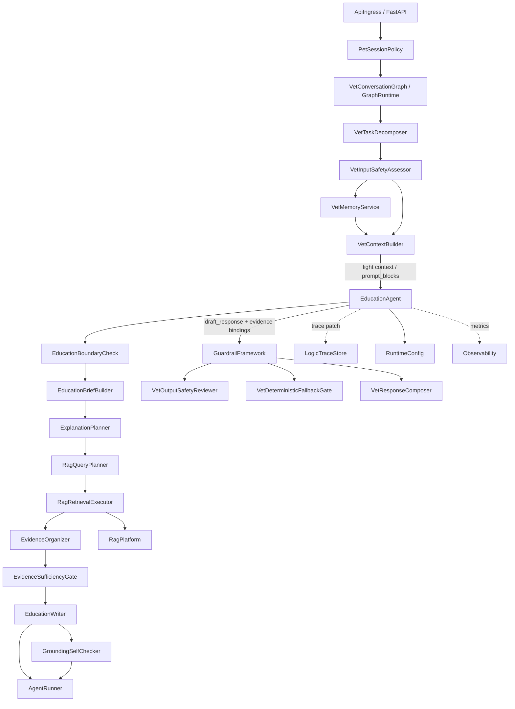
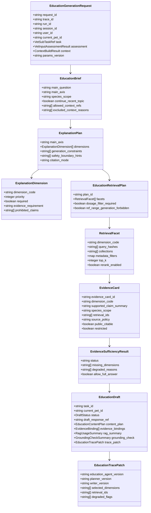
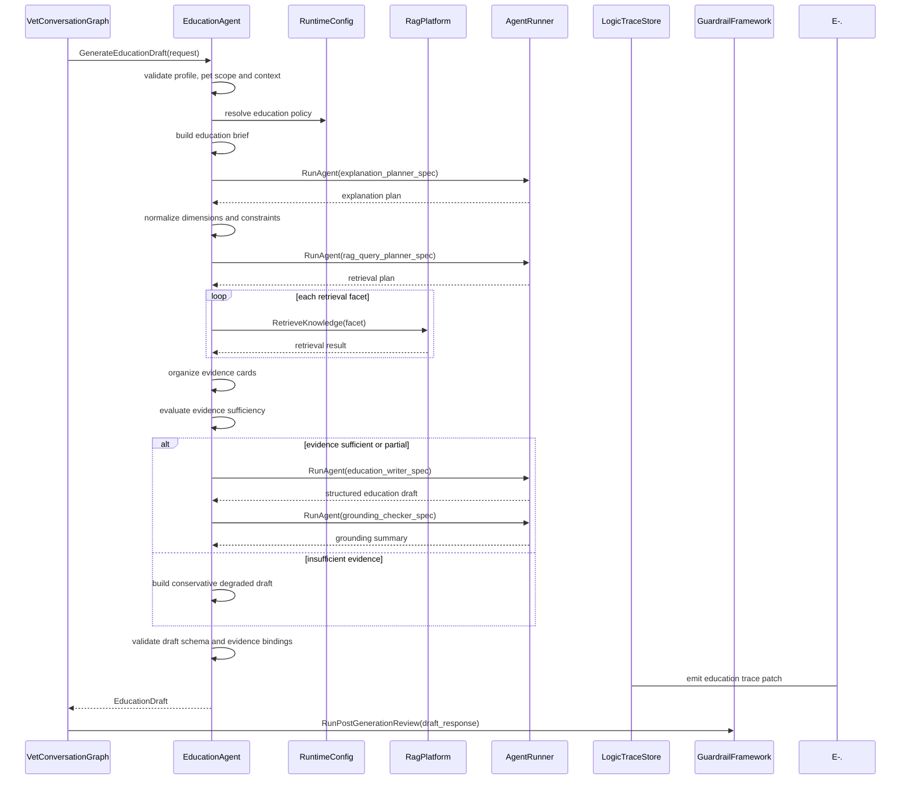
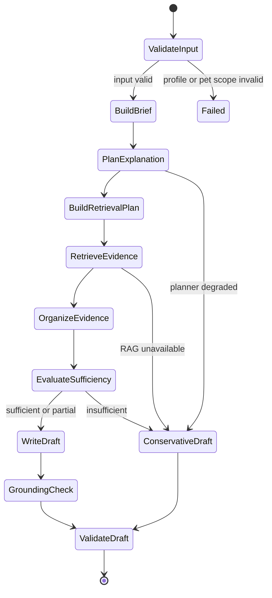

# 科普 Agent 组件设计文档 / EducationAgent

## 3.1 基础元数据 (Metadata)

* **组件标识：** 科普 Agent / `EducationAgent`
* **责任人 (Owner)：** 待定
* **代码仓库：** 当前仓库，正式 Git Repository URL 待补充
* **关联需求：**
  * [`docs/component_catalog.md`](../../../component_catalog.md) §6.7 科普 Agent
  * [`docs/prd.md`](../../../prd.md) §5.1、§5.2、§5.4、§6.8、§6.9、§6.10、§6.11、§7.4、§7.5、§7.6、§9.4、§9.9、§10
  * [`docs/design_spec.md`](../../../design_spec.md)
  * [`docs/temporary-rag.md`](../../../temporary-rag.md)
  * [`docs/components/l2-vet-business/vet-input-safety-assessor/design.md`](../vet-input-safety-assessor/design.md)
  * [`docs/components/l2-vet-business/vet-task-decomposer/design.md`](../vet-task-decomposer/design.md)
  * [`docs/components/l2-vet-business/vet-memory-service/design.md`](../vet-memory-service/design.md)
  * [`docs/components/l1-ai-runtime/agent-runner/design.md`](../../l1-ai-runtime/agent-runner/design.md)
  * [`docs/components/l1-ai-runtime/rag-platform/design.md`](../../l1-ai-runtime/rag-platform/design.md)
  * [`docs/components/l1-ai-runtime/guardrail-framework/design.md`](../../l1-ai-runtime/guardrail-framework/design.md)
  * [`docs/components/l1-ai-runtime/logic-trace-store/design.md`](../../l1-ai-runtime/logic-trace-store/design.md)
* **架构层级：** L2 兽医业务组件 / `education` 剖面生成执行层
* **文档状态：** 草案

## 3.2 职责边界 (Responsibility Boundaries)

* **核心能力 (Capabilities)：**
* 在 `VetInputSafetyAssessor` 已判定当前子任务进入 `generation_profile=education` 后，生成科普剖面的 RAG 接地草稿。
* 作为 `education` 剖面内的受控 RAG 子图，围绕用户当前问题生成科普主轴、解释维度、检索计划、证据组织结果和大白话草稿。
* 基于 `VetContextBuilder` 产出的轻量上下文、`prompt_blocks`、压缩审计和当前宠物作用域执行科普生成；上下文仅用于物种级、近期话题接续和表达偏好，不用于个案诊断。
* 使用弱约束规则限制科普语境下的分析与描述方向，通过动态解释维度规划替代具体科普类型穷举。
* 面向定义、机制、常见方向、风险边界、判断局限、检查原则、护理原则、药物边界、预防管理、误区澄清和概念对比等解释维度，生成受控 RAG 检索计划。
* 调用 `RagPlatform` 执行多 query、多 collection、metadata filter、rerank 与来源策略受控的知识检索，并将结果整理为可被生成器消费的证据卡。
* 对 RAG 证据进行分面组织、来源策略归一、物种适配检查、剂量风险过滤和证据充分性判定。
* 基于证据卡和内容计划生成科普草稿，输出大白话解释，并将必要安全边界自然嵌入正文。
* 对草稿执行轻量接地性自检，标记无证据扩展、个案诊断倾向、四层问诊格式、T4 风险、参考区间幻觉和不可公开引用来源等风险。
* 输出 `EducationDraft`、`EducationContentPlan`、RAG 使用摘要、证据绑定摘要、接地性自检摘要和 trace patch，供后续安全审查、兜底门、回复合成和逻辑链留痕消费。
* 优先复用 `AgentRunner`、`RagPlatform`、LangGraph / LangChain、结构化输出校验和 trace 组件；自研层仅负责兽医科普语境约束、解释维度规划、RAG 证据编排和生成边界控制。

* **非目标 (Non-Goals)：**
* 不实现 JWT、OAuth、登录态解析或用户身份认证。当前阶段 Agent 服务仅在局域网访问，身份上下文由上游可信传入。
* 不校验、创建或改写 session 与 `pet_id` 的绑定关系；一 session 一宠策略由 `PetSessionPolicy` 负责。
* 不根据自然语言文本进行定宠、切宠、宠物名匹配或跨宠对照。
* 不执行多任务拆解、附件角色判定或任务优先级初判；这些由 `VetTaskDecomposer` 负责。
* 不决定输入侧 SAF 信号、`intent`、`route`、`generation_profile`、实际执行器或压缩策略；这些由 `VetInputSafetyAssessor` 负责。
* 不执行标准问诊、结构化追问、分诊四层递进、鉴别收敛或处置计划生成；这些由 `StandardConsultationAgent` 负责。
* 不执行急症简版生成，不在 `safety_trigger` 剖面调用 RAG；急症剖面由 `SafetyTriggerAgent` 负责。
* 不执行纯饲养 / 行为 / 日常护理链路的个性化非医疗建议；这些由 `NonMedicalPetCareAgent` 负责。
* 不绕过 `VetContextBuilder` 直接读取宠物画像、长期记忆、会话摘要、化验报告或 checkpoint 原始状态。
* 不管理知识库索引、文档切片、embedding、rerank、版权策略或知识源版本；这些由 `RagPlatform` 负责。
* 不以 RAG 资料生成检验参考区间、异常标记、诊断结论或当前宠物事实；检验参考区间与 OCR 结构化由视觉 / 参考区间组件负责。
* 不执行输出安全审查、T4 删除、毒物建议拦截、免责追加或最终发布前 P0 否决；这些由 `VetOutputSafetyReviewer` 与 `VetDeterministicFallbackGate` 负责。
* 不直接向用户发布草稿、不决定多段回复发布顺序、不标记 segment 已发布；这些由 `VetResponseComposer`、`GraphRuntime` 和发布链路负责。
* 不写入宠物级 / 主人级长期记忆，不刷新 `CoreFactSnapshot`，不执行用户记忆查看、纠正或删除。
* 不保存完整 A/B/C 业务逻辑链；本组件仅输出科普相关 trace patch，完整落库由 `LogicTraceStore` 与 L2 trace schema 承担。
* 不维护具体科普类型的穷举分类树；组件仅维护有限解释维度、生成禁区和 RAG 检索约束。

## 3.3 架构与交互设计 (Architecture & Interaction)

* **上下文视图 (Context Diagram)：**

`EducationAgent` 是 FastAPI 应用内的 L2 业务 Agent 组件，通常作为 LangGraph 中 `VetContextBuilder` 之后、输出护栏之前的 `education` 生成节点。组件对外保持单一科普生成契约；内部采用弱约束规则驱动的受控 RAG 子图，不允许写作 Agent 自由调用检索工具，也不允许内部节点绕过中控、护栏或 trace。

本组件的规则驱动边界仅用于限制科普语境下的解释维度、检索范围、证据充分性和生成禁区。具体用户问法不通过穷举类型树处理；当问题无法稳定归入某一医学主题时，组件应退化为通用科普主轴与保守证据检索，而不是扩大为问诊链或急症链。

* **核心领域模型 (Domain Model)：**

模型说明：

* `EducationGenerationRequest` 必须消费 `PetSessionPolicy` 确认后的 `current_pet_id`、`VetInputSafetyAssessor` 输出的 `education` 判决和 `VetContextBuilder` 输出的上下文编译结果。
* `EducationBrief` 表示本轮科普主轴和可用上下文视图；它不得承载跨宠事实或未确认 OCR 数值。
* `ExplanationPlan` 表示动态解释维度规划，不是具体科普类型分类结果。
* `EducationRetrievalPlan` 表示受控 RAG 检索计划；完整检索 DTO 由 `RagPlatform` 与代码内 Pydantic 模型维护。
* `EvidenceCard` 是写作 Agent 的证据输入最小单元；它绑定 claim 摘要、检索引用和来源策略，不保存完整知识源文档。
* `EvidenceSufficiencyResult` 决定本轮科普是否完整生成、保守降级或拒绝实质医学解释。
* `EducationDraft` 是本组件唯一对外业务结果；其自然语言正文仍为草稿，必须进入输出安全审查与确定性兜底。
* 完整 DTO、字段约束、错误码、枚举取值和正式示例由代码内 Pydantic 模型或 API 治理平台维护；本文仅定义组件级领域模型。

## 3.4 契约与依赖 (Contracts & Dependencies)

* **入向契约 (Inbound APIs)：**
* 生成科普草稿：`GenerateEducationDraft` -> API 治理平台链接待建立
* 规划科普解释维度：`PlanEducationExplanation` -> API 治理平台链接待建立
* 生成科普 RAG 检索计划：`BuildEducationRetrievalPlan` -> API 治理平台链接待建立
* 校验科普草稿契约：`ValidateEducationDraft` -> API 治理平台链接待建立

接口原则：

* 当前契约优先作为 FastAPI 应用内 service 接口和 LangGraph 节点使用；若后续服务化，再登记 HTTP / RPC 接口。
* 入参必须携带 `request_id`、`trace_id`、`run_id`、`session_id`、`user_id`、`current_pet_id`、`task_id` 与 `params_version`。
* 入参中的 `generation_profile` 必须为 `education`；否则本组件拒绝执行并返回 profile mismatch 错误。
* 入参必须包含 `VetContextBuilder` 产出的轻量上下文、`prompt_blocks` 或等价上下文视图、压缩审计与当前宠物核心事实版本引用。
* `current_pet_id` 必须与上下文编译结果、任务引用和评估结果中的宠物作用域一致；不一致时拒绝运行。
* 科普医学内容需要可用的 RAG 证据或明确的 RAG 降级状态。RAG 不可用或证据不足时，不得输出完整医学科普、药物原则细节或检查指标解释。
* 解释维度来自受控集合，但允许多维度组合、低置信降级和通用科普兜底；不得通过硬编码问法穷举替代解释维度规划。
* RAG 检索计划必须显式声明检索目的、collection、metadata filter、top-k、rerank 策略和来源策略要求。
* 写作 Agent 只能消费 `EducationBrief`、`ExplanationPlan`、`EvidenceCard[]` 与生成约束；不得直接调用自由检索工具。
* 药物 / 补剂相关科普只能输出原则、风险和就医 / 遵兽医边界；不得输出 T4 精确计量。
* 检查指标相关科普不得从 RAG 资料生成参考区间、异常标记或确诊判断。
* 本组件输出的 `draft_response` 不得直接发布；调用方必须继续执行 7.6-C / 7.6-D 对应的输出安全审查与确定性兜底。
* 本组件必须输出可写入逻辑链的 trace patch；trace 写入失败时应向上游暴露降级状态。

核心枚举：

* `ExplanationDimensionCode`：
  * `DEFINITION`：概念或术语定义。
  * `MECHANISM`：发生机制或作用原理。
  * `COMMON_DIRECTIONS`：常见原因、方向或可能性范围。
  * `RED_FLAGS`：风险边界与就医提示。
  * `DIAGNOSTIC_LIMITS`：判断局限与不能确诊的边界。
  * `CHECKUP_PRINCIPLES`：检查、复查或兽医评估原则。
  * `CARE_PRINCIPLES`：一般护理或观察原则。
  * `MEDICATION_BOUNDARY`：药物 / 补剂使用原则与禁区。
  * `PREVENTION_MANAGEMENT`：预防和日常管理。
  * `MISCONCEPTION_CLARIFICATION`：误区澄清。
  * `COMPARISON`：相似概念、症状或指标的区分。
* `EducationDraftStatus`：
  * `DRAFT_READY`
  * `RAG_DEGRADED_CONSERVATIVE`
  * `INSUFFICIENT_EVIDENCE`
  * `NEEDS_SAFETY_REVIEW`
  * `SCHEMA_INVALID`
  * `FAILED`
* `EvidenceSufficiencyStatus`：
  * `SUFFICIENT`
  * `PARTIAL`
  * `INSUFFICIENT`
* `RetrievalPurpose`：
  * `EDUCATION_EXPLANATION`
  * `EDUCATION_RED_FLAG_BOUNDARY`
  * `EDUCATION_MEDICATION_BOUNDARY`
  * `EDUCATION_LAB_INTERPRETATION`
  * `EDUCATION_EVIDENCE_CHECK`

异常映射原则：

* 剖面不匹配映射为 `EDUCATION_PROFILE_MISMATCH`。
* 缺少当前宠物上下文映射为 `EDUCATION_MISSING_CURRENT_PET_ID`。
* 上下文适配结果缺失映射为 `EDUCATION_CONTEXT_MISSING`。
* 上下文作用域与当前宠物不一致映射为 `EDUCATION_PET_CONTEXT_INVALID`。
* 解释维度规划失败映射为 `EDUCATION_PLAN_FAILED`，触发通用科普保守降级。
* RAG 检索计划非法映射为 `EDUCATION_RETRIEVAL_PLAN_INVALID`。
* 医学科普所需 RAG 证据缺失映射为 `EDUCATION_RAG_REQUIRED_MISSING`，触发保守降级。
* RAG 检索超时或不可用映射为 `EDUCATION_RAG_DEGRADED`。
* 证据卡缺失稳定引用映射为 `EDUCATION_EVIDENCE_REFERENCE_INVALID`。
* 证据充分性不足映射为 `EDUCATION_INSUFFICIENT_EVIDENCE`。
* 内部写作 Agent 超时映射为 `EDUCATION_WRITER_TIMEOUT`。
* 接地性自检失败映射为 `EDUCATION_GROUNDING_CHECK_FAILED`。
* 结构化输出解析或 schema 校验失败映射为 `EDUCATION_OUTPUT_SCHEMA_INVALID`。
* prompt 或证据包超出上下文预算映射为 `EDUCATION_TOKEN_BUDGET_EXCEEDED`。

* **出向依赖 (Outbound Dependencies)：**
* **强依赖：**
* `GraphRuntime`：调用本组件并承接护栏、发布与 checkpoint 后续节点。不可用时科普链路无法运行。
* `AgentRunner`：执行解释规划、科普写作和接地性自检 Agent。不可用时本组件无法产出模型草稿。
* `VetContextBuilder`：提供轻量上下文、当前宠物作用域、压缩审计和上下文引用。不可用时不得执行正常科普生成。
* `RuntimeConfig`：提供科普参数、解释维度集合、RAG 策略、子 Agent 版本、超时、重试和参数版本。不可用时服务不可就绪。
* `RagPlatform`：提供科普医学内容的受控 RAG 检索。不可用时进入保守降级，不得输出完整医学科普。
* `Observability`：记录科普内部节点、RAG、子 Agent、schema 校验和降级指标。不可用不应阻断单次生成，但需产生降级日志。

* **弱依赖：**
* `LogicTraceStore`：保存科普 trace patch、RAG 摘要、证据绑定摘要和内部规划摘要。短暂不可用时需向上游暴露 trace 降级状态。
* `VetMemoryService`：通过 `VetContextBuilder` 间接提供轻量记忆读集和 `CoreFactSnapshot` 引用。本组件不直接读写记忆。
* `GuardrailFramework`：承接本组件草稿后的输出安全审查与确定性 gate。不可用时不得直接发布草稿。
* `MedicationPolicy`：提供 T0-T4 生成边界和用药表述版本。本组件可在生成前自约束，但最终安全判断仍由后续护栏承担。
* API 治理平台：维护完整接口字段、示例和版本。缺失时不阻塞应用内契约实现，但阻塞正式契约冻结。

## 3.5 核心流转机制 (Core Flow Mechanism)

* **状态流转/时序图：**

科普草稿生成流程：

内部状态流转：

RAG 证据编排机制：

执行约束：

* 本组件不得接收 `safety_trigger` 或 `standard` 任务作为正常输入。
* RAG 检索计划必须由受控中控生成；写作 Agent 不得自由调用检索工具。
* 解释维度用于组织证据与生成方向，不得演化为具体科普问法穷举树。
* RAG 证据用于科普接地，不用于覆盖输入安全判决、不用于替代当前宠物事实、不用于检验参考区间数值比较。
* 证据卡可复用缓存引用，但知识库版本变化、物种变化、主轴变化、SAF 强信号出现或来源下线时必须失效。
* `education` 草稿必须进入后续输出安全审查和确定性兜底；本组件的接地性自检不具备发布放行权。

## 3.6 稳定性与可观测性 (Reliability & Observability)

* **流量控制：**
* 当前组件不直接暴露公网接口，入口流量由 `ApiIngress` 与 `GraphRuntime` 控制。
* 同一 `session_id` 的并发运行应由 `CheckpointStore` / 图运行锁控制，避免同轮多段状态竞争。
* 内部规划、写作和接地性自检 Agent 必须配置独立超时、有限重试和最大 token 预算。
* RAG 检索必须配置 per-facet 超时、top-k 上限、collection 白名单和 rerank 降级策略。
* 当 RAG、写作 Agent 或接地性自检局部不可用时，组件应返回保守科普草稿、证据不足状态或明确降级结果，不得输出无依据的完整医学解释。

* **数据一致性：**
* 本组件不直接写长期存储；输出草稿、证据绑定和 trace patch 由上游图节点、护栏链路和 `LogicTraceStore` 消费。
* `current_pet_id`、`task_id`、解释计划、RAG 证据和 trace patch 必须在一次运行内保持同一 `trace_id` 和 `params_version`。
* RAG 证据缓存采用只读引用语义；缓存命中结果必须保留 collection version、source version、content hash、retrieval purpose 和失效条件摘要。
* `EvidenceCard` 只绑定证据引用和 claim 摘要，不将运行时对话、草稿或终稿写入知识库索引。
* 本组件不得把 RAG 检索到的通识知识写入 `CoreFactSnapshot`，也不得把科普问答自动沉淀为宠物临床事实。

* **核心指标 (Golden Signals)：**
* `education_agent_latency_ms`：科普组件端到端延迟。
* `education_planner_latency_ms`：解释规划与检索计划生成延迟。
* `education_writer_latency_ms`：科普写作 Agent 延迟。
* `education_success_rate`：成功产出结构化科普草稿比例。
* `education_rag_invoked_rate`：科普医学内容触发 RAG 的比例。
* `education_rag_degraded_rate`：RAG 超时、空结果、低相关或来源策略缺失降级比例。
* `education_evidence_sufficient_rate`：证据充分并允许完整回答的比例。
* `education_conservative_degrade_rate`：证据不足或依赖降级后保守输出比例。
* `education_grounding_check_failed_rate`：接地性自检失败比例。
* `education_schema_invalid_rate`：结构化输出 schema 校验失败比例。
* `education_forbidden_format_detected_rate`：草稿中出现四层问诊格式、个案诊断倾向或参考区间幻觉的拦截比例。
* `education_draft_t4_detected_rate`：后续护栏在科普草稿中发现 T4 的比例。
* `education_dimension_distribution`：解释维度使用分布。
* `education_rag_cache_hit_rate`：科普证据缓存命中率。

可观测性要求：

* 每次运行必须向 `Observability` 发送组件开始、解释规划、RAG 检索、证据充分性判定、写作、接地性自检、schema 校验和降级事件。
* B 级及以上链路必须向 `LogicTraceStore` 提供科普 trace patch；trace 写入降级需被显式记录并向上游暴露。
* 监控面板链接待建立。
