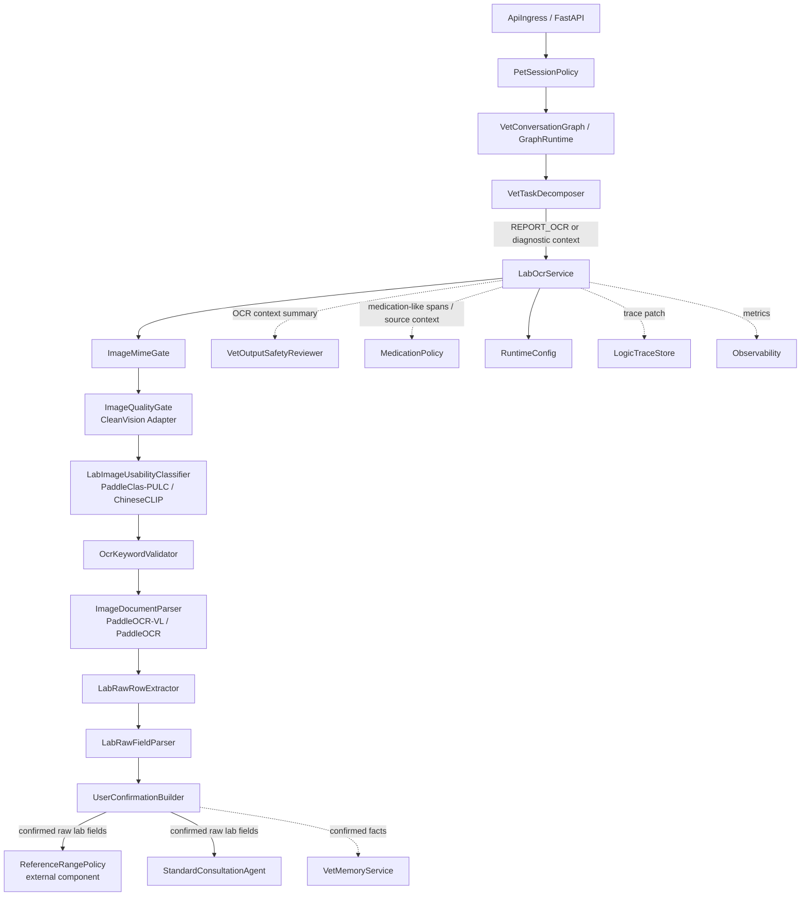
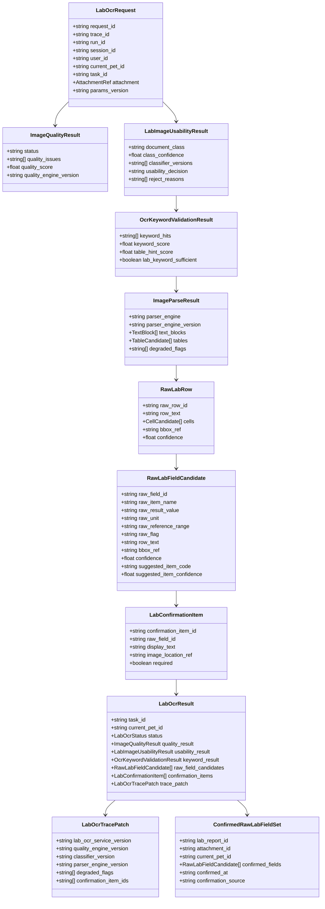
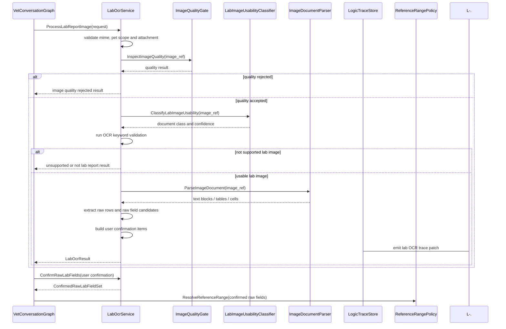
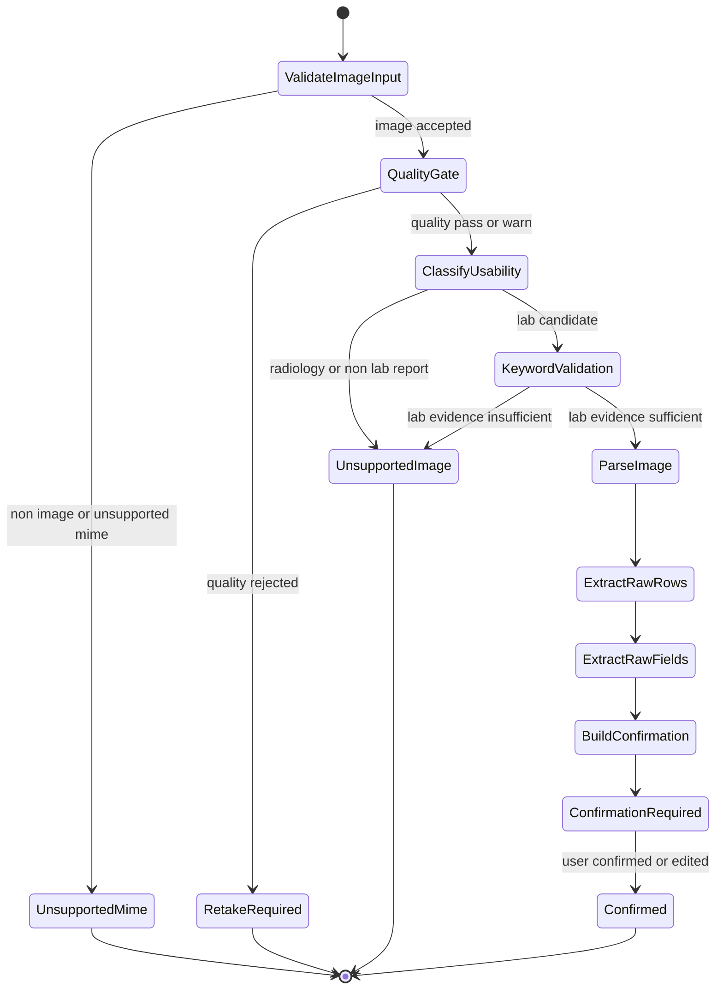
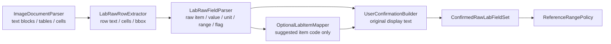

# 化验 OCR 业务组件设计文档 / LabOcrService

## 3.1 基础元数据 (Metadata)

* **组件标识：** 化验 OCR 业务组件 / `LabOcrService`
* **责任人 (Owner)：** 待定
* **代码仓库：** 当前仓库，正式 Git Repository URL 待补充
* **关联需求：**
  * [`docs/component_catalog.md`](../../../component_catalog.md) §6.12 化验 OCR 业务组件
  * [`docs/prd.md`](../../../prd.md) §5.3、§6.3、§6.4、§6.5、§6.7、§7.5、§7.6、§8.1、§8.2、§9.8、§10
  * [`docs/design_spec.md`](../../../design_spec.md)
  * [`docs/components/l2-vet-business/vet-task-decomposer/design.md`](../vet-task-decomposer/design.md)
  * [`docs/components/l2-vet-business/vet-input-safety-assessor/design.md`](../vet-input-safety-assessor/design.md)
  * [`docs/components/l2-vet-business/vet-output-safety-reviewer/design.md`](../vet-output-safety-reviewer/design.md)
  * [`docs/components/l2-vet-business/medication-policy/design.md`](../medication-policy/design.md)
  * [`docs/components/l2-vet-business/vet-memory-service/design.md`](../vet-memory-service/design.md)
  * [`docs/components/l1-ai-runtime/tool-registry/design.md`](../../l1-ai-runtime/tool-registry/design.md)
  * [`docs/components/l1-ai-runtime/logic-trace-store/design.md`](../../l1-ai-runtime/logic-trace-store/design.md)
* **架构层级：** L2 兽医业务组件 / 图片化验单读取与确认层
* **文档状态：** 草案

## 3.2 职责边界 (Responsibility Boundaries)

* **核心能力 (Capabilities)：**
* 在 VIS-MVP 范围内处理用户上传的图片类型化验报告，产出可供用户确认的原始化验字段候选。
* 基于 MIME 与服务端图片解码结果执行图片入口校验，拒绝非图片、不可解码图片和当前阶段不支持的文件类型。
* 复用 CleanVision 或等价成熟图像质量中间件，对模糊、过暗、过曝、低信息量、异常尺寸和严重裁切等质量问题进行判断。
* 复用 PaddleClas-PULC、ChineseCLIP 或等价成熟分类中间件，结合 OCR 关键词与表格线索判断图片是否为当前阶段可处理的化验报告图片。
* 复用 PaddleOCR-VL、PaddleOCR / PP-Structure 或等价图片文档解析中间件，获取文本块、表格候选、单元格、坐标、置信度和阅读顺序。
* 从 OCR / 表格候选中原样抽取化验报告行、单元格与字段候选，包括原始项目名、原始结果值、原始单位、原始报告参考区间文本、原始 H / L 标记、行文本、bbox 和置信度。
* 生成用户可对照图片复核的确认项，优先展示报告原文，不强制替换为系统标准检验项代码。
* 接收用户确认结果，输出已确认的原始化验字段集合，供 `ReferenceRangePolicy`、标准问诊、记忆刷新和逻辑链留痕消费。
* 保留可回放证据，包括附件引用、解析引擎版本、图片质量结果、分类结果、关键词命中、表格 / 字段 bbox、OCR 置信度和用户确认状态。
* 对图片质量差、非化验单图片、不支持的影像图片、OCR 低置信、字段冲突和用户未确认等场景输出明确降级状态。
* 优先复用成熟图像质量、图像分类和 OCR / 文档解析中间件；自研层仅负责兽医化验单业务可用性校验、原始字段抽取、确认流程和 trace patch。

* **非目标 (Non-Goals)：**
* 不实现 JWT、OAuth、登录态解析或用户身份认证。当前阶段 Agent 服务仅在局域网访问，身份上下文由上游可信传入。
* 不校验、创建或改写 session 与 `pet_id` 的绑定关系；一 session 一宠策略由 `PetSessionPolicy` 负责。
* 不根据自然语言文本进行定宠、切宠、宠物名匹配或跨宠对照。
* 不处理 PDF、DOCX、XLSX、PPTX、多页文档或原生电子文档解析；当前阶段仅处理图片类型数据。
* 不判读 X 光、B 超、CT、MRI 或其他影像片子；检测到影像类图片时仅输出不支持判读状态。
* 不执行病历结构化、处方结构化、疫苗史抽取、慢性病抽取或 VIS-Full 病历解析。
* 不强制执行检验项标准化映射，不以 `raw_item_name` 推断可靠 `item_code` 作为业务真源；可选映射仅作为低风险内部 hint。
* 不执行参考区间策略，不生成 `abnormal_flag`，不判断偏高 / 偏低；这些由 `ReferenceRangePolicy` 负责。
* 不从 RAG、LLM 或模型常识猜测参考区间、单位、检验项含义或异常状态。
* 不生成诊断结论、疾病方向、处置建议或用药建议。
* 不将 OCR 识别到的病历 / 处方剂量转化为当前用药建议；涉药文本风险由 `MedicationPolicy` 与 `VetOutputSafetyReviewer` 处理。
* 不直接写入宠物级 / 主人级长期记忆，不刷新 `CoreFactSnapshot`；确认后的事实沉淀由 `VetMemoryService` 或异步刷新链路负责。
* 不保存完整 A/B/C 业务逻辑链；本组件仅输出化验 OCR 相关 trace patch，完整落库由 `LogicTraceStore` 与 L2 trace schema 承担。

## 3.3 架构与交互设计 (Architecture & Interaction)

* **上下文视图 (Context Diagram)：**

`LabOcrService` 是 FastAPI 应用内的 L2 兽医业务组件，通常由独立 `REPORT_OCR` 子任务或标准问诊中的上传报告证据路径触发。组件内部采用图片专用流水线，不执行泛文档 provider 路由。当前 MVP 不接入 MinerU 作为主路径；若后续支持 PDF、多页文档或病历结构化，可在独立文档解析适配层扩展。

本组件的业务真源是用户可对照图片确认的原始字段，而不是系统猜测出的标准化检验项代码。字段抽取必须保留原始行、单元格、bbox 和置信度，以支持用户复核、逻辑链回放和后续人工排错。

* **核心领域模型 (Domain Model)：**

模型说明：

* `LabOcrRequest` 必须消费 `PetSessionPolicy` 确认后的 `current_pet_id` 与附件引用；本组件不得从图片或报告文本推断宠物。
* `ImageQualityResult` 表示图片质量判断结果；质量不合格时组件应停止正式 OCR 或输出重拍建议。
* `LabImageUsabilityResult` 表示图片是否为当前阶段可处理的化验报告图片；它不等价于字段抽取结果。
* `OcrKeywordValidationResult` 是化验单业务可用性校验摘要，用于降低图像分类误判。
* `RawLabFieldCandidate` 保留原始字段文本。`suggested_item_code` 是可选内部 hint，不作为 MVP 主路径事实。
* `LabConfirmationItem` 面向用户确认，展示文本应优先保留报告原文。
* `ConfirmedRawLabFieldSet` 表示用户确认后的原始字段集合；参考区间来源和异常标注由 `ReferenceRangePolicy` 后续处理。
* 完整 DTO、字段约束、错误码、枚举取值和正式示例由代码内 Pydantic 模型或 API 治理平台维护；本文仅定义组件级领域模型。

## 3.4 契约与依赖 (Contracts & Dependencies)

* **入向契约 (Inbound APIs)：**
* 处理图片化验单：`ProcessLabReportImage` -> API 治理平台链接待建立
* 构建化验字段确认项：`BuildLabOcrConfirmationItems` -> API 治理平台链接待建立
* 确认原始化验字段：`ConfirmRawLabFields` -> API 治理平台链接待建立
* 校验化验 OCR 结果契约：`ValidateLabOcrResult` -> API 治理平台链接待建立

接口原则：

* 当前契约优先作为 FastAPI 应用内 service 接口和 LangGraph 节点使用；若后续服务化，再登记 HTTP / RPC 接口。
* 入参必须携带 `request_id`、`trace_id`、`run_id`、`session_id`、`user_id`、`current_pet_id`、`task_id`、`attachment_id` 与 `params_version`。
* 附件必须是当前阶段允许的图片 MIME 类型；非图片类型不得进入本组件主流程。
* 本组件输出的字段候选必须保留原始字段文本、坐标引用和置信度；不得只返回标准化字段。
* 用户确认前的 OCR 字段不得作为已确认临床事实、异常标注、诊断依据或长期记忆事实。
* 用户确认结果必须绑定原始字段候选和附件引用；用户编辑后的字段需保留编辑来源标记。
* 检测到 X 光、B 超或其他影像类图片时，必须返回不支持判读状态，不得输出影像结论。
* 参考区间来源、异常标记和 P1 / P2 / P4 策略不在本组件内执行；调用方应将确认字段交给 `ReferenceRangePolicy`。
* OCR 识别到处方剂量、频次或疗程类文本时，本组件只保留来源上下文或交给安全组件，不得转化为当前用药建议。
* trace patch 必须包含图像质量、业务可用性、OCR 引擎、字段抽取、用户确认和降级摘要。

核心枚举：

* `LabOcrStatus`：
  * `CANDIDATES_READY`
  * `CONFIRMATION_REQUIRED`
  * `CONFIRMED`
  * `IMAGE_QUALITY_REJECTED`
  * `UNSUPPORTED_IMAGE_TYPE`
  * `NOT_LAB_REPORT_IMAGE`
  * `OCR_LOW_CONFIDENCE`
  * `FIELD_CONFLICT`
  * `SCHEMA_INVALID`
  * `FAILED`
* `DocumentClass`：
  * `LAB_REPORT_IMAGE`
  * `MEDICAL_RECORD_IMAGE`
  * `PRESCRIPTION_IMAGE`
  * `RADIOLOGY_IMAGE`
  * `PET_PHOTO`
  * `CHAT_SCREENSHOT`
  * `UNKNOWN_IMAGE`
* `QualityIssueCode`：
  * `BLURRY`
  * `DARK`
  * `OVEREXPOSED`
  * `LOW_INFORMATION`
  * `ODD_SIZE`
  * `CROPPED`
  * `GLARE`
* `ConfirmationSource`：
  * `USER_CONFIRMED`
  * `USER_EDITED`
  * `USER_REJECTED`
  * `EXPIRED`

异常映射原则：

* 附件缺失映射为 `LAB_OCR_ATTACHMENT_MISSING`。
* `current_pet_id` 缺失或作用域不一致映射为 `LAB_OCR_CURRENT_PET_INVALID`。
* MIME 不支持映射为 `LAB_OCR_UNSUPPORTED_MIME_TYPE`。
* 图片解码失败映射为 `LAB_OCR_IMAGE_DECODE_FAILED`。
* 图片质量不合格映射为 `LAB_OCR_IMAGE_QUALITY_REJECTED`。
* 图片分类为非化验单映射为 `LAB_OCR_NOT_LAB_REPORT_IMAGE`。
* 图片分类为影像片子映射为 `LAB_OCR_RADIOLOGY_UNSUPPORTED`。
* OCR / 文档解析中间件不可用映射为 `LAB_OCR_PARSER_UNAVAILABLE`。
* OCR 结果无稳定坐标或置信度映射为 `LAB_OCR_REFERENCE_INVALID`。
* 原始字段抽取为空映射为 `LAB_OCR_NO_FIELD_CANDIDATES`。
* 字段候选冲突映射为 `LAB_OCR_FIELD_CONFLICT`，触发用户确认或重拍提示。
* 用户确认过期或拒绝映射为 `LAB_OCR_CONFIRMATION_NOT_AVAILABLE`。
* trace patch 生成失败映射为 `LAB_OCR_TRACE_PATCH_FAILED`。

* **出向依赖 (Outbound Dependencies)：**
* **强依赖：**
* 图片存储 / 附件读取能力：提供上传图片引用和受控读取能力。不可用时无法处理附件。
* OCR / 图片文档解析中间件：提供文本块、表格候选、坐标和置信度。不可用时无法产出字段候选。
* `RuntimeConfig`：提供图片 MIME 白名单、中间件版本、质量阈值、分类阈值、OCR 超时和参数版本。不可用时服务不可就绪。
* `Observability`：记录图片质量、分类、OCR、字段抽取、确认、降级和错误指标。不可用不应阻断单次处理，但需产生降级日志。

* **弱依赖：**
* CleanVision 或等价图片质量中间件：提供质量问题检测。不可用时可进入保守策略，降低自动处理置信度或要求用户重拍。
* PaddleClas-PULC / ChineseCLIP 或等价图片分类中间件：提供业务可用性分类。不可用时可由 OCR 关键词和表格线索降级判断。
* `ReferenceRangePolicy`：消费确认后的原始字段并输出参考区间来源和异常标记。本组件不依赖其完成 OCR 处理。
* `MedicationPolicy`：消费 OCR 中疑似处方 / 用药 span 和来源上下文。不可用时仅记录降级，不影响普通化验字段确认。
* `VetMemoryService`：消费确认后的字段用于后续记忆刷新。本组件不直接写长期记忆。
* `LogicTraceStore`：保存化验 OCR trace patch。短暂不可用时需向上游暴露 trace 降级状态。
* API 治理平台：维护完整接口字段、示例和版本。缺失时不阻塞应用内契约实现，但阻塞正式契约冻结。

## 3.5 核心流转机制 (Core Flow Mechanism)

* **状态流转/时序图：**

图片化验单处理流程：

内部状态流转：

字段抽取与确认机制：

执行约束：

* 当前阶段仅处理图片类型化验报告；非图片文档和影像片子不得进入正式字段抽取。
* 图片质量判断、业务可用性分类和 OCR / 表格解析必须优先复用成熟中间件，不自研底层图像质量或版面解析算法。
* OCR 字段抽取以原始报告文本为主，不强制标准化检验项代码；标准化映射仅可作为内部 hint。
* 用户确认前不得将 OCR 字段作为临床事实、异常标注、诊断依据或长期记忆事实。
* 本组件不得执行参考区间策略；确认字段必须交由 `ReferenceRangePolicy` 执行 P1 / P2 / P4 判定。
* 本组件不得输出用药建议；疑似用药 / 处方文本仅以来源上下文形式交给后续安全组件。

## 3.6 稳定性与可观测性 (Reliability & Observability)

* **流量控制：**
* 当前组件不直接暴露公网接口，入口调用由 `GraphRuntime` 或应用内服务触发。
* 图片质量、分类和 OCR / 文档解析中间件必须配置独立超时、有限重试和最大图片尺寸限制。
* 对高分辨率图片应执行受控缩放或瓦片策略，避免单次请求耗尽内存。
* 当质量或分类中间件不可用时，组件应降级为保守处理，不得直接将低可信字段自动确认。
* 当 OCR / 文档解析不可用时，组件不得输出字段候选，应返回可恢复错误或重试建议。

* **数据一致性：**
* `attachment_id`、`current_pet_id`、`task_id`、`trace_id` 与 `params_version` 必须贯穿图片质量、分类、OCR、字段候选和确认结果。
* 原始字段候选必须保留图片位置引用和置信度，不得只保存归一化结果。
* 用户确认结果必须绑定原始字段候选版本；若用户编辑字段，应保留编辑来源和原始 OCR 候选。
* 本组件不直接生成 `abnormal_flag`，不写入参考区间判定结果，不更新 `CoreFactSnapshot`。
* OCR 中间件输出、字段候选、用户确认和 trace patch 必须可用于后续回放和问题定位。

* **核心指标 (Golden Signals)：**
* `lab_ocr_latency_ms`：化验 OCR 组件端到端延迟。
* `lab_ocr_quality_reject_rate`：图片质量拒绝比例。
* `lab_ocr_not_lab_report_rate`：非化验单图片比例。
* `lab_ocr_radiology_reject_count`：影像片子拒绝次数。
* `lab_ocr_parser_latency_ms`：OCR / 图片文档解析延迟。
* `lab_ocr_parser_failure_rate`：OCR / 文档解析失败比例。
* `lab_ocr_field_candidate_count`：每张图片抽取字段候选数量。
* `lab_ocr_field_conflict_rate`：字段冲突比例。
* `lab_ocr_confirmation_required_rate`：需要用户确认比例。
* `lab_ocr_user_confirm_rate`：用户确认比例。
* `lab_ocr_user_edit_rate`：用户编辑 OCR 字段比例。
* `lab_ocr_downstream_ref_policy_success_rate`：确认字段进入参考区间策略后的成功处理比例。
* `lab_ocr_trace_degraded_rate`：trace patch 降级比例。

可观测性要求：

* 每次运行必须向 `Observability` 发送 MIME 校验、图片质量、业务分类、关键词校验、OCR 解析、字段抽取、用户确认和降级事件。
* A 级链路中，本组件必须向 `LogicTraceStore` 或上游 trace patch 消费者提供化验 OCR trace patch；trace 写入降级需被显式记录并向上游暴露。
* 监控面板链接待建立。
