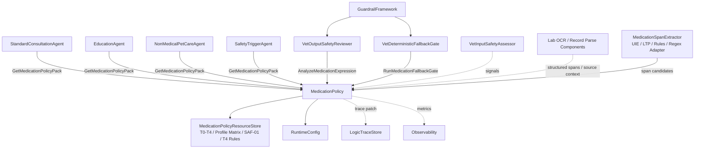
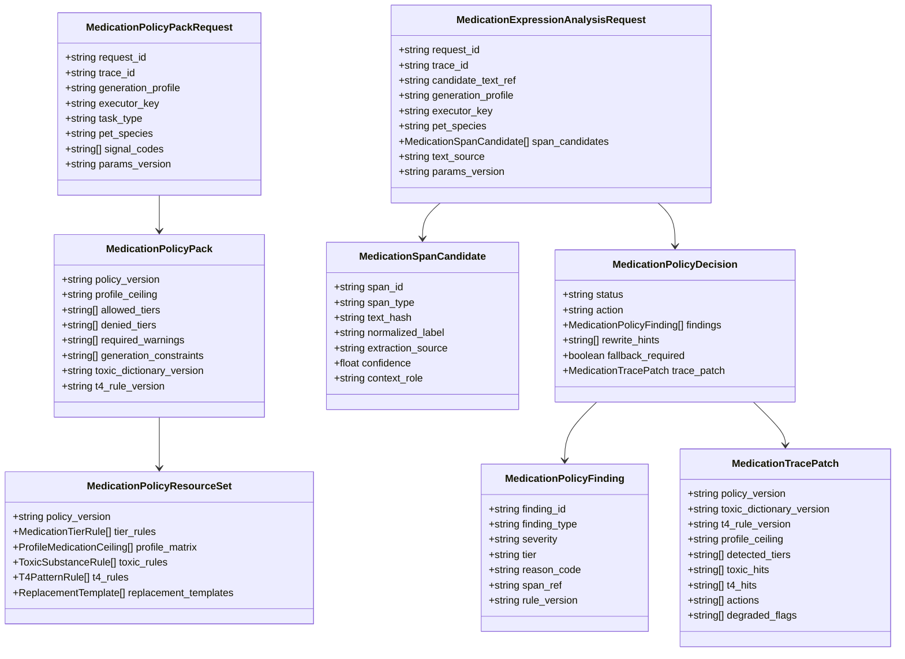
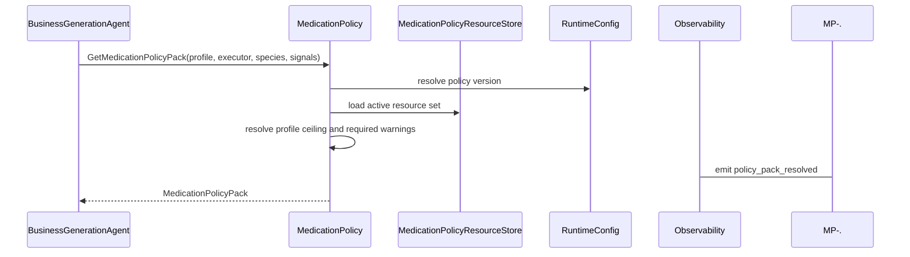
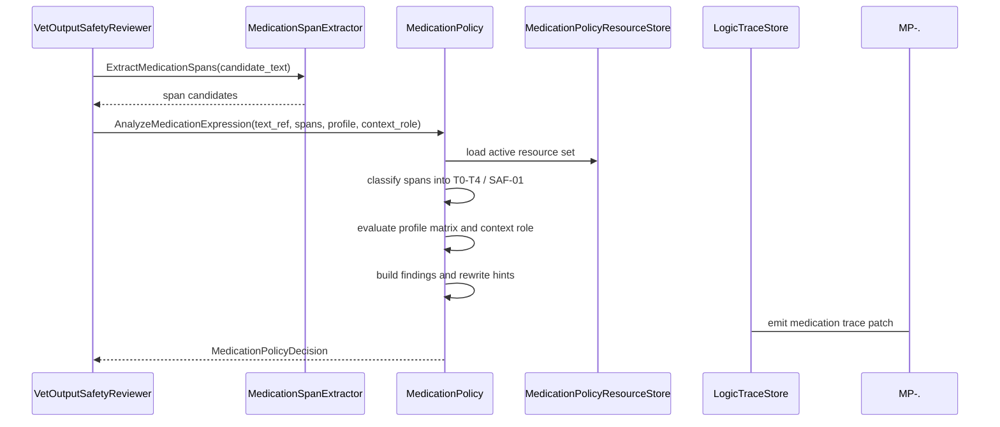
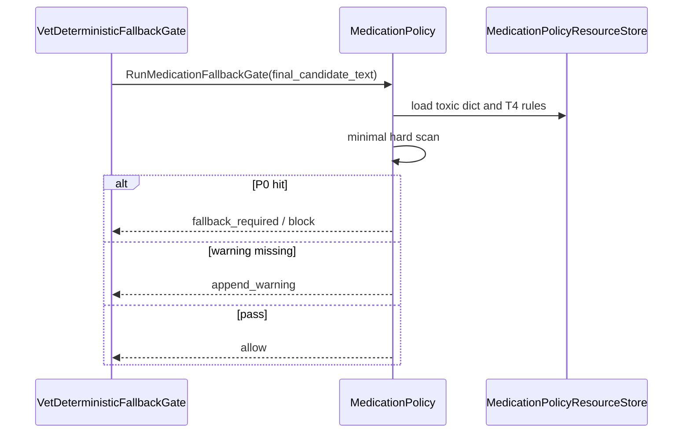
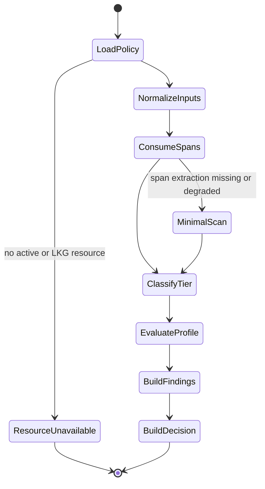

# 用药策略组件设计文档 / MedicationPolicy

## 3.1 基础元数据 (Metadata)

* **组件标识：** 用药策略组件 / `MedicationPolicy`
* **责任人 (Owner)：** 待定
* **代码仓库：** 当前仓库，正式 Git Repository URL 待补充
* **关联需求：**
  * [`docs/component_catalog.md`](../../../component_catalog.md) §6.10 用药策略组件
  * [`docs/prd.md`](../../../prd.md) §6.1、§6.7、§6.10、§7.1、§7.2、§7.3、§7.4、§7.5、§7.6、§9.1、§9.4.3、§10
  * [`docs/design_spec.md`](../../../design_spec.md)
  * [`docs/components/l2-vet-business/standard-consultation-agent/design.md`](../standard-consultation-agent/design.md)
  * [`docs/components/l2-vet-business/education-agent/design.md`](../education-agent/design.md)
  * [`docs/components/l2-vet-business/nonmedical-pet-care-agent/design.md`](../nonmedical-pet-care-agent/design.md)
  * [`docs/components/l2-vet-business/safety-trigger-agent/design.md`](../safety-trigger-agent/design.md)
  * [`docs/components/l2-vet-business/vet-input-safety-assessor/design.md`](../vet-input-safety-assessor/design.md)
  * [`docs/components/l1-ai-runtime/guardrail-framework/design.md`](../../l1-ai-runtime/guardrail-framework/design.md)
  * [`docs/components/l1-ai-runtime/logic-trace-store/design.md`](../../l1-ai-runtime/logic-trace-store/design.md)
* **架构层级：** L2 兽医业务组件 / 用药安全策略层
* **文档状态：** 草案

## 3.2 职责边界 (Responsibility Boundaries)

* **核心能力 (Capabilities)：**
* 维护兽医 Agent 全链路共享的用药表达策略真源，包括 T0-T4 表述阶梯、剖面允许矩阵、SAF-01 毒物 / 人药 / 高危食物名单、T4 精确计量硬规则和替代表述策略。
* 为 `StandardConsultationAgent`、`EducationAgent`、`NonMedicalPetCareAgent`、`SafetyTriggerAgent` 等生成组件提供生成前 `MedicationPolicyPack`，限制当前剖面允许的用药表达上限。
* 消费上游 Span 抽取中间件、输入安全评估、OCR / 病历结构化和输出审查 Agent 提供的结构化候选 span，执行用药表达层级分类和剖面合规判定。
* 对明显 SAF-01 与 T4 表达执行小而硬的确定性兜底扫描，作为发布前 P0 安全门的策略来源。
* 区分药物名称、毒物名称、剂量、频次、疗程、给药动作、历史记录、用户引用、安全警告和免责 / 遵医嘱提示等用药相关语义片段。
* 根据 `generation_profile`、`executor_key`、文本来源、当前宠物物种和上游信号，输出 `allow`、`rewrite_required`、`block`、`fallback_required`、`append_disclaimer` 等策略动作建议。
* 为 `VetOutputSafetyReviewer` 提供 T4 裁剪依据、SAF-01 风险依据、药物边界判断和安全替代表述提示。
* 为 `VetDeterministicFallbackGate` 提供最小 P0 硬拦规则，包括毒物建议、精确计量、给药频次、单次片数 / 毫升数、可执行疗程和缺失必要用药提醒。
* 支持 OCR / 病历场景下区分“历史处方记录 / 用户引用 / 助手当前建议 / 安全警告”，避免将既往处方剂量转化为新的用药方案。
* 输出用药策略 trace patch，记录策略版本、词表版本、span 命中、层级分类、剖面违规、动作建议和降级状态。
* 优先复用 Span 抽取中间件、Aho-Corasick / DFA、正则 / 有限状态机和已有护栏框架；自研层仅负责兽医用药边界策略、版本化资源和动作裁决。

* **非目标 (Non-Goals)：**
* 不实现 JWT、OAuth、登录态解析或用户身份认证。当前阶段 Agent 服务仅在局域网访问，身份上下文由上游可信传入。
* 不校验、创建或改写 session 与 `pet_id` 的绑定关系；一 session 一宠策略由 `PetSessionPolicy` 负责。
* 不判断用户意图、任务类型、`route`、`generation_profile` 或实际执行器；这些由 `VetInputSafetyAssessor` 负责。
* 不生成对外回复，不提供药物问答，不输出用药建议，不替代任何业务生成 Agent。
* 不执行多 Agent 多轮审查；低置信语义复核由 `VetOutputSafetyReviewer` 或后续安全审查链路承担。
* 不替代 `VetOutputSafetyReviewer` 的语义审查，也不替代 `VetDeterministicFallbackGate` 的发布前最终执行门；本组件提供策略和判定结果。
* 不维护完整药物知识库、药物手册、商品名全量别名库、剂型库、药代药效数据库或药物相互作用数据库。
* 不承担大范围文本归一、错别字纠正、拼音识别、复杂口语推断或全量药名标准化；这些由 Span 抽取 / NLP 中间件或后续药物知识服务承担。
* 不调用 RAG，不决定药物知识来源引用，不管理知识库索引、文档切片、embedding 或 rerank。
* 不执行 OCR、病历结构化、检验参考区间匹配或异常标注；仅消费其结构化结果和文本来源标记。
* 不写入宠物级 / 主人级长期记忆，不刷新 `CoreFactSnapshot`，不保存完整 A/B/C 业务逻辑链。
* 不以规则穷举所有危险表达；复杂语义、规避表达和灰区由输出安全审查 Agent 结合本组件结果处理。

## 3.3 架构与交互设计 (Architecture & Interaction)

* **上下文视图 (Context Diagram)：**

`MedicationPolicy` 是 FastAPI 应用内的 L2 兽医业务策略组件，通常被生成节点、输出审查节点和确定性兜底门以内部 service 方式调用。组件不作为独立 Agent 参与多轮协作，也不自行调用 LLM。其核心价值是提供统一、版本化、可回放的用药边界判定。

Span 抽取采用可插拔中间件模式：MVP 可由词典 / Aho-Corasick、正则 / 有限状态机和 UIE-Nano 类信息抽取能力组合实现；LTP 可作为中文分词、NER、依存关系和语义角色辅助能力；LLM 语义复核不属于本组件主路径。

* **核心领域模型 (Domain Model)：**

模型说明：

* `MedicationPolicyPackRequest` 用于生成前策略解析。它不携带完整用户文本，仅携带剖面、执行器、物种、信号和参数版本。
* `MedicationPolicyPack` 是生成 Agent 可消费的用药边界摘要，不包含全量规则表。
* `MedicationPolicyResourceSet` 表示版本化策略资源集合；完整资源内容、维护流程和发布审批不在本文档展开。
* `MedicationSpanCandidate` 由 Span 抽取中间件、OCR / 病历结构化组件、输出审查 Agent 或最小兜底扫描产生。
* `context_role` 用于区分助手当前建议、历史记录、用户引用、药品说明、安全警告和免责声明等上下文角色。
* `MedicationPolicyDecision` 是本组件对一段候选文本或一组 span 的策略判断结果；最终改写、fallback 模板拼接和发布阻断由后续护栏节点执行。
* 完整 DTO、字段约束、错误码、枚举取值和正式示例由代码内 Pydantic 模型或 API 治理平台维护；本文仅定义组件级领域模型。

## 3.4 契约与依赖 (Contracts & Dependencies)

* **入向契约 (Inbound APIs)：**
* 获取生成前用药策略包：`GetMedicationPolicyPack` -> API 治理平台链接待建立
* 分析用药表达：`AnalyzeMedicationExpression` -> API 治理平台链接待建立
* 获取用药违规改写提示：`BuildMedicationRewriteHints` -> API 治理平台链接待建立
* 执行用药确定性兜底检查：`RunMedicationFallbackGate` -> API 治理平台链接待建立
* 校验用药策略资源版本：`ValidateMedicationPolicyResourceSet` -> API 治理平台链接待建立

接口原则：

* 当前契约优先作为 FastAPI 应用内 service 接口和 LangGraph / Guardrail handler 依赖使用；若后续服务化，再登记 HTTP / RPC 接口。
* 所有请求必须携带 `request_id`、`trace_id`、`params_version`，并记录生效的 `policy_version`。
* 生成前策略包请求必须声明 `generation_profile` 或 `executor_key`；本组件不得自行推断业务剖面。
* 文本分析请求应优先携带上游 `MedicationSpanCandidate[]`；缺失时仅允许启用最小确定性扫描并标记 `span_extraction_degraded=true`。
* 本组件只对已识别或明显可识别的用药表达执行策略判定，不承担开放域全语义理解。
* SAF-01 毒物建议与 T4 精确计量命中时必须返回 P0 级发现项和阻断 / fallback 建议。
* T2 药名和 T3 原则性使用建议不得因出现药名本身被误判为违规；违规判断需结合剖面矩阵、上下文角色和是否含 T4 / 毒物建议。
* `historical_record`、`user_quote`、`safety_warning` 等上下文角色不得被直接等同于助手当前用药建议；但若草稿将历史剂量转化为当前建议，必须判定为违规。
* 本组件返回的 rewrite hints 仅作为审查 Agent 或兜底门改写依据，不直接生成最终用户回复。
* 策略资源、词表和硬规则不可通过运行时配置放宽 SAF P0 约束。

核心枚举：

* `MedicationExpressionTier`：
  * `T0_CARE_OBSERVATION`
  * `T1_DRUG_CLASS_DIRECTION`
  * `T2_DRUG_NAME`
  * `T3_USAGE_PRINCIPLE`
  * `T4_PRECISE_REGIMEN`
* `MedicationSpanType`：
  * `MEDICATION_NAME`
  * `TOXIC_SUBSTANCE`
  * `DOSAGE`
  * `FREQUENCY`
  * `DURATION`
  * `ROUTE`
  * `ADMINISTRATION_ACTION`
  * `DISCLAIMER`
  * `HISTORICAL_RECORD`
  * `USER_QUOTE`
  * `SAFETY_WARNING`
* `MedicationContextRole`：
  * `ASSISTANT_RECOMMENDATION`
  * `HISTORICAL_RECORD`
  * `USER_QUOTE`
  * `PRODUCT_LABEL_OR_INSTRUCTION`
  * `SAFETY_WARNING`
  * `DISCLAIMER`
  * `UNKNOWN`
* `MedicationPolicyAction`：
  * `ALLOW`
  * `APPEND_WARNING`
  * `REWRITE_REQUIRED`
  * `BLOCK`
  * `FALLBACK_REQUIRED`
* `MedicationFindingType`：
  * `TOXIC_SUBSTANCE_RECOMMENDED`
  * `T4_DOSAGE_DETECTED`
  * `T4_FREQUENCY_DETECTED`
  * `T4_DURATION_DETECTED`
  * `PROFILE_CEILING_EXCEEDED`
  * `MISSING_MEDICATION_WARNING`
  * `HISTORICAL_DOSE_REUSED_AS_ADVICE`
  * `SPAN_EXTRACTION_DEGRADED`

异常映射原则：

* 策略资源不可用映射为 `MED_POLICY_RESOURCE_UNAVAILABLE`；无 last-known-good 版本时服务不可就绪。
* SAF-01 黑名单不可用映射为 `MED_POLICY_TOXIC_DICT_UNAVAILABLE`；该错误阻断上线与发布前兜底。
* T4 规则不可用映射为 `MED_POLICY_T4_RULE_UNAVAILABLE`；该错误阻断上线与发布前兜底。
* 剖面矩阵不可用映射为 `MED_POLICY_PROFILE_MATRIX_UNAVAILABLE`。
* Span 抽取结果缺失映射为 `MED_POLICY_SPAN_EXTRACTION_MISSING`，触发最小兜底扫描与降级标记。
* Span 抽取结果 schema 非法映射为 `MED_POLICY_SPAN_SCHEMA_INVALID`。
* 文本引用不可读映射为 `MED_POLICY_TEXT_REF_UNAVAILABLE`。
* 策略判定无法产生结论映射为 `MED_POLICY_DECISION_INCONCLUSIVE`，由调用方按 fail-safe 策略处理。
* trace patch 生成失败映射为 `MED_POLICY_TRACE_PATCH_FAILED`。

* **出向依赖 (Outbound Dependencies)：**
* **强依赖：**
* `MedicationPolicyResourceStore`：提供 T0-T4 阶梯、剖面矩阵、SAF-01 黑名单、T4 规则和替代表述的 last-known-good 版本。不可用时核心策略无法运行。
* `RuntimeConfig`：提供策略版本选择、兜底模式、资源加载策略、超时和参数版本。不可用时服务不可就绪。
* `Observability`：记录策略包解析、文本分析、兜底扫描、命中、降级和错误指标。不可用不应阻断单次判定，但需产生降级日志。

* **弱依赖：**
* `MedicationSpanExtractor`：提供药名、毒物、剂量、频次、疗程、动作、历史记录和警告等 span 候选。可由 UIE-Nano / LTP / 词典 / 规则 / 正则适配组合实现；不可用时启用最小确定性扫描并标记降级。
* `VetOutputSafetyReviewer`：消费本组件判定结果并执行语义审查、裁剪和改写。本组件不直接调用 reviewer。
* `VetDeterministicFallbackGate`：消费本组件硬规则结果并执行发布前阻断或安全模板替换。本组件不直接发布 fallback 文本。
* OCR / 病历结构化组件：提供历史处方、用户上传资料和文本来源标记。不可用时本组件仅按普通文本和上游 span 处理。
* `LogicTraceStore`：保存用药策略 trace patch。短暂不可用时需向上游暴露 trace 降级状态。
* API 治理平台：维护完整接口字段、示例和版本。缺失时不阻塞应用内契约实现，但阻塞正式契约冻结。

## 3.5 核心流转机制 (Core Flow Mechanism)

* **状态流转/时序图：**

生成前策略包解析：

生成后用药表达分析：

发布前确定性兜底：

内部判定状态：

执行约束：

* 本组件不执行多轮 MAS 审查，也不自行调用 LLM；复杂语义复核属于输出安全审查链路。
* 复杂文本归一、药名别名、错别字、拼音、口语推断等能力由 Span 抽取中间件或药物知识服务承担。
* 本组件只保留最小、确定性的轻量归一和 P0 硬扫描能力，用于防止简单格式差异绕过兜底门。
* SAF-01 黑名单和 T4 硬规则不可被运行时配置关闭或放宽。
* T2 / T3 合规表达不得因药名出现被错误拦截；策略判定必须区分警告语境、历史记录语境与助手当前建议语境。
* 本组件输出的策略动作必须由上游审查 Agent、兜底门或回复合成链路执行；组件自身不发布、不改写持久化正文。

## 3.6 稳定性与可观测性 (Reliability & Observability)

* **流量控制：**
* 当前组件不直接暴露公网接口，入口调用由生成 Agent、输出审查节点和确定性兜底门以内联 service 方式触发。
* 策略资源加载应使用进程内只读快照和 last-known-good 版本，避免每次请求访问外部存储。
* Span 抽取中间件必须配置独立超时和降级路径；超时后启用最小确定性扫描，不得静默放行。
* 发布前兜底门调用本组件时必须 fail-closed：资源缺失或结论不确定时，不得发布含疑似 P0 风险的候选文本。

* **数据一致性：**
* 策略资源必须版本化发布，并在 trace patch 中记录 `policy_version`、`toxic_dictionary_version`、`t4_rule_version` 和剖面矩阵版本。
* 运行期使用的策略资源快照应在单次请求内保持一致，不得在同一 trace 中混用不同策略版本。
* Span 抽取结果、最小扫描结果、策略发现项和动作建议仅作为逻辑链中间态；是否改写正文由审查 / 兜底链路决定。
* OCR / 病历来源中的历史用药剂量不得被本组件写回为当前建议事实；上下文角色必须随 trace patch 保留。
* 本组件不向知识库索引、长期记忆或 `CoreFactSnapshot` 写入任何运行时对话内容。

* **核心指标 (Golden Signals)：**
* `med_policy_pack_latency_ms`：生成前策略包解析延迟。
* `med_policy_analysis_latency_ms`：用药表达分析延迟。
* `med_policy_fallback_gate_latency_ms`：发布前硬扫描延迟。
* `med_policy_resource_load_success_rate`：策略资源加载成功率。
* `med_policy_lkg_used_rate`：last-known-good 资源使用比例。
* `med_policy_span_extraction_degraded_rate`：Span 抽取降级比例。
* `med_policy_toxic_hit_count`：SAF-01 命中次数。
* `med_policy_t4_hit_count`：T4 命中次数。
* `med_policy_profile_violation_count`：剖面允许矩阵违规次数。
* `med_policy_rewrite_required_rate`：需要改写的用药表达比例。
* `med_policy_fallback_required_rate`：触发 fallback 建议比例。
* `med_policy_false_positive_review_rate`：后续人工或回归确认的过拦截比例。
* `med_policy_missed_by_reviewer_count`：后续护栏或红队发现但本组件未命中的用药风险数量。

可观测性要求：

* 每次策略包解析、文本分析和兜底扫描必须向 `Observability` 发送开始、完成、命中、降级和错误事件。
* A/B 级链路中，本组件必须向 `LogicTraceStore` 或上游 trace patch 消费者提供用药策略摘要；trace 写入降级需被显式记录并向上游暴露。
* 监控面板链接待建立。
