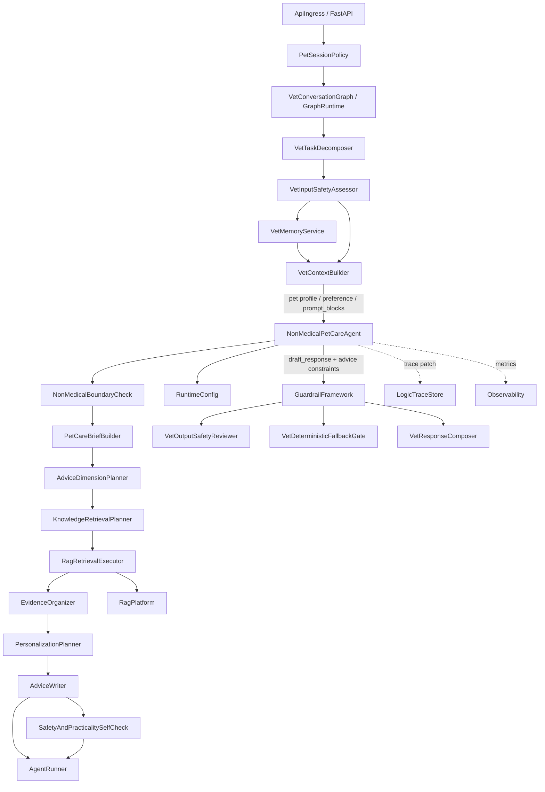
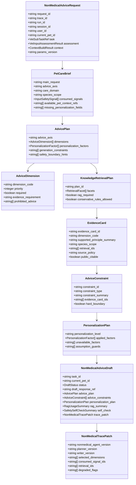
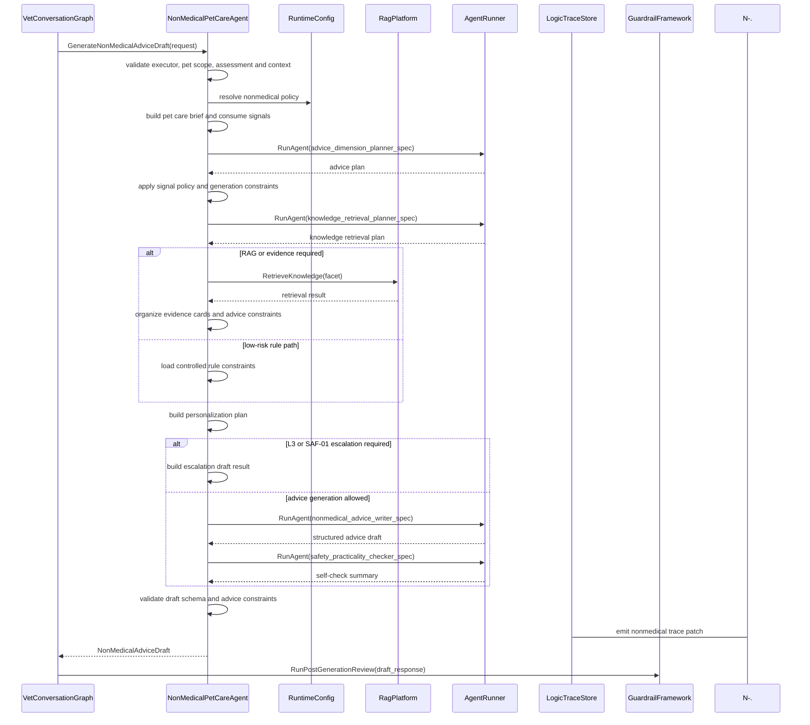
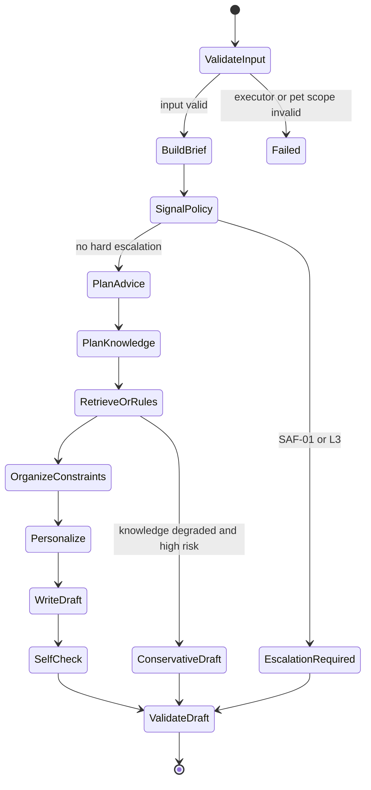

# 非医疗养宠 Agent 组件设计文档 / NonMedicalPetCareAgent

## 3.1 基础元数据 (Metadata)

* **组件标识：** 非医疗养宠 Agent / `NonMedicalPetCareAgent`
* **责任人 (Owner)：** 待定
* **代码仓库：** 当前仓库，正式 Git Repository URL 待补充
* **关联需求：**
  * [`docs/component_catalog.md`](../../../component_catalog.md) §6.9 非医疗养宠 Agent
  * [`docs/prd.md`](../../../prd.md) §5.1、§5.2.6、§5.3、§5.4、§6.3、§6.4、§6.6、§7.5、§7.6、§8.4、§9.2.1、§9.7、§10
  * [`docs/design_spec.md`](../../../design_spec.md)
  * [`docs/temporary-rag.md`](../../../temporary-rag.md)
  * [`docs/components/l2-vet-business/pet-session-policy/design.md`](../pet-session-policy/design.md)
  * [`docs/components/l2-vet-business/vet-input-safety-assessor/design.md`](../vet-input-safety-assessor/design.md)
  * [`docs/components/l2-vet-business/vet-task-decomposer/design.md`](../vet-task-decomposer/design.md)
  * [`docs/components/l2-vet-business/vet-memory-service/design.md`](../vet-memory-service/design.md)
  * [`docs/components/l2-vet-business/education-agent/design.md`](../education-agent/design.md)
  * [`docs/components/l1-ai-runtime/agent-runner/design.md`](../../l1-ai-runtime/agent-runner/design.md)
  * [`docs/components/l1-ai-runtime/rag-platform/design.md`](../../l1-ai-runtime/rag-platform/design.md)
  * [`docs/components/l1-ai-runtime/guardrail-framework/design.md`](../../l1-ai-runtime/guardrail-framework/design.md)
  * [`docs/components/l1-ai-runtime/logic-trace-store/design.md`](../../l1-ai-runtime/logic-trace-store/design.md)
* **架构层级：** L2 兽医业务组件 / 非医疗养宠建议执行层
* **文档状态：** 草案

## 3.2 职责边界 (Responsibility Boundaries)

* **核心能力 (Capabilities)：**
* 在 `VetInputSafetyAssessor` 已判定当前子任务由 `executor_key=nonmedical_pet_care` 执行后，生成饲养、行为、日常护理、环境管理和体重管理等非医疗养宠建议草稿。
* 作为受控 Advice-RAG 子图，围绕用户当前养宠诉求生成建议主轴、建议维度、知识检索计划、证据约束、个性化计划和可执行建议草稿。
* 基于 `VetContextBuilder` 产出的当前宠物画像、轻量记忆、主人偏好、`prompt_blocks`、压缩审计和当前宠物作用域执行建议生成。
* 使用弱约束规则限制非医疗建议语境下的分析方向、个性化边界、跨域安全提示和生成禁区，通过动态建议维度规划替代具体养宠问题类型穷举。
* 面向目标澄清、适用性判断、步骤方案、渐进节奏、观察指标、风险边界、替代方案、误区提醒和专业介入等建议维度，生成可执行建议计划。
* 根据问题风险级别、输入安全信号、知识可得性和配置策略，调用 `RagPlatform` 或使用受控规则库执行养宠知识接地。
* 将 RAG 或规则证据整理为 `EvidenceCard` 与 `AdviceConstraint`，并结合当前宠物画像生成个性化建议计划。
* 消费 `VetInputSafetyAssessor` 输出的 SAF / 跨域信号，按 L1 / L2 / L3 强度调整建议语气、降级策略和正文观察 / 就医提示。
* 对纯非医疗且无信号任务输出低风险养宠建议；对含 L1 / L2 信号任务输出非医疗建议与正文嵌入式风险边界；对 L3 或 SAF-01 误入任务输出升级请求或高风险降级结果。
* 对草稿执行轻量实用性与安全性自检，标记极端饮食、惩罚式训练、忽略医学信号、药物越界、过度承诺和个性化幻觉等风险。
* 输出 `NonMedicalAdviceDraft`、建议计划、个性化摘要、证据约束摘要、跨域信号消费摘要、自检摘要和 trace patch，供后续安全审查、兜底门、回复合成和逻辑链留痕消费。
* 优先复用 `AgentRunner`、`RagPlatform`、LangGraph / LangChain、结构化输出校验和 trace 组件；自研层仅负责非医疗建议维度、个性化约束、跨域安全处理和生成边界控制。

* **非目标 (Non-Goals)：**
* 不实现 JWT、OAuth、登录态解析或用户身份认证。当前阶段 Agent 服务仅在局域网访问，身份上下文由上游可信传入。
* 不校验、创建或改写 session 与 `pet_id` 的绑定关系；一 session 一宠策略由 `PetSessionPolicy` 负责。
* 不根据自然语言文本进行定宠、切宠、宠物名匹配或跨宠对照。
* 不执行多任务拆解、附件角色判定或任务优先级初判；这些由 `VetTaskDecomposer` 负责。
* 不决定输入侧 SAF 信号、`intent`、`route`、`generation_profile`、实际执行器或压缩策略；这些由 `VetInputSafetyAssessor` 负责。
* 不执行标准问诊、症状分诊、鉴别诊断、处置计划或用药建议生成；这些由 `StandardConsultationAgent` 负责。
* 不执行科普解释型回答，不将非医疗建议降格为纯知识解释；科普剖面由 `EducationAgent` 负责。
* 不执行急症简版生成，不在 `safety_trigger` 剖面输出非医疗建议；急症剖面由 `SafetyTriggerAgent` 负责。
* 不绕过 `VetContextBuilder` 直接读取宠物画像、长期记忆、会话摘要、化验报告或 checkpoint 原始状态。
* 不管理知识库索引、文档切片、embedding、rerank、版权策略或知识源版本；这些由 `RagPlatform` 负责。
* 不执行 OCR、病历结构化、检验参考区间匹配或检验异常标注。
* 不以营养、行为或护理建议替代医学诊断、就医评估、处方药方案或急症处理。
* 不输出药物剂量、频次、片数、疗程或任何处方级用药方案。
* 不执行输出安全审查、T4 删除、毒物建议拦截、免责追加或最终发布前 P0 否决；这些由 `VetOutputSafetyReviewer` 与 `VetDeterministicFallbackGate` 负责。
* 不直接向用户发布草稿、不决定多段回复发布顺序、不标记 segment 已发布；这些由 `VetResponseComposer`、`GraphRuntime` 和发布链路负责。
* 不写入宠物级 / 主人级长期记忆，不刷新 `CoreFactSnapshot`，不执行用户记忆查看、纠正或删除。
* 不保存完整 A/B/C 业务逻辑链；本组件仅输出非医疗建议相关 trace patch，完整落库由 `LogicTraceStore` 与 L2 trace schema 承担。
* 不维护具体养宠问题的穷举分类树；组件仅维护有限建议维度、个性化约束、跨域信号策略和生成禁区。

## 3.3 架构与交互设计 (Architecture & Interaction)

* **上下文视图 (Context Diagram)：**

`NonMedicalPetCareAgent` 是 FastAPI 应用内的 L2 业务 Agent 组件，通常作为 LangGraph 中 `VetContextBuilder` 之后、输出护栏之前的非医疗建议生成节点。组件对外保持单一非医疗建议契约；内部采用弱约束规则驱动的受控 Advice-RAG 子图，不允许写作 Agent 自由调用检索工具，也不允许内部节点绕过中控、护栏或 trace。

本组件的规则驱动边界仅用于限制非医疗语境下的建议维度、个性化字段、跨域安全信号响应和生成禁区。具体用户问法不通过穷举类型树处理；当任务中出现强医疗或急症信号时，组件应输出升级或降级结果，避免将医疗风险包裹为普通养宠建议。

* **核心领域模型 (Domain Model)：**

模型说明：

* `NonMedicalAdviceRequest` 必须消费 `PetSessionPolicy` 确认后的 `current_pet_id`、`VetInputSafetyAssessor` 输出的非医疗执行判决和 `VetContextBuilder` 输出的上下文编译结果。
* `PetCareBrief` 表示本轮养宠建议主轴、可用个性化上下文和已消费的输入安全信号。
* `AdvicePlan` 表示动态建议维度规划，不是具体养宠问题类型分类结果。
* `KnowledgeRetrievalPlan` 表示养宠知识检索或规则接地计划；完整检索 DTO 由 `RagPlatform` 与代码内 Pydantic 模型维护。
* `EvidenceCard` 表示养宠知识依据，`AdviceConstraint` 表示证据对建议的约束、禁区或硬边界。
* `PersonalizationPlan` 表示当前建议可个性化到什么程度；缺失字段不得由模型补写。
* `NonMedicalAdviceDraft` 是本组件唯一对外业务结果；其自然语言正文仍为草稿，必须进入输出安全审查与确定性兜底。
* 完整 DTO、字段约束、错误码、枚举取值和正式示例由代码内 Pydantic 模型或 API 治理平台维护；本文仅定义组件级领域模型。

## 3.4 契约与依赖 (Contracts & Dependencies)

* **入向契约 (Inbound APIs)：**
* 生成非医疗养宠建议草稿：`GenerateNonMedicalAdviceDraft` -> API 治理平台链接待建立
* 规划非医疗建议维度：`PlanNonMedicalAdvice` -> API 治理平台链接待建立
* 构建养宠知识检索计划：`BuildPetCareKnowledgePlan` -> API 治理平台链接待建立
* 校验非医疗建议草稿契约：`ValidateNonMedicalAdviceDraft` -> API 治理平台链接待建立

接口原则：

* 当前契约优先作为 FastAPI 应用内 service 接口和 LangGraph 节点使用；若后续服务化，再登记 HTTP / RPC 接口。
* 入参必须携带 `request_id`、`trace_id`、`run_id`、`session_id`、`user_id`、`current_pet_id`、`task_id` 与 `params_version`。
* 入参中的 `executor_key` 必须为 `nonmedical_pet_care`；否则本组件拒绝执行并返回 executor mismatch 错误。
* 入参必须包含 `VetInputSafetyAssessor` 的 `signals[]`、信号强度、意图判决和审计 tier 下限。
* 入参必须包含 `VetContextBuilder` 产出的当前宠物画像、轻量记忆、主人偏好或等价上下文视图、压缩审计与当前宠物核心事实版本引用。
* `current_pet_id` 必须与上下文编译结果、任务引用和评估结果中的宠物作用域一致；不一致时拒绝运行。
* 纯非医疗且无 SAF 信号任务可输出完整低风险建议；含 L1 / L2 信号任务必须在正文中嵌入观察或就医边界；L3 或 SAF-01 误入任务不得输出普通非医疗建议。
* 建议维度来自受控集合，但允许多维度组合、低置信降级和通用建议兜底；不得通过硬编码问法穷举替代建议维度规划。
* 高风险非医疗问题或含跨域信号任务需要可用知识证据、受控规则或明确降级状态；证据不足时不得输出激进建议。
* 写作 Agent 只能消费 `PetCareBrief`、`AdvicePlan`、`EvidenceCard[]`、`AdviceConstraint[]` 与生成约束；不得直接调用自由检索工具。
* 缺失个性化字段时必须降级为通用原则或提出自然补充问题；不得编造体重、活动量、主粮、生活方式或既往病史。
* 本组件输出的 `draft_response` 不得直接发布；调用方必须继续执行 7.6-C / 7.6-D 对应的输出安全审查与确定性兜底。
* 本组件必须输出可写入逻辑链的 trace patch；trace 写入失败时应向上游暴露降级状态。

核心枚举：

* `CareDomain`：
  * `NUTRITION`
  * `BEHAVIOR`
  * `DAILY_CARE`
  * `ENVIRONMENT`
  * `EXERCISE`
  * `WEIGHT_MANAGEMENT`
  * `GENERAL_PET_CARE`
* `AdviceDimensionCode`：
  * `GOAL_CLARIFICATION`：目标澄清。
  * `APPLICABILITY_CHECK`：适用性判断。
  * `STEPWISE_PLAN`：步骤方案。
  * `GRADUAL_PACE`：渐进节奏。
  * `OBSERVATION_METRICS`：观察指标。
  * `RISK_BOUNDARY`：风险边界。
  * `ALTERNATIVE_OPTIONS`：替代方案。
  * `MISCONCEPTION_WARNING`：误区提醒。
  * `PROFESSIONAL_ESCALATION`：专业介入。
* `PersonalizationLevel`：
  * `FULL`
  * `PARTIAL`
  * `MINIMAL`
  * `UNAVAILABLE`
* `NonMedicalDraftStatus`：
  * `DRAFT_READY`
  * `CONSERVATIVE_WITH_SIGNAL`
  * `NEEDS_SAFETY_ESCALATION`
  * `INSUFFICIENT_CONTEXT`
  * `KNOWLEDGE_DEGRADED_CONSERVATIVE`
  * `SCHEMA_INVALID`
  * `FAILED`

异常映射原则：

* 执行器不匹配映射为 `NONMED_EXECUTOR_MISMATCH`。
* 缺少当前宠物上下文映射为 `NONMED_MISSING_CURRENT_PET_ID`。
* 上下文适配结果缺失映射为 `NONMED_CONTEXT_MISSING`。
* 上下文作用域与当前宠物不一致映射为 `NONMED_PET_CONTEXT_INVALID`。
* 缺少输入安全评估结果映射为 `NONMED_ASSESSMENT_MISSING`。
* SAF-01 或 L3 信号误入映射为 `NONMED_SAFETY_ESCALATION_REQUIRED`。
* 建议维度规划失败映射为 `NONMED_ADVICE_PLAN_FAILED`，触发通用建议保守降级。
* 知识检索计划非法映射为 `NONMED_KNOWLEDGE_PLAN_INVALID`。
* RAG 检索超时或不可用映射为 `NONMED_RAG_DEGRADED`。
* 证据或规则不足映射为 `NONMED_INSUFFICIENT_EVIDENCE`。
* 个性化关键字段缺失映射为 `NONMED_PERSONALIZATION_INSUFFICIENT`，触发个性化降级。
* 内部写作 Agent 超时映射为 `NONMED_WRITER_TIMEOUT`。
* 实用性与安全性自检失败映射为 `NONMED_SELF_CHECK_FAILED`。
* 结构化输出解析或 schema 校验失败映射为 `NONMED_OUTPUT_SCHEMA_INVALID`。
* prompt 或证据包超出上下文预算映射为 `NONMED_TOKEN_BUDGET_EXCEEDED`。

* **出向依赖 (Outbound Dependencies)：**
* **强依赖：**
* `GraphRuntime`：调用本组件并承接护栏、发布与 checkpoint 后续节点。不可用时非医疗链路无法运行。
* `AgentRunner`：执行建议规划、建议写作和安全实用性自检 Agent。不可用时本组件无法产出模型草稿。
* `VetContextBuilder`：提供当前宠物画像、轻量记忆、主人偏好、宠物作用域和压缩审计。不可用时不得执行正常个性化建议生成。
* `RuntimeConfig`：提供非医疗参数、建议维度集合、知识接地策略、子 Agent 版本、超时、重试和参数版本。不可用时服务不可就绪。
* `Observability`：记录非医疗内部节点、知识检索、子 Agent、schema 校验和降级指标。不可用不应阻断单次生成，但需产生降级日志。

* **弱依赖：**
* `RagPlatform`：提供养宠知识、行为学、营养和护理资料检索。不可用时低风险任务可使用受控规则保守生成，高风险或含信号任务必须保守降级。
* 受控规则库：提供极端饮食、惩罚式训练、跨域信号响应、个性化缺字段降级等硬边界。短暂不可用时高风险非医疗建议应降级或失败。
* `LogicTraceStore`：保存非医疗 trace patch、信号消费摘要、证据约束摘要和个性化摘要。短暂不可用时需向上游暴露 trace 降级状态。
* `VetMemoryService`：通过 `VetContextBuilder` 间接提供记忆读集和 `CoreFactSnapshot` 引用。本组件不直接读写记忆。
* `GuardrailFramework`：承接本组件草稿后的输出安全审查与确定性 gate。不可用时不得直接发布草稿。
* `MedicationPolicy`：提供 T0-T4 生成边界和用药表述版本。本组件原则上不生成用药建议，但仍需使用该边界避免越界。
* API 治理平台：维护完整接口字段、示例和版本。缺失时不阻塞应用内契约实现，但阻塞正式契约冻结。

## 3.5 核心流转机制 (Core Flow Mechanism)

* **状态流转/时序图：**

非医疗养宠建议草稿生成流程：

内部状态流转：

Advice-RAG 证据约束机制：

执行约束：

* 本组件不得接收 `safety_trigger` 或 `standard` 任务作为正常输入。
* SAF-01 或 L3 信号误入时不得输出普通非医疗建议，必须输出升级请求或高风险降级结果。
* L1 信号不得仅因其存在取消非医疗回答或强制输出急症模板；草稿须保留非医疗建议并正文嵌入轻量观察 / 就医提示。
* L2 信号下非医疗建议必须保守降级，优先提示排除健康问题，不得输出激进饲养、增肥、训练或护理方案。
* 写作 Agent 不得自由调用检索工具；知识检索计划必须由受控中控生成。
* RAG 与规则证据用于约束非医疗建议，不用于替代当前宠物事实、不用于生成诊断结论、不用于输出处方级方案。
* 个性化建议必须来自 `VetContextBuilder` 提供的当前宠物上下文；缺失字段必须以通用原则或自然补充问题处理。
* 证据缓存可复用只读引用，但知识库版本变化、物种变化、主轴变化、SAF 强信号出现或来源下线时必须失效。
* 非医疗草稿必须进入后续输出安全审查和确定性兜底；本组件的安全实用性自检不具备发布放行权。

## 3.6 稳定性与可观测性 (Reliability & Observability)

* **流量控制：**
* 当前组件不直接暴露公网接口，入口流量由 `ApiIngress` 与 `GraphRuntime` 控制。
* 同一 `session_id` 的并发运行应由 `CheckpointStore` / 图运行锁控制，避免同轮多段状态竞争。
* 内部规划、写作和安全实用性自检 Agent 必须配置独立超时、有限重试和最大 token 预算。
* RAG 检索必须配置 per-facet 超时、top-k 上限、collection 白名单和 rerank 降级策略。
* 受控规则库必须使用版本化加载和 last-known-good 策略；无可用版本时高风险非医疗建议不得正常生成。
* 当 RAG、规则库、写作 Agent 或自检局部不可用时，组件应返回保守建议、证据不足状态或明确降级结果，不得输出无依据的高风险养宠方案。

* **数据一致性：**
* 本组件不直接写长期存储；输出草稿、建议约束、个性化摘要和 trace patch 由上游图节点、护栏链路和 `LogicTraceStore` 消费。
* `current_pet_id`、`task_id`、建议计划、知识证据和 trace patch 必须在一次运行内保持同一 `trace_id` 和 `params_version`。
* RAG 证据缓存采用只读引用语义；缓存命中结果必须保留 collection version、source version、content hash、retrieval purpose 和失效条件摘要。
* `AdviceConstraint` 只绑定证据引用、规则版本和建议边界摘要，不将运行时对话、草稿或终稿写入知识库索引。
* 本组件不得把非医疗建议自动沉淀为宠物临床事实；若后续需要记忆写入，必须由上游 Memory Writer 策略判定。

* **核心指标 (Golden Signals)：**
* `nonmedical_agent_latency_ms`：非医疗组件端到端延迟。
* `nonmedical_planner_latency_ms`：建议规划与知识计划生成延迟。
* `nonmedical_writer_latency_ms`：非医疗建议写作 Agent 延迟。
* `nonmedical_success_rate`：成功产出结构化非医疗建议草稿比例。
* `nonmedical_signal_consumed_rate`：含 L1 / L2 信号任务中信号被正文边界消费的比例。
* `nonmedical_safety_escalation_rate`：SAF-01 或 L3 误入时触发升级比例。
* `nonmedical_personalization_level_distribution`：FULL / PARTIAL / MINIMAL / UNAVAILABLE 分布。
* `nonmedical_rag_invoked_rate`：非医疗建议触发 RAG 的比例。
* `nonmedical_rag_degraded_rate`：RAG 超时、空结果、低相关或来源策略缺失降级比例。
* `nonmedical_rule_fallback_rate`：使用受控规则库保守生成比例。
* `nonmedical_conservative_degrade_rate`：信号、证据不足或依赖降级后保守输出比例。
* `nonmedical_self_check_failed_rate`：安全实用性自检失败比例。
* `nonmedical_schema_invalid_rate`：结构化输出 schema 校验失败比例。
* `nonmedical_extreme_advice_detected_rate`：极端饮食、惩罚式训练、长期禁食等建议被自检或后续护栏拦截的比例。
* `nonmedical_draft_t4_detected_rate`：后续护栏在非医疗草稿中发现 T4 的比例。
* `nonmedical_advice_dimension_distribution`：建议维度使用分布。
* `nonmedical_rag_cache_hit_rate`：非医疗证据缓存命中率。

可观测性要求：

* 每次运行必须向 `Observability` 发送组件开始、信号消费、建议规划、知识检索、个性化计划、写作、自检、schema 校验和降级事件。
* C 级链路必须保留最小生成摘要；B 级及以上链路必须向 `LogicTraceStore` 提供非医疗 trace patch；trace 写入降级需被显式记录并向上游暴露。
* 监控面板链接待建立。
