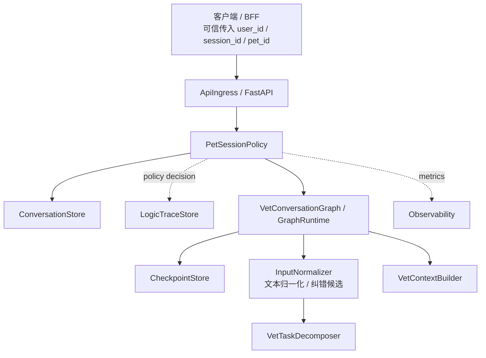
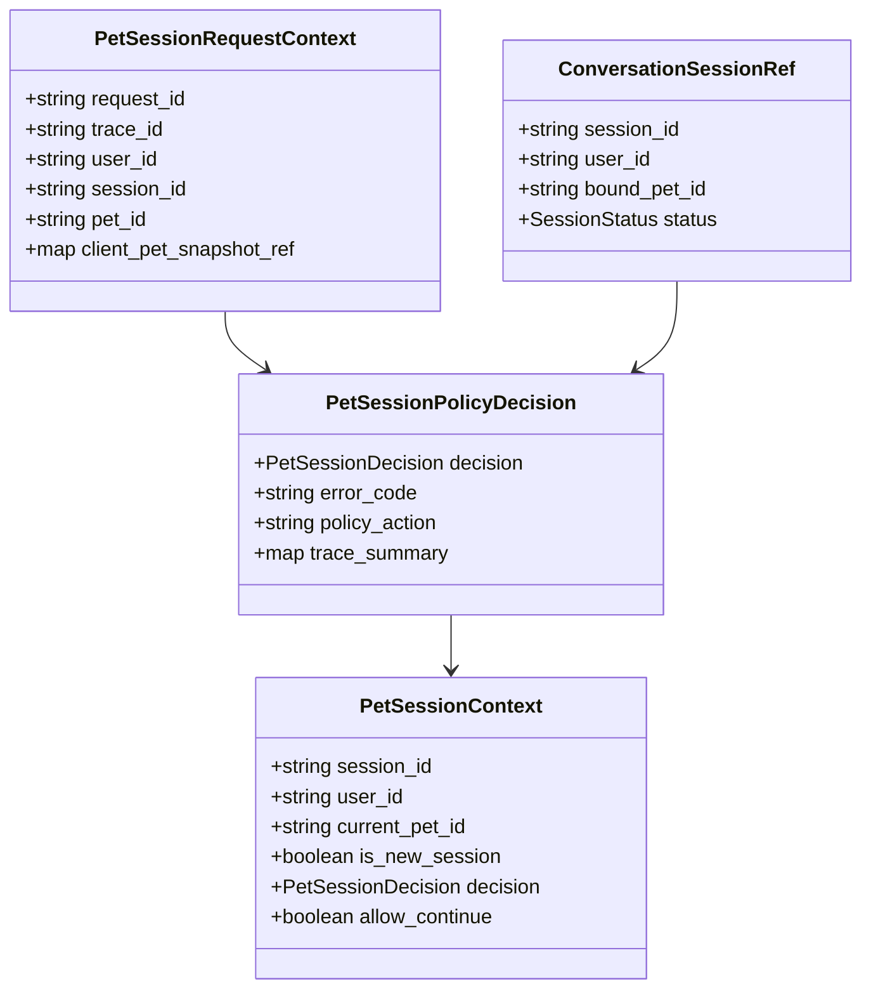
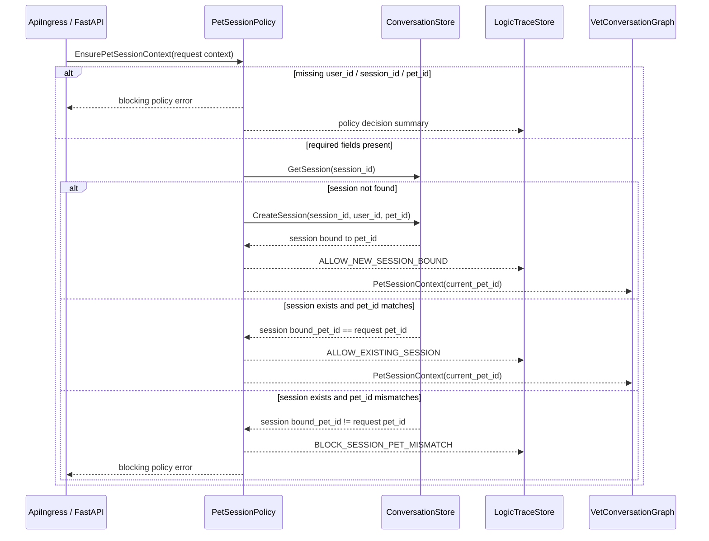
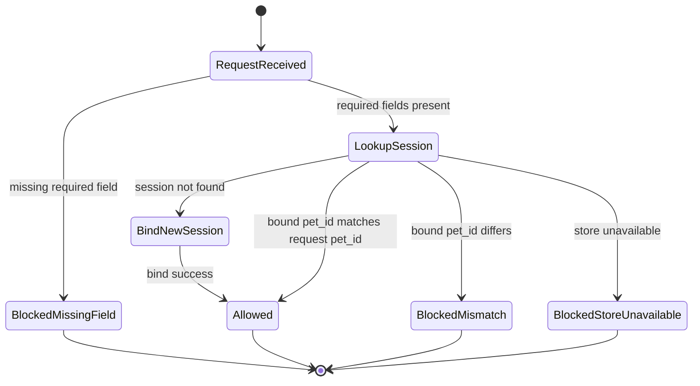

# 宠物会话策略组件设计文档 / PetSessionPolicy

## 3.1 基础元数据 (Metadata)

* **组件标识：** 宠物会话策略组件 / `PetSessionPolicy`
* **责任人 (Owner)：** 待定
* **代码仓库：** 当前仓库，正式 Git Repository URL 待补充
* **关联需求：**
  * [`docs/component_catalog.md`](../../../component_catalog.md) §6.1 宠物会话策略组件
  * [`docs/prd.md`](../../../prd.md) §5.1、§5.2.7、§6.3、§6.4、§7.5、§8.2、§9.3、§9.5
  * [`docs/design_spec.md`](../../../design_spec.md)
* **架构层级：** L2 兽医业务组件 / 会话策略层
* **文档状态：** 草案

## 3.2 职责边界 (Responsibility Boundaries)

* **核心能力 (Capabilities)：**
* 在每轮 Agent 编排开始前校验请求是否具备 `user_id`、`session_id` 与 `pet_id`。
* 为新 session 建立唯一宠物绑定关系，确认该 session 后续只服务请求携带的同一只宠物。
* 为既有 session 校验请求 `pet_id` 与 session 已绑定 `pet_id` 是否一致。
* 对 session 内切宠请求进行阻断，并返回可供客户端新开 session 的业务错误。
* 产出标准 `PetSessionContext`，为后续业务节点提供唯一有效的 `current_pet_id`。
* 在文本归一化、纠错候选、任务拆解、输入安全评估和上下文构建之前确立结构化 `pet_id` 边界。
* 向 `LogicTraceStore` 输出会话策略判定摘要，支持后续逻辑链回放。
* 约束后续 L2 组件不得自行改写 `current_pet_id`，不得绕过该组件直接进入上下文构建。
* 支持请求重试与新 session 首轮并发场景下的幂等绑定。

* **非目标 (Non-Goals)：**
* 不实现 JWT、OAuth、登录态解析或用户身份认证。当前阶段 Agent 服务仅在局域网访问，`user_id`、`session_id`、`pet_id` 由上游客户端 / BFF 可信传入。
* 不校验 `pet_id` 是否属于 `user_id`，该类授权校验由上游 BFF / 数据层在后续阶段承接。
* 不根据自然语言文本进行定宠、切宠或宠物名匹配。
* 不显式判断“文本中是否提及它宠”，用户文本中的宠物名、昵称、错别字或近似称呼不参与本组件策略判定。
* 不调用 `InputNormalizer`、`pycorrector`、MacBERT / BERT 纠错模型或任何文本归一化后端。
* 不处理纠错置信度、候选交互、多候选召回或自动修正策略；这些能力只适用于用户自然语言文本，不适用于结构化 `pet_id`。
* 不将纠错结果用于补齐缺失 `pet_id`、修正请求 `pet_id` 或解释 session 内 `pet_id` 不一致。
* 不处理跨宠比较、联合问诊、主从宠判断或多宠组合推理。
* 不读取宠物画像、宠物级记忆、化验报告、病历或知识库。
* 不决定意图、SAF 信号、`generation_profile`、RAG 是否调用或追问策略。
* 不生成对外回复，不追加“请切换宠物”等自然语言提示；此类表达由后续回复合成组件在明确业务需要时处理。
* 不保存 `slot_progress`、`rolling_summary`、pending tasks 或 LangGraph 节点状态；该类状态由 `CheckpointStore` 负责。
* 不作为聊天消息主存储；session 与消息事实由 `ConversationStore` 维护。
* 不保存完整 A/B/C 业务逻辑链；本组件仅输出策略判定摘要，完整留痕由 `LogicTraceStore` 与 L2 trace schema 承担。

## 3.3 架构与交互设计 (Architecture & Interaction)

* **上下文视图 (Context Diagram)：**

`PetSessionPolicy` 是 FastAPI 应用内的 L2 业务策略组件，通常作为 Agent 请求进入业务图前的第一个策略门。它依赖 `ConversationStore` 读取或创建 session 绑定事实，并将策略判定写入逻辑链摘要。通过该组件后，后续业务图只消费 `current_pet_id`，不再自行执行宠物选择或切宠判断。

若业务图启用文本归一化或纠错候选能力，该能力必须在 `PetSessionPolicy` 之后执行，且只能作用于用户自然语言文本。归一化结果不得覆盖、补齐或修正本组件确认的结构化 `pet_id`。

当前阶段该组件不作为独立网络服务暴露；若后续服务化，应保持相同的应用内契约语义。

* **核心领域模型 (Domain Model)：**

模型说明：

* `PetSessionRequestContext` 表示上游可信传入的本轮请求上下文；其中 `pet_id` 是唯一咨询对象标识。
* `ConversationSessionRef` 是从 `ConversationStore` 读取的 session 绑定事实引用，不在本组件内定义物理表结构。
* `PetSessionContext` 是本组件对后续业务图输出的标准上下文。后续节点应使用 `current_pet_id` 拉取画像、记忆、附件和上下文。
* `PetSessionPolicyDecision` 是策略判定结果，用于流程控制、错误映射和逻辑链留痕。
* 完整 DTO、字段约束与物理存储结构应由代码内 Pydantic 模型、迁移脚本或 API 治理平台维护；本文仅定义组件级领域模型。

## 3.4 契约与依赖 (Contracts & Dependencies)

* **入向契约 (Inbound APIs)：**
* 校验并建立宠物会话上下文：`EnsurePetSessionContext` -> API 治理平台链接待建立
* 查询 session 当前宠物绑定：`GetBoundPetForSession` -> API 治理平台链接待建立
* 生成阻断型策略错误：`BuildPetSessionPolicyError` -> API 治理平台链接待建立

接口原则：

* 当前契约优先作为 FastAPI 应用内 service 接口使用；外部 REST 包装由 `ApiIngress` 定义。
* 所有进入 Agent 业务图的请求必须先通过 `EnsurePetSessionContext`。
* 入参必须携带 `user_id`、`session_id`、`pet_id`、`request_id` 与 `trace_id`。
* `pet_id` 来源仅为请求显式字段，不从用户文本、宠物名、历史消息或记忆中推断。
* `pet_id` 是结构化保护字段，不适用文本纠错阈值、候选推荐或多候选召回策略。
* 文本归一化结果不得用于修复 `BLOCK_MISSING_PET_ID`、`BLOCK_SESSION_PET_MISMATCH` 或其他会话策略错误。
* 新 session 首轮允许创建绑定；既有 session 只允许使用已绑定的同一 `pet_id`。
* 返回成功时必须产出 `PetSessionContext`，并将 `current_pet_id` 写入 graph state。
* 返回阻断时不得启动后续问诊、RAG、OCR、记忆读取或生成节点。
* 策略判定摘要必须可写入逻辑链；写入失败时应向上游暴露降级状态。

策略判定枚举：

* `ALLOW_NEW_SESSION_BOUND`：新 session 已绑定请求 `pet_id`，允许继续。
* `ALLOW_EXISTING_SESSION`：既有 session 的绑定 `pet_id` 与请求一致，允许继续。
* `BLOCK_MISSING_USER_ID`：缺少 `user_id`，阻断。
* `BLOCK_MISSING_SESSION_ID`：缺少 `session_id`，阻断。
* `BLOCK_MISSING_PET_ID`：缺少 `pet_id`，阻断。
* `BLOCK_SESSION_PET_MISMATCH`：既有 session 绑定宠物与请求 `pet_id` 不一致，阻断。
* `BLOCK_SESSION_CLOSED`：session 已关闭或不可继续对话，阻断。
* `BLOCK_STORE_UNAVAILABLE`：无法确认 session 绑定事实，阻断。

异常映射原则：

* 缺少必要请求字段映射为 `PET_SESSION_REQUIRED_FIELD_MISSING`。
* 既有 session 内切宠映射为 `PET_SESSION_PET_MISMATCH`。
* session 已关闭映射为 `PET_SESSION_CLOSED`。
* session 绑定创建并发冲突映射为 `PET_SESSION_BIND_CONFLICT`。
* session 读取或写入不可用映射为 `PET_SESSION_STORE_UNAVAILABLE`。
* 逻辑链摘要写入失败映射为 `PET_SESSION_TRACE_DEGRADED`，是否阻断由上层发布策略决定。

* **出向依赖 (Outbound Dependencies)：**
* **强依赖：**
* `ConversationStore`：读取、创建和确认 session 与 `pet_id` 的绑定事实。不可用时，本组件无法确认一 session 一宠约束，必须阻断后续业务图。
* `RuntimeConfig`：提供错误映射策略、幂等窗口、策略开关和参数版本。不可用时服务不可就绪。
* `Observability`：记录策略执行耗时、允许 / 阻断计数、mismatch 与存储错误。不可用不应阻断核心策略，但需产生降级日志。

* **弱依赖：**
* `LogicTraceStore`：保存策略判定摘要。短暂不可用时可由上游记录降级事件；A/B 级业务链路应避免静默丢失关键策略结果。
* `CheckpointStore`：后续图运行保存 `current_pet_id` 与业务状态。本组件不依赖 checkpoint 完成策略判定。
* `ApiIngress`：将阻断型策略错误转换为统一 HTTP 错误响应或流式错误事件。
* API 治理平台：维护正式接口字段、错误码描述和示例。缺失时不阻塞应用内契约实现，但阻塞正式契约冻结。

## 3.5 核心流转机制 (Core Flow Mechanism)

* **状态流转/时序图：**

核心流程约束：

* `pet_id` 缺失时不得继续执行业务图。
* 新 session 绑定必须具备幂等性；相同 `session_id` 与相同 `pet_id` 的重试应返回既有绑定。
* 同一 `session_id` 被并发请求以不同 `pet_id` 初始化时，只允许一个绑定成功；其他请求按冲突或 mismatch 阻断。
* 既有 session 内 `pet_id` 不一致时不得自动切换、自动新开 session 或继续生成回复。
* 用户文本不参与本组件判定；文本中的宠物名、昵称或“另一只”等表述不改变 `current_pet_id`。
* 文本归一化策略中的“自动修正”“候选交互”“多候选召回”均不得作用于 `user_id`、`session_id`、`pet_id` 或 session 绑定事实。
* 成功输出的 `PetSessionContext` 应写入 LangGraph state，供后续节点统一读取。
* 本组件不直接追加用户消息；消息落库由 `ConversationStore` 在上游或后续编排节点中完成，但必须使用本组件确认后的 `current_pet_id`。
* 阻断型错误应在进入多任务拆解、输入安全评估、RAG、OCR 或模型生成前返回。

## 3.6 稳定性与可观测性 (Reliability & Observability)

* **流量控制：**
* 单次策略执行应设置数据库访问超时；超时后返回阻断型会话状态错误。
* 对同一 `session_id` 的首轮绑定应使用存储级唯一约束、锁或等价原子操作，避免并发双绑定。
* 对重复请求使用 `request_id` 或上游幂等键辅助去重；本组件的幂等边界以 `session_id + pet_id` 绑定事实为准。
* 本组件不执行 HTTP 层限流；入口限流由 `ApiIngress` 或部署网关承担。
* 策略判定失败不得降级为“无 session 绑定继续问诊”。

* **数据一致性：**
* `ConversationStore` 中的 session 绑定事实是本组件判定权威来源。
* session 一旦绑定 `pet_id`，普通对话链路不得改写该绑定。
* 允许 checkpoint 冗余保存 `current_pet_id`，但恢复时不得覆盖 `ConversationStore` 中的绑定事实。
* 后续消息、segment、上下文构建、记忆读取和逻辑链记录均应使用本组件产出的 `current_pet_id`。
* 文本归一化、纠错候选或多候选召回结果不得写回 session 绑定事实，也不得覆盖 graph state 中的 `current_pet_id`。
* 阻断型策略错误不应创建用户消息、助手消息、RAG 调用记录或医疗逻辑链正文。
* `LogicTraceStore` 写入失败不得改变策略判定结果；是否允许继续由上层针对业务等级决定。

* **核心指标 (Golden Signals)：**
* `pet_session_policy_total`：策略执行总数，按 decision 分组。
* `pet_session_policy_allowed_total`：允许继续的请求数，按新 session / 既有 session 分组。
* `pet_session_policy_blocked_total`：阻断请求数，按错误码分组。
* `pet_session_missing_pet_id_total`：缺少 `pet_id` 的请求数，目标值为 0。
* `pet_session_mismatch_total`：既有 session 内 `pet_id` 不一致次数。
* `pet_session_new_bind_total`：新 session 绑定次数。
* `pet_session_existing_ok_total`：既有 session 校验通过次数。
* `pet_session_store_unavailable_total`：绑定事实存储不可用次数。
* `pet_session_policy_duration_ms`：策略执行耗时。
* `pet_session_trace_degraded_total`：策略摘要写入逻辑链失败或降级次数。
* 可观测性面板链接：无
