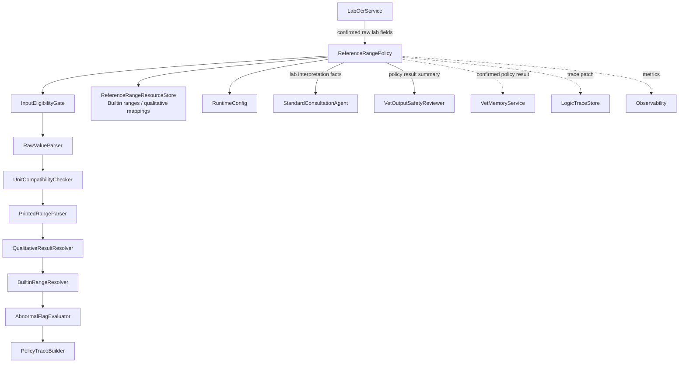
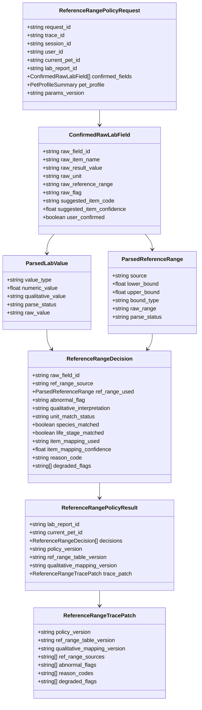
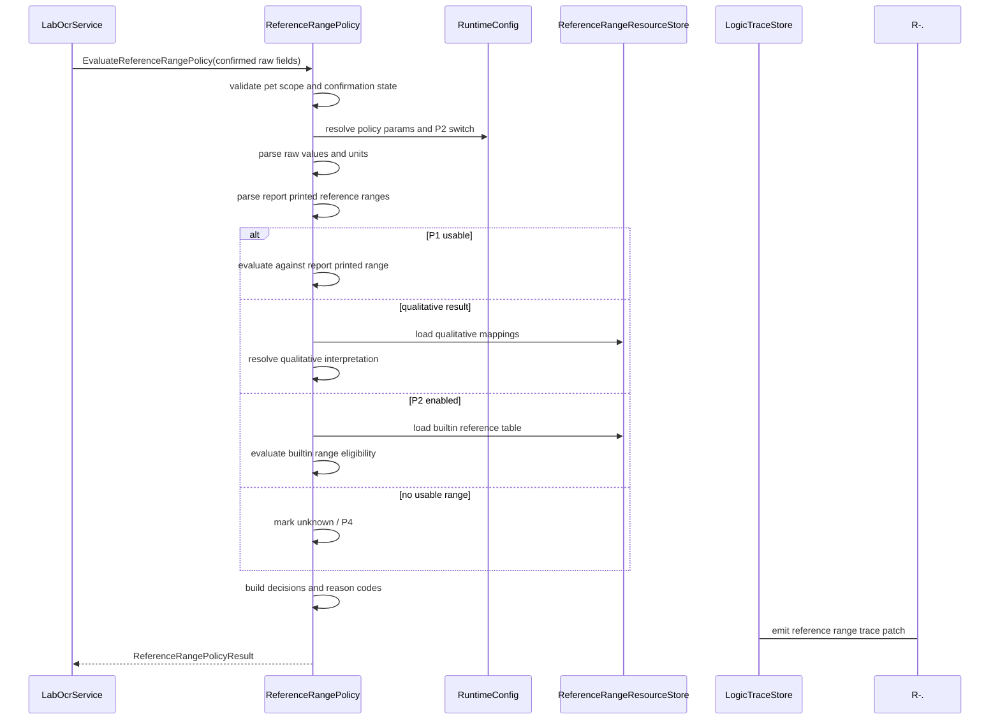
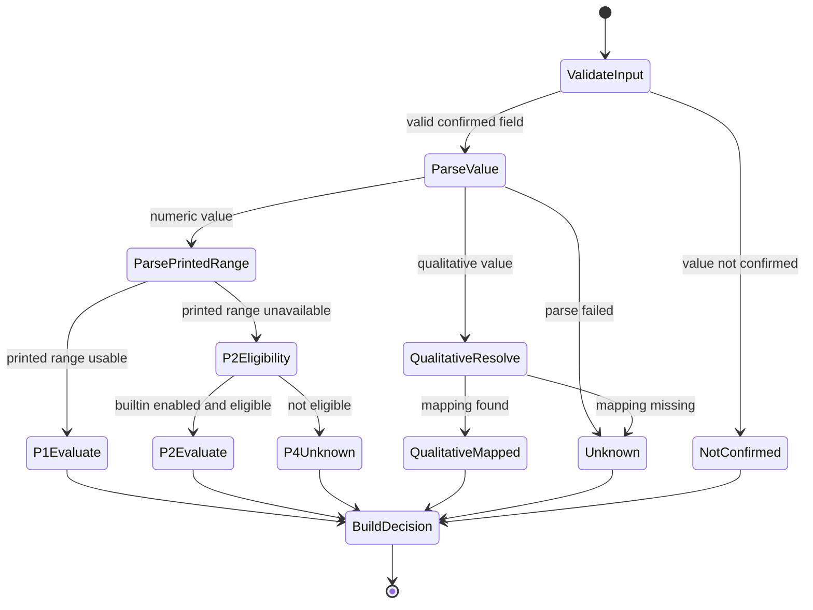
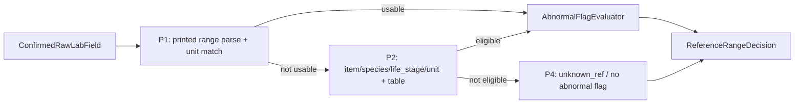

# 参考区间策略组件设计文档 / ReferenceRangePolicy

## 3.1 基础元数据 (Metadata)

* **组件标识：** 参考区间策略组件 / `ReferenceRangePolicy`
* **责任人 (Owner)：** 待定
* **代码仓库：** 当前仓库，正式 Git Repository URL 待补充
* **关联需求：**
  * [`docs/component_catalog.md`](../../../component_catalog.md) §6.13 参考区间策略组件
  * [`docs/prd.md`](../../../prd.md) §6.5、§6.7、§6.7.1、§6.8、§7.5、§7.6-C、§9.8、§10
  * [`docs/design_spec.md`](../../../design_spec.md)
  * [`docs/components/l2-vet-business/lab-ocr-service/design.md`](../lab-ocr-service/design.md)
  * [`docs/components/l2-vet-business/standard-consultation-agent/design.md`](../standard-consultation-agent/design.md)
  * [`docs/components/l2-vet-business/vet-output-safety-reviewer/design.md`](../vet-output-safety-reviewer/design.md)
  * [`docs/components/l2-vet-business/vet-memory-service/design.md`](../vet-memory-service/design.md)
  * [`docs/components/l1-ai-runtime/logic-trace-store/design.md`](../../l1-ai-runtime/logic-trace-store/design.md)
* **架构层级：** L2 兽医业务组件 / 化验参考区间与异常标注策略层
* **文档状态：** 草案

## 3.2 职责边界 (Responsibility Boundaries)

* **核心能力 (Capabilities)：**
* 对用户已确认的原始化验字段执行 P1 / P2 / P4 参考区间策略判定，输出可回放的 `ref_range_source`、`ref_range_used`、`abnormal_flag`、`reason_code` 和 trace patch。
* 优先使用报告印刷参考区间 P1；仅在同一检验项或可信绑定范围内读到参考区间且单位一致时，允许标记偏高 / 偏低。
* 在 P1 不可用且内置参考区间能力启用时，按物种、生命阶段、检验项映射和单位匹配条件尝试 P2；任一条件不满足则降级为 P4。
* 在无法可靠匹配参考区间时输出 P4 / unknown，不标异常，并提供明确 `degraded_reason` 供 LLM 转述局限。
* 对数值型结果执行原始值解析、单位兼容性检查、参考区间格式解析和高低判定。
* 对定性结果执行白名单映射，区分阳性 / 阴性 / 检出 / 未检出 / + 等表达的项目级或类别级含义；无映射时不自动标异常。
* 支持 MVP 阶段仅启用 P1 + P4；P2 内置表、单位换算和高置信检验项映射可作为后续增强。
* 为 `StandardConsultationAgent`、`VetOutputSafetyReviewer`、`VetMemoryService` 和逻辑链留痕提供统一的参考区间策略输出。
* 输出规则版本、内置表版本、定性映射版本、单位匹配状态、物种 / 生命阶段匹配状态、异常标注依据和降级原因。
* 明确禁止 LLM、RAG 或模型常识参与参考区间生成、上下限猜测或异常二次判断；LLM 仅可消费本组件结果进行转述、科普和问诊推理。
* 优先复用规则引擎、版本化配置、单位解析库和结构化字段解析能力；自研层仅负责兽医参考区间策略、P1/P2/P4 裁决和异常标注边界。

* **非目标 (Non-Goals)：**
* 不实现 JWT、OAuth、登录态解析或用户身份认证。当前阶段 Agent 服务仅在局域网访问，身份上下文由上游可信传入。
* 不校验、创建或改写 session 与 `pet_id` 的绑定关系；一 session 一宠策略由 `PetSessionPolicy` 负责。
* 不接收图片、不判断图片质量、不识别是否为化验单、不执行 OCR、表格解析或用户确认；这些由 `LabOcrService` 负责。
* 不强制执行原始检验项到标准 item_code 的映射；MVP 可消费可选 `suggested_item_code`，但不得将低置信映射作为业务真源。
* 不生成疾病诊断、问诊结论、处置建议、用药建议或面向用户的完整回复。
* 不调用 RAG，不读取知识库，不用 RAG 片段作为参考上下限来源。
* 不调用 LLM 判断偏高 / 偏低 / 异常，不允许 LLM 在 `unknown_ref` 场景下自行二次判定异常。
* 不维护完整 OCR 附件、图片 bbox、表格单元格或原始报告文件；仅消费上游传入的字段引用和摘要。
* 不写入宠物级 / 主人级长期记忆，不刷新 `CoreFactSnapshot`；确认字段与策略结果的沉淀由 `VetMemoryService` 或异步链路负责。
* 不保存完整 A/B/C 业务逻辑链；本组件仅输出参考区间相关 trace patch，完整落库由 `LogicTraceStore` 与 L2 trace schema 承担。

## 3.3 架构与交互设计 (Architecture & Interaction)

* **上下文视图 (Context Diagram)：**

`ReferenceRangePolicy` 是 FastAPI 应用内的 L2 兽医业务策略组件，通常在 `LabOcrService` 产生用户确认后的原始化验字段之后执行。组件采用规则引擎和版本化资源完成参考区间来源裁决与异常标注，不作为 Agent，也不调用 LLM。

本组件是化验异常标注的唯一运行时策略真源。下游生成 Agent 可以转述本组件结果，但不得自行补判 `abnormal_flag`，也不得在 `ref_range_source=unknown` 时写出偏高 / 偏低 / 明显异常等结论。

* **核心领域模型 (Domain Model)：**

模型说明：

* `ReferenceRangePolicyRequest` 必须消费当前宠物作用域下的已确认原始化验字段；未确认字段不得进入异常标注主路径。
* `ConfirmedRawLabField` 保留报告原文，`suggested_item_code` 仅作为可选 hint，不替代用户可复核的原始项目名。
* `ParsedLabValue` 区分数值型、边界数值型、定性型和不可解析型结果。
* `ParsedReferenceRange` 表示 P1 或 P2 使用的参考区间；P4 / unknown 场景可为空并记录原因。
* `ReferenceRangeDecision` 是单个化验字段的参考区间策略结果，供下游生成、审查、记忆和留痕消费。
* 完整 DTO、字段约束、错误码、枚举取值和正式示例由代码内 Pydantic 模型或 API 治理平台维护；本文仅定义组件级领域模型。

## 3.4 契约与依赖 (Contracts & Dependencies)

* **入向契约 (Inbound APIs)：**
* 执行参考区间策略判定：`EvaluateReferenceRangePolicy` -> API 治理平台链接待建立
* 执行单项化验字段判定：`EvaluateLabFieldReferenceRange` -> API 治理平台链接待建立
* 查询策略资源版本：`GetReferenceRangePolicyVersion` -> API 治理平台链接待建立
* 校验参考区间策略结果契约：`ValidateReferenceRangePolicyResult` -> API 治理平台链接待建立

接口原则：

* 当前契约优先作为 FastAPI 应用内 service 接口和 LangGraph 节点使用；若后续服务化，再登记 HTTP / RPC 接口。
* 入参必须携带 `request_id`、`trace_id`、`session_id`、`user_id`、`current_pet_id`、`lab_report_id` 与 `params_version`。
* 入参字段必须来自当前 `pet_id` 的已确认化验字段；未确认字段应返回 `value_not_confirmed`，不得标异常。
* P1 报告印刷参考区间优先于 P2；P1 可用时不得被内置表覆盖。
* P2 仅在内置表启用、物种匹配、生命阶段匹配、检验项映射高置信且单位可匹配时使用。
* P4 / unknown 场景必须返回 `abnormal_flag=unknown` 或 `not_applicable`，不得让 LLM 或 RAG 二次判断异常。
* 定性结果仅按版本化白名单映射；无项目级或类别级映射时不得将阳性 / + 自动标为异常。
* 输出必须包含 `reason_code`，解释为何使用 P1 / P2 或为何降级为 P4。
* 策略结果必须可写入逻辑链；trace 写入失败时应向上游暴露降级状态。

核心枚举：

* `ReferenceRangeSource`：
  * `report_printed`
  * `builtin_table`
  * `unknown`
  * `not_applicable`
* `LabValueType`：
  * `numeric`
  * `bounded_numeric`
  * `qualitative`
  * `unparseable`
* `AbnormalFlag`：
  * `high`
  * `low`
  * `unknown`
  * `not_applicable`
* `QualitativeInterpretation`：
  * `positive_detected`
  * `negative_detected`
  * `positive_abnormal`
  * `negative_normal`
  * `needs_vet_review`
  * `unknown`
  * `not_applicable`
* `UnitMatchStatus`：
  * `exact_match`
  * `convertible`
  * `missing`
  * `mismatch`
  * `not_applicable`
* `ReferenceRangeReasonCode`：
  * `report_printed_range_used`
  * `builtin_range_used`
  * `value_not_confirmed`
  * `value_missing`
  * `value_parse_failed`
  * `printed_range_missing`
  * `printed_range_parse_failed`
  * `unit_missing`
  * `unit_mismatch`
  * `item_mapping_missing`
  * `item_mapping_low_confidence`
  * `species_missing`
  * `species_mismatch`
  * `life_stage_missing`
  * `life_stage_mismatch`
  * `builtin_range_missing`
  * `qualitative_mapping_missing`
  * `no_usable_reference_range`

异常映射原则：

* 当前宠物作用域缺失或不一致映射为 `REF_RANGE_PET_SCOPE_INVALID`。
* 确认字段为空映射为 `REF_RANGE_CONFIRMED_FIELDS_EMPTY`。
* 未确认字段映射为 `REF_RANGE_VALUE_NOT_CONFIRMED`，返回 unknown / not_applicable。
* 数值解析失败映射为 `REF_RANGE_VALUE_PARSE_FAILED`。
* 报告印刷参考区间解析失败映射为 `REF_RANGE_PRINTED_PARSE_FAILED`。
* 单位不匹配映射为 `REF_RANGE_UNIT_MISMATCH`。
* P2 资源不可用映射为 `REF_RANGE_BUILTIN_TABLE_UNAVAILABLE`；MVP 可降级 P4。
* 定性映射资源不可用映射为 `REF_RANGE_QUALITATIVE_MAPPING_UNAVAILABLE`；无 last-known-good 版本时定性结果降级 unknown。
* 策略结果 schema 校验失败映射为 `REF_RANGE_OUTPUT_SCHEMA_INVALID`。
* trace patch 生成失败映射为 `REF_RANGE_TRACE_PATCH_FAILED`。

* **出向依赖 (Outbound Dependencies)：**
* **强依赖：**
* `RuntimeConfig`：提供 P2 开关、策略版本、单位匹配策略、定性映射策略和参数版本。不可用时服务不可就绪。
* `Observability`：记录策略判定、降级、错误、P1 / P2 / P4 分布和异常标注指标。不可用不应阻断单次判定，但需产生降级日志。

* **弱依赖：**
* `ReferenceRangeResourceStore`：提供内置参考区间表、定性映射白名单和 last-known-good 资源。MVP 若仅启用 P1 + P4，P2 表不可用不阻断核心判定。
* `LabOcrService`：提供已确认原始化验字段。本组件不依赖其内部 OCR 实现。
* `VetMemoryService`：消费确认字段与策略结果用于后续记忆刷新。本组件不直接写长期记忆。
* `VetOutputSafetyReviewer`：消费策略结果，审查下游草稿是否越过参考区间边界。
* `LogicTraceStore`：保存参考区间策略 trace patch。短暂不可用时需向上游暴露 trace 降级状态。
* API 治理平台：维护完整接口字段、示例和版本。缺失时不阻塞应用内契约实现，但阻塞正式契约冻结。

## 3.5 核心流转机制 (Core Flow Mechanism)

* **状态流转/时序图：**

参考区间策略判定流程：

内部状态流转：

P1 / P2 / P4 裁决：

执行约束：

* 本组件仅处理已确认或明确允许策略判定的结构化字段；未确认字段不得标异常。
* P1 报告印刷参考区间优先；P1 可用时不应使用 P2 覆盖。
* P2 可在 MVP 关闭；关闭或条件不足时必须降级 P4，不得用 LLM 补判。
* 定性阳性 / + 不自动等于异常；必须有版本化白名单映射。
* LLM 和 RAG 可用于后续转述、科普和问诊推理，但不得参与本组件的异常标注决策。
* 下游若看到 `ref_range_source=unknown`，只能转述无法判断偏高 / 偏低，不得自行写异常。

## 3.6 稳定性与可观测性 (Reliability & Observability)

* **流量控制：**
* 当前组件不直接暴露公网接口，入口调用由 `LabOcrService`、图编排节点或应用内 service 触发。
* 单次请求应限制字段数量和单位换算复杂度；超出上限时按字段分批处理或降级。
* 内置表和定性映射资源应使用进程内只读快照和 last-known-good 版本，避免每次请求访问外部存储。
* P2 资源不可用时，MVP 应降级到 P4，而不是阻断 P1 判定。

* **数据一致性：**
* 同一批字段的策略判定必须在同一 `policy_version`、`ref_range_table_version`、`qualitative_mapping_version` 和 `params_version` 下完成。
* 本组件不修改上游原始 OCR 字段，不覆盖用户确认文本，只附加策略判定结果。
* `abnormal_flag`、`ref_range_source`、`reason_code` 与 `trace_patch` 必须保持一致。
* 内置参考区间表更新必须版本化；历史留痕应能回放当时使用的版本。
* 本组件不向知识库索引、长期记忆或 `CoreFactSnapshot` 直接写入任何内容。

* **核心指标 (Golden Signals)：**
* `ref_range_policy_latency_ms`：参考区间策略判定端到端延迟。
* `ref_range_field_count`：单次判定字段数量。
* `ref_range_p1_used_rate`：P1 报告印刷参考区间使用比例。
* `ref_range_p2_used_rate`：P2 内置表使用比例。
* `ref_range_p4_unknown_rate`：P4 / unknown 降级比例。
* `ref_range_value_parse_failed_rate`：数值解析失败比例。
* `ref_range_unit_mismatch_rate`：单位不匹配比例。
* `ref_range_qualitative_unknown_rate`：定性映射缺失比例。
* `ref_range_abnormal_flag_distribution`：high / low / unknown / not_applicable 分布。
* `ref_range_resource_lkg_used_rate`：last-known-good 资源使用比例。
* `ref_range_output_schema_invalid_rate`：策略结果 schema 校验失败比例。

可观测性要求：

* 每次运行必须向 `Observability` 发送组件开始、字段解析、P1 / P2 / P4 裁决、定性映射、降级和错误事件。
* A/B 级链路必须向 `LogicTraceStore` 提供参考区间策略 trace patch；trace 写入降级需被显式记录并向上游暴露。
* 监控面板链接待建立。
