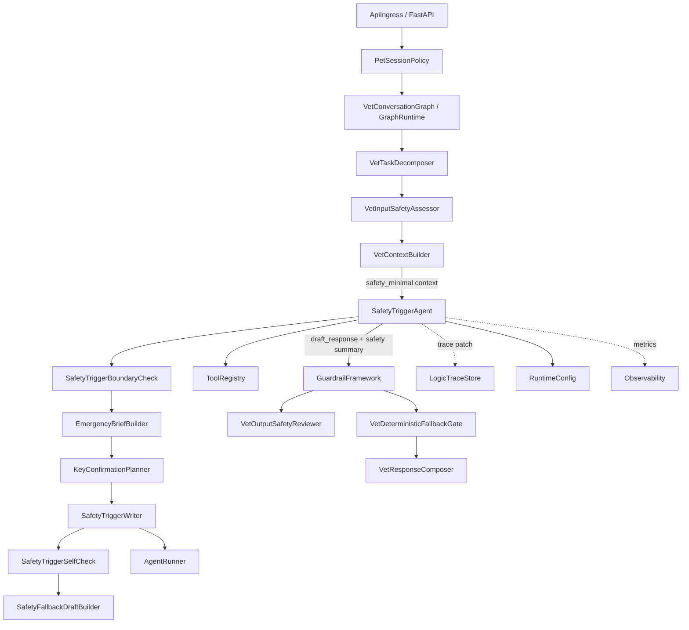
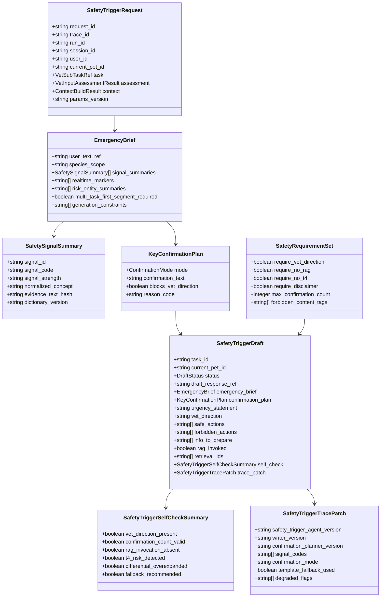
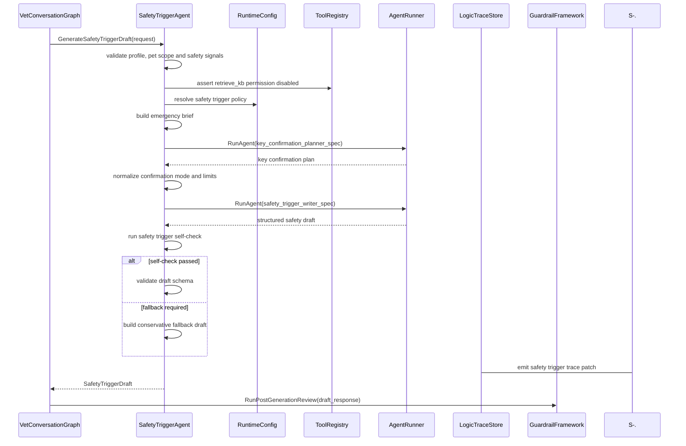
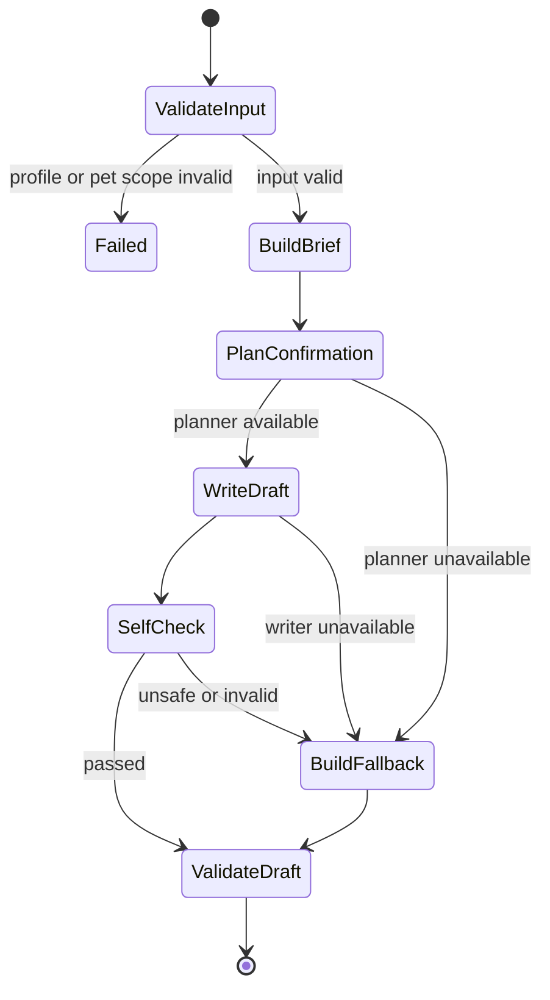
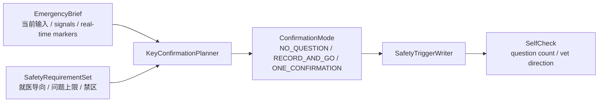

# 急症 Agent 组件设计文档 / SafetyTriggerAgent

## 3.1 基础元数据 (Metadata)

* **组件标识：** 急症 Agent / `SafetyTriggerAgent`
* **责任人 (Owner)：** 待定
* **代码仓库：** 当前仓库，正式 Git Repository URL 待补充
* **关联需求：**
  * [`docs/component_catalog.md`](../../../component_catalog.md) §6.8 急症 Agent
  * [`docs/prd.md`](../../../prd.md) §5.1、§5.2、§5.3、§5.3.1、§5.4、§6.2、§7.1、§7.2、§7.4、§7.5、§7.6、§9.1、§9.2、§9.3、§9.4、§10
  * [`docs/design_spec.md`](../../../design_spec.md)
  * [`docs/components/l2-vet-business/vet-input-safety-assessor/design.md`](../vet-input-safety-assessor/design.md)
  * [`docs/components/l2-vet-business/vet-task-decomposer/design.md`](../vet-task-decomposer/design.md)
  * [`docs/components/l2-vet-business/education-agent/design.md`](../education-agent/design.md)
  * [`docs/components/l2-vet-business/standard-consultation-agent/design.md`](../standard-consultation-agent/design.md)
  * [`docs/components/l1-ai-runtime/agent-runner/design.md`](../../l1-ai-runtime/agent-runner/design.md)
  * [`docs/components/l1-ai-runtime/tool-registry/design.md`](../../l1-ai-runtime/tool-registry/design.md)
  * [`docs/components/l1-ai-runtime/guardrail-framework/design.md`](../../l1-ai-runtime/guardrail-framework/design.md)
  * [`docs/components/l1-ai-runtime/logic-trace-store/design.md`](../../l1-ai-runtime/logic-trace-store/design.md)
* **架构层级：** L2 兽医业务组件 / `safety_trigger` 剖面生成执行层
* **文档状态：** 草案

## 3.2 职责边界 (Responsibility Boundaries)

* **核心能力 (Capabilities)：**
* 在 `VetInputSafetyAssessor` 已判定当前子任务进入 `generation_profile=safety_trigger` 后，生成急症简版草稿。
* 作为 `safety_trigger` 剖面内的轻量受控微子图，围绕最小急症上下文生成就医导向、低风险临时动作、危险动作提醒、信息准备和免责表述。
* 消费输入安全评估中的 SAF-01、SAF-03、`ACUTE_EVENT`、实况标记和信号强度；不重新承担输入侧路由判决。
* 基于 `VetContextBuilder` 产出的 `safety_minimal` 上下文执行急症生成；上下文只包含当前用户输入、当前宠物最小画像、急症信号和必要 P0 事实。
* 通过 `KeyConfirmationPlanner` 决定本轮是否需要 0-1 个关键确认或记录项，并保证确认行为不阻塞就医导向。
* 使用弱约束 LLM 生成急症简版自然语言草稿；不维护过细急症类别模板树，不通过固定行动骨架穷举急症场景。
* 维护最小安全要素约束，包括首段就医导向、急症风险说明、低风险动作、危险动作提醒、给兽医的信息准备、问题数量限制和免责。
* 工程化禁用 RAG：不授予检索工具权限，不接收检索结果作为生成依据，并在输出摘要中固定标记 `rag_invoked=false`。
* 对草稿执行急症自检，标记缺失就医导向、确认问题过多、T4 风险、RAG 违规、完整鉴别诊断、无关长文、SAF-01 未点名风险物等问题。
* 在 LLM 不可用、结构化输出失败、自检失败或高风险字段缺失时，产出保守急症兜底草稿，供后续护栏继续审查。
* 输出 `SafetyTriggerDraft`、关键确认计划、急症信号摘要、RAG 禁用摘要、自检摘要和 trace patch，供后续安全审查、兜底门、回复合成、分段首发和逻辑链留痕消费。
* 优先复用 `AgentRunner`、`ToolRegistry`、`GuardrailFramework`、LangGraph / LangChain、结构化输出校验和 trace 组件；自研层仅负责急症生成边界、关键确认决策、RAG 禁用约束和兜底草稿策略。

* **非目标 (Non-Goals)：**
* 不实现 JWT、OAuth、登录态解析或用户身份认证。当前阶段 Agent 服务仅在局域网访问，身份上下文由上游可信传入。
* 不校验、创建或改写 session 与 `pet_id` 的绑定关系；一 session 一宠策略由 `PetSessionPolicy` 负责。
* 不根据自然语言文本进行定宠、切宠、宠物名匹配或跨宠对照。
* 不执行多任务拆解、附件角色判定或任务优先级初判；这些由 `VetTaskDecomposer` 负责。
* 不决定输入侧 SAF 信号、`intent`、`route`、`generation_profile`、实际执行器或压缩策略；这些由 `VetInputSafetyAssessor` 负责。
* 不执行标准问诊、结构化追问、分诊四层递进、鉴别收敛或处置计划生成；这些由 `StandardConsultationAgent` 负责。
* 不执行科普 RAG 证据编排、解释维度规划或通识回答；这些由 `EducationAgent` 负责。
* 不调用 RAG，不管理知识库索引、文档切片、embedding、rerank、版权策略或知识源版本。
* 不等待 OCR、报告解读、饲养、行为或科普子任务完成后再生成急症段；多任务发布顺序由 `VetResponseComposer` 与发布链路负责。
* 不执行输出安全审查、T4 删除、毒物建议拦截、免责追加或最终发布前 P0 否决；这些由 `VetOutputSafetyReviewer` 与 `VetDeterministicFallbackGate` 负责。
* 不直接向用户发布草稿、不决定 segment 已发布状态；这些由 `VetResponseComposer`、`GraphRuntime` 和发布链路负责。
* 不写入宠物级 / 主人级长期记忆，不刷新 `CoreFactSnapshot`，不执行用户记忆查看、纠正或删除。
* 不保存完整 A/B/C 业务逻辑链；本组件仅输出急症相关 trace patch，完整落库由 `LogicTraceStore` 与 L2 trace schema 承担。
* 不维护细粒度急症类别行动模板库；急症 hint 仅作为信号摘要和生成提示，不作为固定模板分支树。

## 3.3 架构与交互设计 (Architecture & Interaction)

* **上下文视图 (Context Diagram)：**

`SafetyTriggerAgent` 是 FastAPI 应用内的 L2 业务 Agent 组件，通常作为 LangGraph 中 `VetContextBuilder` 之后、输出护栏之前的 `safety_trigger` 生成节点。组件内部采用轻量受控微子图：先构造急症最小 brief，再规划关键确认或记录项，随后生成急症简版草稿，并执行急症自检或保守兜底。

本组件不采用完整 MAS 协作，也不采用急症类别模板树。急症信号类别只作为弱提示参与生成；发布前安全属性由后续 `VetOutputSafetyReviewer` 与 `VetDeterministicFallbackGate` 强制保障。

* **核心领域模型 (Domain Model)：**

模型说明：

* `SafetyTriggerRequest` 必须消费 `PetSessionPolicy` 确认后的 `current_pet_id`、`VetInputSafetyAssessor` 输出的 `safety_trigger` 判决和 `VetContextBuilder` 输出的 `safety_minimal` 上下文。
* `EmergencyBrief` 是本组件生成使用的最小上下文视图；它不包含 RAG 证据、完整长期记忆、OCR 报告全文或跨宠事实。
* `KeyConfirmationPlan` 仅表达急症场景下 0-1 个确认或记录项，不代表标准问诊追问，也不得推动四层问诊状态。
* `SafetyRequirementSet` 表示急症生成硬性安全要求；完整规则与模板版本由代码内配置或安全策略资源维护。
* `SafetyTriggerDraft` 是本组件唯一对外业务结果；其自然语言正文仍为草稿，必须进入输出安全审查与确定性兜底。
* 完整 DTO、字段约束、错误码、枚举取值和正式示例由代码内 Pydantic 模型或 API 治理平台维护；本文仅定义组件级领域模型。

## 3.4 契约与依赖 (Contracts & Dependencies)

* **入向契约 (Inbound APIs)：**
* 生成急症简版草稿：`GenerateSafetyTriggerDraft` -> API 治理平台链接待建立
* 规划急症关键确认：`PlanSafetyKeyConfirmation` -> API 治理平台链接待建立
* 校验急症草稿契约：`ValidateSafetyTriggerDraft` -> API 治理平台链接待建立
* 生成急症兜底草稿：`BuildSafetyFallbackDraft` -> API 治理平台链接待建立

接口原则：

* 当前契约优先作为 FastAPI 应用内 service 接口和 LangGraph 节点使用；若后续服务化，再登记 HTTP / RPC 接口。
* 入参必须携带 `request_id`、`trace_id`、`run_id`、`session_id`、`user_id`、`current_pet_id`、`task_id` 与 `params_version`。
* 入参中的 `generation_profile` 必须为 `safety_trigger`；否则本组件拒绝执行并返回 profile mismatch 错误。
* 入参必须包含 `VetInputSafetyAssessor` 输出的急症 / 毒物 / 实况信号摘要，以及 `VetContextBuilder` 输出的 `safety_minimal` 上下文。
* `current_pet_id` 必须与上下文编译结果、任务引用和评估结果中的宠物作用域一致；不一致时拒绝运行。
* 本组件不得调用 RAG；若入参携带 `retrieval_ids` 或 RAG 证据引用，应标记为剖面违规并返回受控错误或兜底草稿。
* 急症草稿必须包含明确就医 / 联系兽医导向，并优先出现在首段或首句。
* 急症草稿最多包含 0-1 个关键确认或记录项；该确认不得位于就医导向之前，也不得要求用户等待回答后再行动。
* SAF-01 相关草稿必须点名已识别风险物或药物；风险物不可识别时必须表达“疑似对宠物有风险的物质 / 药物”并引导带包装就医。
* 急症草稿不得输出 T4 精确计量、完整鉴别诊断、处方级用药方案、RAG 引用或无关饲养 / OCR 长文。
* 本组件输出的 `draft_response` 不得直接发布；调用方必须继续执行 7.6-C / 7.6-D 对应的输出安全审查与确定性兜底。
* 本组件必须输出可写入逻辑链的 trace patch；trace 写入失败时应向上游暴露降级状态。

核心枚举：

* `ConfirmationMode`：
  * `NO_QUESTION`：不提出确认问题，直接急症就医导向。
  * `RECORD_AND_GO`：建议记录或携带关键信息，不要求用户先回复。
  * `ONE_CONFIRMATION`：提出最多一个关键确认问题，且不阻塞就医。
* `EmergencyHintCode`：
  * `TOXIC_EXPOSURE_HINT`
  * `SEIZURE_HINT`
  * `BREATHING_DISTRESS_HINT`
  * `BLEEDING_OR_TRAUMA_HINT`
  * `COLLAPSE_HINT`
  * `PERSISTENT_GI_HINT`
  * `URINARY_BLOCKAGE_HINT`
  * `UNKNOWN_RED_FLAG_HINT`
* `SafetyTriggerDraftStatus`：
  * `DRAFT_READY`
  * `FALLBACK_READY`
  * `NEEDS_REVIEW`
  * `SCHEMA_INVALID`
  * `FAILED`

异常映射原则：

* 剖面不匹配映射为 `SAFETY_TRIGGER_PROFILE_MISMATCH`。
* 缺少当前宠物上下文映射为 `SAFETY_TRIGGER_MISSING_CURRENT_PET_ID`。
* 上下文适配结果缺失映射为 `SAFETY_TRIGGER_CONTEXT_MISSING`；急症链路可按当前输入与信号摘要降级生成兜底草稿。
* 上下文作用域与当前宠物不一致映射为 `SAFETY_TRIGGER_PET_CONTEXT_INVALID`。
* 缺少急症信号摘要映射为 `SAFETY_TRIGGER_SIGNAL_MISSING`。
* 检出 RAG 证据或 RAG 调用标记映射为 `SAFETY_TRIGGER_RAG_FORBIDDEN`。
* 关键确认规划失败映射为 `SAFETY_TRIGGER_CONFIRMATION_PLAN_FAILED`，触发 `NO_QUESTION` 或 `RECORD_AND_GO` 保守策略。
* 写作 Agent 超时映射为 `SAFETY_TRIGGER_WRITER_TIMEOUT`，触发急症兜底草稿。
* 自检发现缺少就医导向映射为 `SAFETY_TRIGGER_VET_DIRECTION_MISSING`，触发急症兜底草稿。
* 自检发现确认问题数量越界映射为 `SAFETY_TRIGGER_CONFIRMATION_LIMIT_EXCEEDED`，触发裁剪或兜底草稿。
* 自检发现 T4、完整鉴别或危险延误表述映射为 `SAFETY_TRIGGER_DRAFT_UNSAFE`，触发急症兜底草稿。
* 结构化输出解析或 schema 校验失败映射为 `SAFETY_TRIGGER_OUTPUT_SCHEMA_INVALID`。

* **出向依赖 (Outbound Dependencies)：**
* **强依赖：**
* `GraphRuntime`：调用本组件并承接护栏、发布与 checkpoint 后续节点。不可用时急症链路无法运行。
* `VetInputSafetyAssessor`：提供进入 `safety_trigger` 的输入安全评估结果和信号摘要。缺失时本组件不得执行正常生成。
* `RuntimeConfig`：提供急症参数、最小安全要素、Agent 版本、兜底草稿版本、超时、重试和参数版本。不可用时服务不可就绪。
* `ToolRegistry`：执行工具权限约束，确保本组件无 RAG 检索权限。不可用或权限状态不可判定时不得执行普通 LLM 写作。
* `Observability`：记录急症内部节点、生成、自检、兜底和剖面违规指标。不可用不应阻断单次生成，但需产生降级日志。

* **弱依赖：**
* `AgentRunner`：执行关键确认规划和急症写作 Agent。不可用时进入急症兜底草稿。
* `VetContextBuilder`：提供 `safety_minimal` 上下文。短暂不可用时，组件可使用当前用户输入与安全评估摘要生成保守急症草稿。
* `LogicTraceStore`：保存急症 trace patch、确认规划摘要、自检摘要和降级状态。短暂不可用时需向上游暴露 trace 降级状态。
* `GuardrailFramework`：承接本组件草稿后的输出安全审查与确定性 gate。不可用时不得直接发布 LLM 草稿。
* `MedicationPolicy`：提供 T0-T4 生成边界和用药表述版本。本组件可在生成前自约束，但最终安全判断仍由后续护栏承担。
* API 治理平台：维护完整接口字段、示例和版本。缺失时不阻塞应用内契约实现，但阻塞正式契约冻结。

## 3.5 核心流转机制 (Core Flow Mechanism)

* **状态流转/时序图：**

急症草稿生成流程：

内部状态流转：

关键确认决策机制：

执行约束：

* 本组件不得接收 `standard` 或 `education` 任务作为正常输入。
* 本组件不得调用 RAG；`ToolRegistry` 权限、图分支和 trace 字段均需体现该禁令。
* 关键确认只服务急症信息准备，不推动标准问诊 slot，不生成四层诊断状态。
* `ONE_CONFIRMATION` 仅在不阻塞就医导向且明显有助于安全行动时使用。
* 多任务场景下，本组件产出的 segment 必须标记为最高优先级和首段发布要求；实际发布顺序由 `VetResponseComposer` 和发布链路执行。
* 本组件的自检不具备发布放行权；所有草稿必须进入后续输出安全审查和确定性兜底。

## 3.6 稳定性与可观测性 (Reliability & Observability)

* **流量控制：**
* 当前组件不直接暴露公网接口，入口流量由 `ApiIngress` 与 `GraphRuntime` 控制。
* 急症链路应配置更短的节点超时和更高的首段发布优先级；不得等待非急症子任务、OCR 或 RAG 结果。
* 关键确认规划和写作 Agent 必须配置独立超时、有限重试和最大 token 预算。
* 当 AgentRunner、上下文适配或自检局部不可用时，组件应快速返回保守急症兜底草稿，而不是输出无依据或延迟性的长文。
* `ToolRegistry` 必须能证明本组件无检索权限；权限状态不可判定时触发保守兜底或阻断普通写作。

* **数据一致性：**
* 本组件不直接写长期存储；输出草稿、急症信号摘要、确认规划和 trace patch 由上游图节点、护栏链路和 `LogicTraceStore` 消费。
* `current_pet_id`、`task_id`、急症信号、确认规划和 trace patch 必须在一次运行内保持同一 `trace_id` 和 `params_version`。
* 急症草稿不得使用 RAG 证据缓存，也不得将运行时对话、草稿或终稿写入知识库索引。
* 本组件不得把急症提示自动沉淀为宠物长期临床事实；是否写入长期记忆由后续 Memory Writer 策略决定。
* 兜底草稿版本、最小安全要素版本和 Agent 版本必须进入 trace patch，便于回放急症生成链路。

* **核心指标 (Golden Signals)：**
* `safety_trigger_agent_latency_ms`：急症组件端到端延迟。
* `safety_trigger_first_segment_latency_ms`：急症首段生成完成延迟。
* `safety_trigger_success_rate`：成功产出结构化急症草稿比例。
* `safety_trigger_writer_latency_ms`：急症写作 Agent 延迟。
* `safety_trigger_llm_fallback_rate`：LLM 不可用或超时后兜底比例。
* `safety_trigger_template_fallback_rate`：自检失败或高风险字段缺失后兜底比例。
* `safety_trigger_missing_vet_direction_rate`：自检发现缺失就医导向比例，目标应为 0。
* `safety_trigger_question_count_violation_rate`：确认问题超过上限的拦截比例，目标应为 0。
* `safety_trigger_rag_invocation_violation_count`：急症链路 RAG 调用违规次数，目标应为 0。
* `safety_trigger_t4_detected_rate`：后续护栏在急症草稿中发现 T4 的比例。
* `safety_trigger_first_publish_order_violation_count`：多任务下急症段未首发的违规次数。
* `safety_trigger_confirmation_mode_distribution`：`NO_QUESTION` / `RECORD_AND_GO` / `ONE_CONFIRMATION` 分布。
* `safety_trigger_signal_distribution`：急症信号类型分布。

可观测性要求：

* 每次运行必须向 `Observability` 发送组件开始、边界校验、RAG 禁用确认、brief 构造、关键确认规划、写作、自检、兜底和 schema 校验事件。
* A 级链路必须向 `LogicTraceStore` 提供急症 trace patch；trace 写入降级需被显式记录并向上游暴露。
* 监控面板链接待建立。
