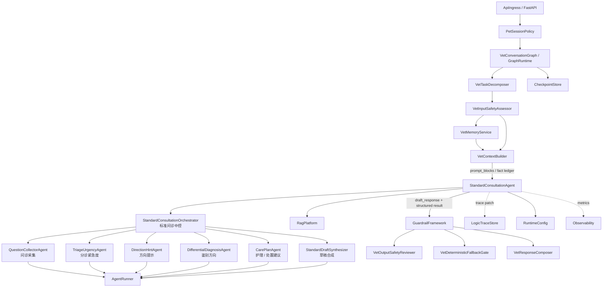
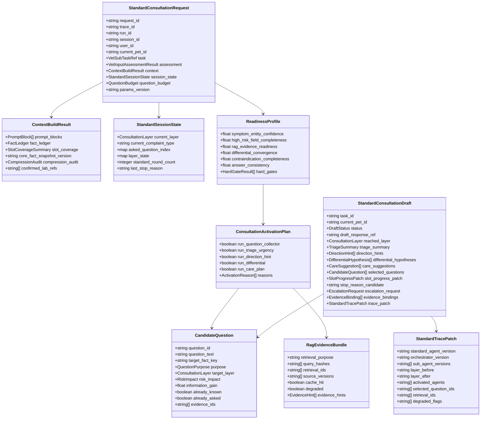
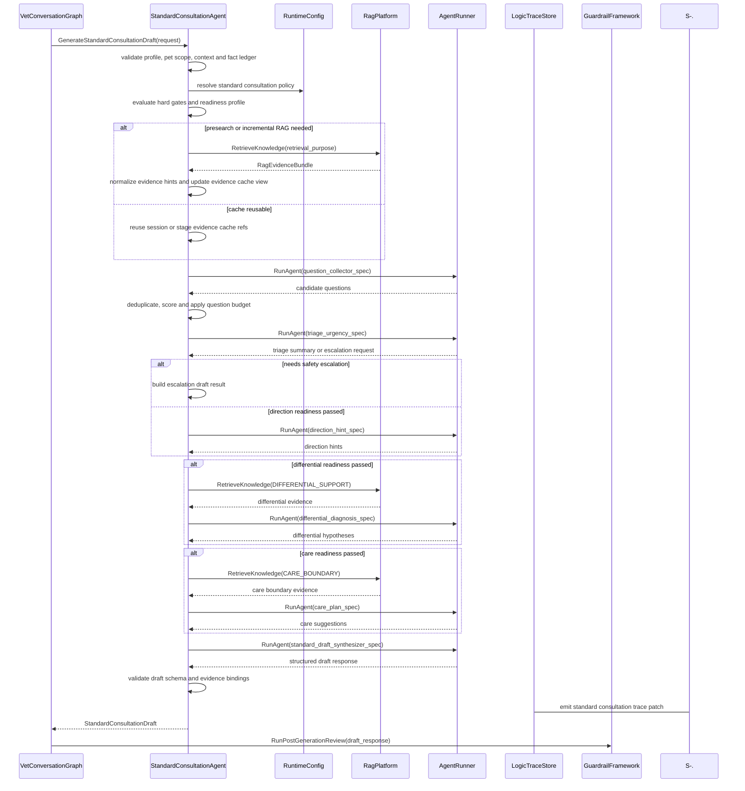
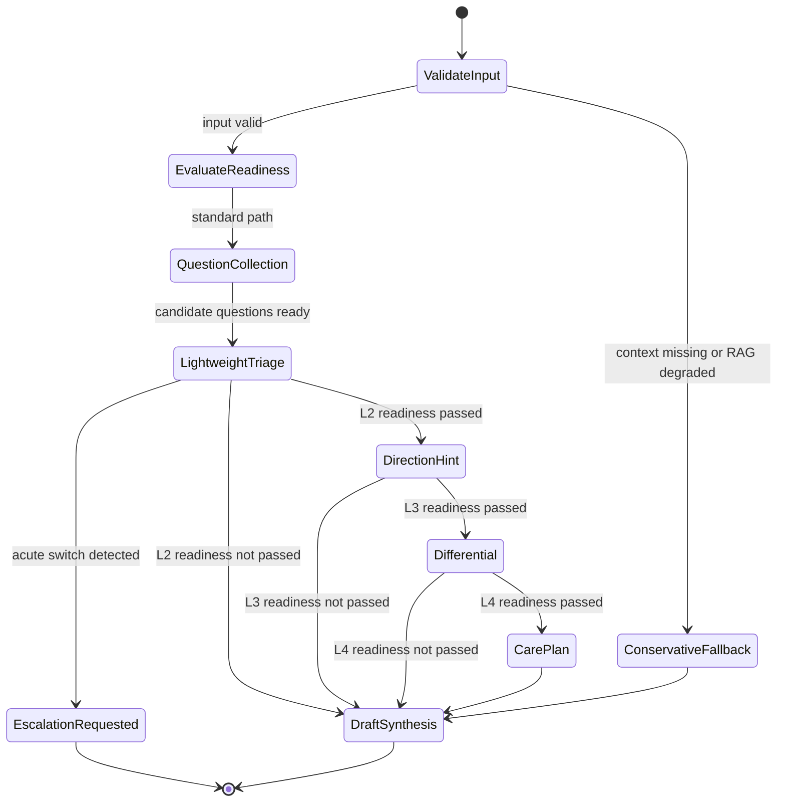
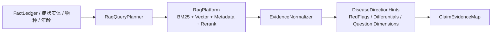

# 标准问诊 Agent 组件设计文档 / StandardConsultationAgent

## 3.1 基础元数据 (Metadata)

* **组件标识：** 标准问诊 Agent / `StandardConsultationAgent`
* **责任人 (Owner)：** 待定
* **代码仓库：** 当前仓库，正式 Git Repository URL 待补充
* **关联需求：**
  * [`docs/component_catalog.md`](../../../component_catalog.md) §6.6 标准问诊 Agent
  * [`docs/prd.md`](../../../prd.md) §5.1、§5.2、§5.3、§5.4、§6.1、§6.2、§6.3、§6.4、§6.8、§6.10、§6.11、§7.1、§7.4、§7.5、§7.6、§9.4、§9.6、§10
  * [`docs/design_spec.md`](../../../design_spec.md)
  * [`docs/temporary-rag.md`](../../../temporary-rag.md)
  * [`docs/components/l2-vet-business/vet-input-safety-assessor/design.md`](../vet-input-safety-assessor/design.md)
  * [`docs/components/l2-vet-business/vet-task-decomposer/design.md`](../vet-task-decomposer/design.md)
  * [`docs/components/l2-vet-business/vet-memory-service/design.md`](../vet-memory-service/design.md)
  * [`docs/components/l1-ai-runtime/agent-runner/design.md`](../../l1-ai-runtime/agent-runner/design.md)
  * [`docs/components/l1-ai-runtime/rag-platform/design.md`](../../l1-ai-runtime/rag-platform/design.md)
  * [`docs/components/l1-ai-runtime/guardrail-framework/design.md`](../../l1-ai-runtime/guardrail-framework/design.md)
  * [`docs/components/l1-ai-runtime/logic-trace-store/design.md`](../../l1-ai-runtime/logic-trace-store/design.md)
* **架构层级：** L2 兽医业务组件 / `standard` 剖面生成执行层
* **文档状态：** 草案

## 3.2 职责边界 (Responsibility Boundaries)

* **核心能力 (Capabilities)：**
* 在 `VetInputSafetyAssessor` 已判定当前子任务进入 `generation_profile=standard` 后，生成标准问诊剖面的结构化草稿。
* 作为 `standard` 剖面内的受控 MAS 子图，对问诊采集、分诊紧急度、方向提示、鉴别诊断、护理 / 处置建议等专业子 Agent 进行内部调度。
* 基于 `VetContextBuilder` 产出的 `prompt_blocks`、`slot_coverage` / 临床事实账本、压缩审计和 `CoreFactSnapshot` 版本引用执行问诊生成。
* 基于 `RagPlatform` 已返回或本组件显式请求的阶段式 RAG 证据，生成疾病方向启发、关键鉴别特征、候选追问问题和标准问诊草稿。
* 维护四层递进的本轮输出意图：L1 分诊与紧急度、L2 方向提示、L3 鉴别方向、L4 护理 / 处置 / 非处方级建议；层级推进以信息完备度、风险门槛和 RAG 证据状态共同判定。
* 通过问诊采集子 Agent 产出候选问题池，并按风险影响、信息增益、已知 / 已问去重、用户负担和本轮问题预算形成候选追问计划。
* 在生成草稿中显式区分已知事实、不确定信息、建议追问、阶段性判断和依据来源，避免将 RAG 知识误写成当前宠物事实。
* 对可能进入 L4 的护理 / 用药表述执行生成前自约束，遵守 `MedicationPolicy` 的 T0-T4 边界；T2 / T3 仅在低风险、禁忌信息充分且证据可用时进入草稿。
* 在标准问诊过程中发现急症切换线索时，停止继续展开鉴别或护理建议，并输出结构化升级请求，由上游编排切换到 `safety_trigger` 路径。
* 输出 `StandardConsultationDraft`、层级状态补丁、候选问题摘要、证据绑定摘要、RAG 使用摘要和 trace patch，供后续安全审查、兜底门、回复合成、checkpoint 与逻辑链留痕消费。
* 优先复用 `AgentRunner`、`RagPlatform`、LangGraph / LangChain、结构化输出校验和 trace 组件；自研层仅负责兽医标准问诊的业务调度、层级门槛、证据绑定和生成约束。

* **非目标 (Non-Goals)：**
* 不实现 JWT、OAuth、登录态解析或用户身份认证。当前阶段 Agent 服务仅在局域网访问，身份上下文由上游可信传入。
* 不校验、创建或改写 session 与 `pet_id` 的绑定关系；一 session 一宠策略由 `PetSessionPolicy` 负责。
* 不根据自然语言文本进行定宠、切宠、宠物名匹配或跨宠对照。
* 不执行多任务拆解、附件角色判定或任务优先级初判；这些由 `VetTaskDecomposer` 负责。
* 不决定输入侧 SAF 信号、`intent`、`route`、`generation_profile` 或纯非医疗执行器；这些由 `VetInputSafetyAssessor` 负责。
* 不绕过 `VetContextBuilder` 直接读取宠物画像、长期记忆、会话摘要、化验报告或 checkpoint 原始状态。
* 不以通用 Agent Memory、LLM 自主工具检索或原始消息全文替代领域上下文适配层。
* 不管理知识库索引、文档切片、embedding、rerank、版权策略或知识源版本；这些由 `RagPlatform` 负责。
* 不在 `safety_trigger` 剖面执行 RAG 或急症简版生成；急症剖面由 `SafetyTriggerAgent` 负责。
* 不执行输出安全审查、T4 删除、毒物建议拦截、免责追加或最终发布前 P0 否决；这些由 `VetOutputSafetyReviewer` 与 `VetDeterministicFallbackGate` 负责。
* 不直接向用户发布草稿、不决定多段回复发布顺序、不标记 segment 已发布；这些由 `VetResponseComposer`、`GraphRuntime` 和发布链路负责。
* 不写入宠物级 / 主人级长期记忆，不刷新 `CoreFactSnapshot`，不执行用户记忆查看、纠正或删除。
* 不执行 OCR、病历结构化、参考区间匹配或检验异常标注；仅消费已确认和已结构化的上传资料摘要。
* 不保存完整 A/B/C 业务逻辑链；本组件仅输出标准问诊相关 trace patch，完整落库由 `LogicTraceStore` 与 L2 trace schema 承担。

## 3.3 架构与交互设计 (Architecture & Interaction)

* **上下文视图 (Context Diagram)：**

`StandardConsultationAgent` 是 FastAPI 应用内的 L2 业务 Agent 组件，通常作为 LangGraph 中 `VetContextBuilder` 之后、输出护栏之前的生成节点。组件对外保持单一 `standard` 生成契约；内部可以按受控 MAS 子图执行，不允许多个子 Agent 自由协商后绕过中控、护栏或 trace。

RAG 在本组件中属于受控医学启发与证据接地能力：前置检索用于建立当前主诉知识边界，阶段式检索用于问诊采集、分诊、方向、鉴别和护理建议，后置证据一致性检索可作为审查辅助。P0 安全触发、毒物拦截和 T4 否决不得依赖 RAG 成功与否。

* **核心领域模型 (Domain Model)：**

模型说明：

* `StandardConsultationRequest` 必须消费 `PetSessionPolicy` 确认后的 `current_pet_id`、`VetInputSafetyAssessor` 输出的 `standard` 判决和 `VetContextBuilder` 输出的上下文编译结果。
* `FactLedger` / `slot_coverage` 是已知事实、未知缺口、已问问题、冲突信息和来源引用的事实账本；本组件可基于其计算层级 readiness，但不得将 RAG 证据写成当前宠物事实。
* `ReadinessProfile` 是中控调度使用的多维信息完备度视图，不替代 P0 硬安全门槛。
* `ConsultationActivationPlan` 是内部 MAS 子图的受控调度计划，表达哪些专业子 Agent 在本轮被激活以及原因。
* `CandidateQuestion` 是问诊采集子 Agent 的候选问题输出；最终对外采用哪些问题由中控基于问题预算和硬约束选择。
* `RagEvidenceBundle` 表达前置、阶段式或后置检索的标准证据包；完整检索 DTO 由 `RagPlatform` 维护。
* `StandardConsultationDraft` 是本组件唯一对外业务结果；其自然语言正文仍为草稿，必须进入输出安全审查与确定性兜底。
* 完整 DTO、字段约束、错误码、枚举取值和正式示例由代码内 Pydantic 模型或 API 治理平台维护；本文仅定义组件级领域模型。

## 3.4 契约与依赖 (Contracts & Dependencies)

* **入向契约 (Inbound APIs)：**
* 生成标准问诊草稿：`GenerateStandardConsultationDraft` -> API 治理平台链接待建立
* 计算标准问诊信息完备度：`EvaluateStandardReadiness` -> API 治理平台链接待建立
* 生成候选追问问题：`CollectConsultationQuestions` -> API 治理平台链接待建立
* 执行标准问诊内部调度计划：`RunStandardConsultationPlan` -> API 治理平台链接待建立
* 校验标准问诊草稿契约：`ValidateStandardConsultationDraft` -> API 治理平台链接待建立

接口原则：

* 当前契约优先作为 FastAPI 应用内 service 接口和 LangGraph 节点使用；若后续服务化，再登记 HTTP / RPC 接口。
* 入参必须携带 `request_id`、`trace_id`、`run_id`、`session_id`、`user_id`、`current_pet_id`、`task_id` 与 `params_version`。
* 入参中的 `generation_profile` 必须为 `standard`；否则本组件拒绝执行并返回 profile mismatch 错误。
* 入参必须包含 `VetContextBuilder` 产出的 `prompt_blocks`、事实账本或等价 `slot_coverage`、`compression_audit` 与当前宠物核心事实版本引用。
* `current_pet_id` 必须与上下文编译结果、任务引用和评估结果中的宠物作用域一致；不一致时拒绝运行。
* 医学问诊草稿需要可用的 RAG 证据或明确的 RAG 降级状态。RAG 降级时只允许保守分诊、风险提示和追问，不得展开深入鉴别或用药建议。
* 内部 MAS 子 Agent 必须通过 `AgentRunner` 的版本化 `AgentSpec` 执行，并采用默认拒绝的工具权限策略。
* 问诊采集子 Agent 只能产出候选问题池；每轮最终选中问题数不得超过上游 `QuestionBudget`。
* 分诊紧急度子 Agent 至少以轻量模式运行，用于识别是否存在急症升级请求；完整分诊输出需要满足对应 readiness 与证据条件。
* 鉴别诊断子 Agent 只能在候选方向已收敛且 RAG 证据可用时输出用户可见的 L3 草稿内容。
* 护理 / 处置建议子 Agent 必须遵守 `MedicationPolicy`，不得输出 T4；禁忌字段缺失或风险未降级时应输出保守护理或请求补充信息。
* 本组件输出的 `draft_response` 不得直接发布；调用方必须继续执行 7.6-C / 7.6-D 对应的输出安全审查与确定性兜底。
* 本组件必须输出可写入逻辑链的 trace patch；trace 写入失败时应向上游暴露降级状态。

核心枚举：

* `ConsultationLayer`：
  * `L0_COLLECTION`：问诊采集 / 信息补全，不作为 PRD 四层诊断输出层。
  * `L1_TRIAGE`：分诊与紧急度。
  * `L2_DIRECTION`：方向提示。
  * `L3_DIFFERENTIAL`：鉴别方向。
  * `L4_CARE_PLAN`：护理 / 处置 / 非处方级建议。
* `QuestionPurpose`：
  * `ACUTE_RULE_OUT`
  * `CHIEF_COMPLAINT_CHARACTERIZATION`
  * `DIRECTION_DISAMBIGUATION`
  * `DIFFERENTIAL_CONVERGENCE`
  * `CARE_CONTRAINDICATION_CHECK`
  * `OCR_VALUE_CONFIRMATION`
* `RetrievalPurpose`：
  * `STANDARD_PRESEARCH`
  * `QUESTION_GENERATION`
  * `TRIAGE_SUPPORT`
  * `DIRECTION_HINT`
  * `DIFFERENTIAL_SUPPORT`
  * `CARE_BOUNDARY`
  * `EVIDENCE_CONSISTENCY_CHECK`
* `DraftStatus`：
  * `DRAFT_READY`
  * `NEEDS_MORE_INFO`
  * `NEEDS_SAFETY_ESCALATION`
  * `RAG_DEGRADED_CONSERVATIVE`
  * `SCHEMA_INVALID`
  * `FAILED`

异常映射原则：

* 剖面不匹配映射为 `STANDARD_PROFILE_MISMATCH`。
* 缺少当前宠物上下文映射为 `STANDARD_MISSING_CURRENT_PET_ID`。
* 上下文适配结果缺失映射为 `STANDARD_CONTEXT_MISSING`。
* 上下文作用域与当前宠物不一致映射为 `STANDARD_PET_CONTEXT_INVALID`。
* 医学问诊所需 RAG 证据缺失映射为 `STANDARD_RAG_REQUIRED_MISSING`，触发保守降级。
* RAG 检索超时或不可用映射为 `STANDARD_RAG_DEGRADED`。
* 问诊事实账本不可解析映射为 `STANDARD_FACT_LEDGER_INVALID`。
* 内部子 Agent 规格不可用映射为 `STANDARD_SUB_AGENT_SPEC_UNAVAILABLE`。
* 内部子 Agent 超时映射为 `STANDARD_SUB_AGENT_TIMEOUT`。
* 结构化输出解析或 schema 校验失败映射为 `STANDARD_OUTPUT_SCHEMA_INVALID`。
* 生成阶段发现急症切换映射为 `STANDARD_ACUTE_ESCALATION_REQUESTED`。
* prompt 或证据包超出上下文预算映射为 `STANDARD_TOKEN_BUDGET_EXCEEDED`。

* **出向依赖 (Outbound Dependencies)：**
* **强依赖：**
* `GraphRuntime`：调用本组件并承接升级、护栏、发布与 checkpoint 后续节点。不可用时标准问诊链路无法运行。
* `AgentRunner`：执行标准问诊内部各子 Agent 与草稿合成 Agent。不可用时本组件无法产出模型草稿。
* `VetContextBuilder`：提供 `prompt_blocks`、事实账本、P0 注入、压缩审计和当前宠物作用域。不可用时不得执行正常标准问诊生成。
* `RuntimeConfig`：提供标准问诊参数、问题预算、RAG 策略、子 Agent 版本、超时、重试和参数版本。不可用时服务不可就绪。
* `Observability`：记录标准问诊内部节点、RAG、子 Agent、schema 校验和降级指标。不可用不应阻断单次生成，但需产生降级日志。

* **弱依赖：**
* `RagPlatform`：提供前置、阶段式与证据一致性检索。不可用时进入保守问诊降级，不得输出深入鉴别或用药建议。
* `LogicTraceStore`：保存标准问诊 trace patch、RAG 摘要、候选问题依据和内部调度摘要。短暂不可用时需向上游暴露 trace 降级状态。
* `VetMemoryService`：通过 `VetContextBuilder` 间接提供记忆读集和 `CoreFactSnapshot` 引用。本组件不直接读写记忆。
* `CheckpointStore`：由上游图节点保存本组件返回的层级状态、问题索引和槽位补丁。本组件不直接写 checkpoint。
* `GuardrailFramework`：承接本组件草稿后的输出安全审查与确定性 gate。不可用时不得直接发布草稿。
* `MedicationPolicy`：提供 T0-T4 生成边界和用药表述版本。本组件可在生成前自约束，但最终安全判断仍由后续护栏承担。
* API 治理平台：维护完整接口字段、示例和版本。缺失时不阻塞应用内契约实现，但阻塞正式契约冻结。

## 3.5 核心流转机制 (Core Flow Mechanism)

* **状态流转/时序图：**

标准问诊草稿生成流程：

内部层级调度状态：

RAG 阶段式调用机制：

执行约束：

* `safety_trigger` 路径不得进入本组件；若本组件内部发现急症切换，仅输出升级请求。
* 问诊采集子 Agent 常驻，但最终问题选择必须经过中控限流和去重。
* 分诊紧急度子 Agent 每轮至少轻量运行；完整分诊、方向、鉴别和护理建议按 readiness 与硬门槛按需激活。
* RAG 证据用于医学启发和结论接地，不用于覆盖输入安全判决、不用于替代当前宠物事实、不用于检验参考区间数值比较。
* 缓存证据可复用，但核心症状变化、方向变化或急症信号出现时必须增量检索、失效缓存或退出 standard。

## 3.6 稳定性与可观测性 (Reliability & Observability)

* **流量控制：**
* 当前组件不直接暴露公网接口，入口流量由 `ApiIngress` 与 `GraphRuntime` 控制。
* 同一 `session_id` 的并发运行应由 `CheckpointStore` / 图运行锁控制，避免多轮同时改写层级状态和已问问题索引。
* 内部子 Agent 调用必须配置独立超时、有限重试和最大 token 预算；问题采集、分诊和草稿合成优先级高于鉴别与护理建议。
* RAG 检索必须配置 per-purpose 超时和 top-k 上限；阶段检索超时后进入保守降级，不得阻塞急症升级请求。
* 当模型、RAG 或子 Agent 局部不可用时，组件应尽量返回保守问诊草稿、候选追问或升级请求，而不是输出无依据的高阶诊断。

* **数据一致性：**
* 本组件不直接写长期存储；层级状态、已问问题索引、`slot_progress_patch` 和 segment 结果由上游图节点写入 `CheckpointStore`。
* `current_pet_id`、`task_id`、`prompt_blocks`、RAG 证据和 trace patch 必须在一次运行内保持同一 `trace_id` 和 `params_version`。
* RAG 证据缓存采用只读引用语义；缓存命中结果必须保留 source version、content hash、retrieval purpose 和失效条件摘要。
* `claim_evidence_map` 只绑定证据引用和摘要，不将运行时对话或草稿写入知识库索引。
* 本组件输出的 `slot_progress_patch` 仅表示本轮候选状态更新，最终是否持久化由上游 checkpoint / memory writer 策略决定。

* **核心指标 (Golden Signals)：**
* `standard_consultation_latency_ms`：标准问诊组件端到端延迟。
* `standard_sub_agent_latency_ms`：问诊采集、分诊、方向、鉴别、护理和草稿合成子 Agent 延迟。
* `standard_success_rate`：成功产出结构化草稿比例。
* `standard_conservative_degrade_rate`：RAG、上下文或子 Agent 降级后保守输出比例。
* `standard_acute_escalation_rate`：standard 内部发现急症切换并请求升级比例。
* `standard_question_count_violation_rate`：候选选择后超过问题预算的拦截比例，目标应为 0。
* `standard_repeated_known_question_rate`：命中已知事实或已问问题的候选过滤比例。
* `standard_rag_cache_hit_rate`：前置和阶段式 RAG 缓存命中率。
* `standard_rag_degraded_rate`：RAG 超时、空结果、来源策略缺失或物种不匹配降级比例。
* `standard_schema_invalid_rate`：结构化输出 schema 校验失败比例。
* `standard_draft_t4_detected_rate`：后续护栏在 standard 草稿中发现 T4 的比例。
* `standard_layer_distribution`：本轮达到 L1 / L2 / L3 / L4 的分布。
* `standard_stop_reason_distribution`：候选停止追问原因分布。

可观测性要求：

* 每次运行必须向 `Observability` 发送组件开始、子 Agent 开始 / 结束、RAG 检索、降级、schema 校验和升级请求事件。
* A/B 级链路必须向 `LogicTraceStore` 提供标准问诊 trace patch；trace 写入降级需被显式记录并向上游暴露。
* 监控面板链接待建立。
