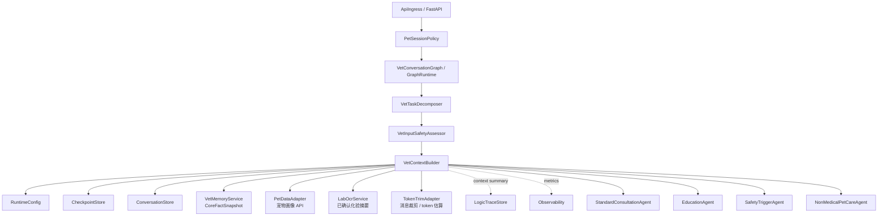
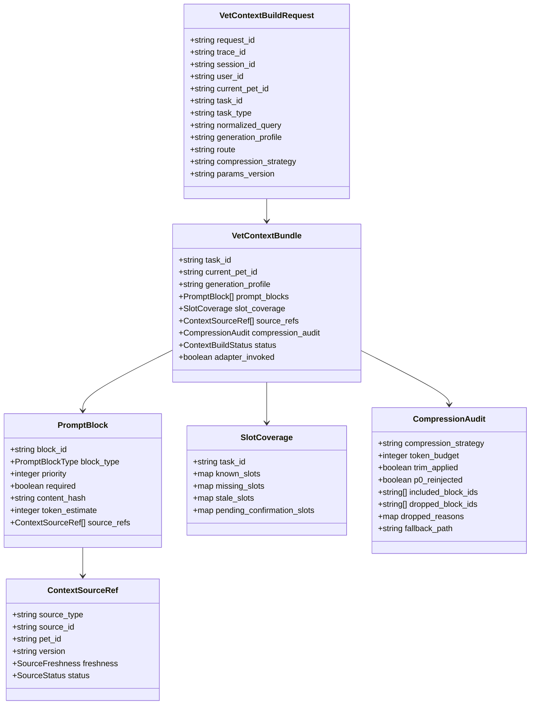
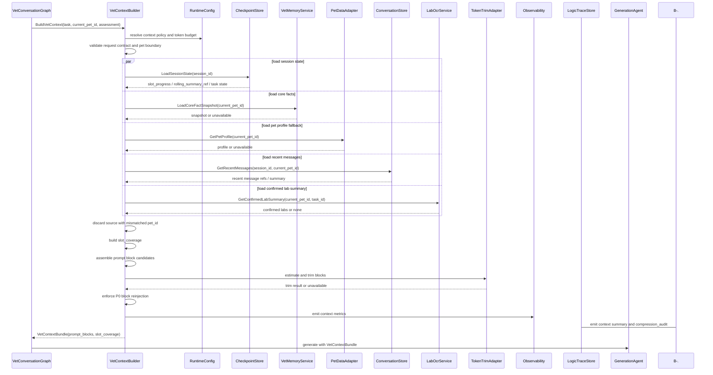
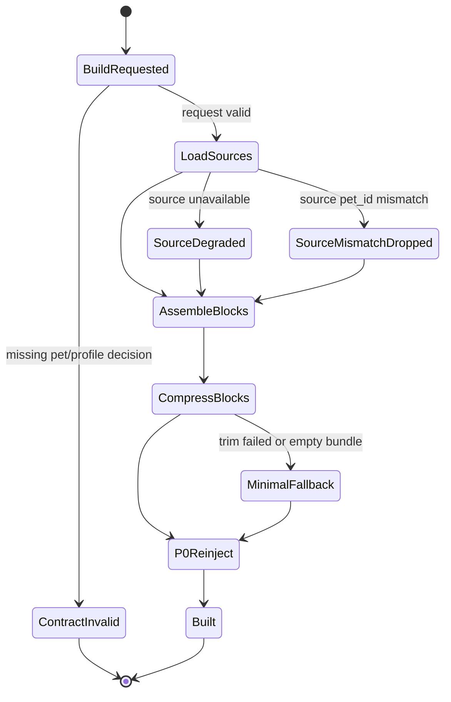

# 领域上下文适配组件设计文档 / VetContextBuilder

## 3.1 基础元数据 (Metadata)

* **组件标识：** 领域上下文适配组件 / `VetContextBuilder`
* **责任人 (Owner)：** 待定
* **代码仓库：** 当前仓库，正式 Git Repository URL 待补充
* **关联需求：**
  * [`docs/component_catalog.md`](../../../component_catalog.md) §6.4 领域上下文适配组件
  * [`docs/prd.md`](../../../prd.md) §5.1、§5.2.7、§5.4、§6.3、§6.4、§6.7、§6.11、§7.4、§7.5、§7.6、§8.2、§8.4、§9.2.2、§9.2.3
  * [`docs/design_spec.md`](../../../design_spec.md)
  * [`docs/components/l2-vet-business/pet-session-policy/design.md`](../pet-session-policy/design.md)
  * [`docs/components/l2-vet-business/vet-task-decomposer/design.md`](../vet-task-decomposer/design.md)
* **架构层级：** L2 兽医业务组件 / 上下文适配层
* **文档状态：** 草案

## 3.2 职责边界 (Responsibility Boundaries)

* **核心能力 (Capabilities)：**
* 在 `PetSessionPolicy` 已产出 `current_pet_id`、`VetTaskDecomposer` 已产出子任务、`VetInputSafetyAssessor` 已产出 `generation_profile` 与 `compression_strategy` 后，为单个子任务构建生成前领域上下文。
* 按 `current_pet_id` 读取并装配宠物画像、`CoreFactSnapshot`、session 短期状态、近期消息摘要、已确认上传资料摘要等上下文来源。
* 校验所有宠物级上下文来源的 `pet_id`，丢弃与 `current_pet_id` 不一致的数据并输出降级摘要。
* 读取 checkpoint 中的 session 业务状态，向后续问诊链提供 `slot_progress`、主诉类别、rolling summary 引用等短期锚点。
* 生成标准 `prompt_blocks`，供 `StandardConsultationAgent`、`EducationAgent`、`SafetyTriggerAgent` 与非医疗养宠链路按权限消费。
* 生成 `slot_coverage`，描述当前子任务下系统已知、缺失、过期或待用户确认的信息槽位。
* 执行输入安全评估给出的 `compression_strategy`，控制上下文块排序、裁剪、保留与降级。
* 在裁剪或 trim 后强制保留 / 重新注入 P0 上下文块，保证基础宠物事实与安全相关事实不会被压缩移除。
* 对 B 级及以上链路输出 `compression_audit`、上下文来源摘要、降级状态和 `adapter_invoked=true`，供 `LogicTraceStore` 记录业务逻辑链。
* 在部分下游来源不可用时产出可继续执行的降级上下文，尤其不得因上下文来源失败阻塞 `safety_trigger` 就医导向链路。

* **非目标 (Non-Goals)：**
* 不实现 JWT、OAuth、登录态解析或用户身份认证。当前阶段 Agent 服务仅在局域网访问，`user_id`、`session_id`、`pet_id` 由上游客户端 / BFF 可信传入。
* 不校验 `pet_id` 是否属于 `user_id`，该类授权校验由上游 BFF / 数据层在后续阶段承接。
* 不创建、绑定、切换或修正 session 的 `pet_id`；一 session 一宠策略由 `PetSessionPolicy` 负责。
* 不根据用户自然语言文本进行定宠、切宠、宠物名匹配或跨宠对照。
* 不执行多任务拆解、附件角色判断或子任务覆盖义务判定；这些由 `VetTaskDecomposer` 负责。
* 不判断 SAF 信号、`intent`、`generation_profile`、`route` 或 `compression_strategy`；这些由 `VetInputSafetyAssessor` 负责。
* 不调用 LLM 生成用户可见回复，不输出分诊结论、科普正文、急症简版或用药建议。
* 不执行输出安全审查、T4 用药拦截、毒物建议拦截或最终发布兜底；这些由 `VetOutputSafetyReviewer` 与 `VetDeterministicFallbackGate` 负责。
* 不执行医学知识库 RAG 检索，不决定 KB 片段引用、版权分流或 `rag_invoked`；医学 RAG 由生成链路或 `RagPlatform` 适配节点负责。
* 不执行 OCR、病历结构化、参考区间匹配或检验异常标注；仅消费已确认、已授权、已按 `pet_id` 绑定的上传资料摘要。
* 不写入宠物级记忆、主人级记忆、`CoreFactSnapshot`、rolling summary 或 checkpoint；本组件全程只读。
* 不使用 LLM 压缩作为 P0 主路径；任何可选二次压缩能力不得覆盖本组件的 P0 块保留策略。
* 不保存完整 A/B/C 业务逻辑链、完整 prompt、完整消息历史或完整护栏三联稿；本组件仅输出上下文构建摘要与引用 / 哈希。

## 3.3 架构与交互设计 (Architecture & Interaction)

* **上下文视图 (Context Diagram)：**

`VetContextBuilder` 是 FastAPI 应用内的 L2 业务适配组件，通常作为 LangGraph 中输入安全与剖面判决之后、生成 Agent 之前的节点。它不直接暴露公网接口，不承担模型生成职责，而是将分散的对话事实、记忆事实、宠物画像、上传资料摘要和短期槽位状态编译为受控 `prompt_blocks`。

本组件优先复用 `CheckpointStore`、`ConversationStore`、`RuntimeConfig`、token 裁剪适配器等通用 / AI 运行组件；自研逻辑仅负责兽医业务隔离、上下文块分层、P0 块保留、`slot_coverage` 计算和压缩审计摘要。

* **核心领域模型 (Domain Model)：**

模型说明：

* `VetContextBuildRequest` 必须消费 `PetSessionPolicy` 产出的 `current_pet_id`，不得从用户文本或记忆中重新推断宠物。
* `ContextSourceRef` 是上下文来源引用，不代表物理表结构；它用于标记来源类型、版本、新鲜度和 `pet_id` 校验结果。
* `PromptBlock` 是供生成 Agent 消费的上下文块。本文不定义完整 prompt 文案、token 估算实现或具体字段字典。
* `SlotCoverage` 是问诊链与上下文适配层之间的业务桥接结构；具体槽位枚举由代码内 schema 与业务配置维护。
* `CompressionAudit` 记录裁剪策略、块保留、块丢弃与 P0 重新注入摘要，不保存完整上下文正文。
* `VetContextBundle` 是本组件唯一标准输出。后续生成 Agent 应消费该结构，而不是绕过本组件直接拼接 API 原始数据。

## 3.4 契约与依赖 (Contracts & Dependencies)

* **入向契约 (Inbound APIs)：**
* 构建兽医领域上下文：`BuildVetContext` -> API 治理平台链接待建立
* 校验上下文构建结果：`ValidateVetContextBundle` -> API 治理平台链接待建立
* 构建降级上下文：`BuildDegradedVetContext` -> API 治理平台链接待建立
* 估算上下文 token 与裁剪结果：`EstimateAndTrimContextBlocks` -> API 治理平台链接待建立

接口原则：

* 当前契约优先作为 FastAPI 应用内 service 接口和 LangGraph 节点使用；若后续服务化，再登记 HTTP / RPC 接口。
* 入参必须携带 `request_id`、`trace_id`、`session_id`、`user_id`、`current_pet_id`、`task_id`、`generation_profile`、`compression_strategy` 与 `params_version`。
* `current_pet_id` 必须来自 `PetSessionPolicy`，本组件不得从用户文本、宠物名、历史消息、附件或记忆中推断宠物。
* `generation_profile` 与 `compression_strategy` 必须来自 `VetInputSafetyAssessor` 或等价的输入安全与剖面判决结果；缺失时不得静默采用默认医学上下文。
* 所有宠物级来源读取必须携带 `current_pet_id`；返回数据的 `pet_id` 不一致时必须丢弃并记录降级原因。
* `standard` 与 `safety_trigger` 链路必须产出 `adapter_invoked=true`、非空 `prompt_blocks` 与可序列化的 `slot_coverage` 或等价结构。
* `safety_trigger` 使用最小上下文策略，只装配 P0 宠物事实、本轮用户文本和必要 SAF 判决摘要；不得因补上下文而延迟急症段生成。
* `education` 可使用轻量上下文策略；当当前问题不需要宠物个性化时，允许仅装配物种级或会话接续相关上下文。
* 纯非医疗链路可复用本组件的轻量宠物画像与主人偏好块，但不得因此升级为医学问诊剖面。
* VIS-MVP 阶段仅允许已确认的化验 OCR 结果作为上传资料上下文；未确认 OCR 候选不得作为诊断依据块注入。
* 病历结构化未就绪时，不得输出“已抽取完整病史”类上下文块；只能引用存档或用户口述确认摘要。
* 本组件不得调用 LLM 编造缺失字段、补齐画像或生成医学结论。
* 输出中的 `prompt_blocks` 应使用受控块类型；不得将下游 API 原始响应、完整消息历史或完整上传资料正文无边界透传给生成 Agent。
* B 级及以上链路必须输出 `compression_audit`；写入完整逻辑链由 `LogicTraceStore` 与兽医 trace schema 承担。

上下文块类型枚举：

* `task_input`：当前子任务文本、原文片段引用与附件绑定摘要。
* `pet_profile_p0`：物种、年龄 / 生命阶段、体重、性别、绝育等 P0 画像字段。
* `core_fact_snapshot`：按 `current_pet_id` 版本化的核心事实摘要。
* `session_state`：checkpoint 中的主诉类别、槽位进度、pending task 等短期状态摘要。
* `rolling_summary`：当前 session 的会话摘要引用或摘要文本。
* `recent_messages`：经裁剪的近期消息摘要或引用。
* `slot_coverage`：当前任务下已知、缺失、过期、待确认槽位。
* `confirmed_lab_summary`：已确认化验 OCR 结构化摘要。
* `owner_preference`：主人沟通偏好、风险偏好等非临床偏好摘要。
* `safety_assessment`：输入安全评估产出的信号、意图、剖面与压缩策略摘要。

压缩策略枚举：

* `single_full`：`standard` 默认策略，按单宠完整上下文装配并执行 token 预算裁剪。
* `safety_minimal`：`safety_trigger` 策略，仅保留 P0、当前用户句和必要安全判决摘要。
* `education_light`：`education` 策略，优先物种级、话题接续和轻量个性化上下文。

异常映射原则：

* 缺少 `current_pet_id` 映射为 `CONTEXT_MISSING_CURRENT_PET_ID`。
* 缺少 `generation_profile` 或 `compression_strategy` 映射为 `CONTEXT_ROUTE_DECISION_MISSING`。
* 上下文来源 `pet_id` 与 `current_pet_id` 不一致映射为 `CONTEXT_SOURCE_PET_MISMATCH`，该来源必须被丢弃。
* `CoreFactSnapshot` 不可读映射为 `CONTEXT_SNAPSHOT_UNAVAILABLE`，触发回源或降级。
* checkpoint 不可读映射为 `CONTEXT_CHECKPOINT_UNAVAILABLE`，触发冷启动式槽位降级。
* 近期消息不可读映射为 `CONTEXT_RECENT_MESSAGES_UNAVAILABLE`，触发无历史消息降级。
* 上传资料摘要不可读映射为 `CONTEXT_ATTACHMENT_SUMMARY_UNAVAILABLE`，不得编造报告内容。
* 不支持的压缩策略映射为 `CONTEXT_COMPRESSION_STRATEGY_UNSUPPORTED`。
* token 预算裁剪失败映射为 `CONTEXT_TRIM_FAILED`，触发 P0 + 当前用户句最小上下文。
* 构建结果为空映射为 `CONTEXT_EMPTY_BUNDLE`，触发降级上下文。

* **出向依赖 (Outbound Dependencies)：**
* **强依赖：**
* `GraphRuntime`：调用本组件并将 `VetContextBundle` 写入 LangGraph state。不可用时业务图无法继续执行。
* `RuntimeConfig`：提供上下文策略、token 预算、P0 字段白名单、快照过期阈值、降级策略和参数版本。不可用时服务不可就绪。
* `Observability`：记录上下文构建耗时、来源可用性、裁剪、降级、token 估算和 P0 重新注入。不可用不应阻断核心构建，但需产生降级日志。

* **弱依赖：**
* `VetMemoryService` / `CoreFactSnapshot` Store：提供宠物级核心事实和主人偏好摘要。不可用时回源宠物画像 API 或构建降级上下文。
* `PetDataAdapter` / 宠物画像 API：提供画像校验与补全。不可用时使用请求快照或 `CoreFactSnapshot` 中已存在事实，并记录来源降级。
* `CheckpointStore`：提供 session 短期业务状态、slot 进度和 rolling summary 引用。不可用时按冷启动上下文处理。
* `ConversationStore`：提供近期消息和必要消息引用。不可用时不注入近期消息块。
* `LabOcrService` / 上传资料摘要服务：提供已确认化验 OCR 摘要。不可用时不注入上传报告依据块。
* Token 裁剪 / token 估算适配器：提供消息裁剪与 token 估算。不可用时进入 P0 + 当前用户句最小上下文。
* episode 检索适配器：可选提供按 `current_pet_id` 过滤的历史 episode 相关性选取。不可用时使用规则 recent_k 或不注入 episode。
* `LogicTraceStore`：保存上下文构建摘要和 `compression_audit`。短暂不可用时由上游图运行事件补偿，组件必须暴露 trace 写入降级状态。
* API 治理平台：维护正式接口字段、错误码和示例。缺失时不阻塞应用内契约实现，但阻塞正式契约冻结。

## 3.5 核心流转机制 (Core Flow Mechanism)

* **状态流转/时序图：**

核心流程约束：

* 本组件必须在 `VetInputSafetyAssessor` 之后执行；没有剖面判决结果时不得猜测上下文策略。
* 所有外部来源读取均使用 `current_pet_id`；来源自身返回的 `pet_id` 不一致时必须丢弃。
* `CoreFactSnapshot` 优先于回源 API；快照过期或不可用时允许回源补全，但不得编造缺失事实。
* `safety_minimal` 策略不得等待长耗时来源；来源超时后应立即产出 P0 + 当前用户句最小上下文。
* token 裁剪只能删除可选块；P0 画像、安全判决摘要和当前子任务输入在相关剖面下必须保留。
* `slot_coverage` 只描述已知 / 缺失 / 过期 / 待确认状态，不生成追问文案。
* 本组件可以返回降级状态，但不得将降级状态伪装为完整上下文。
* 本组件输出的上下文摘要可用于业务逻辑链，但不得写入 RAG 知识库索引。

## 3.6 稳定性与可观测性 (Reliability & Observability)

* **流量控制：**
* 单次上下文构建应设置总超时与分来源超时；超时后按 `compression_strategy` 和剖面要求降级。
* 对 `CoreFactSnapshot`、画像 API、近期消息和上传资料摘要读取应支持并行加载，避免串行放大首包延迟。
* `safety_minimal` 路径应配置更短来源等待预算，保证急症段不被上下文补全拖延。
* token 估算和裁剪应设置最大块数、最大消息数和最大上下文 token 预算，避免 prompt 失控。
* episode 检索、近期消息读取或上传资料摘要不可用时不得阻断 `safety_trigger`。
* 本组件不执行 HTTP 层限流；入口限流由 `ApiIngress` 或部署网关承担。

* **数据一致性：**
* `current_pet_id` 是所有宠物级上下文读取的唯一隔离键。
* `ConversationStore`、`CheckpointStore`、`VetMemoryService` 和上传资料服务返回的宠物级数据必须与 `current_pet_id` 一致后才可进入 `prompt_blocks`。
* `CoreFactSnapshot` 是核心事实首选来源；回源 API 仅用于校验、补全或快照不可用时的降级读取。
* checkpoint 可提供 slot 与 session 状态，但不得覆盖 `PetSessionPolicy` 确认的宠物绑定事实。
* `prompt_blocks` 应包含来源引用、版本或哈希，避免后续组件误以为无法追溯上下文来源。
* 本组件全程只读；任何长期记忆刷新、summary 更新、OCR 结构化回填均由对应异步写入组件处理。
* 降级上下文不得声称已读取不存在的画像、病历或化验数据。

* **核心指标 (Golden Signals)：**
* `vet_context_builder_total`：上下文构建请求总数，按 `generation_profile` 与 `compression_strategy` 分组。
* `vet_context_builder_duration_ms`：上下文构建耗时。
* `vet_context_builder_status_total`：按 `ContextBuildStatus` 统计构建结果。
* `vet_context_builder_degraded_total`：降级次数，按降级原因分组。
* `vet_context_builder_source_unavailable_total`：来源不可用次数，按来源类型分组。
* `vet_context_builder_source_pet_mismatch_total`：来源 `pet_id` 不一致并被丢弃的次数。
* `vet_context_builder_snapshot_stale_total`：`CoreFactSnapshot` 过期并触发回源或降级的次数。
* `vet_context_builder_prompt_block_count`：每次构建输出的上下文块数量。
* `vet_context_builder_token_estimate`：输出上下文 token 估算值。
* `vet_context_builder_trim_applied_total`：触发上下文裁剪的次数。
* `vet_context_builder_p0_reinject_total`：裁剪后重新注入 P0 块的次数。
* `vet_context_builder_minimal_fallback_total`：进入 P0 + 当前用户句最小上下文的次数。
* `vet_context_builder_slot_coverage_missing_total`：按任务类型统计的缺失槽位数量。
* `vet_context_builder_trace_degraded_total`：上下文构建摘要或 `compression_audit` 写入逻辑链失败 / 降级次数。
* 可观测性面板链接：无
