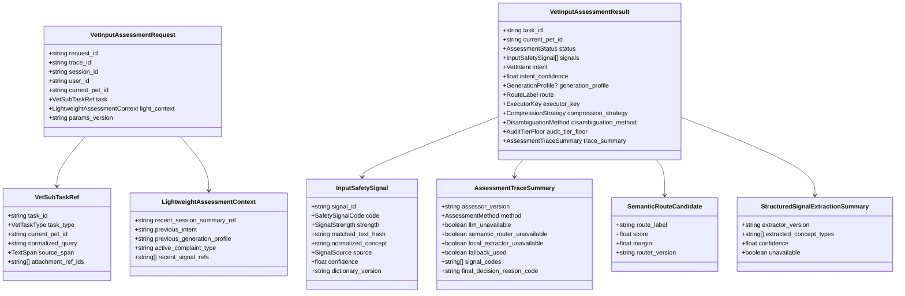
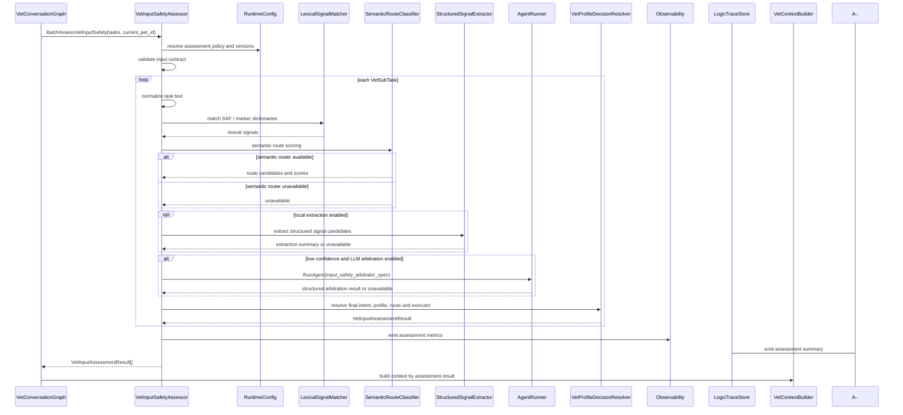
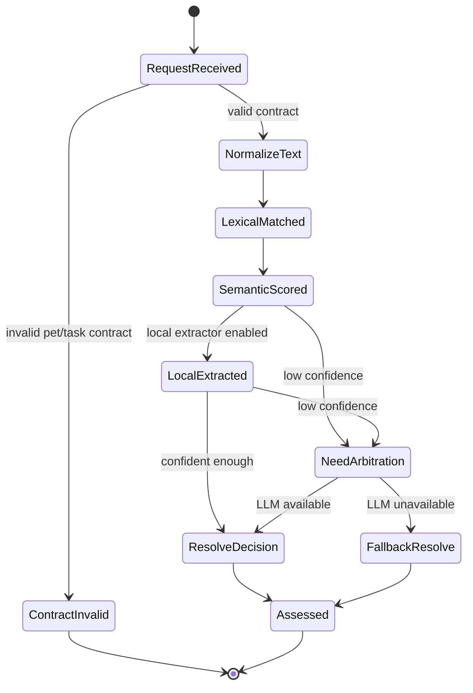

# 输入安全与剖面判决组件设计文档 / VetInputSafetyAssessor

## 3.1 基础元数据 (Metadata)

* **组件标识：** 输入安全与剖面判决组件 / `VetInputSafetyAssessor`
* **责任人 (Owner)：** 待定
* **代码仓库：** 当前仓库，正式 Git Repository URL 待补充
* **关联需求：**
  * [`docs/component_catalog.md`](../../../component_catalog.md) §6.3 输入安全与剖面判决组件
  * [`docs/prd.md`](../../../prd.md) §5.1、§5.2、§5.3、§5.4、§7.5、§7.6-A、§9.2、§9.3、§9.4、§9.7、§10
  * [`docs/design_spec.md`](../../../design_spec.md)
  * [`docs/components/l2-vet-business/pet-session-policy/design.md`](../pet-session-policy/design.md)
  * [`docs/components/l2-vet-business/vet-task-decomposer/design.md`](../vet-task-decomposer/design.md)
  * [`docs/components/l1-ai-runtime/agent-runner/design.md`](../../l1-ai-runtime/agent-runner/design.md)
  * [`docs/components/l1-ai-runtime/llm-gateway/design.md`](../../l1-ai-runtime/llm-gateway/design.md)
  * [`docs/components/l1-ai-runtime/logic-trace-store/design.md`](../../l1-ai-runtime/logic-trace-store/design.md)
* **架构层级：** L2 兽医业务组件 / 输入安全与路由判决层
* **文档状态：** 草案

## 3.2 职责边界 (Responsibility Boundaries)

* **核心能力 (Capabilities)：**
* 在 `VetTaskDecomposer` 已产出当前宠物下的 `VetSubTask[]` 后，对每个子任务独立执行输入安全评估与剖面判决。
* 检出 SAF-01 毒物 / 人药 / 高危食物信号，并输出可供后续安全触发路径使用的结构化信号。
* 检出 SAF-03 急症红线信号，并在非医疗跨域语境中标注 L1 / L2 / L3 信号强度。
* 判断子任务意图、意图置信度、`route`、`generation_profile`、实际执行器 `executor_key` 与 `compression_strategy`。
* 对低置信或模糊输入执行记忆推动或冷启动降级判决，并记录 `disambiguation_method`。
* 优先复用成熟中间件完成语义路由、结构化抽取与多关键词匹配；自研层仅负责兽医 SAF 词库、路由标签归一化与业务裁决优先级。
* 在 LLM 网关降级后仍不可用时，使用本地语义路由、EasyNLP UIE-Nano 类结构化抽取能力、DFA 字典树 / Aho-Corasick 多模自动机与保守默认策略完成降级判决。
* 产出输入安全评估摘要，供 `LogicTraceStore` 与兽医业务 trace schema 记录判决方法、信号、剖面、降级状态和版本信息。
* 将评估结果写入 LangGraph state，供 `VetContextBuilder`、各生成 Agent、`VetResponseComposer` 和后续护栏节点消费。

* **非目标 (Non-Goals)：**
* 不实现 JWT、OAuth、登录态解析或用户身份认证。当前阶段 Agent 服务仅在局域网访问，身份上下文由上游可信传入。
* 不校验、创建或改写 session 与 `pet_id` 的绑定关系；一 session 一宠策略由 `PetSessionPolicy` 负责。
* 不根据自然语言文本进行定宠、切宠、宠物名匹配或它宠识别。
* 不执行多任务拆解、附件角色判定或 source span 切分；这些由 `VetTaskDecomposer` 负责。
* 不读取完整宠物画像、完整长期记忆、化验报告明细、病历结构化字段或知识库检索结果；本组件仅消费为判决准备的轻量上下文引用。
* 不执行领域上下文编译，不生成 `prompt_blocks`、`slot_coverage` 或完整压缩审计；这些由 `VetContextBuilder` 负责。
* 不调用 RAG，不决定 RAG 检索片段，不写入知识库索引。
* 不生成对外回复，不输出诊断结论、处置建议、用药建议或科普正文。
* 不执行输出安全审查，不删除 T4，不追加免责，不作为最终发布前安全闸门；这些由 `VetOutputSafetyReviewer` 与 `VetDeterministicFallbackGate` 负责。
* 不执行 OCR、病历结构化、检验参考区间匹配或检验异常标注。
* 不写入宠物级 / 主人级长期记忆，不刷新 `CoreFactSnapshot`。
* 不维护复杂正则规则表；硬信号兜底应通过版本化词库、DFA 字典树 / Aho-Corasick 自动机和少量业务优先级完成。
* 不提供强可审计或强解释性链路；本组件仅输出足以回放关键判决的结构化摘要，完整展示视图由 `LogicTraceStore` 与 L2 trace schema 投影。

## 3.3 架构与交互设计 (Architecture & Interaction)

* **上下文视图 (Context Diagram)：**

```mermaid
flowchart TB
  API["ApiIngress / FastAPI"]
  Policy["PetSessionPolicy"]
  Graph["VetConversationGraph / GraphRuntime"]
  Decomposer["VetTaskDecomposer"]
  Assessor["VetInputSafetyAssessor"]
  Config["RuntimeConfig"]
  Aho["LexicalSignalMatcher\nDFA / Aho-Corasick"]
  Semantic["SemanticRouteClassifier\nSemantic Router / Embedding Router"]
  UIE["StructuredSignalExtractor\nEasyNLP UIE-Nano 占位"]
  AgentRunner["AgentRunner"]
  LlmGateway["LlmGateway"]
  Resolver["VetProfileDecisionResolver"]
  ContextBuilder["VetContextBuilder"]
  Standard["StandardConsultationAgent"]
  Education["EducationAgent"]
  Safety["SafetyTriggerAgent"]
  NonMed["NonMedicalPetCareAgent"]
  Trace["LogicTraceStore"]
  Obs["Observability"]

  API --> Policy
  Policy --> Graph
  Graph --> Decomposer
  Decomposer -->|VetSubTask[]| Assessor
  Assessor --> Config
  Assessor --> Aho
  Assessor --> Semantic
  Assessor -.optional local extraction.-> UIE
  Assessor -.low confidence / enabled.-> AgentRunner
  AgentRunner --> LlmGateway
  Assessor --> Resolver
  Assessor -.assessment summary.-> Trace
  Assessor -.metrics.-> Obs
  Assessor -->|VetInputAssessmentResult[]| ContextBuilder
  ContextBuilder --> Standard
  ContextBuilder --> Education
  ContextBuilder --> Safety
  ContextBuilder --> NonMed
```

`VetInputSafetyAssessor` 是 FastAPI 应用内的 L2 业务组件，通常作为 LangGraph 中 `VetTaskDecomposer` 之后、`VetContextBuilder` 之前的节点。组件遵循“中间件为主，自研层负责兼容 / 业务逻辑”的原则：语义路由优先复用 Semantic Router 或等价 embedding router；硬信号检出优先复用 DFA 字典树 / Aho-Corasick 多模自动机；结构化症状、毒物、时间与程度线索可复用 EasyNLP UIE-Nano 类本地模型作为占位或增强；LLM 仅作为低置信仲裁或策略增强能力。

本组件不作为独立网络服务暴露。若后续服务化，应保持相同的应用内契约语义，并由 `ApiIngress` 或上游网关统一处理访问控制、限流与错误响应。

* **核心领域模型 (Domain Model)：**



模型说明：

* `VetInputAssessmentRequest` 必须消费 `PetSessionPolicy` 输出的 `current_pet_id` 与 `VetTaskDecomposer` 输出的 `VetSubTaskRef`；本组件不得从用户文本推断宠物。
* `LightweightAssessmentContext` 仅用于模糊意图消歧，不替代 `VetContextBuilder` 的领域上下文编译。
* `InputSafetySignal` 是输入侧安全信号事实；同一轮中已产生的信号不得在后续判决中原地删除。
* `SemanticRouteCandidate` 表示语义路由中间件给出的候选标签，不直接等价于最终 `generation_profile`。
* `StructuredSignalExtractionSummary` 表示 UIE-Nano 类本地抽取器的摘要结果；该能力可作为 shadow、增强或降级路径，不直接承担最终剖面判决。
* `executor_key` 表达实际业务执行器，避免将纯非医疗链强行并入三生成剖面；`generation_profile` 仅在任务进入 PRD 三生成剖面时赋值，并保持 `standard`、`education`、`safety_trigger` 三值语义。
* 完整 DTO、字段约束、错误码、模型版本字段与正式示例由代码内 Pydantic 模型或 API 治理平台维护；本文仅定义组件级领域模型。

## 3.4 契约与依赖 (Contracts & Dependencies)

* **入向契约 (Inbound APIs)：**
* 执行单个子任务输入安全评估：`AssessVetInputSafety` -> API 治理平台链接待建立
* 批量执行当前轮子任务输入安全评估：`BatchAssessVetInputSafety` -> API 治理平台链接待建立
* 校验输入安全评估结果契约：`ValidateVetInputAssessment` -> API 治理平台链接待建立

接口原则：

* 当前契约优先作为 FastAPI 应用内 service 接口和 LangGraph 节点使用；若后续服务化，再登记 HTTP / RPC 接口。
* 入参必须携带 `request_id`、`trace_id`、`session_id`、`user_id`、`current_pet_id`、`task_id`、`task_type` 与子任务文本引用。
* `current_pet_id` 必须来自 `PetSessionPolicy`，并与 `VetSubTaskRef.current_pet_id` 一致。
* 本组件必须对每个 `VetSubTask` 独立输出一条 `VetInputAssessmentResult`；不得因单个子任务的 SAF 信号而覆盖其他子任务的独立判决。
* 输出信号必须来自受控枚举和版本化词库 / 抽取标签；不允许由模型自由生成新的 SAF 编码。
* 输出意图、`route`、三剖面任务的 `generation_profile`、`executor_key`、`compression_strategy` 与 `disambiguation_method` 必须来自受控枚举。
* `generation_profile` 仅表达三生成剖面；纯非医疗执行目标由 `executor_key=nonmedical_pet_care` 表达，`generation_profile` 可为空，后续投影规则由 L2 trace schema 统一处理。
* SAF-01 命中时不得被语义路由、UIE 抽取或 LLM 仲裁降级覆盖。
* SAF-03 信号必须保留，但不自动等同于 `safety_trigger`；是否安全触发由业务裁决优先级决定。
* LLM 不可用时不得静默失败；必须进入本地语义路由、结构化抽取、自动机兜底或保守默认策略，并记录降级状态。
* 语义路由、UIE 抽取和 LLM 仲裁的低置信输出不得直接发布给用户，也不得直接写入长期记忆。
* 评估摘要必须可写入逻辑链；写入失败时应向上游暴露 trace 降级状态。

核心枚举：

* `VetIntent`：
  * `ACUTE_EVENT`：当前宠物正在 / 刚发生可疑急症或毒物相关风险。
  * `EDUCATION`：泛科普、病因介绍或通识解释。
  * `HYPOTHETICAL`：假设性问法。
  * `SYMPTOM_TRIAGE`：当前个案症状咨询或分诊诉求。
  * `NONMED_NUTRITION`：饲养、换粮、体重管理、饮水、零食等诉求。
  * `NONMED_BEHAVIOR`：训练、分离焦虑、护食、如厕、拆家等行为诉求。
  * `NONMED_CARE`：护理、运动、环境、洗护等诉求。
  * `REPORT_INTERPRETATION`：化验单读取、报告解读或报告相关医疗诉求。
  * `GENERAL_QA`：属于养宠范围但无法稳定归类的普通问答。
  * `OUT_OF_SCOPE`：超出养宠健康、行为、饲养和护理范围的诉求。
* `SafetySignalCode`：
  * `SAF_01_TOXIC_SUBSTANCE`
  * `SAF_03_ACUTE_RED_FLAG`
  * `CROSS_DOMAIN_SYMPTOM`
  * `REALTIME_MARKER`
  * `EDUCATION_MARKER`
  * `HYPOTHETICAL_MARKER`
* `SignalStrength`：
  * `L1`
  * `L2`
  * `L3`
  * `NOT_APPLICABLE`
* `GenerationProfile`（仅适用于进入三生成剖面的任务）：
  * `standard`
  * `education`
  * `safety_trigger`
* `RouteLabel`：
  * `normal`
  * `safety_trigger`
* `ExecutorKey`：
  * `standard_consultation`
  * `education`
  * `safety_trigger`
  * `nonmedical_pet_care`
  * `lab_report_interpretation`
  * `out_of_scope_handler`
* `CompressionStrategy`：
  * `single_full`
  * `safety_minimal`
  * `education_light`
* `DisambiguationMethod`：
  * `explicit`
  * `semantic_router`
  * `structured_extraction`
  * `llm_arbitrated`
  * `memory_pushed`
  * `cold_start_downgrade`
  * `deterministic_override`
  * `fallback_default`

异常映射原则：

* 缺少 `current_pet_id` 或与子任务宠物不一致映射为 `INPUT_ASSESS_CURRENT_PET_INVALID`，并阻断后续业务图。
* 子任务文本为空映射为 `INPUT_ASSESS_EMPTY_TASK_TEXT`，触发保守默认或阻断策略，由上层图配置决定。
* SAF 词库或自动机未加载映射为 `INPUT_ASSESS_SIGNAL_DICTIONARY_UNAVAILABLE`；无 last-known-good 版本时服务不可就绪。
* 语义路由不可用映射为 `INPUT_ASSESS_SEMANTIC_ROUTER_UNAVAILABLE`，触发 UIE / 自动机 / 默认策略降级。
* UIE-Nano 类本地抽取器不可用映射为 `INPUT_ASSESS_LOCAL_EXTRACTOR_UNAVAILABLE`，不应单独阻断核心评估。
* LLM 网关降级后仍不可用映射为 `INPUT_ASSESS_LLM_UNAVAILABLE`，触发非 LLM 降级路径。
* LLM 或中间件输出 schema 校验失败映射为 `INPUT_ASSESS_OUTPUT_SCHEMA_INVALID`，允许有限重试或降级。
* 所有判决候选均低置信映射为 `INPUT_ASSESS_LOW_CONFIDENCE`，触发记忆推动或冷启动降级。

* **出向依赖 (Outbound Dependencies)：**
* **强依赖：**
* `GraphRuntime`：调用本组件并将评估结果写入 LangGraph state。不可用时业务图无法继续执行。
* `RuntimeConfig`：提供阈值、超时、路由策略版本、fallback 策略、词库版本和参数版本。不可用时服务不可就绪。
* SAF 词库与路由配置资源：提供 SAF-01、SAF-03、实况标记、科普标记、非医疗主题词和路由标签定义。无可用版本时服务不可就绪。
* `Observability`：记录评估耗时、路由分布、降级、LLM 不可用、语义路由不可用和信号分布。不可用不应阻断核心评估，但需产生降级日志。

* **弱依赖：**
* Semantic Router / embedding router：执行语义路由与意图候选召回。不可用时进入 UIE / 自动机 / 默认策略降级。
* EasyNLP UIE-Nano 类本地结构化抽取能力：抽取症状、毒物、时间、程度和主题线索。前期可作为 shadow、增强或 LLM 不可用时的低置信占位能力。
* DFA 字典树 / Aho-Corasick 多模自动机实现库：执行多关键词硬信号匹配。实现库异常时可使用 last-known-good 自动机实例；完全不可用时按 SAF 词库不可用处理。
* `AgentRunner` / `LlmGateway`：执行低置信仲裁或结构化判决增强。不可用时不阻断评估，进入非 LLM 路径。
* `LogicTraceStore`：保存输入安全评估摘要。短暂不可用时由上游图运行事件补偿，组件必须暴露 trace 写入降级状态。
* API 治理平台：维护正式接口字段、错误码和示例。缺失时不阻塞应用内契约实现，但阻塞正式契约冻结。

## 3.5 核心流转机制 (Core Flow Mechanism)

* **状态流转/时序图：**





核心流程约束：

* 本组件必须在多任务拆解之后、上下文编译之前执行。
* 每个子任务独立评估；本组件不得将一个子任务的最终剖面直接复制到整轮其他子任务。
* SAF-01 自动机命中后必须进入确定性覆盖判决，不得被语义路由或 LLM 仲裁降级。
* SAF-03 信号必须被保留，但需结合实况标记、科普标记、假设标记、子任务类型和置信度进行剖面裁决。
* L1 跨域信号不得单独触发 `safety_trigger`。
* 语义路由输出仅作为候选意图；最终三剖面 `generation_profile` 与实际 `executor_key` 必须由 `VetProfileDecisionResolver` 归一化后产出。
* UIE-Nano 类抽取结果仅作为结构化线索；不得直接替代业务裁决器输出。
* LLM 仲裁不得绕过受控枚举、schema 校验和业务优先级。
* 冷启动且低置信时应按配置降级，不启用独立澄清轮。

## 3.6 稳定性与可观测性 (Reliability & Observability)

* **流量控制：**
* 本组件作为 LangGraph 节点在应用内执行，入口流量由 `ApiIngress` 与 `GraphRuntime` 统一控制。
* 子任务批量评估应受单轮最大任务数、单任务超时和整轮评估超时约束；具体阈值由 `RuntimeConfig` 维护。
* Semantic Router、UIE-Nano 类本地抽取器与 LLM 仲裁应分别设置超时；任一弱依赖超时不得阻断自动机兜底路径。
* LLM 仲裁仅在低置信、冲突候选或配置启用时触发，避免将常规路由变成强 LLM 依赖。
* SAF 词库与自动机实例应在应用启动或配置热更新时预加载；热更新失败时继续使用 last-known-good 版本并记录降级。
* 本地预训练权重模型可按需延迟加载或预热；模型不可用时进入结构化抽取降级，而非阻断整体评估。

* **数据一致性：**
* 本组件不直接写入长期业务数据，不写入会话消息，不修改 checkpoint 物理状态；它只返回评估结果并附带 trace 摘要。
* `signals[]` 在单轮评估结果内采用 append-only 语义；若后续节点需要修正，应产生新的 trace event，而不是原地删除信号。
* 词库版本、semantic router 版本、UIE 抽取器版本、LLM 仲裁规格版本和 `params_version` 必须进入评估摘要。
* 语义路由标签、UIE 抽取 schema 和业务枚举必须通过 `RuntimeConfig` 或 API 治理平台登记版本，避免模型输出自由扩展字段。
* 评估结果写入 LangGraph state 后，由后续节点按 `task_id` 消费；多任务场景不得依赖数组位置隐式匹配。
* `LogicTraceStore` 写入失败不应改变判决结果，但必须向上游暴露 trace 降级状态。

* **核心指标 (Golden Signals)：**
* `vet_input_safety_assessment_total`：输入安全评估请求总数。
* `vet_input_safety_assessment_duration_ms`：评估耗时分布。
* `vet_input_safety_task_count`：每轮参与评估的子任务数量分布。
* `vet_input_safety_signal_total`：按 `SafetySignalCode` 与 `SignalStrength` 统计的信号数量。
* `vet_input_safety_intent_total`：按 `VetIntent` 统计的最终意图数量。
* `vet_input_safety_profile_total`：按非空 `generation_profile` 统计的剖面数量。
* `vet_input_safety_executor_total`：按 `executor_key` 统计的执行器分布。
* `vet_input_safety_semantic_router_success_total`：语义路由成功次数。
* `vet_input_safety_semantic_router_unavailable_total`：语义路由不可用次数。
* `vet_input_safety_local_extractor_total`：UIE-Nano 类本地抽取器调用次数。
* `vet_input_safety_llm_arbitration_total`：触发 LLM 仲裁次数。
* `vet_input_safety_llm_unavailable_total`：LLM 网关降级后仍不可用次数。
* `vet_input_safety_deterministic_override_total`：SAF-01、L3 等确定性覆盖判决次数。
* `vet_input_safety_fallback_default_total`：触发保守默认策略次数。
* `vet_input_safety_low_confidence_total`：低置信判决次数。
* `vet_input_safety_schema_invalid_total`：中间件或 LLM 输出 schema 校验失败次数。
* `vet_input_safety_trace_degraded_total`：逻辑链摘要写入降级次数。
* `vet_input_safety_route_regression_pass_rate`：固定路由回归集通过率，面板链接待建立。
