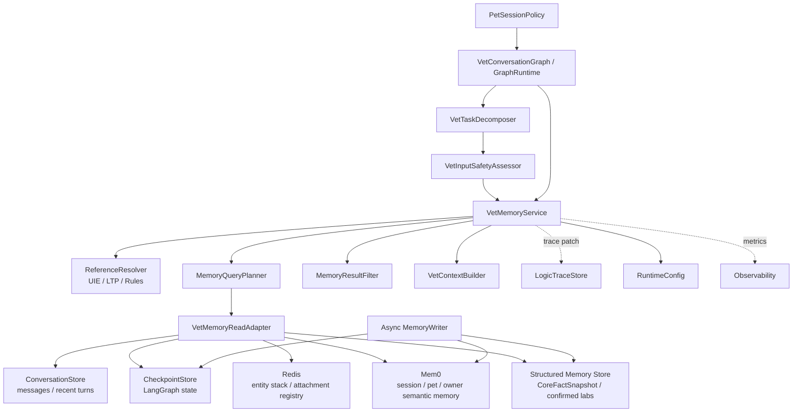
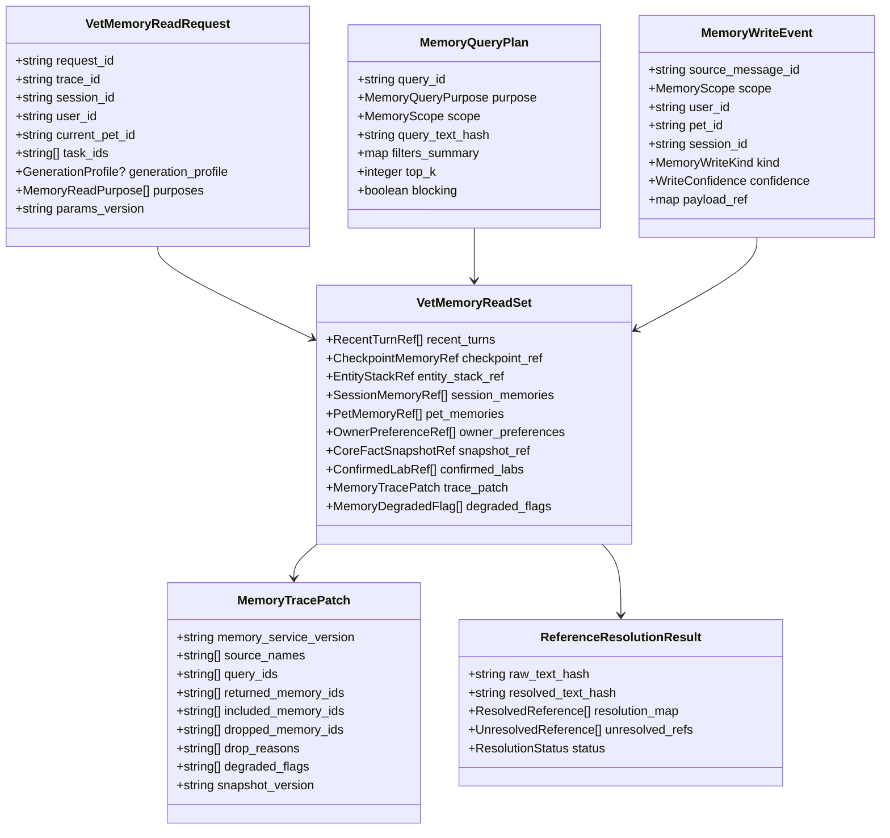
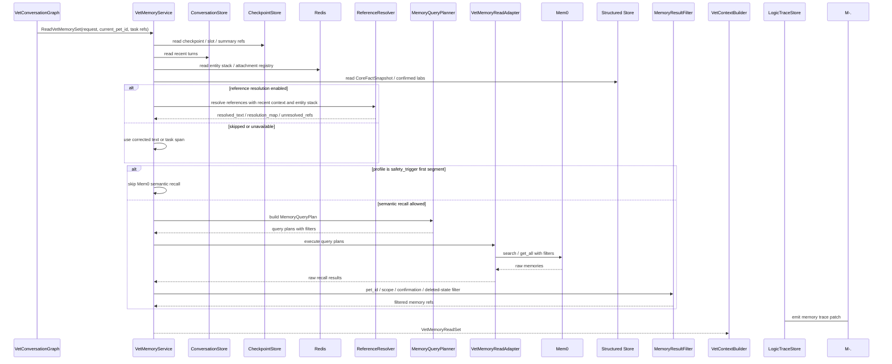
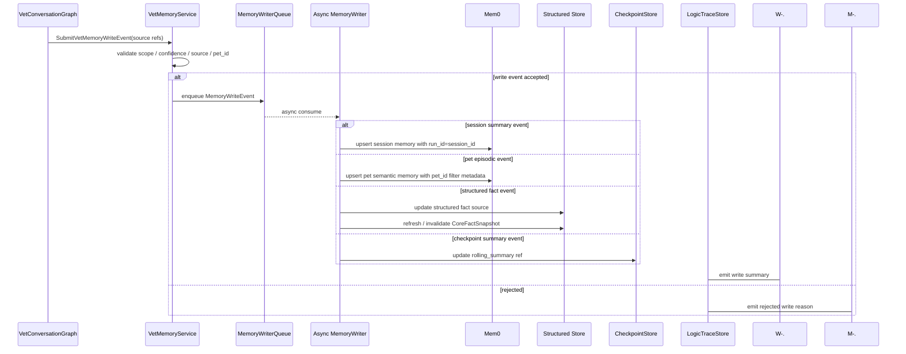
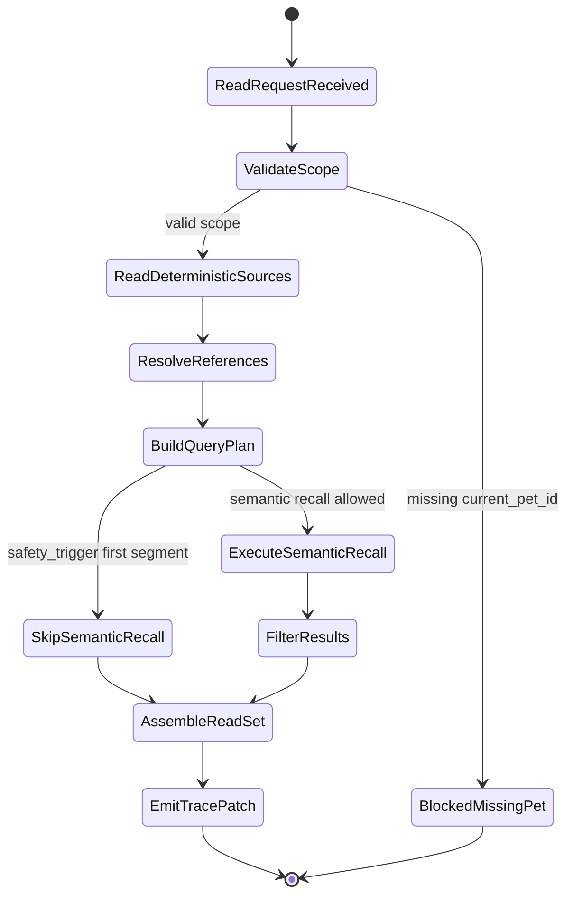

# 兽医记忆组件设计文档 / VetMemoryService

## 3.1 基础元数据 (Metadata)

* **组件标识：** 兽医记忆组件 / `VetMemoryService`
* **责任人 (Owner)：** 待定
* **代码仓库：** 当前仓库，正式 Git Repository URL 待补充
* **关联需求：**
  * [`docs/component_catalog.md`](../../../component_catalog.md) §6.5 兽医记忆组件
  * [`docs/prd.md`](../../../prd.md) §5.1、§5.2.7、§5.4、§6.4、§6.7、§7.5、§8.1、§8.2、§8.4、§9.5、§10
  * [`docs/design_spec.md`](../../../design_spec.md)
  * [`docs/temporary.md`](../../../temporary.md)
  * [`docs/components/l2-vet-business/pet-session-policy/design.md`](../pet-session-policy/design.md)
  * [`docs/components/l0/conversation-store/design.md`](../../l0/conversation-store/design.md)
  * [`docs/components/l0/checkpoint-store/design.md`](../../l0/checkpoint-store/design.md)
  * [`docs/components/l1-ai-runtime/logic-trace-store/design.md`](../../l1-ai-runtime/logic-trace-store/design.md)
* **架构层级：** L2 兽医业务组件 / 记忆聚合与业务适配层
* **文档状态：** 草案

## 3.2 职责边界 (Responsibility Boundaries)

* **核心能力 (Capabilities)：**
* 作为兽医业务层的统一记忆门面，封装短期、中期、长期语义记忆与长期结构化事实的读写入口。
* 复用 `ConversationStore`、`CheckpointStore`、Redis、Mem0、结构化业务存储等成熟中间件能力，并在本组件内完成兽医业务作用域、确认状态、纠正状态和删除状态过滤。
* 按 `user_id`、`session_id`、`pet_id` 与记忆作用域读取当前会话短期上下文、中期会话摘要、当前宠物长期情景记忆、主人级偏好和结构化核心事实。
* 管理 `CoreFactSnapshot` 的读取、版本引用和刷新请求；结构化画像、已确认化验值、慢性问题等 P0 事实优先来自该快照或其结构化源库。
* 为 `VetContextBuilder` 提供只读记忆读集，包括最近 N 轮、session 摘要、同宠情景记忆、主人偏好、已确认化验历史和快照版本引用。
* 为上下文指代消解提供当前会话实体栈、附件 registry、OCR registry、上一轮 segment 引用和中期摘要引用。
* 使用 `MemoryQueryPlanner` 将高置信 `resolved_text`、子任务 span 或纠错后文本转换为 Mem0 查询计划；使用 `VetMemoryReadAdapter` 调用中间件；使用 `MemoryResultFilter` 执行业务后过滤。
* 支持异步 `MemoryWriter`，将已确认、可持久化的宠物级事实、主人级偏好、会话摘要和情景记忆写入对应存储。
* 支持用户查看、纠正、删除记忆；纠正和删除结果必须影响后续召回过滤，并触发 `CoreFactSnapshot` 刷新或失效。
* 输出记忆读取、召回、消解、过滤、降级和写入摘要，供 `LogicTraceStore` 与兽医业务 trace schema 形成连贯逻辑链。
* 在 Mem0、Redis、UIE / LTP 等弱依赖不可用时提供降级读集，保证急症、安全和基础问诊路径不因语义记忆失败而阻断。

* **非目标 (Non-Goals)：**
* 不实现 JWT、OAuth、登录态解析或用户身份认证。当前阶段 Agent 服务仅在局域网访问，身份上下文由上游可信传入。
* 不校验、创建或改写 session 与 `pet_id` 的绑定关系；一 session 一宠策略由 `PetSessionPolicy` 负责。
* 不根据自然语言文本定宠、切宠、改写结构化 `pet_id` 或把它宠临床事实并入当前宠物上下文。
* 不替代 `VetContextBuilder` 执行领域上下文编译，不生成最终 `prompt_blocks`，不决定 token 压缩后哪些内容进入模型。
* 不替代 `VetInputSafetyAssessor` 执行 SAF 信号判定、意图判决、`generation_profile` 判决或跨域裁决。
* 不替代 `VetOutputSafetyReviewer` 或 `VetDeterministicFallbackGate` 执行输出安全审查、T4 裁剪、毒物拦截或发布前否决。
* 不管理 RAG 知识库，不将运行时对话、急症输出或留痕内容写入知识库索引。
* 不执行 OCR、病历结构化、检验参考区间匹配或异常标注；本组件仅读取已确认和已结构化的结果引用。
* 不把 Mem0 语义召回结果作为结构化事实真源；Mem0 结果必须经过作用域、确认状态、纠正状态和置信度过滤后才能作为上下文候选。
* 不将未确认 OCR、低置信指代消解、模型猜测、历史处方剂量或被删除 / 被纠正事实写入 P0 事实快照。
* 不在急症首段路径等待中长期语义召回、复杂指代消解或摘要刷新。
* 不保存完整 A/B/C 逻辑链；本组件仅产出记忆相关 trace patch，完整落库由 `LogicTraceStore` 承担。

## 3.3 架构与交互设计 (Architecture & Interaction)

* **上下文视图 (Context Diagram)：**

`VetMemoryService` 是 FastAPI 应用内的 L2 业务组件，通常被 LangGraph 中的记忆读取节点、指代消解节点、上下文构建节点和异步记忆写入 job 调用。组件遵循“中间件为主，自研层负责兼容 / 业务逻辑”的原则：短期状态复用 Redis 与 `CheckpointStore`，最近消息复用 `ConversationStore`，中长期语义记忆复用 Mem0，结构化事实复用业务存储；本组件仅负责兽医业务作用域、过滤、适配、版本引用和 trace patch。

本组件不作为独立网络服务暴露。若后续服务化，应保持相同的业务契约语义，并继续由上游接入层处理认证、限流和传输错误。

* **核心领域模型 (Domain Model)：**

模型说明：

* `VetMemoryReadRequest` 必须消费 `PetSessionPolicy` 确认后的 `current_pet_id`；本组件不得从自然语言文本重定宠物。
* `VetMemoryReadSet` 是提供给 `VetContextBuilder` 的只读记忆读集，不等价于最终 prompt。
* `MemoryQueryPlan` 描述中长期语义召回计划；边界由 filters 和后过滤保证，`query_text` 只负责相关性。
* `ReferenceResolutionResult` 描述上下文指代消解结果；消解结果可用于查询与摘要，但不得改写结构化 `pet_id`、附件归属或确认状态。
* `MemoryWriteEvent` 是异步记忆写入的输入事件；只有高置信、可持久化、作用域明确的内容允许写入。
* `MemoryTracePatch` 是本组件提供给逻辑链的记忆摘要；完整 DTO、字段约束、错误码和正式示例由代码内 Pydantic 模型或 API 治理平台维护。

## 3.4 契约与依赖 (Contracts & Dependencies)

* **入向契约 (Inbound APIs)：**
* 读取当前轮兽医记忆读集：`ReadVetMemorySet` -> API 治理平台链接待建立
* 读取 `CoreFactSnapshot` 引用：`GetCoreFactSnapshotRef` -> API 治理平台链接待建立
* 查询同宠中长期情景记忆：`SearchPetEpisodicMemory` -> API 治理平台链接待建立
* 查询主人级偏好：`GetOwnerPreferences` -> API 治理平台链接待建立
* 执行上下文指代消解：`ResolveContextualReferences` -> API 治理平台链接待建立
* 提交异步记忆写入事件：`SubmitVetMemoryWriteEvent` -> API 治理平台链接待建立
* 纠正记忆：`CorrectVetMemoryItem` -> API 治理平台链接待建立
* 删除记忆：`DeleteVetMemoryItem` -> API 治理平台链接待建立

接口原则：

* 当前契约优先作为 FastAPI 应用内 service 接口、LangGraph 节点和异步 job 接口使用；若后续服务化，再登记 HTTP / RPC 接口。
* 所有读接口必须携带 `request_id`、`trace_id`、`user_id`、`session_id`、`current_pet_id` 与 `params_version`。
* `current_pet_id` 必须来自 `PetSessionPolicy`；本组件不得因指代消解、Mem0 召回或历史摘要改变该字段。
* 读取宠物级临床记忆、已确认化验、附件引用和情景记忆时，必须按 `current_pet_id` 过滤；返回项 `pet_id` 不一致必须丢弃。
* 读取主人级偏好时，可按 `user_id` 拉取，但结果不得被标记为当前宠物临床事实。
* 中期会话记忆应使用 `session_id` 或 Mem0 `run_id` 作为会话作用域，并同时保留 `pet_id` metadata。
* `ResolveContextualReferences` 可产出完整 `resolved_text`，但不得修改结构化 `pet_id`、session 绑定、附件归属、OCR 确认状态或用药安全边界。
* `SearchPetEpisodicMemory` 必须先生成 `MemoryQueryPlan`，再执行 Mem0 查询；禁止业务节点直接绕过本组件调用 Mem0。
* Mem0 返回结果必须经 `MemoryResultFilter` 处理 deleted、corrected、superseded、pet_id mismatch、unconfirmed OCR、low confidence 等状态。
* `CoreFactSnapshot` 与结构化源库优先于 Mem0 语义召回；二者冲突时，Mem0 结果只能作为待确认情景记忆。
* `safety_trigger` 首段路径不得阻塞等待 Mem0、复杂指代消解或异步摘要刷新。
* 所有写入事件必须包含来源、作用域、置信度和可纠正引用；低置信模型猜测不得写入长期事实。
* 纠正和删除必须生成可用于后续召回过滤的状态标记，并触发相关快照失效或刷新事件。
* 所有读写结果必须返回记忆相关 trace patch；写入 `LogicTraceStore` 失败时不得静默吞掉降级状态。

记忆作用域枚举：

* `session`：当前会话内摘要、话题、已问问题和未闭合事项。
* `pet`：当前宠物历史主诉、转归、慢性问题、已确认资料和饲养 / 行为情景记忆。
* `owner`：主人沟通偏好、风险偏好、长期饲养偏好和跨会话展示偏好。
* `structured_fact`：由结构化源库和 `CoreFactSnapshot` 承载的版本化事实。

记忆读取目的枚举：

* `recent_turns`：读取最近 N 轮确定性消息。
* `entity_stack`：读取当前会话实体栈和资源引用。
* `session_summary`：读取当前 session 中期摘要。
* `pet_episode_recall`：召回当前宠物历史情景记忆。
* `owner_preference`：读取主人偏好。
* `confirmed_lab_history`：读取当前宠物已确认化验历史。
* `core_fact_snapshot`：读取当前宠物核心事实快照。
* `reference_resolution`：执行上下文指代消解。

异常映射原则：

* 缺少 `current_pet_id` 映射为 `MEMORY_MISSING_CURRENT_PET_ID`，并阻断需要宠物级记忆的后续读集。
* `CoreFactSnapshot` 不可用映射为 `MEMORY_SNAPSHOT_UNAVAILABLE`，触发结构化源库回源或最小画像降级。
* `ConversationStore` 读取失败映射为 `MEMORY_RECENT_TURNS_UNAVAILABLE`，触发最近轮数缺失降级。
* `CheckpointStore` 读取失败映射为 `MEMORY_CHECKPOINT_UNAVAILABLE`，触发冷启动槽位降级。
* Redis 实体栈不可用映射为 `MEMORY_ENTITY_STACK_UNAVAILABLE`，指代消解降级为原文。
* Mem0 不可用映射为 `MEMORY_SEMANTIC_STORE_UNAVAILABLE`，跳过中长期语义召回。
* 指代消解失败映射为 `MEMORY_REFERENCE_RESOLUTION_FAILED`，保留纠错后原文。
* 结果过滤后为空映射为 `MEMORY_RECALL_EMPTY_AFTER_FILTER`，不视为系统错误。
* 记忆写入队列不可用映射为 `MEMORY_WRITE_QUEUE_UNAVAILABLE`，不得影响已发布回复，但必须记录降级。

* **出向依赖 (Outbound Dependencies)：**
* **强依赖：**
* `RuntimeConfig`：提供记忆读取策略、召回开关、top_k、降级策略、参数版本和中间件配置引用。不可用时服务不可就绪。
* `ConversationStore`：读取最近 N 轮与消息引用。不可用时当前轮仍可最小化执行，但标准问诊连续性与指代消解能力降级。
* `CheckpointStore`：读取 session 业务状态、slot、rolling summary 引用和 LangGraph state。不可用时进入冷启动降级。
* 结构化记忆源库 / `CoreFactSnapshot` Store：读取当前宠物 P0 事实、已确认化验和快照版本。不可用时需回源宠物 API 或返回降级读集。
* `Observability`：记录记忆读取、召回、过滤、写入、纠正和降级指标。不可用不应阻断核心流程，但需产生降级日志。

* **弱依赖：**
* Redis：承载实体栈、附件 registry 和短期指代消解上下文。不可用时保留原文并跳过实体栈消解。
* Mem0：承载中期会话摘要、长期非结构化情景记忆和主人偏好的语义召回。不可用时跳过中长期语义召回，不得阻断安全触发和基础问诊。
* UIE / LTP / 本地 embedding：用于指代消解、实体识别、语义相似度和话题连续性辅助。不可用时降级为规则与原文。
* 异步任务队列：承载 `MemoryWriter`、summary 刷新和快照刷新。不可用时不影响当前回复发布，但必须记录写入延迟或失败。
* `LogicTraceStore`：保存记忆相关 trace patch。短暂不可用时由上游图运行事件补偿，A/B 级链路应避免静默丢失。
* API 治理平台：维护正式接口字段、错误码和示例。缺失时不阻塞应用内契约实现，但阻塞正式契约冻结。

## 3.5 核心流转机制 (Core Flow Mechanism)

* **状态流转/时序图：**

核心流程约束：

* 所有宠物级读写必须以 `current_pet_id` 为硬过滤条件。
* 主人级偏好可跨宠读取，但必须标记为 owner scope，不得投影为当前宠物临床事实。
* 指代消解输出优先用于 Mem0 query 和会话摘要，不得改写 session 绑定、附件归属或确认状态。
* 结构化事实读取优先于 Mem0；Mem0 召回结果不得覆盖 `CoreFactSnapshot`。
* `safety_trigger` 首段仅允许最小确定性读集，不等待 Mem0、UIE / LTP 或异步摘要刷新。
* 异步写入只接受来源明确、置信度达标、作用域明确的事件；被拒绝事件必须有可追踪原因。
* 纠正或删除记忆后，后续召回必须过滤旧版本、删除项和 superseded 项。
* 本组件返回的 `VetMemoryReadSet` 是候选上下文读集；最终 prompt 选择、裁剪和 P0 注入由 `VetContextBuilder` 完成。

## 3.6 稳定性与可观测性 (Reliability & Observability)

* **流量控制：**
* 单次记忆读集构建应为 ConversationStore、CheckpointStore、Redis、Mem0 和结构化源库分别设置超时与最大返回数量。
* Mem0 查询必须限制 `top_k`、最大 query 数和最大并发数；复杂多任务按子任务 span 查询时应受总预算约束。
* `safety_trigger` 首段路径禁止调用阻塞型中长期语义召回。
* 异步 `MemoryWriter` 应使用队列重试、死信或等价补偿机制；重复写入事件需按来源事件幂等处理。
* 用户纠正 / 删除操作应优先处理，避免已删除或被纠正事实继续被召回。

* **数据一致性：**
* `ConversationStore` 与 `CheckpointStore` 保存短期确定性上下文；Mem0 保存语义记忆；结构化源库与 `CoreFactSnapshot` 保存事实真源。
* `CoreFactSnapshot` 必须按 `pet_id` 版本化；刷新失败时不得用 Mem0 召回结果伪造新快照。
* Mem0 中的 session 记忆应使用 `run_id=session_id` 或等价会话作用域，并保留 `pet_id` metadata。
* Mem0 中的 pet 记忆必须带 `user_id`、`pet_id` 和 `memory_scope=pet` 等可过滤 metadata。
* 未确认 OCR、未验证附件、低置信指代消解结果、被删除或被纠正记忆不得进入 P0 事实读集。
* 结构化事实被纠正后，应标记旧版本 superseded，并触发快照刷新或失效。
* 本组件不保证异步记忆写入与当前轮回复强一致；当前轮回复应基于已确认读集和本轮输入。

* **核心指标 (Golden Signals)：**
* `memory_read_latency_p95`：记忆读集构建 P95 延迟。
* `memory_read_error_rate`：记忆读接口错误率。
* `memory_degraded_rate`：记忆降级读集占比。
* `mem0_search_latency_p95`：Mem0 语义召回 P95 延迟。
* `mem0_unavailable_count`：Mem0 不可用次数。
* `snapshot_unavailable_rate`：`CoreFactSnapshot` 不可用比例。
* `pet_scope_mismatch_drop_count`：因 `pet_id` 不一致被丢弃的记忆数量。
* `memory_filtered_count_by_reason`：按原因统计的召回结果过滤数量。
* `reference_resolution_success_rate`：指代消解成功率。
* `reference_resolution_rollback_count`：指代消解回滚次数。
* `memory_write_queue_lag`：异步写入队列积压。
* `memory_correction_propagation_latency`：纠正 / 删除到后续过滤生效的延迟。
* `trace_patch_emit_failure_count`：记忆 trace patch 写入失败次数。

可观测性要求：

* 每次 A/B 级业务轮次应至少记录记忆来源、快照版本、Mem0 查询计划摘要、召回数量、纳入数量、丢弃原因和降级标记。
* 不记录原始敏感长文本到指标系统；长文本应通过 hash、摘要或受控 trace 字段进入 `LogicTraceStore`。
* 对 `pet_scope_mismatch_drop_count`、`unconfirmed_ocr_drop_count`、`deleted_memory_recalled_count` 设置告警，避免业务隔离或纠正删除链路失效。
* 对 Mem0、Redis、UIE / LTP 的不可用应分别观测，不得合并为笼统“记忆失败”。
* 对急症首段路径应单独观测是否跳过中长期语义召回，以证明记忆组件未阻塞安全触发发布。
