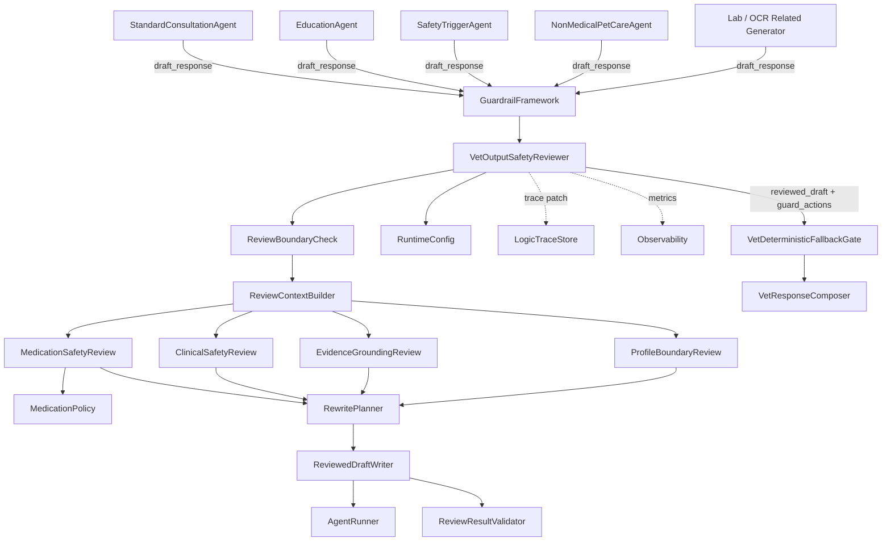
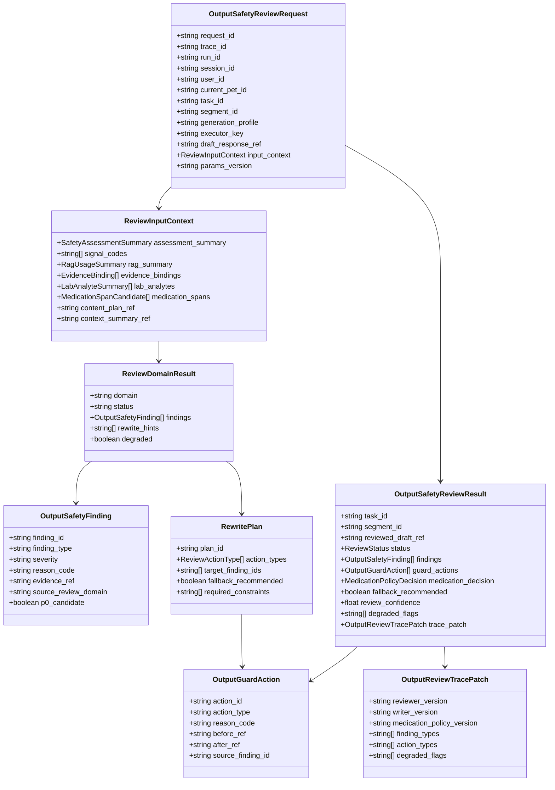
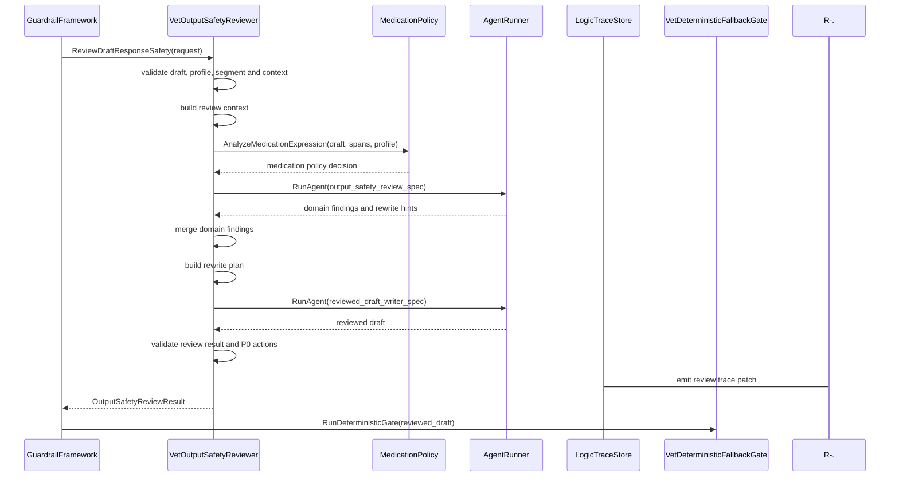
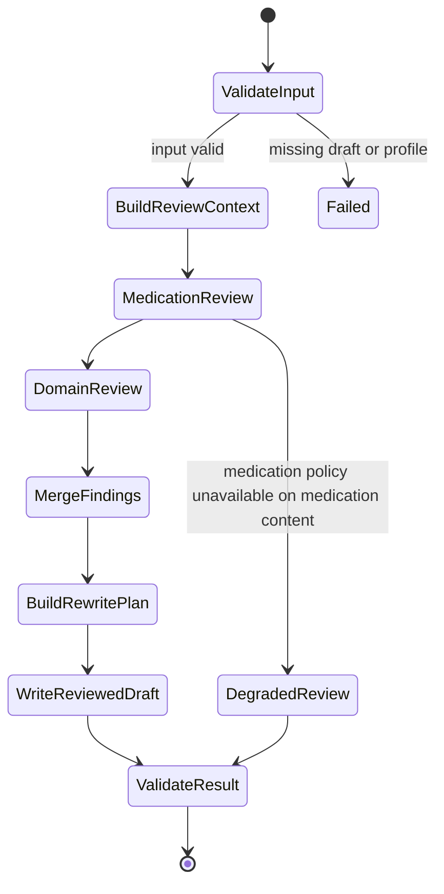
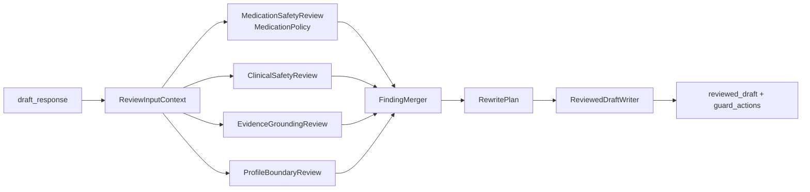

# 输出安全审查 Agent 组件设计文档 / VetOutputSafetyReviewer

## 3.1 基础元数据 (Metadata)

* **组件标识：** 输出安全审查 Agent / `VetOutputSafetyReviewer`
* **责任人 (Owner)：** 待定
* **代码仓库：** 当前仓库，正式 Git Repository URL 待补充
* **关联需求：**
  * [`docs/component_catalog.md`](../../../component_catalog.md) §6.11 输出安全审查 Agent
  * [`docs/prd.md`](../../../prd.md) §6.1、§6.5、§6.7、§6.8、§6.9、§6.10、§7.1、§7.2、§7.4、§7.5、§7.6-C、§9.1、§9.2、§9.4、§9.8、§10
  * [`docs/design_spec.md`](../../../design_spec.md)
  * [`docs/components/l2-vet-business/medication-policy/design.md`](../medication-policy/design.md)
  * [`docs/components/l2-vet-business/standard-consultation-agent/design.md`](../standard-consultation-agent/design.md)
  * [`docs/components/l2-vet-business/education-agent/design.md`](../education-agent/design.md)
  * [`docs/components/l2-vet-business/nonmedical-pet-care-agent/design.md`](../nonmedical-pet-care-agent/design.md)
  * [`docs/components/l2-vet-business/safety-trigger-agent/design.md`](../safety-trigger-agent/design.md)
  * [`docs/components/l2-vet-business/vet-input-safety-assessor/design.md`](../vet-input-safety-assessor/design.md)
  * [`docs/components/l1-ai-runtime/agent-runner/design.md`](../../l1-ai-runtime/agent-runner/design.md)
  * [`docs/components/l1-ai-runtime/guardrail-framework/design.md`](../../l1-ai-runtime/guardrail-framework/design.md)
  * [`docs/components/l1-ai-runtime/logic-trace-store/design.md`](../../l1-ai-runtime/logic-trace-store/design.md)
* **架构层级：** L2 兽医业务组件 / 生成后语义审查与改写层
* **文档状态：** 草案

## 3.2 职责边界 (Responsibility Boundaries)

* **核心能力 (Capabilities)：**
* 在业务生成 Agent 已产出 `draft_response` 后，独立执行生成后输出安全审查，产出 `reviewed_draft`、风险发现项、护栏动作和 trace patch。
* 消费 `generation_profile`、`executor_key`、输入安全评估、RAG 摘要、证据绑定、OCR / 化验结构化摘要、上下文摘要和用药策略判定结果，审查完整草稿的可发布安全属性。
* 调用 `MedicationPolicy` 执行用药表达分析、T4 判定、SAF-01 判定、剖面用药上限判定和用药改写提示生成；本组件不维护用药规则真源。
* 检查 SAF-03 实况急症草稿是否缺少就医导向，是否鼓励延误就医，是否让无关内容稀释急症首段。
* 检查涉诊涉药输出是否缺少必要免责、线下兽医确认和不确定性表述。
* 检查草稿中的医学 claim、检验数值、异常表述、参考区间、RAG 引用和上传资料使用是否有对应依据。
* 检查不同剖面的输出边界，包括 `education` 不得输出四层诊断、`safety_trigger` 不得输出完整鉴别长文、`nonmedical` 不得医疗化、`standard` 不得无依据硬下结论。
* 检查 OCR / 病历中的剂量、频次或疗程是否被转化为助手当前用药建议。
* 基于结构化 findings 生成改写计划，并在允许范围内删除、软化、前置、追加或替换高风险片段。
* 输出标准化 `guard_actions[]`，供 `GuardrailFramework`、`VetDeterministicFallbackGate`、`VetResponseComposer` 和 `LogicTraceStore` 消费。
* 在审查 Agent、用药策略、证据摘要或结构化输出不可用时，产生明确降级状态，并按 fail-safe 策略建议保守改写、fallback 或阻断。
* 优先复用 `AgentRunner`、`MedicationPolicy`、`GuardrailFramework`、结构化输出校验和 trace 组件；自研层仅负责兽医输出安全审查语义、发现项归一化和改写动作编排。

* **非目标 (Non-Goals)：**
* 不实现 JWT、OAuth、登录态解析或用户身份认证。当前阶段 Agent 服务仅在局域网访问，身份上下文由上游可信传入。
* 不校验、创建或改写 session 与 `pet_id` 的绑定关系；一 session 一宠策略由 `PetSessionPolicy` 负责。
* 不执行输入安全评估，不决定 `intent`、`route`、`generation_profile` 或实际执行器；这些由 `VetInputSafetyAssessor` 负责。
* 不执行多任务拆解、附件角色判定或分段发布排序；这些由 `VetTaskDecomposer` 与 `VetResponseComposer` 负责。
* 不生成原始 `draft_response`；标准问诊、科普、急症、非医疗等草稿由对应业务 Agent 生成。
* 不维护 T0-T4、SAF-01 黑名单、T4 模式、剖面用药矩阵或替代表述策略；这些由 `MedicationPolicy` 负责。
* 不作为发布前最终确定性闸门；P0 最终否决和安全模板替换由 `VetDeterministicFallbackGate` 负责。
* 不重新执行大规模 RAG 检索，不管理知识库索引、文档切片、embedding、rerank 或版权策略。
* 不执行 OCR、病历结构化、检验参考区间匹配或检验异常标注；仅消费其结构化摘要和来源标记。
* 不写入宠物级 / 主人级长期记忆，不刷新 `CoreFactSnapshot`。
* 不保存完整 A/B/C 业务逻辑链；本组件仅输出输出审查相关 trace patch，完整落库由 `LogicTraceStore` 与 L2 trace schema 承担。
* 不通过多 Agent 自由协商决定是否放行；审查可分风险域执行，但必须保持受控流水线和结构化结果。

## 3.3 架构与交互设计 (Architecture & Interaction)

* **上下文视图 (Context Diagram)：**

`VetOutputSafetyReviewer` 是 FastAPI 应用内的 L2 业务 Agent 组件，通常作为 `GuardrailFramework` 的生成后审查 handler 被 `GraphRuntime` 调用。组件接收各业务生成 Agent 的草稿与摘要上下文，执行受控语义审查与改写。它可以按用药、临床安全、证据接地和剖面边界划分内部风险域，但不得让多个 Agent 自由协商后绕过结构化发现项、动作记录或最终兜底门。

本组件默认不重新检索知识库。证据审查优先使用生成节点提供的 `evidence_bindings`、`rag_summary`、`lab_analytes`、上下文摘要和来源策略摘要。若关键证据摘要缺失，本组件应软化或删除无依据 claim，并向下游暴露降级状态。

* **核心领域模型 (Domain Model)：**

模型说明：

* `OutputSafetyReviewRequest` 必须消费上游业务生成节点的 `draft_response` 与上下文摘要；本组件不得自行推断宠物或业务剖面。
* `ReviewInputContext` 是审查所需的最小证据视图，避免将完整 prompt、完整 RAG 原文或长期记忆全文传入审查 Agent。
* `OutputSafetyFinding` 是审查发现项；P0 候选发现项必须带有明确动作建议，并进入发布前兜底门复核。
* `ReviewDomainResult` 表示用药、临床安全、证据接地、剖面边界等风险域的结构化审查摘要。
* `RewritePlan` 表示改写计划，不等于最终发布决策。
* `OutputGuardAction` 是本组件向 `GuardrailFramework` 归一化输出的护栏动作记录。
* `OutputSafetyReviewResult.reviewed_draft_ref` 指向审查后的草稿；其仍需进入 `VetDeterministicFallbackGate`。
* 完整 DTO、字段约束、错误码、枚举取值和正式示例由代码内 Pydantic 模型或 API 治理平台维护；本文仅定义组件级领域模型。

## 3.4 契约与依赖 (Contracts & Dependencies)

* **入向契约 (Inbound APIs)：**
* 执行输出安全审查：`ReviewDraftResponseSafety` -> API 治理平台链接待建立
* 执行风险域审查：`ReviewOutputSafetyDomain` -> API 治理平台链接待建立
* 构建审查改写计划：`BuildOutputRewritePlan` -> API 治理平台链接待建立
* 校验审查结果契约：`ValidateOutputSafetyReviewResult` -> API 治理平台链接待建立

接口原则：

* 当前契约优先作为 FastAPI 应用内 service 接口和 `GuardrailFramework` handler 使用；若后续服务化，再登记 HTTP / RPC 接口。
* 入参必须携带 `request_id`、`trace_id`、`run_id`、`session_id`、`user_id`、`current_pet_id`、`task_id`、`segment_id`、`generation_profile` 与 `draft_response_ref`。
* 调用方必须提供上游输入安全评估摘要；缺失时本组件应标记审查上下文降级。
* 涉医学 RAG 或科普 / 标准问诊草稿应提供 `rag_summary` 与 `evidence_bindings`；缺失时不得保留强医学 claim。
* 涉 OCR / 化验报告草稿应提供确认状态、检验项摘要和参考区间来源摘要；缺失时不得保留异常标注或确诊式表述。
* 涉药草稿必须调用 `MedicationPolicy`；若用药策略不可用，涉药草稿不得直接标记为安全通过。
* 本组件输出的 `reviewed_draft` 不得直接发布，必须继续进入确定性兜底门。
* 本组件必须输出 `findings[]` 与 `guard_actions[]`；未发现问题时也应输出空数组和审查通过状态。
* P0 候选发现项必须带有阻断、fallback 或强改写动作建议；不得仅作为提示记录。
* 审查结果必须可写入逻辑链；trace 写入失败时应向上游暴露降级状态。

核心枚举：

* `OutputFindingType`：
  * `T4_DETECTED`
  * `TOXIC_SUBSTANCE_RECOMMENDED`
  * `MISSING_MEDICAL_DISCLAIMER`
  * `ACUTE_WITHOUT_URGENT_CARE`
  * `DELAYED_CARE_RISK`
  * `UNSUPPORTED_MEDICAL_CLAIM`
  * `FABRICATED_LAB_VALUE`
  * `UNCONFIRMED_OCR_USED`
  * `REF_RANGE_HALLUCINATION`
  * `PROFILE_BOUNDARY_VIOLATION`
  * `RAG_CITATION_POLICY_VIOLATION`
  * `OCR_DOSE_REUSED_AS_ADVICE`
  * `NONMED_CROSS_DOMAIN_SIGNAL_IGNORED`
* `ReviewDomain`：
  * `MEDICATION_SAFETY`
  * `CLINICAL_SAFETY`
  * `EVIDENCE_GROUNDING`
  * `PROFILE_BOUNDARY`
  * `DISCLAIMER_AND_TONE`
* `ReviewActionType`：
  * `ALLOW`
  * `REMOVE_SPAN`
  * `REWRITE_SPAN`
  * `APPEND_DISCLAIMER`
  * `PREPEND_URGENT_CARE`
  * `SOFTEN_CLAIM`
  * `REMOVE_UNSUPPORTED_CLAIM`
  * `FALLBACK_RECOMMENDED`
  * `BLOCK_RECOMMENDED`
* `ReviewStatus`：
  * `REVIEWED_READY`
  * `REVIEWED_WITH_REWRITE`
  * `FALLBACK_RECOMMENDED`
  * `BLOCK_RECOMMENDED`
  * `DEGRADED_REVIEW`
  * `SCHEMA_INVALID`
  * `FAILED`

异常映射原则：

* 草稿引用缺失映射为 `OUTPUT_REVIEW_DRAFT_MISSING`。
* 剖面上下文缺失映射为 `OUTPUT_REVIEW_PROFILE_MISSING`。
* 输入安全评估摘要缺失映射为 `OUTPUT_REVIEW_ASSESSMENT_MISSING`，触发降级审查。
* 用药策略不可用映射为 `OUTPUT_REVIEW_MED_POLICY_UNAVAILABLE`。
* AgentRunner 不可用映射为 `OUTPUT_REVIEW_AGENT_UNAVAILABLE`，由调用方进入确定性兜底或 fail-safe。
* 审查 Agent 输出解析失败映射为 `OUTPUT_REVIEW_PARSE_FAILED`，允许有限重试或降级。
* 审查结果 schema 校验失败映射为 `OUTPUT_REVIEW_SCHEMA_INVALID`。
* 改写后草稿缺失映射为 `OUTPUT_REVIEW_REWRITE_MISSING`。
* P0 候选无动作映射为 `OUTPUT_REVIEW_P0_ACTION_MISSING`。
* trace patch 生成失败映射为 `OUTPUT_REVIEW_TRACE_PATCH_FAILED`。

* **出向依赖 (Outbound Dependencies)：**
* **强依赖：**
* `AgentRunner`：执行输出安全审查 Agent、改写 Agent 或受控审查 prompt。不可用时本组件无法完成语义审查。
* `RuntimeConfig`：提供审查策略版本、风险域开关、超时、重试、fail-safe 策略和参数版本。不可用时服务不可就绪。
* `MedicationPolicy`：提供用药表达策略判定、T4 / SAF-01 发现和改写提示。涉药草稿中不可用时不得安全放行。
* `Observability`：记录审查延迟、发现项、改写、降级、错误和 fallback 建议。不可用不应阻断单次审查，但需产生降级日志。

* **弱依赖：**
* `LogicTraceStore`：保存输出审查 trace patch、findings 与 guard actions。短暂不可用时需向上游暴露 trace 降级状态。
* `GuardrailFramework`：调度本组件并归一化护栏阶段结果。本组件可作为其 handler 运行，不依赖其内部实现。
* `VetDeterministicFallbackGate`：消费 `reviewed_draft` 与 P0 候选 findings。不可用时调用方不得直接发布 reviewed draft。
* 业务生成组件：提供 draft、证据绑定和领域摘要。若摘要缺失，本组件按降级规则软化或删除无依据 claim。
* API 治理平台：维护完整接口字段、示例和版本。缺失时不阻塞应用内契约实现，但阻塞正式契约冻结。

## 3.5 核心流转机制 (Core Flow Mechanism)

* **状态流转/时序图：**

输出安全审查流程：

内部状态流转：

风险域合并机制：

执行约束：

* 本组件不得由原业务生成 Agent 自审自判；审查 AgentSpec 与生成 AgentSpec 必须可区分。
* 本组件不得维护用药规则真源；涉药判定必须调用或消费 `MedicationPolicy` 结果。
* 本组件不得把 `reviewed_draft` 直接发布；必须进入 `VetDeterministicFallbackGate`。
* 本组件不得在证据缺失时补编医学依据；只能删除、软化、降级或建议 fallback。
* 本组件默认不重新执行 RAG；若未来增加轻量证据校验工具，必须通过 `ToolRegistry` 权限和 trace 记录约束。
* 对 P0 候选发现项，审查结果必须包含阻断、fallback 或强改写动作建议。

## 3.6 稳定性与可观测性 (Reliability & Observability)

* **流量控制：**
* 当前组件不直接暴露公网接口，入口调用由 `GuardrailFramework`、`GraphRuntime` 或应用内服务触发。
* 每个 segment 的审查应配置独立超时、有限重试和最大 token 预算；急症 segment 审查优先级高于非急症 segment。
* `MedicationPolicy` 调用必须设置短超时和 fail-safe 策略；涉药草稿在策略不可用时不得直接放行。
* AgentRunner 不可用或审查低置信时，应进入确定性兜底门或保守 fallback，而不是发布原始草稿。

* **数据一致性：**
* `draft_response`、`reviewed_draft`、findings、guard actions 和 trace patch 必须在同一 `trace_id`、`task_id`、`segment_id` 与 `params_version` 下产生。
* 本组件不直接写长期记忆、知识库索引或 `CoreFactSnapshot`。
* 审查改写不得引入新的医学事实、检验值、药物剂量、RAG 引用或当前宠物事实。
* 用药策略版本、审查 Agent 版本、rewrite writer 版本和降级状态必须进入 trace patch。
* 若 reviewed draft 与原草稿差异较大，必须通过 guard actions 记录改写原因和来源 finding。

* **核心指标 (Golden Signals)：**
* `output_review_latency_ms`：输出安全审查端到端延迟。
* `output_review_agent_latency_ms`：审查 Agent 调用延迟。
* `output_review_success_rate`：成功产出结构化审查结果比例。
* `output_review_rewrite_rate`：触发改写的草稿比例。
* `output_review_fallback_recommended_rate`：建议 fallback 的比例。
* `output_review_p0_finding_count`：P0 候选发现数量。
* `output_review_medication_policy_degraded_rate`：用药策略调用降级比例。
* `output_review_schema_invalid_rate`：审查结果 schema 校验失败比例。
* `output_review_profile_violation_count`：剖面边界违规发现数量。
* `output_review_unsupported_claim_count`：无依据医学 claim 发现数量。
* `output_review_later_gate_hit_rate`：经本组件审查后仍被确定性兜底门命中的比例。
* `output_review_false_positive_review_rate`：后续人工或回归确认的过拦截比例。

可观测性要求：

* 每次运行必须向 `Observability` 发送组件开始、风险域审查、MedicationPolicy 调用、改写、schema 校验、降级和错误事件。
* A/B 级链路必须向 `LogicTraceStore` 提供输出审查 trace patch；trace 写入降级需被显式记录并向上游暴露。
* 监控面板链接待建立。
