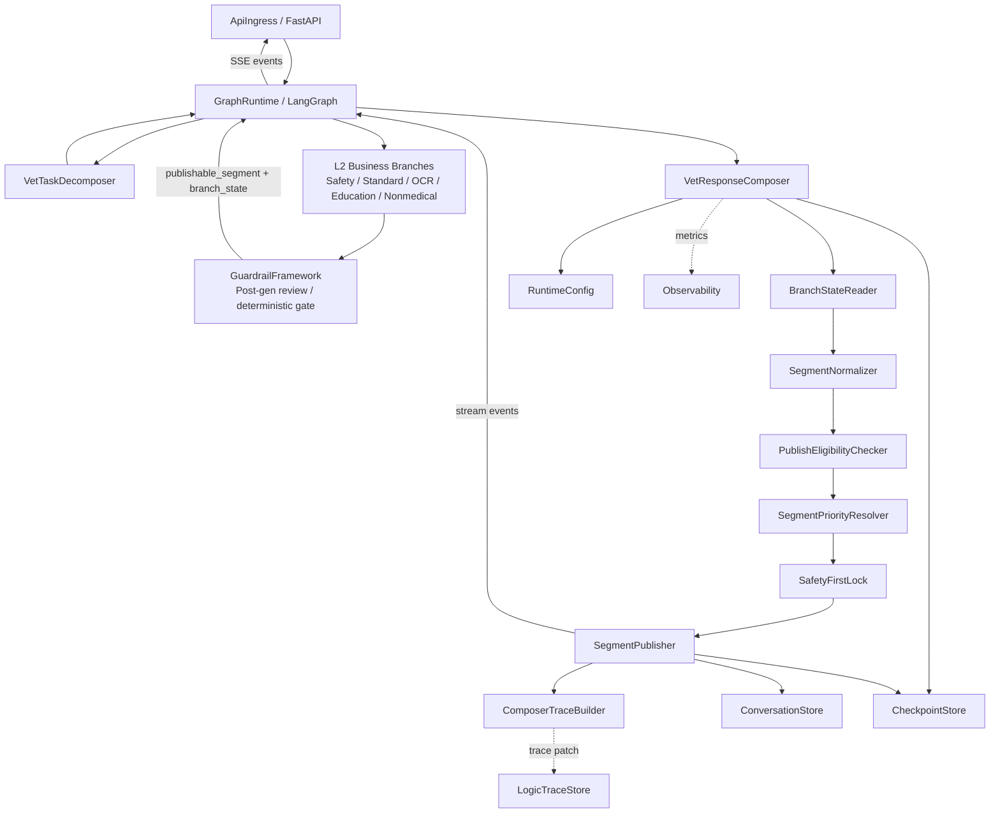
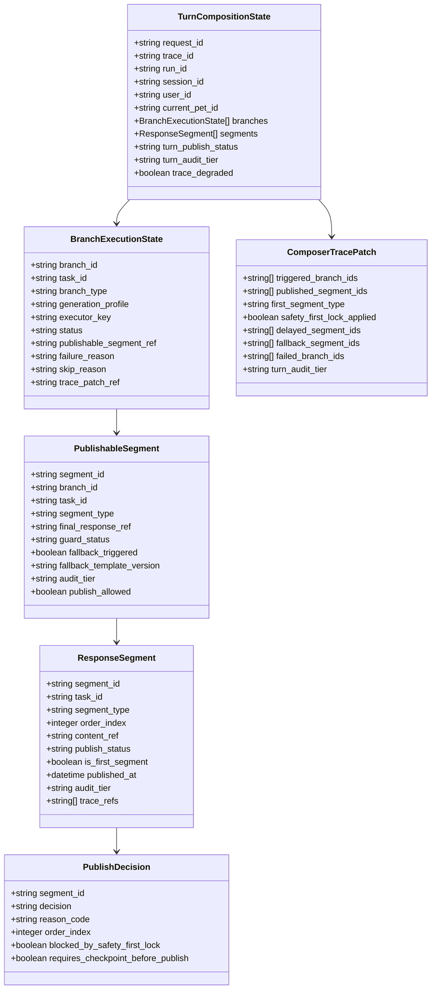
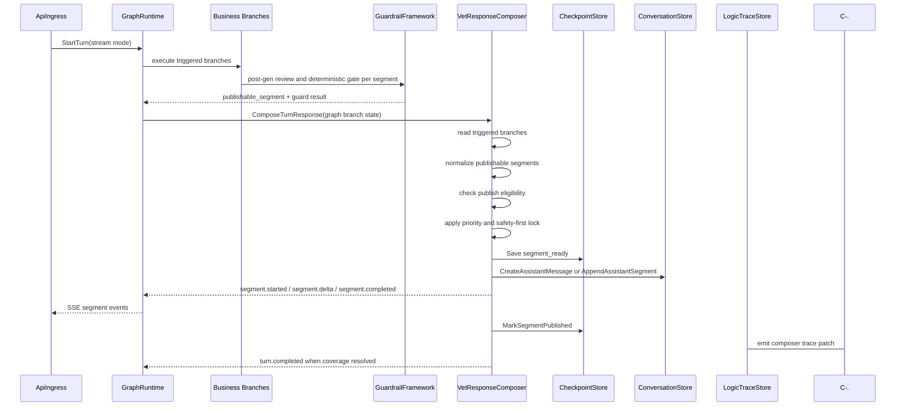
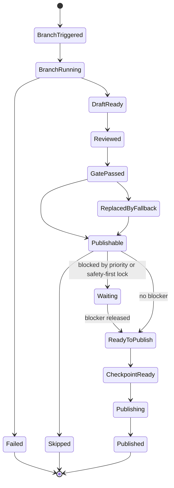
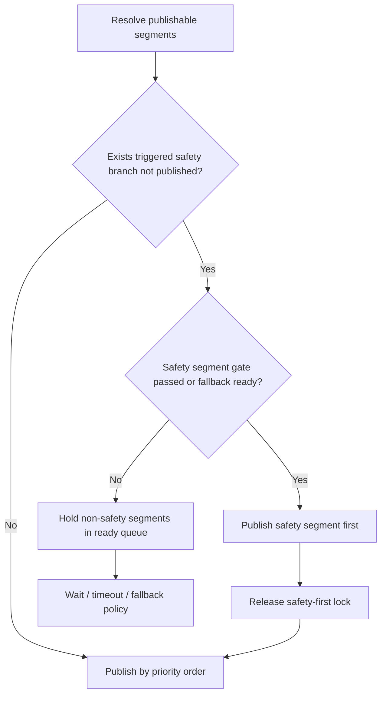

# 回复合成与分段发布组件设计文档 / VetResponseComposer

## 3.1 基础元数据 (Metadata)

* **组件标识：** 回复合成与分段发布组件 / `VetResponseComposer`
* **责任人 (Owner)：** 待定
* **代码仓库：** 当前仓库，正式 Git Repository URL 待补充
* **关联需求：**
  * [`docs/component_catalog.md`](../../../component_catalog.md) §6.14 回复合成与分段发布组件
  * [`docs/prd.md`](../../../prd.md) §5.3、§5.3.1、§7.5、§7.6-C、§7.6-D、§7.6-E、§9.2、§10
  * [`docs/design_spec.md`](../../../design_spec.md)
  * [`docs/components/l0/api-ingress/design.md`](../../l0/api-ingress/design.md)
  * [`docs/components/l0/conversation-store/design.md`](../../l0/conversation-store/design.md)
  * [`docs/components/l0/checkpoint-store/design.md`](../../l0/checkpoint-store/design.md)
  * [`docs/components/l1-ai-runtime/graph-runtime/design.md`](../../l1-ai-runtime/graph-runtime/design.md)
  * [`docs/components/l1-ai-runtime/guardrail-framework/design.md`](../../l1-ai-runtime/guardrail-framework/design.md)
  * [`docs/components/l1-ai-runtime/logic-trace-store/design.md`](../../l1-ai-runtime/logic-trace-store/design.md)
  * [`docs/components/l2-vet-business/vet-task-decomposer/design.md`](../vet-task-decomposer/design.md)
  * [`docs/components/l2-vet-business/vet-output-safety-reviewer/design.md`](../vet-output-safety-reviewer/design.md)
* **架构层级：** L2 兽医业务组件 / 多任务回复合成与发布编排层
* **文档状态：** 草案

## 3.2 职责边界 (Responsibility Boundaries)

* **核心能力 (Capabilities)：**
* 消费 `GraphRuntime` 中已触发业务分支的结构化状态，将通过输出安全审查与确定性兜底门的 `publishable_segment` 归一为用户可见 `segments[]`。
* 基于 LangGraph 分支触发状态判断本轮覆盖范围，不单独维护复杂 `SegmentPlanBuilder` 或重复的任务计划真源。
* 按业务优先级控制 segment 发布顺序，保证 `safety_trigger` 段优先、医疗段优先于非医疗段、独立 OCR / 病历段位于医疗段之后且非医疗段之前。
* 在存在未发布 `safety_trigger` 分支时启用急症首发锁，防止 OCR、科普、饲养或其他非急症段抢先发布。
* 对 segment 执行发布资格检查，确认其已完成 7.6-C 输出安全审查、7.6-D 确定性兜底门，并持有可发布 `final_response`。
* 支持段级流式发布事件，向 `ApiIngress` / `GraphRuntime` 提供 `turn.started`、`segment.started`、`segment.delta`、`segment.completed`、`turn.completed` 等事件序列。
* 支持同步响应场景下生成完整 `segments[]` 和按相同业务顺序拼接的 `final_response_text`。
* 协调 `ConversationStore`、`CheckpointStore` 与 `LogicTraceStore`，记录 segment 发布事实、发布状态、幂等状态和逻辑链摘要。
* 维护 segment 级发布状态，避免运行恢复、节点重放或请求重试导致重复发布。
* 在整轮结束前检查已触发分支的 eventual coverage，确保每个被触发分支均有已发布段、fallback 段、降级段、明确跳过状态或失败原因。
* 输出 `ComposerTracePatch`，记录分支触发摘要、发布顺序、首段安全约束、降级状态、发布时间和整轮 `audit_tier` 聚合结果。
* 优先复用 LangGraph state、`GraphRuntime` 事件、`CheckpointStore` 幂等状态和 `ConversationStore` 多段消息能力；自研层仅负责兽医业务发布顺序和 segment 发布控制。

* **非目标 (Non-Goals)：**
* 不实现 JWT、OAuth、登录态解析或用户身份认证。当前阶段 Agent 服务仅在局域网访问，身份上下文由上游可信传入。
* 不执行任务拆解、意图识别、附件角色判定或业务分支触发；这些由 `VetTaskDecomposer` 与主编排图负责。
* 不生成医疗、科普、非医疗养宠、OCR 解读或急症回复正文；正文由对应业务 Agent / 组件生成。
* 不调用 LLM 对多个 segment 进行二次整篇润色、改写或再生成，避免破坏已通过护栏的段级安全属性。
* 不执行输出安全审查、T4 删除、毒物建议拦截、免责追加、急症语义审查或最终 P0 否决；这些由 `VetOutputSafetyReviewer`、`GuardrailFramework` 与 `VetDeterministicFallbackGate` 负责。
* 不判断化验异常、参考区间来源、用药策略、RAG 证据真实性或医学结论正确性；本组件只消费上游结构化结果和发布门状态。
* 不决定 `generation_profile`、`executor_key`、`audit_tier` 判定规则或 A/B/C 留痕字段全集；这些由上游业务组件和 trace schema 负责。
* 不作为 HTTP / SSE 协议适配层；连接管理、心跳、客户端断开处理入口由 `ApiIngress` 负责。
* 不保存完整对话正文、完整 guard 三联稿、完整 RAG 片段或完整业务逻辑链；本组件只写入发布事实和 trace patch，权威存储分别由 `ConversationStore` 与 `LogicTraceStore` 承担。
* 不提供跨轮后台补发、用户自选段顺序、多端订阅编排或复杂发布 DSL；这些能力如后续需要，应在发布事件总线或更高阶编排层扩展。

## 3.3 架构与交互设计 (Architecture & Interaction)

* **上下文视图 (Context Diagram)：**

`VetResponseComposer` 是 FastAPI 应用内的 L2 业务发布编排组件，通常作为 LangGraph 主图中业务分支和护栏节点之后的响应发布节点被 `GraphRuntime` 调用。组件不直接维护一套独立 segment 计划，而是以图状态中已经触发的分支为本轮覆盖事实来源。

本组件采用确定性状态编排，不作为 Agent，也不调用 LLM。它的核心职责是把已经具备发布资格的 segment 按业务顺序可靠发布，并把发布事实写入会话事实、checkpoint 与逻辑链。

* **核心领域模型 (Domain Model)：**

模型说明：

* `BranchExecutionState` 来自 LangGraph 编排状态，是本轮覆盖对象的事实来源；Composer 不重新推导业务意图。
* `PublishableSegment` 表示某个分支已经完成输出审查和确定性兜底后的候选发布段。
* `ResponseSegment` 是用户可见 segment 的统一发布模型，可同步拼接，也可通过 SSE 逐段发布。
* `TurnCompositionState` 是本轮合成发布状态，必须与 `request_id`、`trace_id`、`run_id`、`session_id` 和 `current_pet_id` 绑定。
* `PublishDecision` 表示 Composer 对单个候选段的发布、等待、跳过或失败判断。
* `ComposerTracePatch` 只记录回复合成与发布阶段的摘要，不替代完整业务逻辑链。
* 完整 DTO、字段约束、正式枚举、错误码和示例由代码内 Pydantic 模型或 API 治理平台维护；本文仅定义组件级领域模型。

## 3.4 契约与依赖 (Contracts & Dependencies)

* **入向契约 (Inbound APIs)：**
* 合成本轮可发布回复：`ComposeTurnResponse` -> API 治理平台链接待建立
* 注册或刷新可发布 segment：`RegisterPublishableSegment` -> API 治理平台链接待建立
* 计算下一批可发布段：`ResolveNextPublishableSegments` -> API 治理平台链接待建立
* 发布单个 segment：`PublishSegment` -> API 治理平台链接待建立
* 完成本轮发布：`FinalizeTurnComposition` -> API 治理平台链接待建立
* 校验 segment 发布状态：`ValidateSegmentPublishState` -> API 治理平台链接待建立

接口原则：

* 当前契约优先作为 FastAPI 应用内 service 接口和 LangGraph 节点接口使用；若后续服务化，再登记 HTTP / RPC 接口。
* 入参必须携带 `request_id`、`trace_id`、`run_id`、`session_id`、`user_id`、`current_pet_id`、`params_version` 与 graph state schema version。
* 入参必须包含已触发业务分支状态；Composer 以 `BranchExecutionState` 判断本轮覆盖范围，不从自然语言重新推导任务。
* 进入发布队列的 segment 必须具备 `final_response_ref`、`guard_status=gate_passed` 或等价安全模板替换状态、稳定 `segment_id` 与 `publish_allowed=true`。
* `draft_response`、`reviewed_draft`、未完成 deterministic gate 的候选文本不得进入用户可见发布队列。
* 若存在未发布 `safety_trigger` 分支，非急症 segment 即使已就绪也必须等待急症段或急症 fallback 段完成发布。
* `segment_id` 必须在同一 `run_id` 内稳定；重复调用 `PublishSegment` 不得重复写入消息或重复对外发布。
* 同步响应与流式响应必须使用同一 segment 排序规则，不得在非流式场景下调用 LLM 将多个安全段重写为一篇新正文。
* 本轮 `turn_audit_tier` 应按已发布 segment 与已触发分支的最高 tier 聚合；具体 tier 字段裁剪由 trace schema 负责。
* 组件输出必须包含可供 `LogicTraceStore` 消费的 `ComposerTracePatch`；trace 写入失败时必须向上游暴露 `trace_degraded` 状态。

异常映射原则：

* graph branch 状态缺失映射为 `COMPOSER_BRANCH_STATE_MISSING`。
* segment 缺少稳定 `segment_id` 映射为 `COMPOSER_SEGMENT_ID_MISSING`。
* segment 未通过发布门映射为 `COMPOSER_SEGMENT_NOT_GATE_PASSED`。
* 尝试发布 `draft_response` 或 `reviewed_draft` 映射为 `COMPOSER_UNSAFE_STAGE_PUBLISH_BLOCKED`。
* 存在未发布急症段而请求发布非急症段映射为 `COMPOSER_SAFETY_FIRST_LOCK_ACTIVE`。
* 急症首段缺少就医导向标记映射为 `COMPOSER_SAFETY_DIRECTION_MISSING`，并要求上游进入兜底链路。
* 已发布 segment 重复发布映射为 `COMPOSER_SEGMENT_ALREADY_PUBLISHED`，并返回既有发布状态。
* `ConversationStore` 写入失败映射为 `COMPOSER_CONVERSATION_APPEND_FAILED`。
* `CheckpointStore` 发布前状态写入失败映射为 `COMPOSER_CHECKPOINT_READY_FAILED`。
* `CheckpointStore` 发布后状态写入失败映射为 `COMPOSER_CHECKPOINT_PUBLISHED_FAILED`。
* trace patch 生成或写入降级映射为 `COMPOSER_TRACE_DEGRADED`。

* **出向依赖 (Outbound Dependencies)：**
* **强依赖：**
* `GraphRuntime`：提供已触发分支状态、节点输出、护栏结果引用和流式事件通道。不可用时本组件无法参与主图运行。
* `CheckpointStore`：保存 segment ready / published 状态和运行恢复锚点。发布前 checkpoint 不可用时不得继续发布，避免恢复后重复发布。
* `ConversationStore`：保存助手消息容器和用户实际可见 segment。不可用时不得宣称 segment 已完成发布。
* `RuntimeConfig`：提供 segment 优先级、发布超时、流式模式、降级策略、追问展示上限和参数版本。不可用时服务不可就绪。
* `Observability`：记录发布延迟、首段延迟、急症首发、重复发布拦截、存储错误和降级指标。不可用不应阻断单次发布，但需触发降级告警。

* **弱依赖：**
* `LogicTraceStore`：保存回复合成与分段发布 trace patch。短暂不可用时可标记 `trace_degraded` 或进入可靠 outbox，但不得改写已发布用户内容。
* `ApiIngress`：消费 `GraphRuntime` 透传的 SSE / HTTP 响应事件。入口层异常时，本组件只记录发布链路状态，不自行管理客户端连接。
* Redis Streams / Event Bus：可选用于后续异步 segment 事件总线。MVP 不要求引入；不可用时不影响应用内段级发布。
* API 治理平台：维护完整接口字段、示例与版本。缺失时不阻塞运行，但阻塞正式契约冻结。

## 3.5 核心流转机制 (Core Flow Mechanism)

* **状态流转/时序图：**

segment 发布状态：

急症首发锁：

核心流程约束：

* 分支触发状态是覆盖事实来源；Composer 不生成独立复杂 segment plan，也不重新执行任务拆解。
* 任一用户可见 segment 必须先完成输出安全审查和确定性兜底门；禁止只审查整轮拼接结果。
* 急症段首发优先于 OCR、报告解读、科普、非医疗养宠和其他补充段。
* 独立 OCR / 病历段仅在上游分支已经触发且产出可发布段时进入排序；作为医疗证据的图片不由 Composer 额外创建独立段。
* 段级流式是 MVP 默认策略；用户可见 token 级流式不作为当前核心路径。
* 已发布 segment 不回滚；后续分支失败时只能追加降级段、失败状态或 trace 记录。
* 整轮结束前必须检查所有 triggered branches，避免已触发分支静默消失。

## 3.6 稳定性与可观测性 (Reliability & Observability)

* **流量控制：**
* 单个 `run_id` 内同一时刻只允许一个 Composer 发布循环持有 segment 发布权。
* 对单轮最大 segment 数、单个 segment 最大正文大小、单轮最大流式时长和待发布队列长度设置上限。
* 对 `ConversationStore`、`CheckpointStore` 与 `LogicTraceStore` 调用设置独立超时。
* 对非急症低优先级分支允许配置等待上限；不得用该等待上限阻塞已通过 gate 的急症段。
* 对急症首段设置更短的发布 SLA，并在超时后触发急症 fallback 或上游兜底策略。
* 不在本组件内执行 HTTP 层限流；入口限流由 `ApiIngress` 或部署网关承担。

* **数据一致性：**
* `CheckpointStore` 是 segment 发布恢复状态的权威来源；`ConversationStore` 是用户实际可见消息事实的权威来源。
* 发布前必须写入 `segment_ready` checkpoint；发布成功后必须调用幂等 `MarkSegmentPublished`。
* `segment_id` 应由稳定运行上下文派生，保证节点重放或请求恢复时不会生成新的用户可见段身份。
* 同一 `segment_id` 重复发布时必须返回既有发布状态，不得重复写入 `ConversationStore` 或重复发出用户可见事件。
* `ConversationStore` 写入成功但发布后 checkpoint 标记失败时，应记录补偿状态和告警；恢复流程必须以已写入消息事实为准避免重复展示。
* `LogicTraceStore` 写入失败不得改变已发布内容，但必须在 Composer 输出中暴露 `trace_degraded=true`。
* `turn_audit_tier`、segment 顺序、published 状态和 trace patch 应在同一 `trace_id` 与 `params_version` 下保持一致。
* 客户端断开后，已发布 segment 不回滚；未发布低优先级 segment 的取消或继续执行由图运行策略决定。

* **核心指标 (Golden Signals)：**
* `composer_turn_total`
* `composer_turn_completed_total`
* `composer_turn_partial_total`
* `composer_segment_publishable_total`
* `composer_segment_published_total`
* `composer_segment_publish_failed_total`
* `composer_segment_duplicate_blocked_total`
* `composer_first_segment_latency_ms`
* `composer_safety_first_latency_ms`
* `composer_safety_first_lock_wait_ms`
* `composer_safety_first_violation_total`
* `composer_publish_duration_ms`
* `composer_checkpoint_ready_failed_total`
* `composer_checkpoint_published_failed_total`
* `composer_conversation_append_failed_total`
* `composer_trace_degraded_total`
* `composer_coverage_unresolved_total`
* `composer_fallback_segment_total`
* 可观测性面板链接：无
