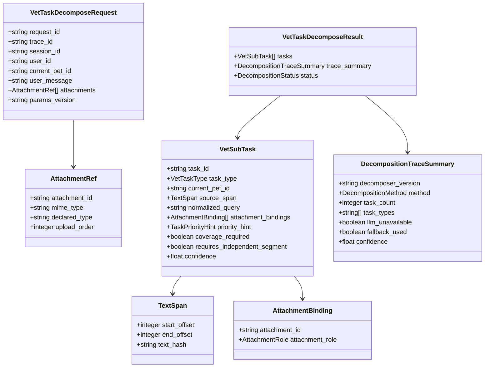
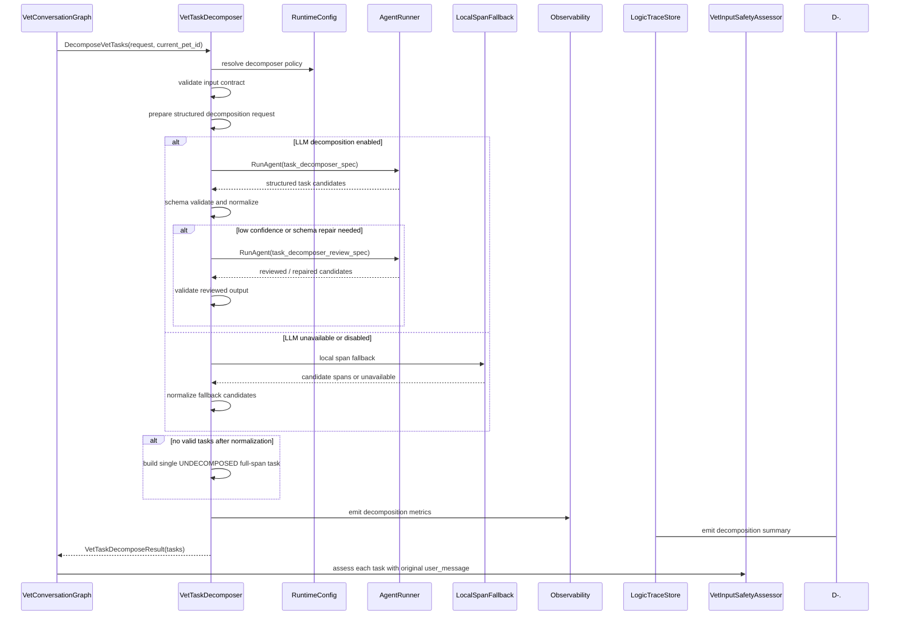
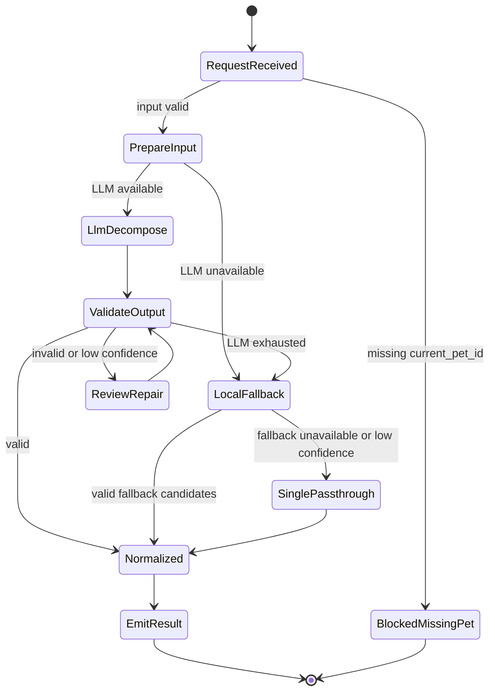

# 兽医多任务拆解组件设计文档 / VetTaskDecomposer

## 3.1 基础元数据 (Metadata)

* **组件标识：** 兽医多任务拆解组件 / `VetTaskDecomposer`
* **责任人 (Owner)：** 待定
* **代码仓库：** 当前仓库，正式 Git Repository URL 待补充
* **关联需求：**
  * [`docs/component_catalog.md`](../../../component_catalog.md) §6.2 兽医多任务拆解组件
  * [`docs/prd.md`](../../../prd.md) §5.1、§5.3、§5.3.1、§5.2.7、§7.5、§7.6、§9.3
  * [`docs/design_spec.md`](../../../design_spec.md)
  * [`docs/components/l2-vet-business/pet-session-policy/design.md`](../pet-session-policy/design.md)
* **架构层级：** L2 兽医业务组件 / 任务规划层
* **文档状态：** 草案

## 3.2 职责边界 (Responsibility Boundaries)

* **核心能力 (Capabilities)：**
* 在 `PetSessionPolicy` 已产出 `current_pet_id` 后，将单轮用户输入拆解为 1-N 个当前宠物下的业务子任务。
* 为每个子任务标注标准任务类型、原文片段引用、附件关联、覆盖义务和初始处理优先级提示。
* 判断附件在本轮中是作为医疗任务上下文证据，还是形成独立 `REPORT_OCR` / `RECORD_PARSE` 子任务。
* 保留用户原始输入与子任务 source span 的可回指关系，避免拆解过程丢失急症、医疗或附件相关文本。
* 使用 `AgentRunner` 调用 LLM 结构化拆解能力，并通过 schema 校验和有限审查 / 修复保证输出契约稳定。
* 在 LLM 网关降级后仍不可用时，使用本地预训练权重模型占位能力或单任务原文透传策略完成降级输出。
* 产出拆解摘要，供 `LogicTraceStore` 与兽医业务 trace schema 记录拆解方法、任务数量、任务类型、附件决策和降级状态。
* 将拆解结果写入 LangGraph state，供后续 `VetInputSafetyAssessor` 对每个子任务独立执行安全评估与剖面判决。

* **非目标 (Non-Goals)：**
* 不实现 JWT、OAuth、登录态解析或用户身份认证。当前阶段 Agent 服务仅在局域网访问，身份上下文由上游可信传入。
* 不校验、创建或改写 session 与 `pet_id` 的绑定关系；一 session 一宠策略由 `PetSessionPolicy` 负责。
* 不根据自然语言文本进行定宠、切宠、宠物名匹配或它宠识别。
* 不输出 `other_pet_id`、`involved_pet_ids`、`pet_scope`、`mentions_other_pet`、`cross_pet_comparison_requested` 等多宠或它宠识别字段。
* 不处理跨宠比较、联合问诊、主从宠判断或多宠组合推理；所有子任务均继承 `current_pet_id`。
* 不决定 SAF 信号、`intent`、`generation_profile`、`route`、RAG 是否调用或上下文压缩策略；这些由 `VetInputSafetyAssessor` 与后续业务节点负责。
* 不读取宠物画像、宠物级记忆、化验报告、病历、知识库或 RAG 检索结果。
* 不执行 OCR、病历结构化、参考区间匹配或检验异常标注。
* 不生成对外回复，不决定最终分段发布顺序，不判断急症段是否已经优先发布。
* 不写入长期记忆、会话消息、checkpoint 物理状态或完整 A/B/C 逻辑链；本组件仅返回拆解结果与拆解摘要。

## 3.3 架构与交互设计 (Architecture & Interaction)

* **上下文视图 (Context Diagram)：**

```mermaid
flowchart TB
  API["ApiIngress / FastAPI"]
  Policy["PetSessionPolicy"]
  Graph["VetConversationGraph / GraphRuntime"]
  Decomposer["VetTaskDecomposer"]
  AgentRunner["AgentRunner"]
  LlmGateway["LlmGateway"]
  LocalSpan["LocalSpanFallback\nEasyNLP / BERT / RoBERTa / MacBERT 占位"]
  Safety["VetInputSafetyAssessor"]
  Composer["VetResponseComposer"]
  Config["RuntimeConfig"]
  Trace["LogicTraceStore"]
  Obs["Observability"]

  API --> Policy
  Policy -->|PetSessionContext current_pet_id| Graph
  Graph --> Decomposer
  Decomposer --> Config
  Decomposer --> AgentRunner
  AgentRunner --> LlmGateway
  Decomposer -.LLM unavailable.-> LocalSpan
  Decomposer -.decomposition summary.-> Trace
  Decomposer -.metrics.-> Obs
  Decomposer -->|VetSubTask[]| Safety
  Safety --> Composer
```

`VetTaskDecomposer` 是 FastAPI 应用内的 L2 业务组件，通常作为 LangGraph 中 `PetSessionPolicy` 之后、`VetInputSafetyAssessor` 之前的节点。它优先复用 `AgentRunner`、`LlmGateway`、LangGraph state 与结构化输出校验能力；自研逻辑仅负责兽医任务类型、附件角色、契约归一化和降级兼容。

本组件在前期可接入 EasyNLP、BERT、RoBERTa、MacBERT 等中文预训练权重模型作为本地 span 标注占位能力。由于前期暂未具备可训练数据，该占位能力不作为可信业务拆解主路径；当 LLM 网关不可用时，组件应优先保证原文不丢失，并通过单任务透传或低置信 span 候选归一化完成安全降级。

* **核心领域模型 (Domain Model)：**



模型说明：

* `VetTaskDecomposeRequest` 必须消费 `PetSessionPolicy` 产出的 `current_pet_id`；该字段是所有子任务唯一宠物归属。
* `VetSubTask` 是后续安全评估和剖面判决的最小业务输入单元。它不允许携带替代 `current_pet_id` 的宠物标识。
* `source_span` 用于回指用户原文，不用于解释性审计；其目的在于保证拆解后仍可定位子任务来源并避免文本遗漏。
* `AttachmentBinding` 描述附件与子任务的关系。附件作为医疗上下文证据时不等价于独立 OCR 段。
* `DecompositionTraceSummary` 仅保存拆解摘要与降级状态；完整 DTO、枚举、字段校验与正式示例由代码内 Pydantic 模型或 API 治理平台维护。

## 3.4 契约与依赖 (Contracts & Dependencies)

* **入向契约 (Inbound APIs)：**
* 拆解兽医业务子任务：`DecomposeVetTasks` -> API 治理平台链接待建立
* 校验拆解结果契约：`ValidateVetTaskDecomposition` -> API 治理平台链接待建立
* 本地降级拆解：`FallbackDecomposeVetTasks` -> API 治理平台链接待建立

接口原则：

* 当前契约优先作为 FastAPI 应用内 service 接口和 LangGraph 节点使用；若后续服务化，再登记 HTTP / RPC 接口。
* 入参必须携带 `request_id`、`trace_id`、`session_id`、`user_id`、`current_pet_id` 与用户原文。
* `current_pet_id` 必须来自 `PetSessionPolicy`，本组件不得从用户文本、宠物名、历史消息或附件中推断宠物。
* 返回结果必须至少包含一个 `VetSubTask`；无法可靠拆解时返回单任务原文透传结果。
* 所有 `VetSubTask.current_pet_id` 必须等于入参 `current_pet_id`。
* 所有 `VetSubTask.source_span` 必须可回指用户原文；模型生成的补写内容不得替代原文片段。
* 输出任务类型必须来自受控枚举；不允许由 LLM 自由生成新类型。
* 附件角色必须来自受控枚举；不允许将未知影像附件标记为影像判读任务。
* 拆解输出不得包含多宠元数据或它宠识别字段。
* LLM 不可用时不得静默失败；必须返回明确的降级状态、单任务透传或本地占位模型结果。

任务类型枚举：

* `TRIAGE`：症状、分诊或当前个案医疗咨询。
* `NUTRITION`：饲养、换粮、体重管理、饮水、零食等咨询。
* `BEHAVIOR`：行为、训练、分离焦虑、护食、如厕等咨询。
* `CARE`：日常护理、环境、运动、口腔、洗护等咨询。
* `EDUCATION_QA`：科普、假设或通识问答。
* `REPORT_OCR`：独立化验单读取或解读诉求。
* `RECORD_PARSE`：独立病历整理或结构化诉求。
* `GENERAL_QA`：属于养宠范围但无法稳定归类的诉求。
* `UNDECOMPOSED`：LLM 与本地占位能力均不可用或低置信时的原文透传任务。

附件角色枚举：

* `none`：子任务不关联附件。
* `diagnostic_context`：附件作为当前医疗任务上下文证据，不形成独立发布段。
* `independent_visual_task`：附件形成独立 `REPORT_OCR` / `RECORD_PARSE` 子任务。
* `unsupported_image`：片子或其他不支持判读的影像附件，仅供后续节点执行非判读型提示。
* `unknown`：附件类型或角色暂不可判定，交由后续节点保守处理。

异常映射原则：

* 缺少 `current_pet_id` 映射为 `TASK_DECOMPOSE_MISSING_CURRENT_PET_ID`，并阻断后续业务图。
* 用户原文为空映射为 `TASK_DECOMPOSE_EMPTY_MESSAGE`。
* LLM 拆解调用不可用映射为 `TASK_DECOMPOSE_LLM_UNAVAILABLE`，触发本地占位或单任务透传。
* LLM 输出解析失败映射为 `TASK_DECOMPOSE_OUTPUT_PARSE_FAILED`，允许有限修复或降级。
* schema 校验失败映射为 `TASK_DECOMPOSE_SCHEMA_INVALID`，允许有限修复或降级。
* 本地预训练占位模型不可用映射为 `TASK_DECOMPOSE_LOCAL_FALLBACK_UNAVAILABLE`，触发单任务透传。
* 归一化后仍无有效 task 映射为 `TASK_DECOMPOSE_EMPTY_RESULT`，触发单任务透传。

* **出向依赖 (Outbound Dependencies)：**
* **强依赖：**
* `GraphRuntime`：调用本组件并将结果写入 LangGraph state。不可用时业务图无法继续执行。
* `RuntimeConfig`：提供拆解策略版本、LLM 审查开关、超时、降级策略和参数版本。不可用时服务不可就绪。
* `Observability`：记录拆解耗时、错误、降级、任务数量和附件角色分布。不可用不应阻断核心拆解，但需产生降级日志。

* **弱依赖：**
* `AgentRunner` / `LlmGateway`：执行 LLM 结构化拆解与有限审查 / 修复。不可用时进入本地占位模型或单任务透传。
* 本地预训练权重占位能力：可基于 EasyNLP、BERT、RoBERTa、MacBERT 等中文预训练权重实现候选 span 标注。前期无训练数据时仅作为低置信工程占位或 shadow 能力，不得覆盖单任务透传兜底。
* `LogicTraceStore`：保存拆解摘要。短暂不可用时由上游图运行事件补偿，组件必须暴露 trace 写入降级状态。
* API 治理平台：维护正式接口字段、错误码和示例。缺失时不阻塞应用内契约实现，但阻塞正式契约冻结。

## 3.5 核心流转机制 (Core Flow Mechanism)

* **状态流转/时序图：**





核心流程约束：

* `PetSessionPolicy` 未成功产出 `current_pet_id` 时，本组件不得执行。
* LLM 主路径应使用结构化输出 schema，并允许至多有限审查 / 修复；不得进入无界多轮 Agent 自由协作。
* LLM 不可用时，本地预训练占位模型仅提供候选 span。候选低置信、不可用或违反契约时，必须退回单任务原文透传。
* 单任务透传必须覆盖完整用户原文，并将 `task_type` 标记为 `UNDECOMPOSED` 或等价降级类型。
* 无论拆解方式如何，原始 `user_message` 必须继续传给 `VetInputSafetyAssessor`，避免拆解遗漏影响安全评估。
* 附件作为医疗上下文证据时不产生独立发布段；只有存在独立读取或解读诉求时，才输出 `REPORT_OCR` / `RECORD_PARSE` 子任务。
* OCR 数值确认不属于本组件顶层子任务；该类追问由后续视觉和问诊组件处理。
* 用户文本中的宠物名称、昵称或“另一只”等表达仅保留在 source span 原文中，不参与任务归属和拆解元数据。

## 3.6 稳定性与可观测性 (Reliability & Observability)

* **流量控制：**
* 单次 LLM 拆解和审查 / 修复应设置超时；超时后进入本地占位或单任务透传。
* 本地预训练占位模型应设置加载健康检查和推理超时；不可用时不得阻断单任务透传。
* 对同一 `request_id` 的重试应保持任务拆解幂等性；可通过输入 hash、策略版本和 deterministic task id 生成策略实现。
* 本组件不执行 HTTP 层限流；入口限流由 `ApiIngress` 或部署网关承担。
* 拆解失败不得降级为丢弃用户输入或返回空任务列表。

* **数据一致性：**
* `current_pet_id` 是所有子任务的唯一宠物归属来源，不得被 LLM、本地占位模型或后处理器覆盖。
* source span 与用户原文之间必须保持可回指关系；归一化文本不得替代原始片段。
* `VetTaskDecomposeResult` 写入 graph state 后，后续节点应以其中的 `tasks[]` 作为并行安全评估输入，同时仍可读取原始用户输入。
* 本组件默认无长期状态；拆解摘要可写入 `LogicTraceStore`，物理持久化由上游图或 trace 组件负责。
* 本地预训练权重占位模型前期不具备业务标签训练数据时，其输出不得删除原文、不得覆盖单任务透传兜底、不得作为安全评估的唯一输入。

* **核心指标 (Golden Signals)：**
* `vet_task_decomposer_total`：拆解请求总数。
* `vet_task_decomposer_duration_ms`：拆解耗时。
* `vet_task_decomposer_task_count`：每轮子任务数量分布。
* `vet_task_decomposer_task_type_total`：按任务类型统计的子任务数量。
* `vet_task_decomposer_llm_success_total`：LLM 主路径成功次数。
* `vet_task_decomposer_review_repair_total`：触发审查 / 修复次数。
* `vet_task_decomposer_llm_unavailable_total`：LLM 网关降级后仍不可用次数。
* `vet_task_decomposer_local_fallback_total`：本地预训练占位模型调用次数。
* `vet_task_decomposer_single_passthrough_total`：单任务原文透传次数。
* `vet_task_decomposer_schema_invalid_total`：结构化输出 schema 校验失败次数。
* `vet_task_decomposer_attachment_role_total`：按附件角色统计的附件绑定数量。
* `vet_task_decomposer_empty_result_total`：归一化后无有效 task 并触发透传的次数。
