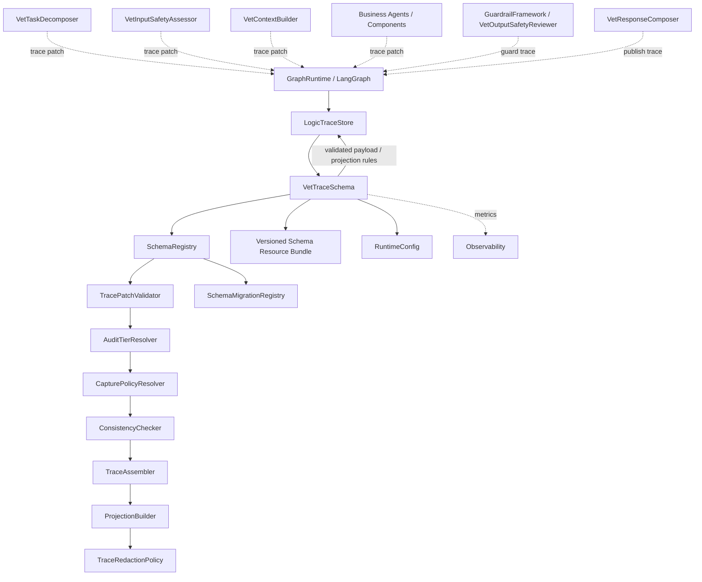
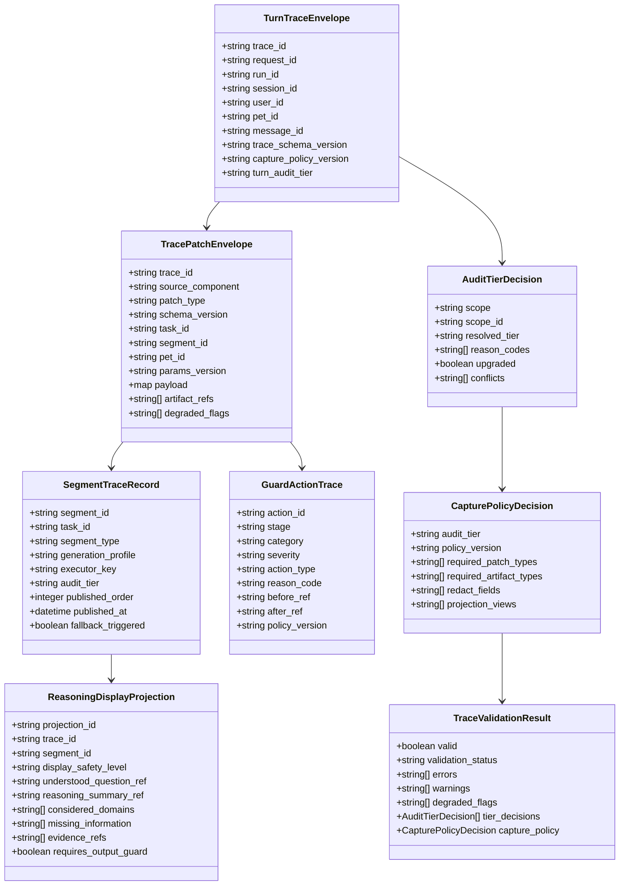
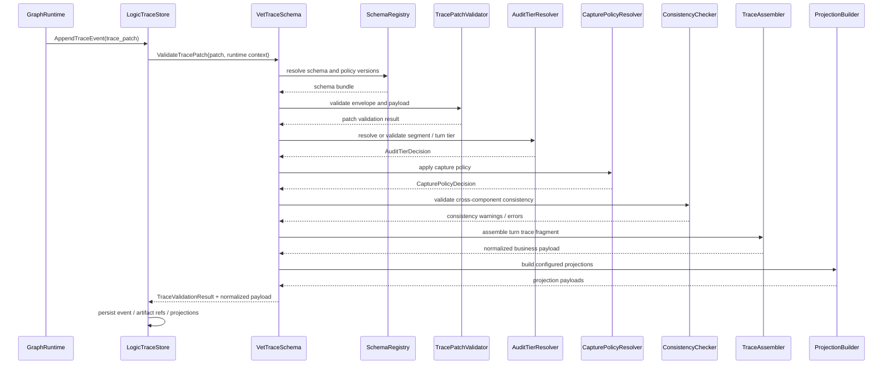
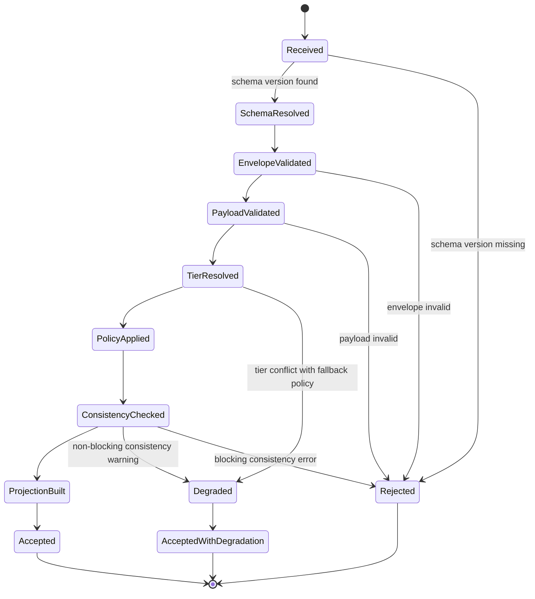
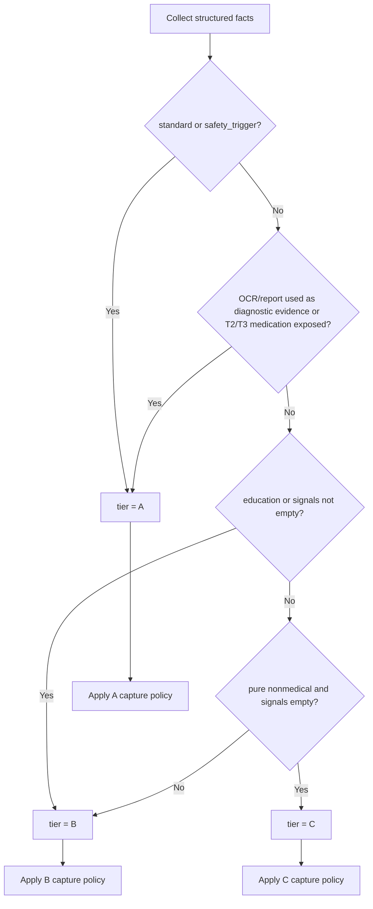
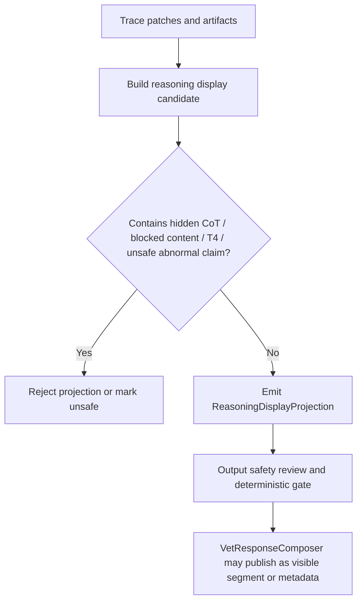

# 兽医逻辑链 Schema 组件设计文档 / VetTraceSchema

## 3.1 基础元数据 (Metadata)

* **组件标识：** 兽医逻辑链 Schema 组件 / `VetTraceSchema`
* **责任人 (Owner)：** 待定
* **代码仓库：** 当前仓库，正式 Git Repository URL 待补充
* **关联需求：**
  * [`docs/component_catalog.md`](../../../component_catalog.md) §6.15 兽医逻辑链 schema 组件
  * [`docs/prd.md`](../../../prd.md) §5.3、§5.4、§6、§7.5、§7.6、§9.2.1、§10
  * [`docs/design_spec.md`](../../../design_spec.md)
  * [`docs/components/l1-ai-runtime/logic-trace-store/design.md`](../../l1-ai-runtime/logic-trace-store/design.md)
  * [`docs/components/l1-ai-runtime/guardrail-framework/design.md`](../../l1-ai-runtime/guardrail-framework/design.md)
  * [`docs/components/l1-ai-runtime/graph-runtime/design.md`](../../l1-ai-runtime/graph-runtime/design.md)
  * [`docs/components/l0/conversation-store/design.md`](../../l0/conversation-store/design.md)
  * [`docs/components/l0/checkpoint-store/design.md`](../../l0/checkpoint-store/design.md)
  * [`docs/components/l2-vet-business/vet-task-decomposer/design.md`](../vet-task-decomposer/design.md)
  * [`docs/components/l2-vet-business/vet-input-safety-assessor/design.md`](../vet-input-safety-assessor/design.md)
  * [`docs/components/l2-vet-business/vet-context-builder/design.md`](../vet-context-builder/design.md)
  * [`docs/components/l2-vet-business/vet-output-safety-reviewer/design.md`](../vet-output-safety-reviewer/design.md)
  * [`docs/components/l2-vet-business/vet-response-composer/design.md`](../vet-response-composer/design.md)
* **架构层级：** L2 兽医业务组件 / 业务逻辑链 Schema 与投影规则层
* **文档状态：** 草案

## 3.2 职责边界 (Responsibility Boundaries)

* **核心能力 (Capabilities)：**
* 定义兽医业务逻辑链的统一 schema envelope，包括 `trace_id`、`request_id`、`run_id`、`session_id`、`user_id`、`pet_id`、`params_version`、`trace_schema_version` 与 `capture_policy_version`。
* 定义 A / B / C 三级 `audit_tier` 的 capture policy，明确每个 tier 下的必填字段、可选字段、artifact 引用策略和裁剪规则。
* 消费各 L2 业务组件输出的 `trace_patch`，执行 schema 校验、版本校验、字段裁剪、跨组件一致性校验和降级标记。
* 根据结构化事实解析或校验 segment 级与 turn 级 `audit_tier`，支持多任务场景下按最高 segment tier 聚合整轮 tier。
* 定义每轮逻辑链结构，覆盖任务拆解、输入安全、上下文构建、生成摘要、RAG、OCR / 化验、参考区间、用药策略、输出护栏、segment 发布和最终响应。
* 定义 `guard_actions[]`、fallback、三联稿引用、`stop_reason`、RAG 使用、OCR analytes、slot / 问诊缺口和 segment 发布事实的业务留痕模型。
* 定义用户可见推理摘要投影 `ReasoningDisplayProjection`，支持向用户展示受控、结构化、经过安全审查的解释摘要。
* 明确禁止保存或展示模型隐藏 chain-of-thought；本组件只定义业务决策摘要、证据引用、版本信息和可展示投影。
* 为 `LogicTraceStore` 提供 schema registry、capture policy、validator、projection builder 和 consistency checker。
* 输出 `TraceValidationResult`、`CapturePolicyDecision`、`AuditTierDecision` 和投影结果，供 `LogicTraceStore`、`GraphRuntime`、`VetResponseComposer` 和后续抽检链路消费。
* 支持 schema 版本、capture policy 版本、segment schema 版本、guard action schema 版本和 reasoning display schema 版本的兼容管理。

* **非目标 (Non-Goals)：**
* 不作为传统合规审计系统；本组件仅定义 Agent 运行逻辑链的兽医业务 schema 和校验规则。
* 不负责 trace 数据持久化、查询、索引、outbox、补偿写入或投影存储；这些由 `LogicTraceStore` 负责。
* 不执行用户认证、JWT、OAuth、登录态解析或访问授权。当前阶段 Agent 服务仅在局域网访问，身份上下文由上游可信传入。
* 不负责创建 `trace_id`、维护运行锁、保存 checkpoint 或保存对话消息；这些分别由 `LogicTraceStore`、`CheckpointStore` 与 `ConversationStore` 负责。
* 不执行意图识别、SAF 信号识别、急症判断、用药风险判定、参考区间判定、RAG 检索或 OCR 解析；这些由对应 L2 业务组件产出结构化事实。
* 不调用 LLM 生成摘要、重写 trace、修正事实或生成用户可见解释；若上游需要摘要，应以结构化 patch 或 artifact 形式提交。
* 不保存模型隐藏推理链、不展示内部 prompt、不暴露被护栏删除的危险草稿、不将 trace 数据写回 RAG 知识库索引。
* 不决定 segment 发布顺序或流式事件顺序；这些由 `VetResponseComposer` 和编排链路负责。
* 不绕过输出安全审查发布 reasoning display；任何用户可见推理摘要仍必须进入 7.6-C / 7.6-D 对应发布门。
* 不维护完整人工抽检工单、申诉、复检或质量评审流程；本组件仅提供抽检所需的结构化 trace 数据基础。

## 3.3 架构与交互设计 (Architecture & Interaction)

* **上下文视图 (Context Diagram)：**

`VetTraceSchema` 是 FastAPI 应用内的 L2 兽医业务 schema 组件，通常被 `LogicTraceStore` 或图编排层以应用内 service 方式调用。组件不作为独立 Agent，不持久化 trace，不直接对外发布内容，而是为 trace patch 的校验、分级、裁剪和投影提供确定性业务规则。

本组件是兽医业务逻辑链字段语义的单一事实源。各业务组件只产出自身 `trace_patch`，`LogicTraceStore` 只负责存储和查询，`VetTraceSchema` 负责规定这些 patch 如何组成一条可信、连贯、可回放的业务逻辑链。

* **核心领域模型 (Domain Model)：**

模型说明：

* `TracePatchEnvelope` 是所有 L2 业务组件提交逻辑链补丁的统一外壳；组件私有 payload 通过 schema registry 解析。
* `TurnTraceEnvelope` 是一轮兽医 Agent 运行在业务 schema 层的聚合根，不替代 `LogicTraceStore.Trace` 存储模型。
* `AuditTierDecision` 描述 segment 或 turn 级 `audit_tier` 的解析结果和升级原因。
* `CapturePolicyDecision` 描述当前 tier 下应保存、裁剪、脱敏、引用或投影的字段集合。
* `SegmentTraceRecord` 对齐 `VetResponseComposer` 的分段发布事实，支撑多任务覆盖、急症首发和回放。
* `GuardActionTrace` 对齐 7.6 护栏流水线，统一输出审查、确定性兜底和 fallback 的留痕表达。
* `ReasoningDisplayProjection` 是用户可见推理摘要的 schema，不等同于模型隐藏 chain-of-thought。
* 完整 DTO、枚举取值、字段级约束、artifact 类型和正式示例由代码内 Pydantic 模型、JSON Schema 或 API 治理平台维护；本文仅定义组件级领域模型。

## 3.4 契约与依赖 (Contracts & Dependencies)

* **入向契约 (Inbound APIs)：**
* 校验业务 trace patch：`ValidateTracePatch` -> API 治理平台链接待建立
* 解析或校验 `audit_tier`：`ResolveAuditTier` -> API 治理平台链接待建立
* 应用 A/B/C capture policy：`ApplyCapturePolicy` -> API 治理平台链接待建立
* 组装一轮业务逻辑链：`AssembleTurnTrace` -> API 治理平台链接待建立
* 构建逻辑链投影：`BuildTraceProjection` -> API 治理平台链接待建立
* 构建用户可见推理摘要投影：`BuildReasoningDisplayProjection` -> API 治理平台链接待建立
* 执行跨组件一致性校验：`ValidateTraceConsistency` -> API 治理平台链接待建立
* 查询 schema / capture policy 版本：`GetVetTraceSchemaVersion` -> API 治理平台链接待建立

接口原则：

* 当前契约优先作为 FastAPI 应用内 service 接口使用；若后续独立服务化，再登记 HTTP / RPC 接口。
* 所有请求必须携带 `trace_id`、`request_id` 或可反查的运行标识，并绑定 `params_version` 与 `trace_schema_version`。
* 所有业务 patch 必须声明 `source_component`、`patch_type`、`schema_version`、`pet_id` 和 `params_version`。
* 同一 trace 内所有业务 patch 的 `pet_id` 必须等于请求携带的当前宠物 `pet_id`；不一致时不得进入最终依据投影。
* `AuditTierResolver` 只消费上游结构化事实，不执行自然语言语义识别。
* `signals[]` 非空时不得解析为 C 级；`standard` 与 `safety_trigger` 段必须解析为 A 级；`education` 段必须至少为 B 级。
* 多 segment 场景下，turn 级 `audit_tier` 必须等于所有 segment tier 的最高级。
* A 级 segment 必须具备三联稿 artifact 引用或明确降级原因；不得将缺失三联稿静默按 B/C 保存。
* 任一用户可见 `final_response` 必须有关联输出安全审查和确定性兜底门记录。
* 用户可见 `ReasoningDisplayProjection` 不得包含隐藏 chain-of-thought、被护栏删除的危险内容、T4 精确剂量、伪精确概率或未经确认的异常判断。
* 用户可见推理摘要投影只表达可解释推理摘要；实际发布仍必须经过输出安全审查、确定性兜底门和 `VetResponseComposer`。

异常映射原则：

* schema 版本不存在映射为 `VET_TRACE_SCHEMA_VERSION_NOT_FOUND`。
* capture policy 不存在映射为 `VET_TRACE_CAPTURE_POLICY_NOT_FOUND`。
* patch envelope 缺失必填字段映射为 `VET_TRACE_PATCH_ENVELOPE_INVALID`。
* patch payload schema 校验失败映射为 `VET_TRACE_PATCH_PAYLOAD_INVALID`。
* trace 内 `pet_id` 不一致映射为 `VET_TRACE_PET_CONFLICT`。
* `audit_tier` 与结构化事实冲突映射为 `VET_TRACE_AUDIT_TIER_CONFLICT`。
* A 级必填 artifact 缺失映射为 `VET_TRACE_REQUIRED_ARTIFACT_MISSING`。
* 用户可见投影命中不可展示字段映射为 `VET_TRACE_REASONING_DISPLAY_UNSAFE`。
* guard 链路记录缺失映射为 `VET_TRACE_GUARD_CHAIN_INCOMPLETE`。
* segment 发布事实缺失或顺序冲突映射为 `VET_TRACE_SEGMENT_INCONSISTENT`。
* schema 资源加载失败映射为 `VET_TRACE_SCHEMA_RESOURCE_UNAVAILABLE`。
* 投影构建失败映射为 `VET_TRACE_PROJECTION_BUILD_FAILED`。

* **出向依赖 (Outbound Dependencies)：**
* **强依赖：**
* Versioned Schema Resource Bundle：保存 patch schema、capture policy、投影规则、字段裁剪规则和兼容策略。不可用时服务不可就绪。
* `RuntimeConfig`：提供 schema 版本选择、capture policy 版本、严格 / 降级模式、最大 patch 大小和用户可见投影开关。不可用时服务不可就绪。
* 本地结构化校验框架：执行 Pydantic / JSON Schema 等结构化校验。不可用时不得接受业务 patch。

* **弱依赖：**
* `LogicTraceStore`：消费本组件校验后的 payload、policy decision 和 projection。短暂不可用时由 trace 存储链路标记降级；本组件自身不负责补偿写入。
* `Observability`：记录 schema 校验、tier 冲突、投影构建、降级和资源版本指标。不可用不影响校验，但需产生降级日志。
* Artifact Storage / TraceArtifact Adapter：用于校验大文本 artifact 引用和 hash。不可用时可退化为只校验引用格式，并标记 artifact 校验降级。
* API 治理平台：维护完整接口字段、示例与版本。缺失时不阻塞运行，但阻塞正式契约冻结。

## 3.5 核心流转机制 (Core Flow Mechanism)

* **状态流转/时序图：**

trace patch 校验状态：

capture policy 裁决：

用户可见推理摘要投影：

核心流程约束：

* schema 解析、tier 解析、capture policy 裁剪和一致性校验均为确定性逻辑，不调用 LLM。
* `VetTraceSchema` 不直接写入数据库；持久化由 `LogicTraceStore` 完成。
* 业务组件不得绕过 patch envelope 直接向业务逻辑链写入私有字段。
* A/B/C capture policy 决定留痕粒度，不改变 SAF、护栏或发布门要求。
* 用户可见推理摘要只是投影视图，不是模型原始思维链；发布前必须继续经过输出安全链路。
* trace 投影不得把被安全审查删除的内容重新暴露给用户或抽检视图之外的普通展示面。
* 旧 trace 查询应按其写入时的 `trace_schema_version` 和 `capture_policy_version` 解释，不得用新版本规则静默改写历史语义。

## 3.6 稳定性与可观测性 (Reliability & Observability)

* **流量控制：**
* 对单个 trace patch 的 payload 大小、artifact 引用数量、projection 结果大小和单轮 patch 数设置上限。
* 对 schema 解析、payload 校验、tier 解析、一致性校验和投影构建设置独立超时。
* 对用户可见推理摘要投影启用单独开关和长度上限，避免展示面反向拖慢主 trace 写入链路。
* 对 schema resource bundle 加载采用启动期校验和 last-known-good 策略；无可用 LKG 时服务不可就绪。
* 不在本组件内执行 HTTP 层限流；入口限流由 `ApiIngress` 或部署网关承担。

* **数据一致性：**
* schema resource、capture policy 与 projection rule 必须版本化发布，并在每个 `TraceValidationResult` 中记录生效版本。
* 同一 trace 内的 `pet_id`、`trace_id`、`params_version` 和 schema version 必须一致或具备明确迁移 / 降级记录。
* `signals[]` 采用 append-only 语义；后续组件可追加修正事件，不得删除既有信号事实。
* `audit_tier` 冲突应优先升级或阻断，不得静默降级。
* A 级链路缺失三联稿、guard action 或关键 artifact 时必须输出阻断错误或显式降级标记。
* `ReasoningDisplayProjection` 与用户最终发布文本必须存在独立 guard 链路引用；不得把内部 trace 投影直接当作已发布内容。
* 旧版本 trace 的投影构建应按原版本 schema 解释；跨版本投影必须记录迁移规则版本。
* trace schema 校验失败不应篡改原始业务事实；调用方应根据错误级别决定阻断发布、降级写入或告警。

* **核心指标 (Golden Signals)：**
* `vet_trace_schema_validation_total`
* `vet_trace_schema_validation_failed_total`
* `vet_trace_patch_payload_invalid_total`
* `vet_trace_audit_tier_conflict_total`
* `vet_trace_capture_policy_applied_total`
* `vet_trace_consistency_warning_total`
* `vet_trace_consistency_blocked_total`
* `vet_trace_projection_build_total`
* `vet_trace_projection_failed_total`
* `vet_trace_reasoning_display_rejected_total`
* `vet_trace_pet_conflict_total`
* `vet_trace_required_artifact_missing_total`
* `vet_trace_schema_resource_lkg_used_total`
* `vet_trace_schema_validation_duration_ms`
* `vet_trace_projection_duration_ms`
* 可观测性面板链接：无
