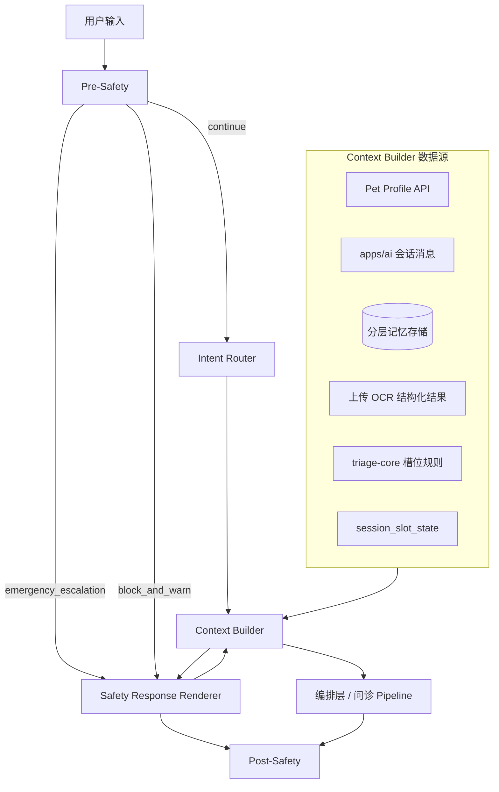
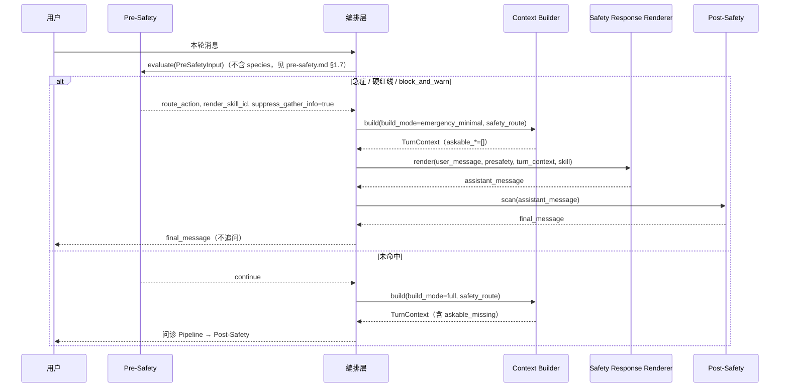
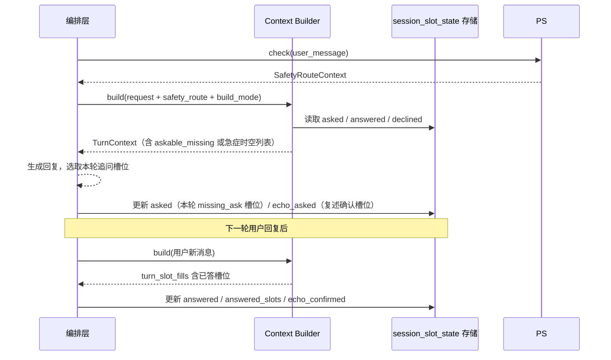
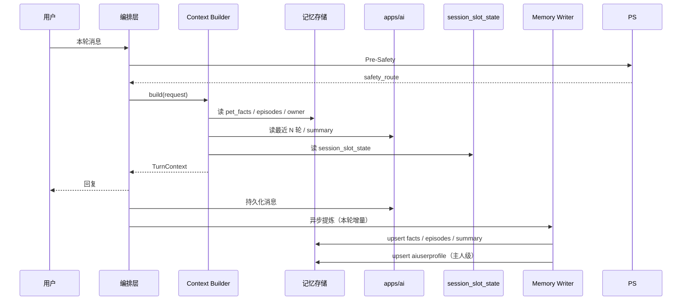

# Context Builder 设计文档（上下文层）

> 关联需求：`prd.md`（R1–R7、§4、§5、§7）  
> 关联架构：兽医 Agent 总体编排层 · 记忆子系统 · `triage-core` · R8 知识库检索  
> 关联设计：`pre-safety.md`（Pre-Safety 输入侧安全闸门 · `SafetyRouteContext` 来源）· `safety-response-renderer.md`（急症 / 警告路径回复渲染）

---

## 0. 一句话

**Context Builder 是每轮对话前的「上下文装配器」**：把宠物档案、历史记忆、本轮用户说法和已确认的检查报告整理成一份**「已知什么、还缺什么、本轮可以问什么」**的清单（`TurnContext`），交给编排层去追问和作答。它只负责**读取与整理**，不负责写入长期记忆，也不负责查医学知识库或给出诊断结论。

---

## 1. 背景与定位

### 1.1 在系统中的位置



> **调用顺序**：Pre-Safety **先于** Context Builder；Builder **不**做急症规则匹配。Post-Safety 在编排层输出之后，与 Builder 无关。

### 1.2 职责边界

| 属于 Context Builder | 不属于 Context Builder |
|---|---|
| 多源事实聚合与带来源合并 | 医学推理、分诊结论生成 |
| 数据新鲜度与冲突标记 | 长期记忆的写入与抽取（→ Memory Writer） |
| 槽位覆盖计算（`known` / `stale` / `missing` / `askable_*`） | 权威知识库 ingestion 与 RAG 检索（→ R8） |
| 生成本轮 `prompt_interactions`（复述确认 / 待核实 / 开放式追问）并渲染 `prompt_blocks` | 自然语言回复生成（→ 编排层 Pipeline） |
| 读取并应用会话内槽位状态（`session_slot_state`） | 会话槽位状态的持久化写入（→ 编排层） |
| 应用 `safety_route` 置 `blocked`、清空 `askable_*`（急症短路） | Pre-Safety 规则匹配与 `route_action` 判定 |
| 按 `build_mode` 执行全量或极简装配 | 安全路径用户可见回复（→ Safety Response Renderer，非 Builder 生成） |
| 按当前意图裁剪记忆视图 | Post-Safety 输出侧规则（→ 编排层之后） |
| 组装 `TurnContext`、`prompt_interactions`、`prompt_blocks` 与 `audit_context` | 原始对话持久化（→ `apps/ai`） |
| 可选：会话级热缓存（性能，键含 `user_id` + `pet_id`） | 每用户完整知识图谱的构建与图推理 |
| 按 `request.pet_id` 过滤宠物域数据；校验返回 fact 的 `pet_id` | 换宠检测与 `active_pet_id` 维护（→ 编排层） |
| 区分主人域（`owner`）与宠物域（`facts` / `episodes`）合并 | API 鉴权 `user_id` ↔ `pet_id`（→ gateway / 后端） |
| 输出 `data_completeness` / `data_fetch_errors`；Step 1 部分失败仍装配 | 用户可见拒答/重试文案（→ 编排层 §8.5） |

### 1.3 需求映射

| PRD 条款 | 参与 | 承接摘要 | 详见 | 主要可观测输出 |
|---|---|---|---|---|
| **R1** 辅助诊断 | 部分 | 提供 `facts`、`slot_coverage` 供编排层分诊 / 鉴别；**不**生成诊断结论 | §1.5.1 | `known`, `missing`, `facts` |
| **R2** 结构化追问 | 核心 | Step 2 填槽；§5.6 结合 `session_slot_state`、`safety_route` 输出 `askable_*`；§8.1.1 选题预算 | §5.2–§5.6, §8.1.1 | `askable_missing`, `askable_stale`, `askable_echo` |
| **R3** 少问基础题 | 核心 | L1 → `known`；**复述确认** `echo_confirm`；过期/冲突 → `stale_confirm`；真正未知 → `missing_ask` | §1.5.8, §3.4, §5.6.5, §6.11, §7 | `prompt_interactions`, `askable_echo`, `askable_stale` |
| **R4** 三层记忆 | 核心 | 读会话 / 宠物 / 主人；多宠按 `pet_id` 隔离；CRUD 后失效缓存 | §3.5, §8.3–§8.4, §9 | `facts`, `isolation` |
| **R5** 有据可解释 | 核心 | 每条 fact 带 `source`；输出 `citeable_sources` | §6.2, §6.7 | `citeable_sources` |
| **R6** 非医疗养宠 | 部分 | Care intent 下裁剪饲养 / 行为 facts；跨域红旗**不在此** | §1.5.2, §5.7 | `facts`（care 子集） |
| **R7** 上传报告 / 病历 | 部分 | 仅读 **已确认** OCR 结构化结果 | §1.5.3, §5.1 | `uploaded_docs` → `facts` |
| **R8** 知识库 | 边界 | 可选输出 `retrieval_query` 原料；**不**执行 RAG | §1.5.4, §4 | `retrieval_query` |
| **§4.2** 急症红线 | 消费 | 应用 `safety_route`；`askable_*` 为空（含 `askable_echo`） | §1.4, §5.0 | `emergency_short_circuit` |
| **§4.5** 留痕 | 输出 | 每轮输出 `audit_context`（含 `data_fetch_errors`、`data_completeness`） | §6.9–§6.10, §8.5 | `audit_context` |
| **§5** 可用数据 | 核心 | L1/L2/L3 槽位分层与数据源映射 | §3.4 | `known`（L1） |
| **§7** 验收 | 可测 | 见 §11 与 PRD §7 对照表 | §11 | 各字段组合 |
| **可靠性** | 核心 | Step 1 分源并行；失败收集；`degraded_mode` 输出 | §5.2.1, §6.10, §8.5 | `data_completeness` |

> **参与**：`核心` = Builder 主责；`部分` = 仅上下文供给；`边界` = 仅输出原料或旁路；`消费` = 应用上游判定。  
> **不涉及 Builder** 的 PRD 能力：毒物黑名单拦截、具体剂量 gate、影像判读、知识库 ingestion、诊断 / 处置文案生成（→ Pre/Post-Safety、Router、Pipeline、R8）。

### 1.5 PRD 分项承接说明

#### 1.5.1 R1 辅助诊断（部分）

Context Builder **不输出分诊结论或用药建议**；其为编排层提供：

- **事实侧**：宠物画像、记忆、已确认上传、本轮填槽 → `facts`
- **缺口侧**：`slot_coverage`（`known` / `missing` / `askable_*`）
- **停止辅助**：`missing` 为空且仍不足时，编排层可据 `slot_coverage` 诚实转「需线下检查」（R2 停止条件在编排层）

#### 1.5.2 R6 非医疗养宠咨询（部分）

| R6 要求 | Builder 承接 | 不负责 |
|---|---|---|
| 饲养 / 行为个性化 | `intent_hint=care_*` 时 Step 6 裁剪 care facts（§5.7） | Care 话术生成 |
| 跨域医疗红旗 | — | Pre-Safety（§1.4） |
| 有毒食物拦截 | — | Pre-Safety / Post-Safety |
| 不传谣 | 提供 `citeable_sources` | 结论生成与 R8 检索 |

**Care 常用 fact 谓词（示例）**：`current_diet`、`activity_level`、`body_condition`、`behavior_pattern`、`living_environment`（最终清单见开放项与 `triage-core` care 附录）。

#### 1.5.3 R7 视觉 / 上传（部分）

- Step 1 仅合并 **`uploaded_docs` 中 `status=confirmed`** 的结构化结果。
- 未确认 OCR、处理中附件**不**进入 `facts`（附件完整状态机见 Vision 子系统设计，本文不展开）。
- 片子 Phase 1：`interpret_forbidden` 由上游传入时，`do_not_assume` 块须声明不得影像判读。

#### 1.5.4 R8 知识库（边界）

Builder 可在 `TurnContext` 附带 **`retrieval_query`**（供编排层 / RAG 使用），例如：

```json
{
  "species": "dog",
  "chief_complaint_category": "gi",
  "key_symptoms": ["vomiting"],
  "species_locale": "CN"
}
```

**不**在 Builder 内执行向量检索或引用版权分流；检索结果不反向写入 `facts`。

#### 1.5.5 §4.5 留痕与 §7 记忆 CRUD

- 每轮 `build()` 输出 **`audit_context`**（§6.9），编排层与涉诊涉药回复一并入库。
- 用户经 Memory API **纠正 / 删除** fact 后，编排层须调用 `invalidate_cache(pet_id=..., reason="memory_crud")`，下一轮 Builder **必须**读到最新记忆；合并优先级见 §5.4（`user_corrected` 最高）。

#### 1.5.6 R4 多宠分别记（部分）

PRD 要求多只宠物**分别记**；Context Builder 通过 **`pet_id` 硬过滤** 实现，不将宠物 A 的 facts / episodes 装入宠物 B 的 `TurnContext`（详见 §3.5）。`aiuserprofile` 中的多宠列表仅供 Router **消歧**，**不得**作为拉取他宠临床 facts 的依据。

#### 1.5.7 失败与降级（部分）

Step 1 上游**部分失败**时仍输出 `TurnContext`，并附带 **`data_completeness`**（§6.10）与 **`data_fetch_errors`**；**不**伪造缺失的 profile / 记忆。`degraded_mode=blocked` 时由编排层拒答或提示重试（§8.5）。Pre-Safety 命中急症时，**P2/P3 源失败不取消**急诊短路（§5.0）。

#### 1.5.8 R3 少问基础题与复述确认（核心）

PRD R3 区分三种对用户说话的方式，须在 Prompt 契约中**显式分开**，不得混为同一种「追问」：

| 模式 | `interaction_mode` | 何时 | 话术形态（示例） |
|---|---|---|---|
| **直接使用** | `use_silent` | L1 已在 `known` 且本会话无需再确认 | 写入 `[系统已知]`，不向用户提问 |
| **复述确认** | `echo_confirm` | 系统有值、可信、未过期；本会话尚未对该槽复述确认 | 「档案里豆豆约 12kg（2025-12 记录），还对吗？」 |
| **待核实** | `stale_confirm` | `stale` / `conflict` / `provenance_gaps` | 「记录是半年前 12kg，现在还是这样吗？」 |
| **开放式追问** | `missing_ask` | 真正 `missing`，仅 `askable_missing` | 「它一天吐几次？」 |

**Builder 职责**：Step 6 根据 `slot_coverage` 与 `session_slot_state` 生成结构化 **`prompt_interactions`**（§6.11），渲染 §7 分块；**推荐话术**由模板渲染为 `suggested_utterance`，供编排层与 LLM 约束，而非即兴编造。

**编排层职责**（§8.1.1）：从 `prompt_interactions` 按模式选题；`echo_confirm` ∪ `stale_confirm` 每轮 ≤2 项，`missing_ask` ≤3 项；**禁止**对 `askable_stale` / `echo_confirm` 槽使用开放式「请问 XX 是什么」。

---

### 1.4 与 Pre-Safety / 急症短路的衔接

Pre-Safety 为**输入侧确定性安全闸门**（独立子系统，详见 `pre-safety.md`）；Context Builder 在其**之后**被调用，**只消费**编排层传入的 `safety_route`，自行不做急症词表匹配。

**全链路顺序**：

```text
用户输入 → Pre-Safety → [Intent Router] → Context Builder → [问诊 Pipeline | Safety Response Renderer] → Post-Safety
                ↓ emergency_escalation / block_and_warn
         build(emergency_minimal) → Renderer（SKILL + LLM，见 safety-response-renderer.md）
                └─ 均不进入 GATHER_INFO 结构化追问（suppress_gather_info=true）
```

| 组件 | 职责 |
|---|---|
| **Pre-Safety** | 匹配急症红线 / 毒物 / R6 跨域红旗；输出 `route_action`、`suppress_gather_info`、`matched_rule_ids`；**不**接收 `species`（`pre-safety.md` §1.7） |
| **编排层** | 映射 `SafetyRouteContext`；非 `continue` 时 **Renderer** 生成回复 → Post-Safety；`continue` 时问诊 Pipeline |
| **Context Builder** | 装配 `TurnContext`；**不**生成安全路径用户可见正文；`emergency_minimal` 供 Renderer 极简上下文 |
| **Safety Response Renderer** | 消费 `user_message` + `PreSafetyResult` + 极简 `TurnContext` + `render_skill_id`（`safety-response-renderer.md`） |
| **Post-Safety** | 输出侧免责 / 禁剂量等；安全路径与问诊路径 **均**经此层 |

**`blocked` 的来源**：由编排层根据 Pre-Safety 结果写入 `safety_route.blocked_slot_policy`（`emergency_escalation` 与 `block_and_warn` 通常为 `all_complaint`），Builder §5.6 **确定性应用**，不依赖 LLM 判断是否追问。

**`build_mode`（入参）**：

| 模式 | 何时 | Builder 行为 |
|---|---|---|
| `full` | `route_action=continue` | 完整六步流水线 |
| `emergency_minimal` | `route_action=emergency_escalation` **或** `block_and_warn` | 仅拉 `pet_profile` 极简字段；§5.6 强制 `askable_*=[]`；产出 `TurnContext` 供 **Safety Response Renderer**（`pre-safety.md` §3.6 `render_skill_id`） |

急症与警告轮次**不向 `session_slot_state.asked` / `echo_asked` 追加槽位**（编排层保证）。

---

## 2. 设计原则

1. **读写在途分离**：Context Builder 只读；对话结束后由 Memory Writer 异步提炼写入记忆。
2. **事实优于全文**：跨会话依赖提炼后的结构化事实与摘要，不将全量历史问答作为主记忆形态。
3. **来源可追溯**：每条进入上下文的事实必须可指回 `pet_profile` / `session` / `upload` / `user_corrected` 等来源。
4. **槽位确定性**：「还缺什么信息」由 `triage-core` + `slot_coverage` 计算，不全权交给 LLM 判断。
5. **按宠物隔离**：临床与饲养**事实**以 `pet_id` 为边界；多宠家庭不混用 `pet_facts` / `episodes` / `uploaded_docs`（§3.5）。
6. **主人域与宠物域分离**：`aiuserprofile`（`user_id`）可跨宠共享语气与偏好；症状、体重、化验等**一律宠物域**，不因同一主人而合并。
7. **视图物化、存储轻量**：采用「事实表 + 来源元数据」存储；每轮在内存中物化为当前相关的上下文视图，Phase 1 不强制图数据库。
8. **会话内问槽有状态**：同一 `(session_id, pet_id)` 内，哪些槽已问、已答、被拒答须可追溯（§3.3）；Context Builder 读取并用于过滤追问，避免绕圈重复问（R2）。
9. **安全路由被动应用**：急症短路由 Pre-Safety + 编排层决策，经 `safety_route` 传入；Builder 只清空追问面（`askable_*`）并设置 `blocked`，不判定是否急诊（PRD §4.2）。
10. **防御性隔离校验**：上游 API 返回的 fact / episode 若 `pet_id ≠ request.pet_id`，丢弃并记入 `data_fetch_errors`（鉴权由 gateway 保证，Builder 二次校验）。
11. **失败可见、降级可审计**：任何上游失败或降级须进入 `data_fetch_errors` 与 `data_completeness`；**禁止**在源不可用时从热缓存静默回填该源数据（§9）。

---

## 3. 记忆分层与 Context Builder 的关系

记忆机制是**产品刚需**（R4），但应作为**独立子系统**存在；Context Builder 是其**消费者**，而非记忆的主存储。

### 3.1 短 / 中 / 长与 PRD 三层映射

| 语义层级 | 对应 PRD | 存储内容 | 范围 | Context Builder 用法 |
|---|---|---|---|---|
| **短（工作记忆）** | 会话级 | 最近 N 轮原文、rolling summary、本轮槽位状态 | 当前 `session_id` | 接上「上次没说完的」；同会话内避免重复问 |
| **中（情节记忆）** | 宠物级（部分） | 历次主诉、症状发作、建议与转归、行为模式 | 按 `pet_id`，近 3–12 个月 | 按当前主诉/intent 裁剪相关 episodes |
| **长（语义记忆）** | 宠物级慢性 + 主人级 | 宠物：慢性病、过敏/用药史、疫苗史；主人：沟通偏好 | 宠物按 `pet_id`；主人按 `user_id` | 宠物事实进 `facts`；主人进 `owner`，不进 `slot_coverage` |

### 3.2 原始对话 vs 提炼记忆

| 数据 | 负责组件 | 说明 |
|---|---|---|
| 原始消息链 | `apps/ai`（`AIChatSession` / `AIDialogMessage`） | 用户可见聊天记录；Context Builder 仅读最近 N 轮或 summary |
| 结构化事实 / episodes | 分层记忆存储（`pet_facts` 等） | Memory Writer 提炼写入；Context Builder 按 intent 选取 |
| 主人偏好 | `aiuserprofile` | 本次需求要真正写入；Builder 只读 |

**不做法**：在 agent 侧再维护一套与 `apps/ai` 平行的全量 Q&A 缓存作为主记忆。

### 3.3 会话内槽位状态（Session Slot State）

**短记忆的工作面**：记录当前咨询会话中，围绕主诉槽位的**交互进度**，与 `pet_facts`（跨会话）和 `turn_slot_fills`（单轮解析）互补。

| 概念 | 说明 |
|---|---|
| **`session_slot_state`** | 绑定 **`(session_id, pet_id)`** 及当前 `chief_complaint_category` 的可持久化状态 |
| **负责读取** | Context Builder（Step 1 按 `request.pet_id` 拉取，§5.6 应用） |
| **负责写入** | 编排层（每轮 assistant 发出追问后记 `asked` / `echo_asked`；用户回答经 Step 2 解析后记 `answered` / `echo_confirmed`） |

**与 `turn_slot_fills` 的分工**：

| | `turn_slot_fills` | `session_slot_state` |
|---|---|---|
| 粒度 | 仅**本轮** `user_message` 解析结果 | **整段会话**累计的问答进度 |
| 生命周期 | 单次 `build()` 内 | 跨多轮，至 session 结束或主诉切换 |
| 作用 | 本轮填槽 → 并入事实集 | 防止对已问/已答/拒答槽位重复开放式追问 |

**主诉切换**：`chief_complaint_category` 变化时，编排层应 **重置或 fork** 当前 `(session_id, pet_id)` 下的 `session_slot_state`（保留 L1 基线 `known`，清空主诉相关 `asked` / `answered`）。

**换宠切换**：`pet_id` 变化时，**不得**继承上一只宠物的 `session_slot_state`；见 §3.5、§8.4。

### 3.4 KNOWN_FIELDS 与槽位分层（PRD §5）

「已知必不问」与主诉追问槽位**分层处理**，避免与 `triage-core` 混为一谈：

| 层级 | 名称 | 字段来源（示例） | Step 5 行为 |
|---|---|---|---|
| **L1** | 基线槽位 `KNOWN_FIELDS` | 品种、物种、年龄、体重、性别、绝育；已确认病历中的慢性史 / 疫苗史 | 有值 → `known`；**不得**对 L1 做开放式 `askable_missing`；未过期且策略要求时 → `askable_echo`（`echo_confirm`）；过期 / 冲突 → `askable_stale`（`stale_confirm`） |
| **L2** | 主诉槽位 | `triage-core` × `{species, chief_complaint_category}` | 正常 `missing` / `askable_missing` |
| **L3** | Care 槽位 | 饲养 / 行为相关（§1.5.2） | 仅 `intent_hint=care_*` 时参与 |

**数据源映射（PRD §5）**：

| 字段类型 | 权威数据源 |
|---|---|
| 画像基线 | Pet Profile API |
| 病历抽取病史 | `uploaded_docs`（`confirmed`）+ `pet_facts` |
| 会话中用户确认 | `turn_input` / `user_corrected` |

L1 字段清单以实现时 `assets/known-fields/known-fields.v1.json` 为准（与开放项 §12 对齐）。

### 3.5 多宠场景下的上下文隔离（PRD R4）

同一 `user_id` 下可有多只宠物；**临床 / 饲养事实不得跨 `pet_id` 泄漏**。`user_id` 鉴权由 gateway / 后端保证；Context Builder 假定 `request.pet_id` 已授权，并做 **防御性 `pet_id` 校验**（原则 10）。

#### 3.5.1 数据归属

| 数据 | 隔离键 | 跨宠可读 | Builder 行为 |
|---|---|---|---|
| `pet_profile` | `pet_id` | 否 | 仅 `request.pet_id` |
| `pet_facts` / `episodes` | `pet_id` | 否 | Step 1 API 必带 `pet_id` 过滤 |
| `uploaded_docs` | `pet_id` | 否 | 仅当前宠已确认文档 |
| `session_slot_state` | `(session_id, pet_id)` | 否 | 换宠读另一份状态 |
| `session` 消息 / summary | `session_id`（宜带 `pet_id` 元数据） | 视产品 | 同 session 聊多宠时读**当前 pet 分段**摘要 |
| `owner_profile` | `user_id` | **是** | 进 `owner` 块；**不进** `facts` / `slot_coverage` |
| 热缓存 / TurnContext 缓存 | `user_id` + `pet_id` + `session_id` | 否 | 见 §9 |

#### 3.5.2 主人域 vs 宠物域（Step 3 合并）

```text
owner_profile  → TurnContext.owner（语气、风险偏好、多宠列表仅供指代）
pet_*          → facts / episodes / slot_coverage（严格 pet_id）
```

`aiuserprofile` 中的多宠关系用于 Intent Router **消歧**（「你说的哪一只」），**不得**据此拉取其他 `pet_id` 的 facts。能指到具体宠物的信息（体重、症状、化验）**一律宠物域**。

#### 3.5.3 换宠与缓存（编排层 + §8.4）

换宠检测：`request.pet_id != active_pet_id` 时由编排层执行 §8.4，再调用 `build()`。Builder 不在内部切换 `active_pet_id`。

---

## 4. 宠物上下文子图（轻量实现）

不采用 Phase 1「每用户完整知识图谱」方案。采用**按 `pet_id` Scoped 的轻量上下文子图**：

- **节点语义**：宠物基线、慢性问题、症状/事件 episode、化验指标、行为模式等。
- **边语义**：`HAS_CONDITION`、`OCCURRED_AT`、`LAB_RESULT`、`SUGGESTED`（带来源，非因果推理）。
- **持久形态**：关系型表 + JSONB 事实记录；查询时在内存物化为视图，无需 Neo4j 级图库。
- **与 R8 边界**：子图只含**当前 `pet_id` 下**这只宠物的临床 / 饲养事实；默克等权威知识走共享 RAG，不写入用户子图。主人偏好走 `owner`，不写入宠物子图节点。

---

## 5. 核心流水线

`build()` **仅在 Pre-Safety 完成之后**由编排层调用；请求须携带 `safety_route`（见 §6.1、§6.8）。

每轮对话触发一次 `build()`，顺序如下（`build_mode=emergency_minimal` 时见 §5.0）。

### 5.0 安全短路分支（`safety_route.suppress_gather_info=true`）

当 Pre-Safety 命中 **`route_action=emergency_escalation`** 或 **`route_action=block_and_warn`** 时，编排层传入 `build_mode=emergency_minimal`（二者共用 Builder 裁剪；用户可见回复由 **`render_skill_id`** 选 SKILL 渲染，见 `safety-response-renderer.md`）。

| 步骤 | 正常 `full` | `emergency_minimal`（急症 / 警告） |
|---|---|---|
| Step 1 | 全量拉取 | 仅 `pet_profile` 极简字段（物种、名称）；可不拉 `pet_facts` / `episodes` |
| Step 2 | 解析 `user_message` 填槽 | **跳过**（或仅摘录 `evidence_span` 供审计，不用于追问） |
| Step 3–4 | 正常合并 / 新鲜度 | 跳过或极简 |
| Step 5 | 正常槽位覆盖 | `askable_missing=[]`，`askable_stale=[]`，`askable_echo=[]`，`blocked=全部主诉槽`，`session_suppressed` 可标 `reason=emergency_short_circuit` |
| Step 6 | 正常打包 | `prompt_interactions=[]`；`prompt_blocks` 不含追问块；供审计的最小 `TurnContext` |

编排层在 Builder 返回后调用 **Safety Response Renderer**（`user_message` + `PreSafetyResult` + `TurnContext`）；**不得**依赖 `askable_missing` 发起追问（PRD §7：急症 100% 不经追问拖延；毒物 / 人药警告同理）。Renderer 输出经 **Post-Safety** 后送达用户。

> **安全短路 + `pet_profile` 拉取失败**：仍允许 `degraded_mode=emergency_minimal_ok`；Renderer 使用 **无宠物名** SKILL 上下文；不进入追问。Pre-Safety 命中优先于数据不完整。

### 5.1 常规流水线概览


**关键顺序**：`user_message` 必须在 Step 5「槽位覆盖」之前完成解析并并入事实集；否则用户本轮刚回答的内容会被误标为 `missing`，触发 R2 反例「绕圈重复问」。

### 5.2 Step 1 — 并行拉取（Fan-out）

| 数据源 | 内容 |
|---|---|
| `pet_profile` | 物种、品种、年龄、体重、性别、绝育等（PetIntelli API） |
| `owner_profile` | 沟通偏好、风险偏好、多宠关系（`aiuserprofile`） |
| `pet_facts` / `episodes` | 结构化宠物记忆 |
| `session` | 最近 N 轮消息 或 `rolling_summary`（`apps/ai`） |
| `uploaded_docs` | 已 OCR 且 **用户已确认** 的报告/病历结构化结果 |
| `triage_slots` | 按物种 + 主诉类型的必填槽位定义（`triage-core`） |
| `session_slot_state` | 本会话 **当前 `pet_id`** 下槽位问答进度（键 `(session_id, pet_id)`，见 §3.3、§6.6） |

> Step 1 所有**宠物域**拉取须带 `request.pet_id`；返回项 `pet_id` 不一致则丢弃（§3.5、原则 10）。`owner_profile` 按 `user_id` 拉取。  
> 本轮 `user_message` 在 Step 2 单独解析；`emergency_minimal` 模式下按 §5.0 裁剪拉取范围。

#### 5.2.1 Step 1 — 失败与部分成功

Step 1 采用 **并行拉取 + 独立超时**；**单一非关键源失败不导致整轮 `build()` 抛错**（除非触发 `degraded_mode=blocked`）。各源结果汇总为 `data_fetch_errors` 与 `data_completeness`（§6.10）。

**数据源关键性（默认策略）**：

| 级别 | 数据源 | 失败时 |
|---|---|---|
| **P0** | 鉴权 `user_id`↔`pet_id` | **不 build**（gateway 403）；无降级 |
| **P1** | `pet_profile`（至少 `species`） | 无 `species` → `blocked`；仅缺体重/年龄等 → `continue` / `limited` |
| **P2** | `pet_facts` / `episodes`、`uploaded_docs` | `continue`；不得引用「既往记录」式表述所依记忆 |
| **P3** | `apps/ai` session / summary | `continue`；`session` 为空，单轮仍可工作 |
| **P4** | `session_slot_state` | 视为**空状态**（无 `asked`）；**倾向多问**，不用脏缓存 |
| **P5** | `owner_profile` | `continue`；仅失语气个性化 |
| **P6** | 本地 `triage-core` / KNOWN_FIELDS | `blocked`（无法算槽位） |

**与槽位覆盖**：profile / memory 均不可用时，L1 字段**不得**虚假进入 `known`；可进 `missing` / `askable_missing` 或 `provenance_gaps`（§6.10）。**禁止**在记忆失败时假装「系统已知慢性病」。

**与缓存**：某源本轮回合为 `unavailable` 时，**不得**用该源热缓存顶替（§9）。

### 5.3 Step 2 — 本轮输入解析（Turn Input Extraction）

将 `ContextBuildRequest.user_message`（及消息中已出现的明确陈述，不含尚未 OCR/确认的上传附件）解析为**本轮槽位填充**，在算 `missing` 之前生效。

**输入**：

| 字段 | 说明 |
|---|---|
| `user_message` | 本轮用户文本 |
| `triage_slots` | 当前主诉下的候选槽位清单（来自 Step 1） |
| `session` 最近 1–2 轮 | 可选，用于解析指代（如「还是昨天那样」「大概那个频率」） |

**输出**：`turn_slot_fills`（见 §6.3），每条映射到 `triage-core` 中的一个 `slot` predicate。

**解析方式（实现可选，语义须一致）**：

1. **规则 / 词典**：高频可结构化的回答（是/否、天数、次数、公斤等）优先走确定性模式。
2. **轻量结构化抽取**：对自然语言主诉描述，用 schema 约束的抽取器（LLM 或 NER）填槽；输出须带 `confidence` 与原文 `evidence_span`。
3. **低置信度**：`confidence` 低于阈值时**不写入** `known`，可落入 `stale` 供确认式复述，或保留在 `missing` 由编排层追问。

**示例**：

| 用户本轮输入 | 解析结果 |
|---|---|
| 「一天吐三四次，没血，精神还行」 | `vomit_frequency=3-4/day`，`hematemesis=no`，`energy=normal` |
| 「体重现在 10 公斤左右」 | `weight≈10kg`（`source.type=turn_input`） |

**与 R2 的关系**：上一轮若问了 `vomit_frequency`，用户本轮已答 → 本步填槽后，Step 5 不得再将该槽标为 `missing`；同时编排层应将对应槽写入 `session_slot_state.answered`（见 §8.1）。

### 5.4 Step 3 — 带来源合并（Merge with Provenance）

将 Step 1 历史事实与 Step 2 `turn_slot_fills` **合并为统一事实集**，同一语义字段多来源时按优先级选取**当前有效值**，并保留冲突信息供确认式提问。

**合并参与方**：

```text
Step 1: pet_profile, pet_facts, uploaded_docs, session 中已沉淀的历史陈述
Step 2: turn_slot_fills（本轮 user_message 解析结果）
```

**优先级（示例，实现时可配置）**：

```text
user_corrected > user_confirmed_upload > turn_input > session_history > pet_profile > extracted_memory > old_memory
```

> `user_corrected`（R4 CRUD）优先于一切来源；`status=deleted` 的 fact **不得**进入合并结果。

> 原「`recent_user_statement`」细化为：`turn_input`（本轮）优先于 `session` 历史轮次中的同槽位陈述。

冲突示例：档案体重 12kg，用户本轮口述 10kg → 标记 `conflict`，进入 `stale` 或专项确认，不静默覆盖。

### 5.5 Step 4 — 新鲜度判断（Freshness）

| 字段类型 | stale 规则（示例） | 行为 |
|---|---|---|
| 体重 | 观测时间 > 180 天 | → `stale_slots`，确认式提问 |
| 化验指标 | 有新主诉且报告 > 90 天 | 提示是否需要新检查，不当作当前强证据 |
| 慢性问题 | 无硬性过期 | 直接带入，标注 `last_mentioned_at` |

原则：**不能盲信也不能无视**（PRD R3）。

### 5.6 Step 5 — 槽位覆盖（Slot Coverage）

在 **Step 3 合并完成（含本轮 `turn_slot_fills`）** 之后，由 `triage-core` 定义 `{species, chief_complaint_category}` 下的必填槽位，与已合并事实求差集，再叠加 **Step 1 读入的 `session_slot_state`** 过滤可追问项。

**5.6.1 原始覆盖（事实侧）**

```text
known   — 已有且可信；L1 默认 use_silent，策略要求时可进 askable_echo（echo_confirm）
stale   — 有值但过期或冲突，确认式提问（stale_confirm）
missing — 必填但事实侧仍缺失（未叠加会话过滤）
blocked — 不必追问的槽位（含急症短路时由 `safety_route` 填入的全部主诉槽）
```

**5.6.2 会话过滤（交互侧）**

在 `missing` / `stale` 基础上，结合 `session_slot_state` 生成 **`askable_missing`** 与 **`askable_stale`**（供编排层 R2 实际选题）：

| 会话状态 | 槽位条件 | 过滤规则 |
|---|---|---|
| `answered` | 本会话已答且已进入 `known` | 不得再问；移出 `askable_*` |
| `asked` + 未答 | 已追问但用户尚未提供可解析答案 | 移出 `askable_missing`；记入 `session_suppressed`（`reason=asked_unanswered`） |
| `declined` | 用户明确拒答（「不知道」「没注意」） | 移出 `askable_*`；非急症关键槽可在后续轮次降级或转「需线下检查」 |
| `stale` + 未 `asked` | 事实过期需确认 | 可进入 `askable_stale`（`stale_confirm`，非开放式） |
| `known` L1 + 未 `echo_confirmed` | 档案有值、未过期、策略要求复述 | 可进入 `askable_echo`（`echo_confirm`，非开放式） |
| `echo_confirmed` | 本会话用户已确认复述槽位 | 移出 `askable_echo`；后续轮次 `use_silent` |
| 未 `asked` + `missing` | 事实缺失且本会话未问过 | 进入 `askable_missing` 候选（`missing_ask`） |

```text
askable_missing — 本会话仍可开放式追问的缺失槽（编排层每轮取 1–3）
askable_stale   — 本会话仍可待核实的过期 / 冲突槽（stale_confirm）
askable_echo    — 本会话仍可复述确认的系统已知 L1 槽（echo_confirm，R3）
session_suppressed — 因已问未答/拒答等原因本轮不宜再问（含 reason）
```

**5.6.3 急症过滤（安全路由侧）**

在会话过滤**之前**，若 `safety_route.suppress_gather_info=true`：

```text
askable_missing  = []
askable_stale    = []
askable_echo     = []
blocked          = triage-core 当前 chief_complaint 下全部槽位（或 safety_route.blocked_slots）
session_suppressed 追加 { reason: emergency_short_circuit, matched_rule_ids }
```

此后**不再**执行 §5.6.2 的会话过滤（已无 `askable_*` 可滤）。

**5.6.4 输出约定**

- 编排层**只从 `askable_missing` ∪ `askable_stale` ∪ `askable_echo` 对应的 `prompt_interactions` 选题**，不直接使用原始 `missing`。
- **`askable_stale` 与 `askable_echo` 不得进入 `askable_missing`**；二者仅产出 `stale_confirm` / `echo_confirm` 交互项（§6.11）。
- **`同轮生效`**：用户在本轮 `user_message` 中已明确回答且解析成功的槽位 → 进入 `known`，不得出现在 `askable_missing`；用户对复述的确认（「对」「没错」）→ 记入 `session_slot_state.echo_confirmed`。
- 原始 `missing` / `known` 仍保留在 `TurnContext`，供审计与停止条件判断（如「槽位已问尽仍不足」）。
- 审计须能证明急症轮次 `askable_missing=[]` 且 `askable_echo=[]`（对应 PRD §4.5 / §7）。

**5.6.5 复述确认候选（`askable_echo`，R3）**

在 §5.6.2 会话过滤之后，对 **L1 `known` 且非 `stale` / 非 `conflict`** 的槽位，按产品策略生成 `askable_echo`：

| 条件 | 行为 |
|---|---|
| 槽位 ∈ L1，`known` 有值，`stale` / `conflict` 为空 | 候选进入 `echo_confirm_candidates` |
| `session_slot_state.echo_confirmed` 已含该槽 | **不**进入 `askable_echo` |
| 本轮 `turn_slot_fills` 已提供同槽新值 | **不**进入 `askable_echo`（已采信或待 conflict 流程） |
| `provenance_gaps` 含该 L1 槽（档案未读到） | **不**进入 `askable_echo`；可走 `stale_confirm`「读不到档案，请确认」或 `missing_ask`（§6.10） |
| 换宠后首轮 / 新 session 接续 handoff 后 | 可提高 `askable_echo` 优先级（产品可配） |

**L1 默认交互策略（示例，可配置 `assets/known-fields/echo-policy.v1.json`）**：

| 槽位 | 默认 `interaction_mode` | 说明 |
|---|---|---|
| `species`, `breed` | `use_silent` | 直接带入 `[系统已知]`，首轮通常不复述 |
| `weight`, `age` | 首 consult 轮次 `echo_confirm` | PRD 例：「系统记录约 12kg…对吗？」 |
| `sex`, `neutered` | `use_silent` 或首 consult `echo_confirm` | 视产品 |
| 慢性史 / 疫苗（来自已确认上传） | `echo_confirm` 或 `use_silent` | 有 `upload` 来源时优先 `echo_confirm` 并带 `doc_ref` |

`askable_echo` 经 §5.7 Step 6.1 转为 `prompt_interactions`（`mode=echo_confirm`），再渲染 §7 `[复述确认]` 块。

### 5.7 Step 6 — 视图裁剪与打包

按当前 `intent_hint` 从 facts/episodes 中选取**相关子集**，避免把无关历史塞进 prompt。

**医疗**（`medical` / 默认）：与 `chief_complaint_category` 相关的 episodes + 主诉 facts。

**非医疗 Care**（R6，§1.5.2）裁剪示例：

| `intent_hint` | 优先纳入的 facts / episodes |
|---|---|
| `care_nutrition` | 体重、年龄、物种、`current_diet`、慢性 GI / 过敏 |
| `care_behavior` | 物种 / 品种、`behavior_pattern`、既往行为 episodes |
| `care_grooming` | 物种、毛长 / 皮肤相关慢性史、生活环境 |

**5.7.1 Step 6.1 — 生成交互项与 Prompt 分块**

在 facts / `slot_coverage` 定稿后、写入 `TurnContext` 前：

```text
1. askable_stale   → prompt_interactions（mode=stale_confirm | conflict_confirm）
2. askable_echo    → prompt_interactions（mode=echo_confirm）
3. askable_missing → prompt_interactions（mode=missing_ask）
4. known（L1，策略=use_silent）→ 仅渲染 [系统已知]，不生成交互项
5. 按 priority 截断：confirm_budget≤2（echo + stale），ask_budget≤3（missing）
6. 模板渲染 suggested_utterance（§6.11）→ 组装 prompt_blocks（§7）
```

组装为 `TurnContext`（见 §6.7），并输出 `prompt_interactions` + 结构化 `prompt_blocks`；医学场景可附带 `retrieval_query`（§1.5.4）。

---

## 6. 核心数据模型

### 6.1 入口参数

```python
class ContextBuildRequest:
    user_id: str
    pet_id: str
    session_id: str
    user_message: str
    attachments: list[Attachment]      # 本轮新上传，可能尚未 OCR 完成
    intent_hint: str | None            # 编排层或路由器的意图提示
    chief_complaint_category: str | None  # 如 gi / resp / joint，来自 Router
    safety_route: SafetyRouteContext   # Pre-Safety 结果，由编排层映射传入（§6.8）
    build_mode: str                    # full | emergency_minimal
    prior_pet_id: str | None           # 编排层传入：若与 pet_id 不同表示本轮回发生换宠（§8.4）
```

### 6.2 事实与来源

```json
{
  "fact_id": "f_001",
  "pet_id": "p_123",
  "predicate": "weight",
  "value": { "amount_kg": 12.0 },
  "source": {
    "type": "pet_profile",
    "id": "profile_row_id",
    "observed_at": "2025-12-01T00:00:00Z"
  },
  "status": "confirmed",
  "confidence": 1.0
}
```

**`source.type` 枚举（示例）**：`pet_profile` | `turn_input` | `session` | `upload` | `memory` | `user_corrected`

**`status` 枚举（示例）**：`confirmed` | `user_reported` | `stale` | `conflict` | `deleted`

### 6.3 本轮槽位填充（TurnSlotFill）

Step 2 输出；合并前为临时结构，合并后写入统一 `facts` 或直接进入 `slot_coverage.known`。

```json
{
  "slot": "vomit_frequency",
  "value": { "count_per_day": "3-4" },
  "source": {
    "type": "turn_input",
    "session_id": "s_99",
    "turn_index": 5,
    "evidence_span": "一天吐三四次"
  },
  "confidence": 0.92,
  "status": "user_reported"
}
```

| 字段 | 说明 |
|---|---|
| `slot` | 对应 `triage-core` 槽位名 |
| `evidence_span` | 用户原文片段，供 R5 引用与审计 |
| `confidence` | 低于阈值时不进入 `known` |
| `turn_index` | 当前会话轮次，便于与 `apps/ai` 消息对齐 |

### 6.4 Episode（情节记忆）

```json
{
  "episode_id": "ep_042",
  "pet_id": "p_123",
  "category": "gi",
  "chief_complaint": "呕吐",
  "occurred_at": "2025-08-15",
  "summary": "偶发呕吐，建议少食多餐，后好转",
  "outcome": "resolved",
  "source": { "type": "session", "session_id": "s_88" },
  "related_fact_ids": ["f_010", "f_011"]
}
```

### 6.5 SlotCoverage

```json
{
  "known": {
    "breed": { "fact_id": "f_002", "display": "金毛" },
    "weight": { "fact_id": "f_001", "display": "约 12kg" }
  },
  "stale": {
    "weight": { "fact_id": "f_001", "reason": "observed_at > 180d" }
  },
  "missing": ["vomit_frequency", "stool_status", "appetite"],
  "blocked": [],
  "askable_missing": ["appetite"],
  "askable_stale": ["weight"],
  "askable_echo": ["age"],
  "echo_confirm_candidates": ["age", "breed"],
  "session_suppressed": [
    {
      "slot": "stool_status",
      "reason": "asked_unanswered",
      "asked_at_turn": 4
    }
  ],
  "emergency_short_circuit": false
}
```

**急症短路示例**（`safety_route.suppress_gather_info=true`）：

```json
{
  "missing": ["vomit_frequency", "stool_status"],
  "blocked": ["vomit_frequency", "stool_status", "appetite", "energy"],
  "askable_missing": [],
  "askable_stale": [],
  "askable_echo": [],
  "session_suppressed": [
    {
      "slot": "*",
      "reason": "emergency_short_circuit",
      "matched_rule_ids": ["emergency_respiratory_distress"]
    }
  ],
  "emergency_short_circuit": true
}
```

### 6.6 会话内槽位状态（SessionSlotState）

Step 1 读入；§5.6 用于生成 `askable_*`。由**编排层**在每轮对话结束后持久化更新（Context Builder 不写入）。

```json
{
  "session_id": "s_99",
  "pet_id": "p_123",
  "chief_complaint_category": "gi",
  "turn_index": 5,
  "asked": [
    {
      "slot": "vomit_frequency",
      "asked_at_turn": 3,
      "answered": true,
      "answered_at_turn": 4
    },
    {
      "slot": "stool_status",
      "asked_at_turn": 4,
      "answered": false
    }
  ],
  "declined": ["appetite"],
  "answered_slots": ["vomit_frequency", "hematemesis", "energy"],
  "echo_asked": [
    {
      "slot": "weight",
      "asked_at_turn": 2,
      "template_id": "echo_confirm_scalar_v1"
    }
  ],
  "echo_confirmed": ["breed"]
}
```

| 字段 | 说明 |
|---|---|
| `pet_id` | 与 `request.pet_id` 一致；存储主键 `(session_id, pet_id)` |
| `asked[]` | 本会话 **该宠物** 下 agent 已发出的追问槽位及是否已答 |
| `answered_slots` | 本会话累计已答槽位名（与 `known` 对齐，便于快速过滤） |
| `declined` | 用户拒答槽位，§5.6 移出 `askable_*` |
| `echo_asked[]` | 本会话已发出的 **复述确认 / 待核实** 槽位（`echo_confirm` / `stale_confirm`） |
| `echo_confirmed` | 用户已确认准确的槽位名；§5.6.5 移出 `askable_echo`，后续 `use_silent` |
| `turn_index` | 当前会话轮次，与 `apps/ai` 消息序对齐 |

**编排层写入时机（§8.1）**：

1. **Assistant 发出含追问的回复后**：将本轮选取的 `missing_ask` 槽位 append 到 `asked`（`answered=false`）；将 `echo_confirm` / `stale_confirm` 槽位 append 到 `echo_asked`。
2. **用户下轮消息经 Step 2 解析后**：将成功填槽的项标 `answered=true`，并加入 `answered_slots`；对复述确认的肯定答复（「对」「没错」「是的」）→ 将对应槽加入 `echo_confirmed`。
3. **用户纠正复述**（「不对，现在 10kg」）→ 走 `turn_slot_fills` / `user_corrected` 合并（§5.4），**不**加入 `echo_confirmed`；冲突槽进入 `stale` / `askable_stale`。
4. **用户拒答**：将槽位加入 `declined`。
5. **急症短路轮次**：不追加 `asked` / `echo_asked`（§1.4、§8.0）。
6. **换宠**：不继承上一 `pet_id` 的 `asked` / `declined` / `echo_*`；为新 `(session_id, pet_id)` 读写独立状态（§8.4）。

### 6.7 TurnContext（输出）

```json
{
  "trace_id": "tr_abc",
  "user_id": "u_1",
  "pet_id": "p_123",
  "isolation": {
    "active_pet_id": "p_123",
    "pet_switch_detected": false,
    "prior_pet_id": null
  },
  "build_mode": "full",
  "safety_route": {
    "route_action": "continue",
    "suppress_gather_info": false,
    "hit_type": null,
    "matched_rule_ids": [],
    "blocked_slot_policy": "none",
    "blocked_slots": []
  },
  "pet": {
    "pet_id": "p_123",
    "species": "dog",
    "breed": "金毛",
    "age_months": 36,
    "display_name": "豆豆"
  },
  "owner": {
    "communication_style": "detailed",
    "risk_attitude": "cautious"
  },
  "facts": [],
  "episodes": [],
  "session": {
    "summary": "上轮讨论呕吐，尚未确认频率",
    "recent_turn_count": 4
  },
  "turn_slot_fills": [],
  "session_slot_state": {},
  "slot_coverage": {},
  "data_completeness": {
    "overall": "ok",
    "degraded_mode": "none",
    "sources": {
      "pet_profile": "ok",
      "pet_facts": "ok",
      "session": "ok",
      "session_slot_state": "ok",
      "uploaded_docs": "ok",
      "owner_profile": "ok",
      "triage_slots": "ok"
    },
    "provenance_gaps": [],
    "capabilities_reduced": []
  },
  "data_fetch_errors": [],
  "prompt_interactions": [
    {
      "slot": "weight",
      "mode": "echo_confirm",
      "display_value": "约 12kg",
      "source_label": "宠物档案",
      "observed_at": "2025-12-01",
      "template_id": "echo_confirm_scalar_v1",
      "suggested_utterance": "档案里豆豆体重约 12kg（2025年12月记录），现在还准确吗？",
      "fact_id": "f_001",
      "priority": 20
    }
  ],
  "prompt_blocks": {
    "interaction_rules": "...",
    "system_known": "...",
    "echo_confirm": "...",
    "stale_confirm": "...",
    "still_missing": "...",
    "session_suppressed": "...",
    "do_not_assume": "..."
  },
  "citeable_sources": [
    { "type": "pet_profile", "label": "宠物档案", "ref": "..." },
    { "type": "upload", "label": "化验报告 doc_88", "ref": "..." }
  ],
  "retrieval_query": {
    "species": "dog",
    "chief_complaint_category": "gi",
    "key_symptoms": ["vomiting"]
  },
  "audit_context": {}
}
```

> 完整 `audit_context` 结构见 §6.9；`data_completeness` / `data_fetch_errors` 见 §6.10。

### 6.8 安全路由上下文（SafetyRouteContext）

由**编排层**将 Pre-Safety 输出映射后传入 `ContextBuildRequest`；Context Builder **只读应用**（§1.4、§5.6.3）。

```json
{
  "route_action": "continue",
  "suppress_gather_info": false,
  "hit_type": null,
  "matched_rule_ids": [],
  "blocked_slot_policy": "none",
  "blocked_slots": [],
  "render_skill_id": null
}
```

| 字段 | 说明 |
|---|---|
| `route_action` | `continue` \| `emergency_escalation` \| `block_and_warn` |
| `suppress_gather_info` | `true` 时 Step 5 清空 `askable_*`，禁止结构化追问（急症与毒物 / 人药警告均为 `true`，见 `pre-safety.md` §5.3） |
| `hit_type` | 如 `emergency_symptom`、`toxic_substance`、`toxic_human_drug`、`care_red_flag` |
| `matched_rule_ids` | 命中规则 ID，供审计（§4.5） |
| `blocked_slot_policy` | `none` \| `all_complaint` \| `explicit` |
| `blocked_slots` | `policy=explicit` 时的槽位列表；急症 / 警告常用 `all_complaint` |
| `render_skill_id` | 编排层 Safety Response Renderer 选用的 SKILL（如 `safety.render.emergency_symptom`）；Builder 可透传至 `TurnContext.safety_route` |

**编排层映射（概念，完整见 `pre-safety.md` §5.3）**：

```text
route_action=emergency_escalation
  → suppress_gather_info=true, build_mode=emergency_minimal
  → blocked_slot_policy=all_complaint
  → 编排层 Renderer + render_skill_id → Post-Safety

route_action=block_and_warn
  → suppress_gather_info=true, build_mode=emergency_minimal
  → blocked_slot_policy=all_complaint
  → 编排层 Renderer + 警告类 render_skill_id → Post-Safety

route_action=continue
  → suppress_gather_info=false, build_mode=full
  → blocked_slot_policy=none
```

### 6.9 审计上下文（AuditContext）

每轮 `build()` 随 `TurnContext` 输出；编排层**原样或摘要**写入留痕库（PRD §4.5）。Builder 不负责审计库写入。

```json
{
  "trace_id": "tr_abc",
  "user_id": "u_1",
  "pet_id": "p_123",
  "build_mode": "full",
  "safety_route_summary": {
    "route_action": "continue",
    "matched_rule_ids": []
  },
  "fact_ids_used": ["f_001", "f_002"],
  "episode_ids_used": ["ep_042"],
  "upload_doc_ids_confirmed": ["doc_88"],
  "slot_coverage_snapshot": {
    "known_keys": ["breed", "weight", "vomit_frequency"],
    "missing": ["appetite"],
    "askable_missing": ["appetite"],
    "emergency_short_circuit": false
  },
  "session_slot_state_turn": 5,
  "chief_complaint_category": "gi",
  "intent_hint": "medical",
  "data_fetch_errors": [
    {
      "source": "pet_facts",
      "error_type": "timeout",
      "message": "Memory API deadline exceeded",
      "retryable": true
    }
  ],
  "data_completeness": {
    "overall": "partial",
    "degraded_mode": "continue",
    "sources": {
      "pet_profile": "ok",
      "pet_facts": "unavailable"
    },
    "provenance_gaps": [],
    "capabilities_reduced": ["long_term_memory"]
  }
}
```

| 字段 | 用途 |
|---|---|
| `fact_ids_used` / `episode_ids_used` | 回放「当时依据了哪些记忆」 |
| `slot_coverage_snapshot` | 证明急症轮 `askable_missing=[]`、L1 已 `known` |
| `upload_doc_ids_confirmed` | R7 仅 confirmed 进入推理的证明 |
| `data_fetch_errors` | 上游失败、超时、**`pet_id` 校验失败**（结构见 §6.10） |
| `data_completeness` | 降级模式与能力收缩快照（§6.10） |
| `user_id` / `pet_id` | 留痕回放时校验隔离边界 |

### 6.10 数据完整性与拉取错误（DataCompleteness / DataFetchError）

每轮 `build()` 在 `TurnContext` 输出；**摘要副本**写入 `audit_context`（§6.9）。供编排层决定继续对话、`limited` 追问或 `blocked` 拒答（§8.5）。

#### 6.10.1 DataFetchError

```json
{
  "source": "pet_facts",
  "error_type": "timeout",
  "message": "Memory API deadline exceeded",
  "retryable": true,
  "occurred_at": "2026-06-21T12:00:00Z"
}
```

**`source` 枚举（示例）**：`pet_profile` | `pet_facts` | `episodes` | `session` | `session_slot_state` | `uploaded_docs` | `owner_profile` | `triage_slots`

**`error_type` 枚举（示例）**：`timeout` | `http_5xx` | `http_4xx` | `parse_error` | `pet_id_mismatch` | `authz_denied` | `not_found`

#### 6.10.2 DataCompleteness

```json
{
  "overall": "partial",
  "degraded_mode": "continue",
  "sources": {
    "pet_profile": "ok",
    "pet_facts": "unavailable",
    "session": "ok",
    "session_slot_state": "ok",
    "uploaded_docs": "ok",
    "owner_profile": "ok",
    "triage_slots": "ok"
  },
  "provenance_gaps": ["weight"],
  "capabilities_reduced": ["long_term_memory", "known_fields_from_memory"]
}
```

| 字段 | 说明 |
|---|---|
| `overall` | `ok` \| `partial` \| `unavailable`（多源失败） |
| `degraded_mode` | 编排层主决策字段（下表） |
| `sources.*` | 每源 `ok` \| `partial` \| `unavailable` |
| `provenance_gaps` | 本可从系统读取、当前未读到的 L1/L2 槽位名 |
| `capabilities_reduced` | 能力收缩标记（如失记忆则禁止「根据以往记录」） |

**`degraded_mode` 枚举与编排层默认动作**：

| `degraded_mode` | 条件（示例） | 编排层默认 |
|---|---|---|
| `none` | 全源 `ok` | 常规 Pipeline |
| `continue` | P2/P3/P5 部分失败 | 可对话；可选短提示「部分档案暂不可用」 |
| `limited` | P1 缺体重等；或多源 `partial` | 加强 `stale_confirm` / `echo_confirm`；避免强结论 |
| `blocked` | P0；或缺 `species`；或 P6 `triage-core` 不可用 | 服务不可用 / 请稍后重试模板 |
| `emergency_minimal_ok` | 急症短路 + profile 极简成功或失败（§5.0） | Renderer + Post-Safety；`askable_*=[]` |

**计算时机**：Step 1 结束后初算；Step 3–5 若因数据缺失调整 `known` / `provenance_gaps`，在 Step 6 打包前定稿。

### 6.11 交互项（PromptInteraction，R3）

Step 6.1 输出；供编排层选题与 §7 Prompt 渲染。每条对应**一个槽位、一种交互模式**。

```json
{
  "slot": "weight",
  "mode": "echo_confirm",
  "display_value": "约 12kg",
  "source_label": "宠物档案",
  "observed_at": "2025-12-01T00:00:00Z",
  "template_id": "echo_confirm_scalar_v1",
  "suggested_utterance": "档案里豆豆体重约 12kg（2025年12月记录），现在还准确吗？",
  "fact_id": "f_001",
  "priority": 20,
  "cite_ref": { "type": "pet_profile", "ref": "profile_row_id" }
}
```

**`mode` 枚举**：

| `mode` | 来源 | 禁止的话术 |
|---|---|---|
| `use_silent` | `known` L1，策略为直接使用 | 任何向用户提问该槽的句式 |
| `echo_confirm` | `askable_echo` | 「请问体重多少」「它多重？」等开放式 |
| `stale_confirm` | `askable_stale`（过期） | 当作未知重问 |
| `conflict_confirm` | `stale` + `conflict` | 静默采信任一侧 |
| `missing_ask` | `askable_missing` | — |
| `declined_skip` | `declined` / `session_suppressed` | 本轮不宜再问 |

**`priority` 排序（示例，编排层截断前）**：`conflict_confirm` (10) > `stale_confirm` (15) > `echo_confirm` (20) > `missing_ask` (30)。同一 `confirm_budget` 内按 priority 升序取前 N 项。

**话术模板（`template_id`，示例）**：

| `template_id` | `mode` | 骨架 |
|---|---|---|
| `echo_confirm_scalar_v1` | `echo_confirm` | 「{source_label}显示{pet_name}的{slot_label}约{value}（{observed_at}），还对吗？」 |
| `stale_confirm_scalar_v1` | `stale_confirm` | 「上次记录是{value}（已是{stale_age}前），现在还是这样吗？」 |
| `conflict_confirm_scalar_v1` | `conflict_confirm` | 「档案是{value_a}，您刚才说是{value_b}，以哪个为准？」 |
| `missing_ask_open_v1` | `missing_ask` | 「想了解一下：{slot_question}」 |
| `provenance_gap_confirm_v1` | `stale_confirm` | 「我这边暂时读不到最新的{slot_label}，您方便说一下吗？」 |

`suggested_utterance` 由 Builder **确定性模板渲染**；编排层可直接采用或略作润色，但须保留来源与时间信息（R5）。`slot_label` / `slot_question` 来自 `triage-core` 本地化文案。

---

## 7. Prompt 分块模板

建议固定结构，便于 LLM 稳定遵守 R3「已知复述确认、未知才开放式问」。

> **`build_mode=emergency_minimal`**：`echo_confirm` / `stale_confirm` / `still_missing` / `session_suppressed` 追问块**留空**；用户可见回复由 **Safety Response Renderer** 生成，不依赖 prompt 追问块。

```text
[当前咨询宠物 — 已锁定 pet_id，勿与其他宠物混淆]
- {display_name}（{species}，{breed}）— 仅使用本 pets 块内档案与记忆

[交互规则 — 必须遵守]
- use_silent：下列 [系统已知] 直接使用，不要向用户提问
- echo_confirm / stale_confirm：必须用「系统记录 / 档案显示…（来源、时间）…对吗？」；禁止问「请问{slot}是什么」
- missing_ask：仅对 [仍缺失] 槽位开放式提问；本轮回合最多 {ask_budget} 项
- echo_confirm + stale_confirm 合计本轮回合最多 {confirm_budget} 项（默认 confirm_budget=2，ask_budget=3）

[系统已知 — use_silent，直接使用，勿重复开放式询问]
- 宠物：{species}，{breed}，{age}，约 {weight}（来源：{source_label}，{observed_at}）
- 慢性：{chronic_conditions}
- 化验：{key_labs}（用户已确认，{doc_ref}）

[复述确认 — echo_confirm，系统已有信息，请向用户确认对错]
- {echo_confirm_items}
  示例渲染：档案里{pet_name}体重约{value}（{observed_at}），现在还准确吗？

[待核实 — stale_confirm / conflict_confirm，过期或冲突，确认式提问]
- {stale_confirm_items}
  示例渲染：记录为{value}，但您刚才提到{conflict_value}，以哪个为准？

[仍缺失 — missing_ask only，勿包含 askable_stale / askable_echo]
- {missing_ask_items}

[本会话暂不宜再问 — 供编排层参考]
- {session_suppressed_slots}

[禁止假设]
- 未上传/未确认的影像或化验，不得推断具体结果
- 未在上下文中出现的信息，不得编造
- 不得对 [复述确认] / [待核实] 中的槽位使用 [仍缺失] 的开放式问法
```

**`prompt_blocks` 键与上块对应**：

| 键 | 内容 |
|---|---|
| `interaction_rules` | `[交互规则]` 全文（含 `confirm_budget` / `ask_budget`） |
| `system_known` | `[系统已知]` |
| `echo_confirm` | `[复述确认]`，来自 `mode=echo_confirm` 的 `prompt_interactions` |
| `stale_confirm` | `[待核实]`，来自 `stale_confirm` / `conflict_confirm` |
| `still_missing` | `[仍缺失]`，**仅** `mode=missing_ask` |
| `session_suppressed` | `[本会话暂不宜再问]` |
| `do_not_assume` | `[禁止假设]` |

**渲染约定**：`{echo_confirm_items}` 等列表项由 `prompt_interactions[].suggested_utterance` 逐行拼接；每项须含 `source_label` 与 `observed_at`（若有），满足 R5 可追溯。

---

## 8. 与 Pre-Safety / Memory Writer / 编排层的协作

### 8.0 Pre-Safety 与急症短路（编排层闭环）

Context Builder **不在**此闭环内做安全判定；须理解顺序以便正确传入 `safety_route`。



**编排层职责摘要**：

| 步骤 | 动作 |
|---|---|
| Pre-Safety 之后 | 将 `PreSafetyResult` 映射为 `SafetyRouteContext` |
| `emergency_escalation` / `block_and_warn` | `build_mode=emergency_minimal` → **Renderer** → Post-Safety |
| 生成回复 | 安全路径：**Renderer**（非 Builder、非问诊 Pipeline）；不得从 `askable_missing` 选题追问 |
| 审计 | `matched_rule_ids`、`askable_missing=[]`、`render_skill_id`、`safety_render_audit` |

### 8.1 会话槽位状态写入（编排层）

Context Builder **只读** `session_slot_state`；写入由编排层在每轮闭环中完成：



### 8.1.1 复述确认与追问选题（编排层，R3）

编排层从 `TurnContext.prompt_interactions` 选题，**不得**将 `askable_stale` / `askable_echo` 当作 `askable_missing` 开放式追问。

| 预算 | 来源 `mode` | 默认上限 |
|---|---|---|
| `confirm_budget` | `echo_confirm`, `stale_confirm`, `conflict_confirm` | 2 |
| `ask_budget` | `missing_ask` | 3 |

**选题顺序（默认）**：按 `priority` 升序填满 `confirm_budget`；再取 `missing_ask` 至 `ask_budget`。主诉极不明且 `confirm_budget` 未用尽时，产品可配置「先完成关键 L1 复述再追问主诉槽」。

**禁止**：

- 对 `prompt_interactions` 中 `mode=echo_confirm` 的槽位生成「请问体重多少」类句式。
- 在 `stale_confirm` 未解决前，将冲突侧静默写入 `known`（§5.4）。
- 急症轮次从任何 `askable_*` 或 `prompt_interactions` 选题追问。

**审计**：记录本轮采用的 `template_id` 列表与对应 `fact_id`（可摘要写入 `audit_context.prompt_template_ids`）。

### 8.2 Memory Writer（跨会话记忆）



**写入原则**：

- 只沉淀稳定、可纠正的信息（慢性问题、转归、偏好），非每句闲聊落库。
- 每条写入 fact 带 `source=session_turn` 及 `session_id`。
- 用户纠正/删除通过 Memory API 更新 `status`，保留审计历史；**须**触发 `invalidate_cache`（§8.3）。

### 8.3 记忆 CRUD 与缓存失效

用户经 Memory API **查看 / 纠正 / 删除** 记忆后（PRD R4 / §7）：

| 事件 | 编排层动作 | Builder 下轮行为 |
|---|---|---|
| **纠正** fact | `invalidate_cache(pet_id, reason="memory_crud")` | 读到 `source.type=user_corrected`，合并优先 |
| **删除** fact | 同上 | `status=deleted` 不参与合并；相关槽可回到 `missing` |
| **活跃 session 内纠正** | 立即 invalidate，可选同轮重 `build` | 不得使用热缓存中的旧 `pet_facts` |

```python
invalidate_cache(pet_id="p_123", reason="memory_crud")  # 见 §10
```

### 8.4 换宠切换（编排层）

当用户在小程内**切换当前宠物**或 Router 确认咨询对象变更时（`request.pet_id != active_pet_id`）：

| 步骤 | 编排层动作 |
|---|---|
| 1 | `invalidate_cache(user_id, pet_id=旧)` 与 `invalidate_cache(user_id, pet_id=新)` |
| 2 | 更新 `active_pet_id`；`build(request, prior_pet_id=旧)` |
| 3 | **fork** 新 `(session_id, pet_id)` 的 `session_slot_state`（空 `asked`），**不**复制上一只宠物的 `asked` / `declined` |
| 4 | 重跑 Intent Router（`chief_complaint_category` 不继承） |
| 5 | CCS / handoff 仅查 **新 `pet_id`**（见 CCS 设计） |

**产品模式（Phase 1 建议）**：

| 模式 | 说明 |
|---|---|
| **A. 一 session 一宠** | 换宠即新 `session_id`；隔离最简单 |
| **B. 一 session 多宠** | 消息带 `pet_id` 元数据；`session.summary` 按 pet 分段；`session_slot_state` 仍按 `(session_id, pet_id)` 隔离 |

Context Builder 在 `TurnContext.isolation` 中回显 `pet_switch_detected` / `prior_pet_id`，供审计与 Prompt 使用。

### 8.5 失败与降级（编排层）

Context Builder 输出 **`data_completeness.degraded_mode`**；**用户可见拒答/重试文案由编排层生成**，Builder 不直接回复用户。

```text
TurnContext = build(...)

if degraded_mode == blocked:
    → 服务不可用 / 请稍后重试（不调医疗追问 Pipeline）

if safety_route.emergency_escalation:
    → Renderer → Post-Safety（不因 P2/P3 失败取消；见 §5.0）

if degraded_mode in (continue, limited):
    → 正常 Pipeline；可选附加「部分档案暂时无法读取」
    → limited：优先 provenance_gaps / askable_stale 确认式提问

if capabilities_reduced 含 long_term_memory:
    → 禁止 Pipeline 引用「既往咨询 / 以往记录」（除非本轮 turn_input）
```

**与 R2**：`provenance_gaps` 非空时，编排层应**优先确认或追问**这些槽位，而非假定 `known`。

**与 §4.5**：`degraded_mode`、`data_fetch_errors` 须进入 `audit_context`。

---

## 9. 缓存策略

**缓存键（强制）**：

```text
ctx:{user_id}:{pet_id}:{session_id}
```

禁止仅用 `user_id` 或 `session_id` 缓存 `pet_facts` / `TurnContext`（§3.5）。

| 缓存类型 | 内容 | 目的 | 失效条件 |
|---|---|---|---|
| **会话热缓存** | 已拉取的 profile、记忆、最近消息、`session_slot_state` | 降低同 session 多轮 API 延迟 | 新用户消息、记忆 **CRUD**、上传确认、换宠（§8.4）、`session_slot_state` 更新 |
| **TurnContext 短缓存（可选）** | 上一轮 `build` 结果 | 性能优化 | TTL 1–5 分钟；同上失效 |

**降级与缓存**：

- 某源本轮回合标记为 `unavailable` 时，**不得**用该源的热缓存数据顶替 Step 1 结果（原则 11）。
- `degraded_mode != none` 时，**不建议**缓存整包 `TurnContext`（或 TTL 极短），避免把 partial 状态当作 ok 复用。

缓存是**性能层**，不改变记忆语义。无缓存时功能必须完整可用。

---

## 10. 对外接口（草案）

```python
class ContextBuilder:
    async def build(
        self,
        request: ContextBuildRequest,
    ) -> TurnContext:
        """装配本轮推理上下文。"""

    async def invalidate_cache(
        self,
        *,
        user_id: str | None = None,
        session_id: str | None = None,
        pet_id: str | None = None,
        reason: str | None = None,
    ) -> None:
        """记忆 CRUD、上传确认、换宠、session_slot_state 更新后失效缓存。reason 示例：memory_crud | pet_switch | upload_confirmed"""
```

HTTP 层通常不单独暴露 Context Builder；由 `POST /v1/chat/completions` 内部调用。

---

## 11. 分阶段落地

| 阶段 | 记忆读取能力 | Context Builder 能力 |
|---|---|---|
| **M1** | `apps/ai` 最近 N 轮 + 宠物画像 API + `session_slot_state(session, pet)` | profile + session + `triage-core` + `askable_missing` + `pet_id` 过滤 |
| **M2** | + `pet_facts`、session `rolling_summary` | 带来源合并、freshness、`known`/`missing` |
| **M3** | + `aiuserprofile`、上传 OCR 已确认结果 | intent 视图裁剪、`citeable_sources`、冲突处理、`prompt_interactions` / R3 复述确认 |
| **M4（可选）** | 会话/TurnContext 热缓存 | Redis 等，纯性能 |

**验收锚点（对应 PRD §7）**：

| PRD §7 验收项 | Context Builder 可观测证明 | 不涉及 Builder |
|---|---|---|
| 不重复问已知基础信息（品种 / 年龄 / 体重） | L1 ∈ `slot_coverage.known`；`askable_missing` 不含 L1；有档案体重时不出现开放式「多重」而出现 `echo_confirm` 或 `use_silent` | — |
| 能引用系统数据 / 报告 / 记忆支撑结论 | `citeable_sources` 非空且 `type` 正确 | 知识库内部 grounding |
| 合理轮数问清 / 不过度追问 | 每轮 `askable_*` 供编排层取 1–3 | 停止条件 / 轮数上限在编排层 |
| 急症跳过追问 | `emergency_short_circuit` 且 `askable_missing=[]` | Pre-Safety 命中规则 |
| 跨会话接上上下文 | `facts` / `episodes` + `session.summary` | 完整 Consultation 接续见 CCS 设计 |
| 记忆可查看 / 纠正 / 删除 | 纠正后 `user_corrected` 出现在 `facts`；`invalidate_cache` 生效 | Memory API UI |
| 行为 / 饲养个性化 | care intent 下 `facts` 含体重 / 品种 / care 谓词 | Care 文案 |
| **多宠分别记（R4）** | `facts` / `episodes` 仅含 `request.pet_id`；换宠后不含他宠数据；`isolation.pet_switch_detected` 可审计 | — |
| 跨域红旗 / 毒物 / 剂量 / 片子判读 | — | Pre/Post-Safety、Vision |
| 报告 OCR 确认后才用 | `upload_doc_ids_confirmed` ⊆ `audit_context`；未确认不进 `facts` | OCR 流水线 |
| 涉诊留痕 | `audit_context` 随轮入库（含 `data_completeness`） | 审计库 schema |
| **上游失败降级** | `pet_facts` 不可用时 `capabilities_reduced` 含 `long_term_memory`；不编造既往史 | 编排层 blocked 模板 |

**阶段内快速检查（§11 原条目）**：

- 不重复问系统已知的品种/年龄/体重等（`known` / L1 覆盖；`askable_missing` 不含 L1）。
- **复述确认（R3）**：档案有体重时，首轮不出现「请问狗狗多重」；`prompt_interactions` 含 `mode=echo_confirm` 或该槽 `use_silent`；`still_missing` 块不含 `askable_echo` / `askable_stale` 槽位。
- 用户对体重复述确认「对」后，下轮 `askable_echo` 不含 `weight`，且不再复述同一槽。
- `stale` 体重走 `stale_confirm`，`prompt_blocks.stale_confirm` 非空且含 `observed_at`。
- `pet_facts` 不可用时，不出现无来源的「系统记录有慢性病」类 `echo_confirm`（与 `provenance_gaps` 一致）。
- 同会话内不对已问且未获有效答案的槽位重复开放式追问（`session_suppressed` / `askable_*`）。
- 急症红线命中时 `askable_missing=[]`（`emergency_short_circuit`）。
- 能引用具体系统数据、上传报告或记忆事实（`citeable_sources`）。
- 记忆纠正后下一轮反映新值（`user_corrected` + `memory_crud` 失效缓存）。
- 多宠：宠 A 有呕吐 episode，切到宠 B 后 `facts` / `episodes` 不含 A 的数据；B 上 `askable_missing` 不受 A 的 `session_suppressed` 影响。
- `pet_profile` 全失败 → `degraded_mode=blocked`；`pet_facts` 超时 → `continue` 且回复不引用「上次咨询」。

---

## 12. 开放项

1. **新鲜度阈值**：体重、化验等指标 stale 天数需产品/兽医确认。
2. **槽位全集**：`triage-core`、`KNOWN_FIELDS`（§3.4 L1）与 Care L3 的最终字段清单依赖兽医 / 产品输入。
3. **冲突策略**：用户口述与档案不一致时，默认确认流程 vs 自动采信规则。
4. **episode 保留时长**：中记忆默认保留窗口（建议 12 个月，可配置）。
5. **API 契约**：Pet Profile、`apps/ai`、`aiuserprofile` 的字段以 `API_CONTRACT_PetIntelli.md` 为准（待纳入本仓库 `docs/`）。
6. **`asked_unanswered` 重问策略**：已问未答槽位是否允许换表述再问一次、几轮后转「需线下检查」，由产品与 R2 停止条件一并定义。
7. **一 session 多宠 vs 换宠新 session**：产品最终选型（§8.4 模式 A/B）影响 `apps/ai` 消息元数据与 summary 分段方式。
8. **Step 1 超时与重试**：各源 deadline、重试次数、整轮 `build` 预算（毫秒）由实现与 SLO 约定。
9. **L1 复述确认策略**：哪些 L1 字段在首 consult 必须 `echo_confirm`（vs `use_silent`），以 `echo-policy.v1.json` 与兽医 / 产品确认为准（§5.6.5）。

---

## Changelog

- 2026-06-21：首版。基于 PRD 与架构讨论定稿 Context Builder 职责、记忆分层、五段流水线、数据模型与分阶段落地。
- 2026-06-21：流水线新增 Step 2「本轮输入解析」；合并优先级纳入 `turn_input`；补充 `TurnSlotFill` 模型；槽位覆盖明确在合并本轮输入之后执行。
- 2026-06-21：新增 §3.3 会话内槽位状态；Step 5 增加 `askable_missing` / `session_suppressed` 与会话过滤；补充 `SessionSlotState` 模型及编排层写入约定（§8.1）。
- 2026-06-21：新增 §1.4 Pre-Safety 衔接；§5.0 急症短路分支；§5.6.3 安全路由过滤；§6.8 `SafetyRouteContext`；§8.0 急症闭环时序；重画 §1.1 调用顺序。
- 2026-06-21：扩展 §1.3 PRD 全覆盖映射表；新增 §1.5 分项承接、§3.4 KNOWN_FIELDS 分层、§6.9 `AuditContext`、§8.3 记忆 CRUD；§11 与 PRD §7 对照表；R6/R8/§4.5/§5 遗漏修复。
- 2026-06-21：新增 §3.5 多宠隔离；`session_slot_state` 键 `(session_id, pet_id)`；§8.4 换宠切换；缓存键 `user_id:pet_id:session_id`；`TurnContext.isolation`；§11 多宠验收。
- 2026-06-21：新增 §5.2.1 失败与部分成功；§6.10 `DataCompleteness` / `DataFetchError`；§8.5 编排层降级；原则 11；§9 降级缓存规则；§11 降级验收。
- 2026-06-21：R3 复述确认契约：§1.5.8、`askable_echo`、`prompt_interactions`（§6.11）、`session_slot_state.echo_*`；§5.6.5 / §5.7.1；重写 §7 Prompt 分块；§8.1.1 编排选题预算；§11 复述确认验收；开放项 §12.9。
- 2026-06-21：`block_and_warn` 映射：§6.8 `route_action` 增第三枚举；§1.4 / §5.0 / §8.0 与 `pre-safety.md` §5.3 对齐（Warn Handler、`emergency_minimal` 共用）。
- 2026-06-21：§1.4 / §8.0 与 `pre-safety.md` §1.7 对齐：Pre-Safety `evaluate` 不含 `species`；物种由 Builder `pet_profile` 消费。
- 2026-06-21：**安全回复渲染**：急症 / 警告路径改 Safety Response Renderer（`safety-response-renderer.md`）；§1.4 / §5.0 / §6.8 / §8.0；`template_id` → `render_skill_id`（安全路径）。
